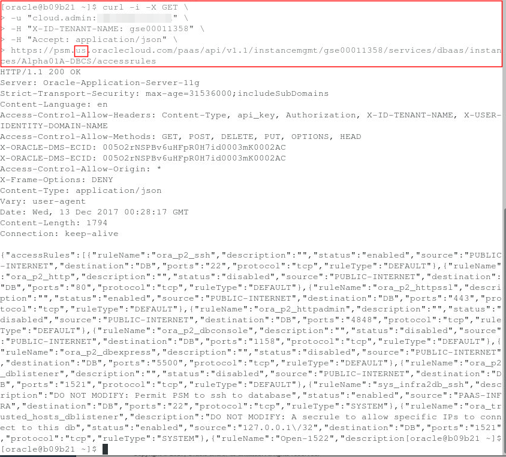
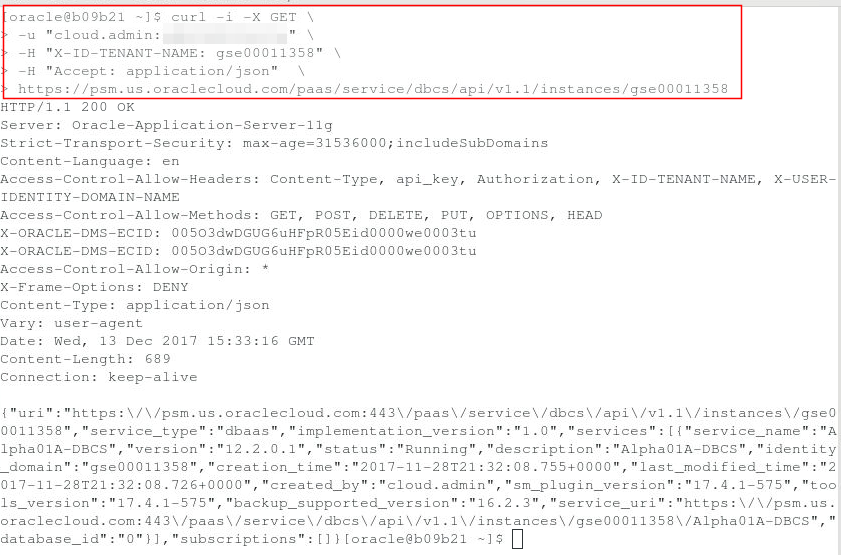
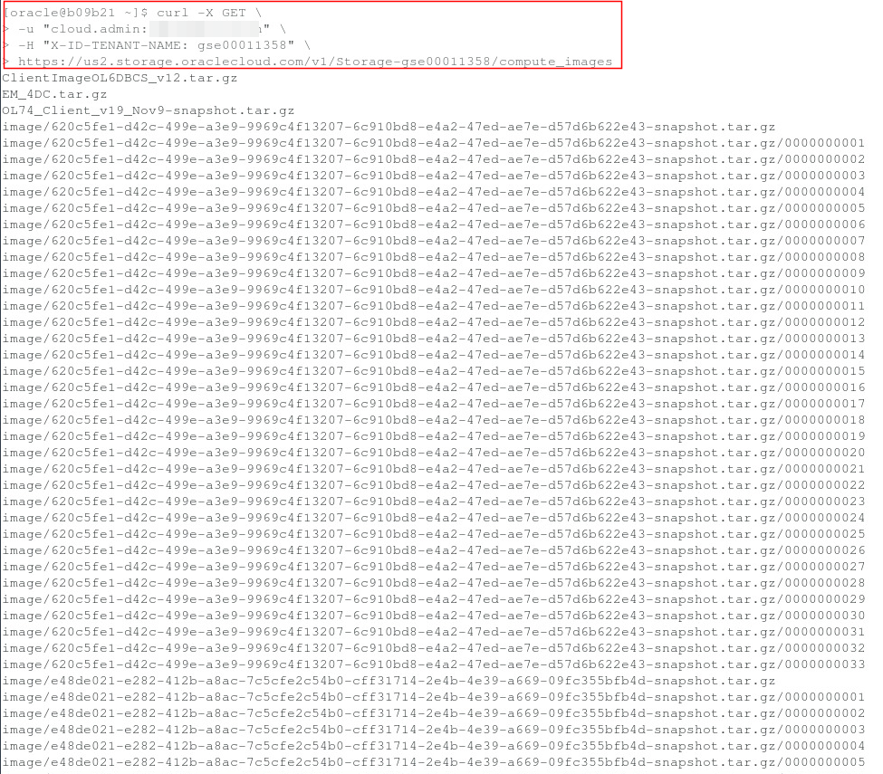
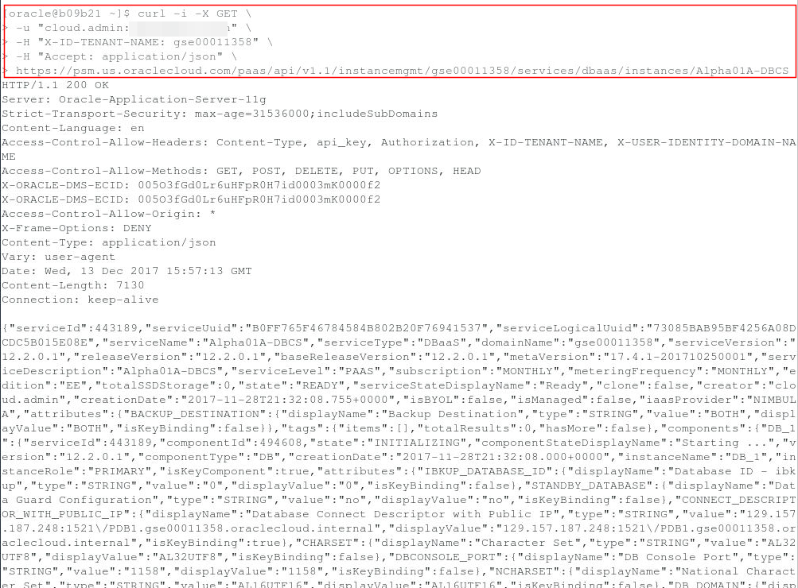
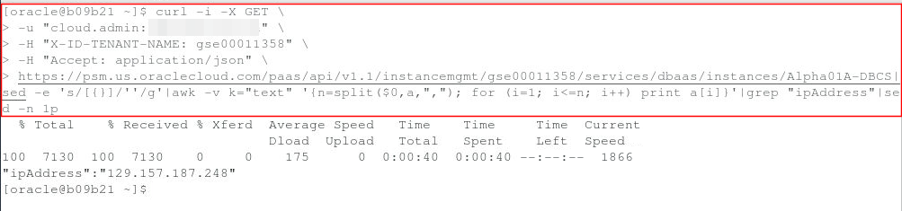

Update: December 12, 2017

## Introduction

In this Lab you will use curl commands to retrieve information about the configuration and status of various cloud services without the need to use the Cloud Console.  Note you may wish to open a separate text window with your identity domain account and password to copy/paste these into the placeholders in the following commands, and then copy this into the terminal windows.

This lab supports the following use cases:
-	Programatic control of cloud databases.

Please direct comments to: Derrick Cameron (derrick.cameron@oracle.com)

## Objectives

-   Request information about DBCS related configuration and services.
-   Create services with curl commands.

## Required Artifacts

-   There are now dependencies for this lab.

## Curl 'Get' Examples (all commands enter in a terminal window)

### **STEP 1**: Fetch a List of Access Rules

-	Enter the following in a terminal window on the compute image.  This will return a JSON formatted response providing security access rules.  Note that we are using a US data center (see the highlight below).  Many GSE instances are EMEA, in which case the URL would have an EM where the US is.  This holds for all the examples that follow.  Be sure to replace the Identity Domain and Identity Domain passwords below with your own.

```
curl -i -X GET \
-u "cloud.admin:<IDENTITY DOMAIN PASSWORD>" \
-H "X-ID-TENANT-NAME: <IDENTITY DOMAIN>" \
-H "Accept: application/json" \
https://psm.us.oraclecloud.com/paas/api/v1.1/instancemgmt/<IDENTITY DOMAIN>/services/dbaas/instances/Alpha01A-DBCS/accessrules
```


### **STEP 2**: Fetch a List of All Instances

-	Enter the following in a terminal window on the compute image.  This will return a JSON formatted response providing a list of instances (not just database - all instances).
```
curl -i -X GET \
-u "cloud.admin:<IDENTITY DOMAIN PASSWORD>" \
-H "X-ID-TENANT-NAME: <IDENTITY DOMAIN>" \
-H "Accept: application/json"  \
https://psm.us.oraclecloud.com/paas/service/dbcs/api/v1.1/instances/<IDENTITY DOMAIN>
```


### **STEP 3**: Fetch a List of All Image Files

-	Enter the following in a terminal window on the compute image.  This will return a JSON formatted response providing a list of all image files.
```
curl -X GET \
-u "cloud.admin:<IDENTITY DOMAIN PASSWORD>" \
-H "X-ID-TENANT-NAME: <IDENTITY DOMAIN>" \
https://us2.storage.oraclecloud.com/v1/Storage-<IDENTITY DOMAIN>/compute_images
```


### **STEP 4**: Fetch Details of DBCS Instance Alpha01A-DBCS

-	Enter the following in a terminal window on the compute image.  This will return a JSON formatted response providing details of a particular instance (Alpha01A-DBCS in this case).
```
curl -i -X GET \
-u "cloud.admin:<IDENTITY DOMAIN PASSWORD>" \
-H "X-ID-TENANT-NAME: <IDENTITY DOMAIN>" \
-H "Accept: application/json" \
https://psm.us.oraclecloud.com/paas/api/v1.1/instancemgmt/<IDENTITY DOMAIN>/services/dbaas/instances/Alpha01A-DBCS
```


### **STEP 5**: Isolate the IP Address of Alpha01A-DBCS in the example above using 

-	Enter the following in a terminal window on the compute image.  This will return a JSON formatted response providing the IP address particular instance (Alpha01A-DBCS in this case).
```
curl -i -X GET \
-u "cloud.admin:<IDENTITY DOMAIN PASSWORD>" \
-H "X-ID-TENANT-NAME: <IDENTITY DOMAIN>" \
-H "Accept: application/json" \
https://psm.us.oraclecloud.com/paas/api/v1.1/instancemgmt/<IDENTITY DOMAIN>/services/dbaas/instances/Alpha01A-DBCS|sed -e 's/[{}]/''/g'|awk -v k="text" '{n=split($0,a,","); for (i=1; i<=n; i++) print a[i]}'|grep "ipAddress"|sed -n 1p
```


## Curl 'Put' Examples (all commands enter in a terminal window)

### **STEP 6**: Create New Access Rule - Open Port 1523

-	This creates a new access rule and enables it.
```
curl -i -X POST \
  -u "cloud.admin:<IDENTITY DOMAIN PASSWORD>" \
  -H "X-ID-TENANT-NAME: <IDENTITY DOMAIN>" \
  -d '{"ruleName":"open1523","ruleType":"USER","description":"","source":"PUBLIC-INTERNET","destination":"DB","ports":"1523","protocol":"tcp","status":"enabled"}' \
  -H "Accept: application/json" \
  -H "Content-Type: application/json" \
https://psm.us.oraclecloud.com/paas/api/v1.1/instancemgmt/<IDENTITY DOMAIN>/services/dbaas/instances/Alpha01A-DBCS/accessrules 
```


### **STEP 7**: Create New DBCS Instance EXAMPLE

-	This creates a new DBCS Instance.  This is only an example.  We will not do this as you may be over quota, and it can take over 30 minutes to provision.
```
---------- create instance ---------- 
curl -X POST \
-u "cloud.admin:<IDENTITY DOMAIN PASSWORD>" \
-H "X-ID-TENANT-NAME: <IDENTITY DOMAIN>" \
-H "Content-Type:application/json" \
-H "Accept: application/json" \
-d @createrequestbody.json \ -- this references the file below
https://dbaas.oraclecloud.com/paas/service/dbcs/api/v1.1/instances/<IDENTITY DOMAIN>

---------- createrequestbody.json ---------- 
{
  "description": "Example service instance",
  "edition": "EE_HP",
  "level": "PAAS",
  "serviceName": "orcl2",
  "shape": "oc3",
  "subscriptionType": "HOURLY",
  "version": "12.1.0.2",
  "vmPublicKeyText": "ssh-rsa AAAAB3NzaC1yc2EAAAABJQAAAQEAjjVf7hUGWOjWa1bcPSJ1uA9Tu3rYJ/9OkmtUzPiLSv6bKs2RjxnH6l80cfZibWned7wlqZeEA1iMWza+E8nMk/0sMkO+f9HpkTCc/N4wD7nFmLiAmhivWnS2HFj4oiNPdmBM4tFhSsfEextTSRKOlIZG0m9aIAOUh7e6Tf1/XS+MTLyUYwNGkNWHtAH03J3sVf3AaJ+SxS8YyVz5SY0VnJTWRqKs5nrLfLuJEsrBZdme4RYowIqxUlYWpkaf/RjFk2kIvIN1sEQHmMe+RTZmCvaDaOmOKlLOg9pmUN7Ybra3r7BnVbr1FuAJBjFj45XisY5lmhJCNZNFl79GJ8H8hw== rsa-key-20160415",
  "parameters": [
    {
      "type": "db",
      "usableStorage": "15",
      "adminPassword": "Welcome_1",
      "sid": "orcl",
      "pdbName": "pdb1",
      "failoverDatabase": "no",
      "backupDestination": "BOTH",
      "cloudStorageContainer": "Storage-<IDENTITY DOMAIN>\/Alpha01A_DBCS_SC",
      "cloudStorageUser": "cloud.admin",
      "cloudStoragePwd": "<IDENTITY DOMAIN PASSWORD>"
    }
  ]
}
```