Update Dec 4, 2017

## Introduction

This is the first of several labs that are part of the Oracle Public Cloud Database Cloud Service workshop. These labs will give you a basic understanding of the Oracle Database Cloud Service and many of the capabilities around administration and database development.

This lab will walk you through configuring RMAN to back up your on-premise database to the Oracle cloud.  You will then create a new Database Cloud Service from the backup, and then connect into the Database image using the ssh private key and familiarize yourself with the image layout. Next you will learn how to create an ssh configuration file that can be used to tunnel simultaneously multiple ports to a remote OPC instance. Using the tunnels, you will learn how to access various Database consoles.  Note that all Oracle Cloud Databases are configured by default with Transparent Data Encryption (TDE).  To restore an on-premise database that was backed up to the cloud it must be configured with with archivelog turned on with TDE prior to backup.  We have configured our on-premise (compute image) database with archivelog and TDE in advance to simplify the flow.  The instructions to do this are in an appendix if you wish to try this on your own 12.2 database.  Note that TDE has evolved between database versions, including between 12.1 and 12.2, and these instructions specifically relate to 12.2.

This lab supports the following use cases:
-	Migration of on-premise databases to a cloud based environment.
-	Rapid creation of test or development database copies in the Cloud.
-	Replication of Databases for reporting and analytics.
 
- To log issues and view the Lab Guide source, go to the [github oracle](https://github.com/oracle/learning-library/tree/master/workshops/dbcs) repository.

## Objectives

-   Configure archive logging (this has been done for you - see Step 5 in the appendix)
-	Configure Transparent Data Encryption (TDE - required to restore from backup to the cloud, this has also been done for you - see Step 6 in the appendix)
-	Backup your local database to the Oracle Cloud
-	Drop a table and then restore it from your cloud backup.
-	Create Database Cloud Service from your on-premise backup 
-   SSH configuration
-   Explore VM and consoles

## Required Artifacts

-   The following lab requires a VNC Viewer to connect to an Image running on Oracle's IaaS Compute Service.

## Workshop Image

For the Database Cloud Service Workshop we will be using a Workshop Image that will represent your on-premises environment. In this image we have installed an Oracle 12.2.0.1 database that contains a Pluggable database that we will be migrating to our Oracle Public Cloud Database instance. The image also contains SQL Developer 4.1 that will be used to connect to both your local and cloud database.

The Client Image is a VM that is running on Oracle's IaaS Compute service.

**Retrieve Public IP for Client Image**

### **STEP 1**: Login to your Oracle Cloud account

-   Open a browser and go to the following URL:

	https://cloud.oracle.com

-   Click **Sign In** in the upper right hand corner of the browser

	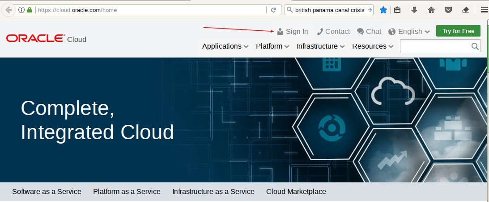

- **IMPORTANT** - Select 'Traditional Cloud Account' and then select from the Data Center drop down list the correct data center and click on **My Services**. If you are unsure of the data center you should select, and this is an in-person training event, ***ask your instructor*** which **Region** to select from the drop down list. If you received your account through an Oracle Trial, your Trial confirmation email should provide a URL that will pre-select the region for you.

	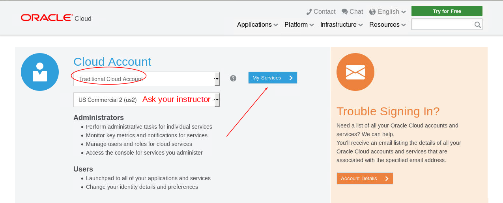

-   Enter the **identity domain** and click **Go**.  All workshop participants will have their own identity domain.  For the purposes of going through the lab 

	**NOTE**: The **Identity Domain, User Name** and **Password** values will be given to you from your instructor.

	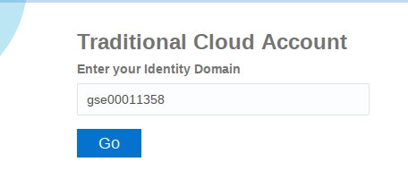

-   Once your Identity Domain is set, enter your User Name and Password and click **Sign In**

	**NOTE**: the **Identity Domain, User Name** and **Password** values will be given to you from your instructor.

	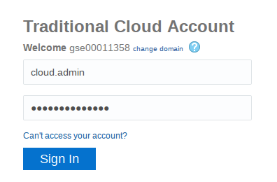

-   You will be presented with a Dashboard summarizing all of your available services.

	

-   If all of your services are not visible, **click** on **Customize Dashboard.** You can then add services to the dashboard by clicking **Show**. If you do not want to see a specific service click **Hide**.

	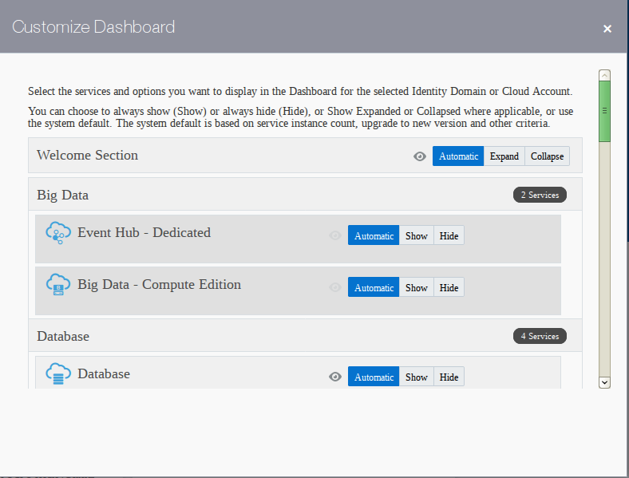

### **STEP 2**:  Access Compute Service Console

-   From the main dashboard, click on the **Compute** service link

	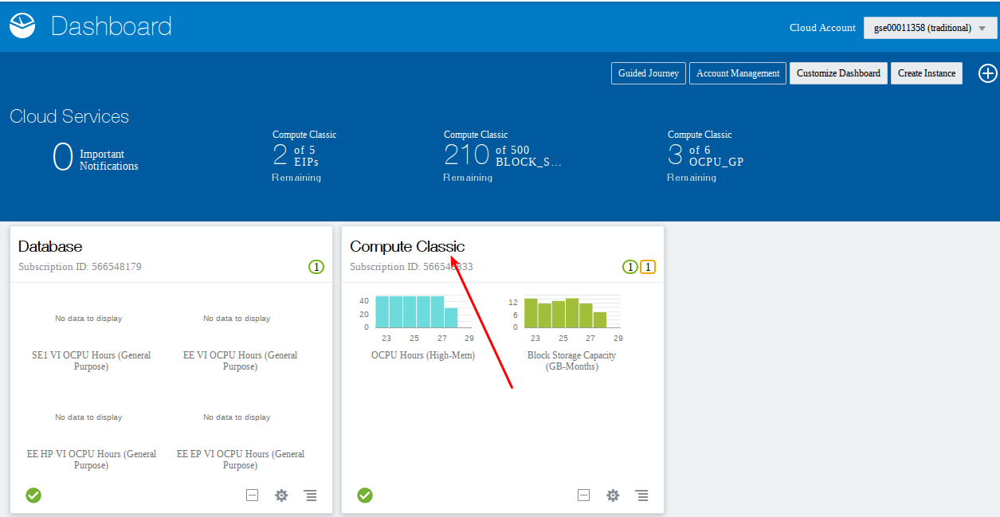

-   From this page you can view general information about this Compute Cloud Service. Click on the **Open Service Console** button.

	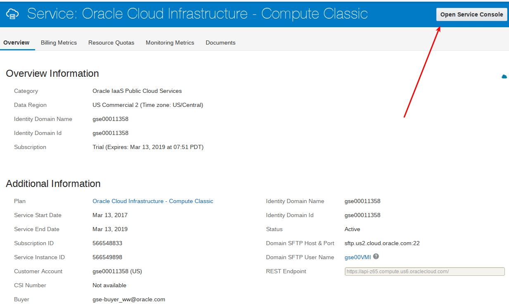

### **STEP 3**:  Copy Public IP for Client Image

-   The Compute Service Console will show you all running VM's. Note: If a compute service is not visible, as shown below, the following task will provide instructions on how to change to the correct zone.

	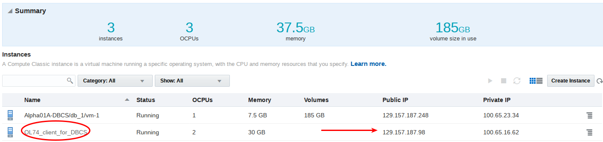

-   Identity Domains will have multiple sites. Please ask you instructor which site the Client Image is running on. **If needed**, click the **Site drop down** to access the **Site Selector,** and choose the correct site.

	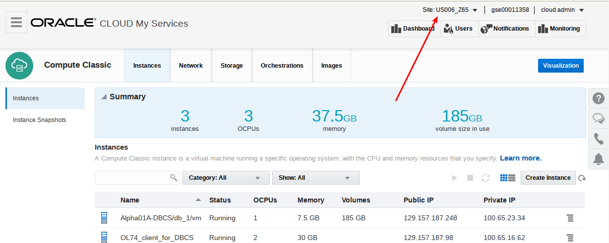

	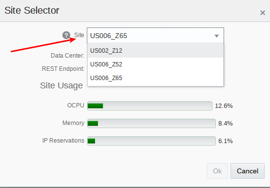

-   Now that you have the correct site selected, find the instance name **OL74_client_for_DBCS** and copy down the **Public IP**

	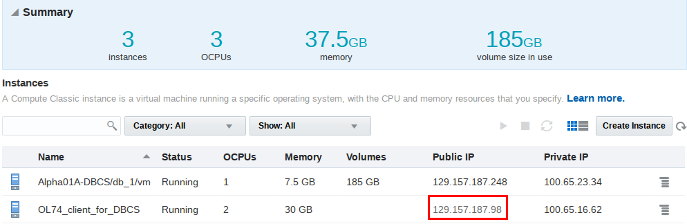

### **STEP 4**:  Connect to Client Image using VNC Viewer

-   If you do not already have a VNC Viewer installed on your computer, you will want to download a Viewer, or ask the instructor for the Real VNC Viewer executable. To run the VNC Viewer, enter the Public IP you just copied, along with appending either the display port **:443** or **:11**. Ask your instructor which port is active for this workshop. Note your VNC client might look a bit different.  Next, click **Connect**

	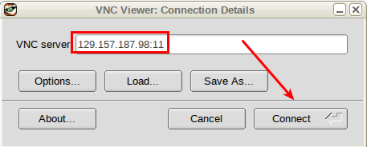

-   Enter the password you used to log into the Oracle Cloud domain, and click **OK**

	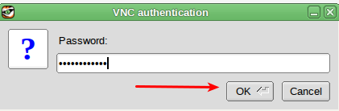

-   You are now connected to the Client Image that will be used for all labs. You might want to place the image in full screen mode so that there is no confusion as to which environment you are working in. Note: the use of the compute “Client” image provides us the opportunity to simulate an on premises environment. We have pre-installed several tools, a database, etc. within this compute Client image. Of course, you could install the same tools and database on your laptop or in an on premises environment to accomplish the same functionality provided by the Client Image, but to reduce the time required to complete the workshop, the Client Image just simplifies the configuration you'd be required to perform.  Note your desktop might look slightly different.

	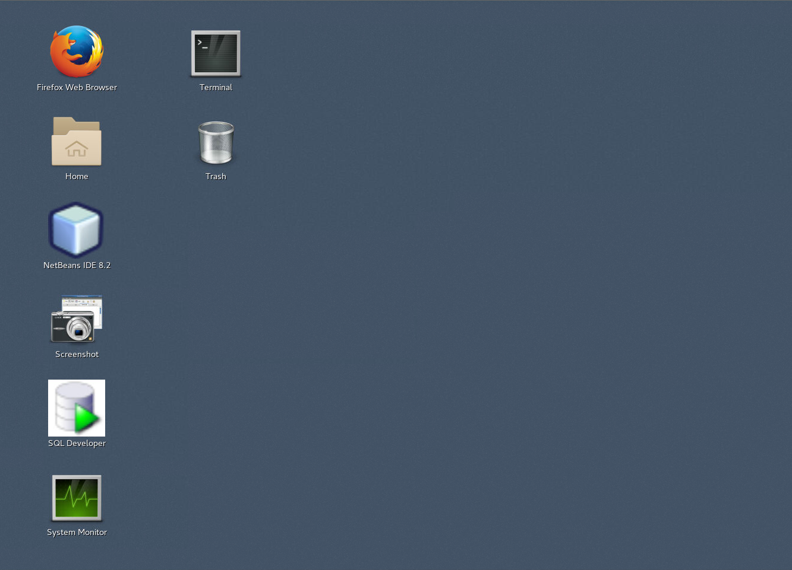

## Configure and Backup the Local Database to the Oracle Cloud

**Step 5 (turn on archivelog) and step 6 (Configure Transparent Data Encryption) have already been done for you.  See Appendix below if you wish to review the steps.**

### **STEP 7**:  Use RMAN to Back Up to the Cloud

-	Start the listener and database.  Open a command window and enter the following.
	- `source dbenv.sh`
	- `lsnrctl start`
	- `sqlplus sys/Alpha2018_ as sysdba`
	- `startup`
	- `alter pluggable database all open;`

-	Create opc_wallet directory.  Open a command window and enter the following:
	- `mkdir /u01/app/oracle/product/12.2/opc_wallet`

-	Install the Oracle Cloud Database Backup Module (previously downloaded from the [Oracle website](https://docs.oracle.com/en/cloud/paas/db-backup-cloud/csdbb/installing-oracle-database-cloud-backup-module.html#GUID-DA5B65A2-0A59-460E-8D2A-1E6E1F510A57)).  Open a terminal window and enter the following.  Be sure to replace the identity domain and password placeholder with your own:
	- `/u01/app/oracle/product/12.2/dbhome_1/jdk/bin/java -jar /u01/OPCWorkshop/opc_install.jar -serviceName Storage -identityDomain <identity domain> -opcId cloud.admin -opcPass <cloud account password> -walletDir /u01/app/oracle/product/12.2/opc_wallet -libDir $ORACLE_HOME/lib -libPlatform linux64 -container oracle-data-storageg-1`

	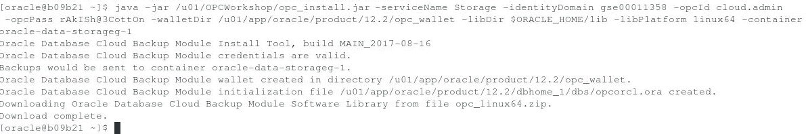

-	Connect to RMAN
	- `rman target /`

	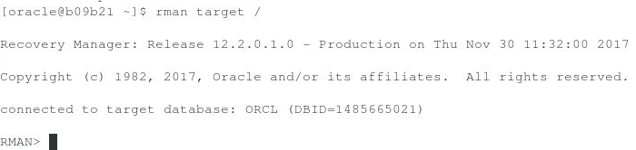

-	Set Configuration parameters
```
run {
configure channel device type 'sbt_tape' MAXPIECESIZE 2 G FORMAT 'alphacloud_%d_%U' PARMS  'SBT_LIBRARY=libopc.so, ENV=(OPC_PFILE=/u01/app/oracle/product/12.2/dbhome_1/dbs/opcorcl.ora)';
CONFIGURE COMPRESSION ALGORITHM 'MEDIUM';
CONFIGURE DEVICE TYPE sbt BACKUP TYPE TO COMPRESSED BACKUPSET;
CONFIGURE CONTROLFILE AUTOBACKUP ON;
configure default device type to sbt;
CONFIGURE DEVICE TYPE SBT_TAPE PARALLELISM 5 BACKUP TYPE TO COMPRESSED BACKUPSET;
}
```
	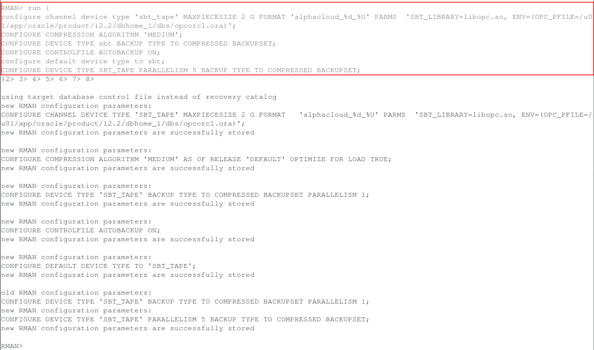

-	List parameters
	- `show all;`

	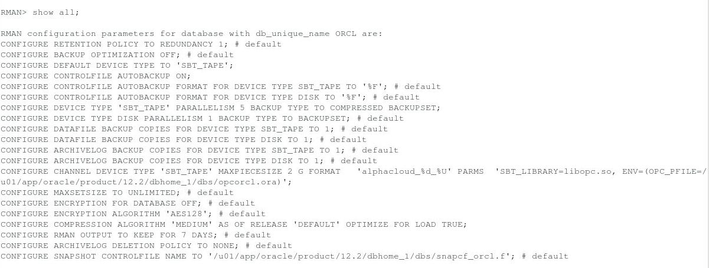

-	Backup the Database
	- `set encryption on;`
	- `alter system archive log current;`
	- `backup database plus archivelog;`

	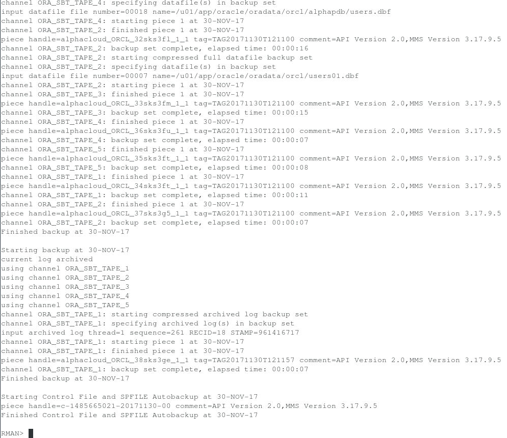

-	List backups.
	- `list backup summary;`

	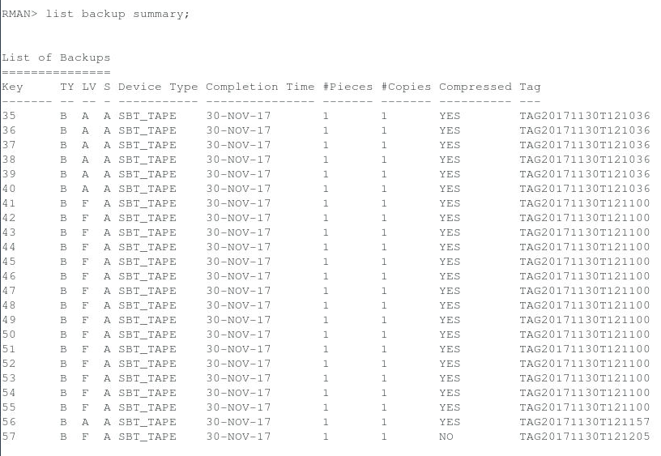

-	Create restore point for later (lab 300)
	- `create restore point gold preserve;`

	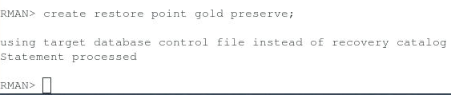

## Recover Dropped Table

Now that we have a backup of our database we are going to “accidently” drop a table that will reappear once we perform the restore.  

We need to set the de-encryption password we set when encrypting and backing up the database.

### **STEP 8**:  Drop Table

-	Exit out of RMAN and log into alpha
	- `exit;`
	- `sqllplus alpha/Alpha2018_@alphapdb`
	- `drop table alpha_services_stats;`

	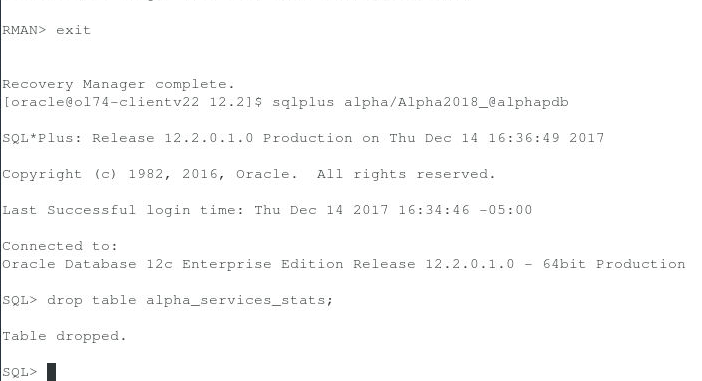

### **STEP 9**:  Recover Table

We now need to restore the database to the point in time before the mstars table was accidentally deleted (:> The backup files stored in cloud will be used.  These steps will bring the entire database to a point where media recovery can occur. This of course takes the database offline. If you had multiple PDBs in the database and only needed to recover data in one PDB while leaving the others on-line, you could use the steps listed in the ALTERNATIVE RESTORE section in Workshop_Commands_URLS.txt under the RMAN FLOW. It takes a little longer using this method, so we'll use the flow under the RESTORE section.

-	Exit out of SQLPlus and log into RMAN and recover table.  Enter the following commands.
	- `exit`
	- `rman target /`
	- `shutdown immediate;`
	- `startup mount;`
	- `set decryption identified by oracle;`

	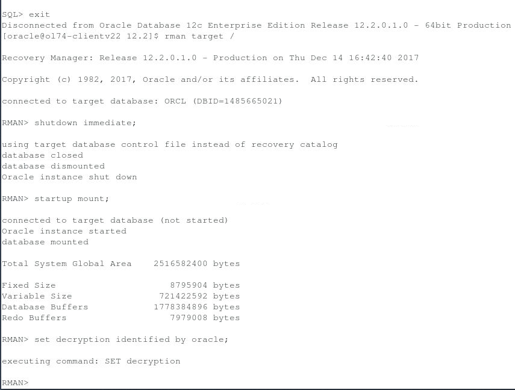

-	Copy and Paste the RMAN run block that does the restore / recovery to our “gold” restore point. The final step opens the database and resets the logs since we've restored to a previous point in time.
	- `run {restore database; recover database to restore point gold; alter database open resetlogs;}`

	

-	Once the script completes, go back to the Terminal Window you used to connect with sqlplus and re-connect back into the Alphapdb container as alpha and query to see if the alpha_services_stats table has been recovered.   
	- `exit;`
	- `sqlplus sys/Alpha2018_ as sysdba`
	- `alter pluggable database all open;`
	- `connect alpha/Alpha2018_@alphapdb;`
	- `select count(*) from alpha_services_stats;`
	- 'exit;`

	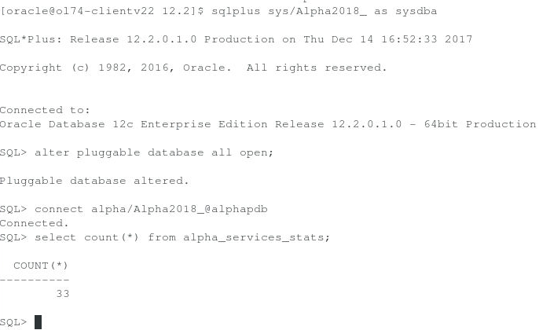

## Create Database Cloud Service from Backup

### **STEP 9**:  Login to your Oracle Cloud account

-   From within the VNC Session, open **Firefox** and go to the following URL: https://cloud.oracle.com

	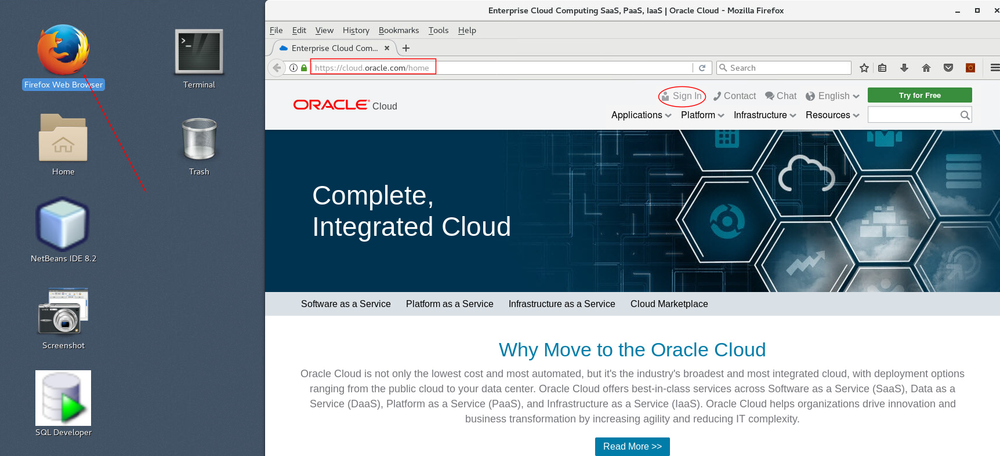

-   Click **Sign In** in the upper right hand corner of the browser.  Note this is the same account/login that you used earlier in this lab.

- **IMPORTANT** - Select 'Traditional Cloud Account' and then select from the Data Center drop down list the correct data center and click on **My Services**. If you are unsure of the data center you should select, and this is an in-person training event, ***ask your instructor*** which **Region** to select from the drop down list. If you received your account through an Oracle Trial, your Trial confirmation email should provide a URL that will pre-select the region for you.

	

-   Enter the **identity domain** and click **Go**

	**NOTE**: The **Identity Domain, User Name** and **Password** values will be given to you from your instructor.

	

-   Once your Identity Domain is set, enter your User Name and Password and click **Sign In**

	**NOTE**: the **Identity Domain, User Name** and **Password** values will be given to you from your instructor.

	

-   You will be presented with a Dashboard summarizing all of your available services.

	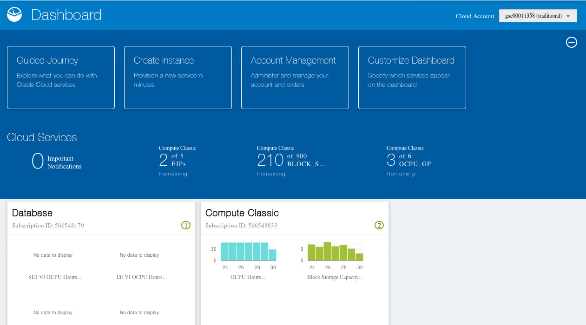

### **STEP 10**:  Create Database Cloud Service

-   From the main dashboard, click on the **Database** service link

	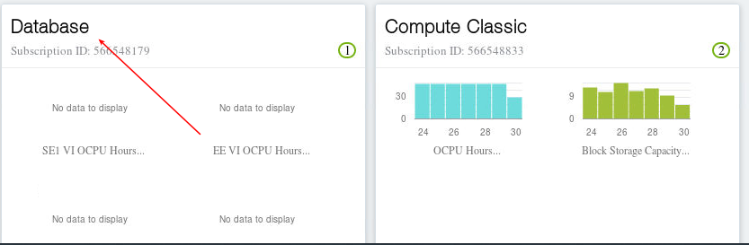

-   From this page you can view general information about this Database Cloud Service. Click on the **Open Service Console** button.

	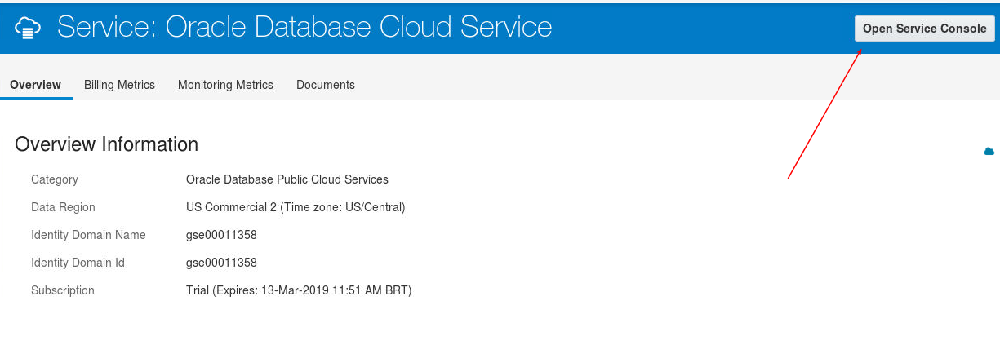

-   From the console, click **Create Service**

	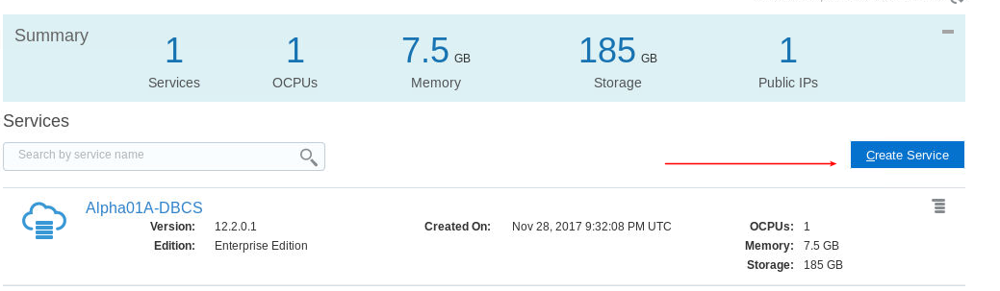

### **STEP 11**:  Enter the Instance Configuration

When providing a name, please note you may have another service instance already created in your account, so the name must be unique.

-   Enter the Service Name (Alpha01B-DBCS) and other fields as noted below.  Note it is important you select **Software Release Oracle Database 12c Release 2** (default is 1) 

	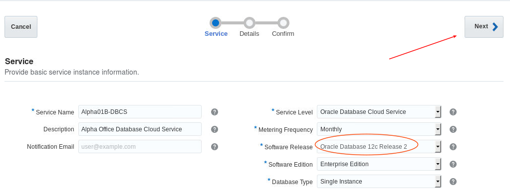

-   Click on the **Next** Button to navigate to the Service Details page.  Enter the DB Name, PDB Name, Administration Password ('Alpha2018_'), and then **select Edit for the SSH Public Key**.

	

-	Click on Browse, select File System on the left, and then navigate to /u01/OPCWorkshop and select the ci\_opc\_keys.pub file.

	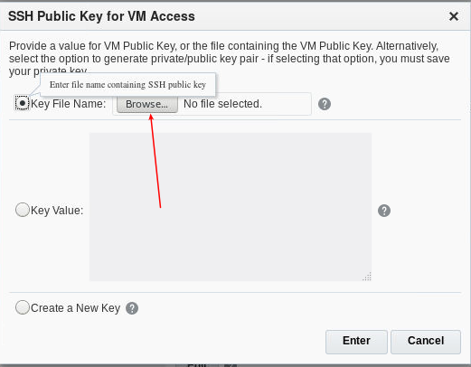

	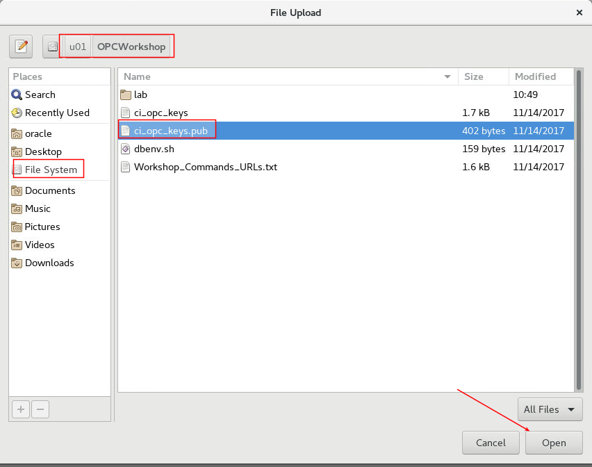

-	Select **Backup Destination None** and **Create Instance from Existing Backup Yes**.

	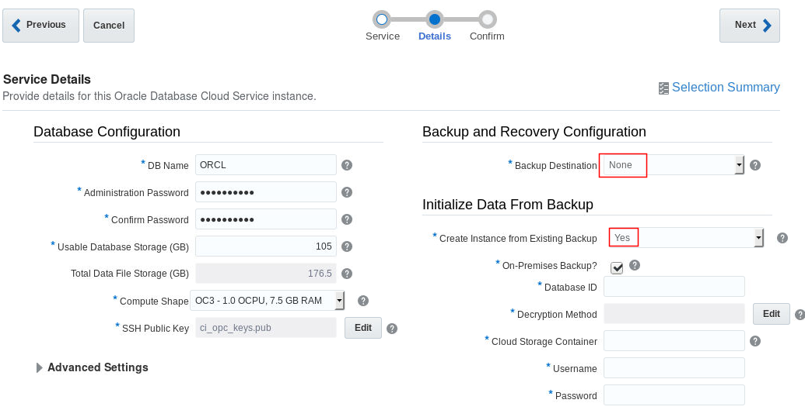

-	**In a separate terminal window** enter the following to retrieve the dbid which you'll need.
	- `source dbenv.sh`
	- `sqlplus sys/Alpha2018_ as sysdba`
	- `select dbid from v$database`

	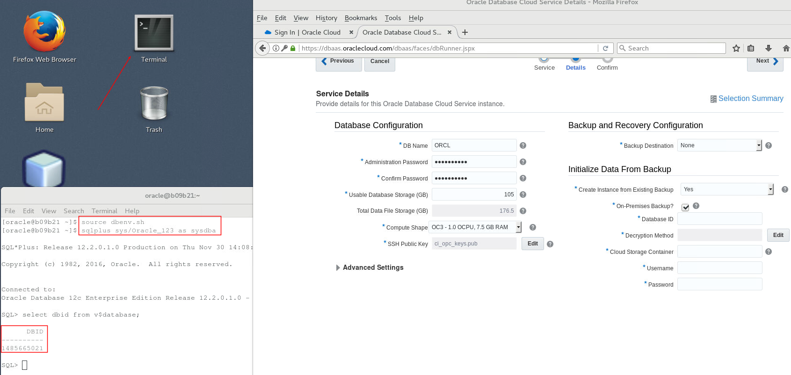

-   Enter the following fields
	- **On-Premises Backup:** yes
	- **Database ID:**  From the query above
	- **Decription Method:** see below
	- **Cloud Storage Container - note substitutions:** `https://storage.us2.oraclecloud.com/v1/Storage-<IDENTITY DOMAIN>/oracle-data-storageg-1`  
		- us2 may be em2 if you are in a EMEA data center
		- substitute gse00011358 with your own identity domain
	- **Username:** `<your cloud account userid>`
	- **Password:** `<your cloud account password>`

-	Select zipped wallet for the Decyption Method:

	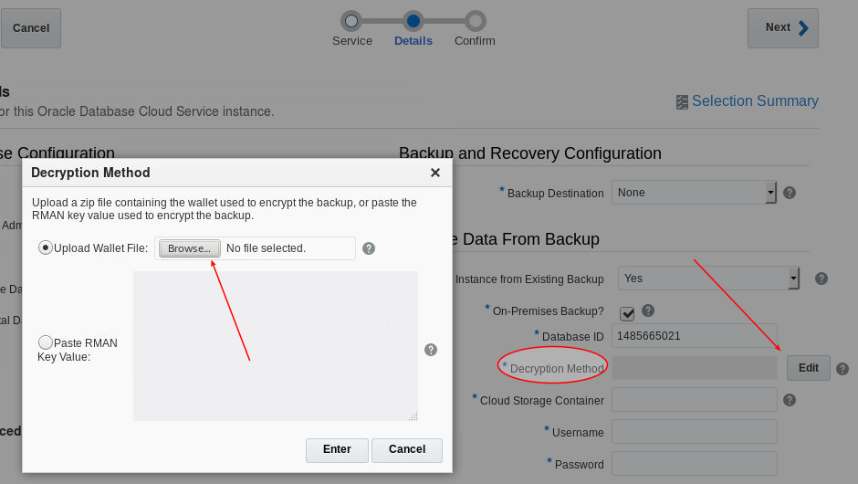

-   Click on the icon upper left, enter the following path and select the wallet.zip file

	

	

-	Confirm the following fields are entered correctly and then select Next.

	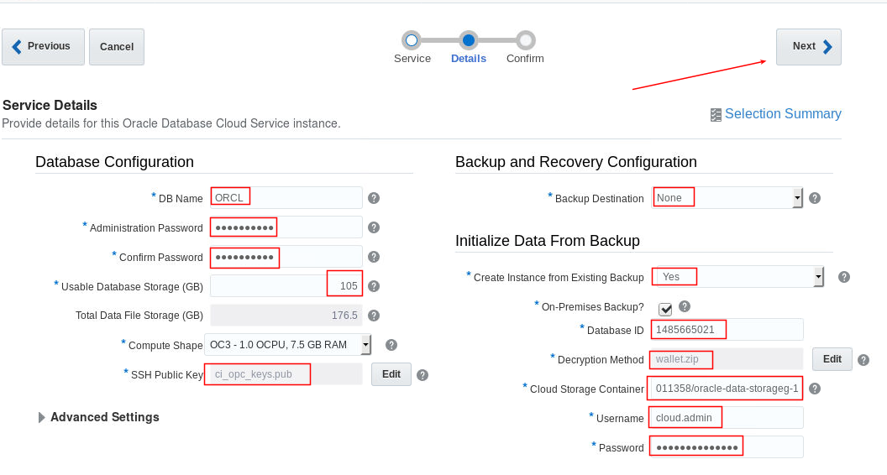

-	Select Create

	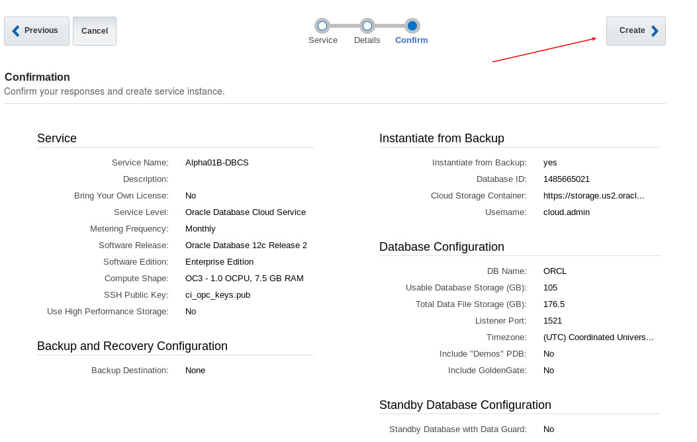

-   The creation of the DBCS instance will take approximately 20 minutes. While your DBCS instance is being created, you can monitor the progress by clicking on the **Activity** menu item, and view the current status.  **NOTE:** If this process fails it may be due to either you did not properly open the password wallet for the pdb$seed and pluggable databases prior to backing up the database to the cloud, or that you did not zip the wallet IMMEDIATELY after opening the password wallets to capture the wallet state properly.  If this restore step fails NONE of the rest of the labs depend on this, and due to the time required to fix the issue and backup and restore the database again you should move on rather than trying to fix this. 

	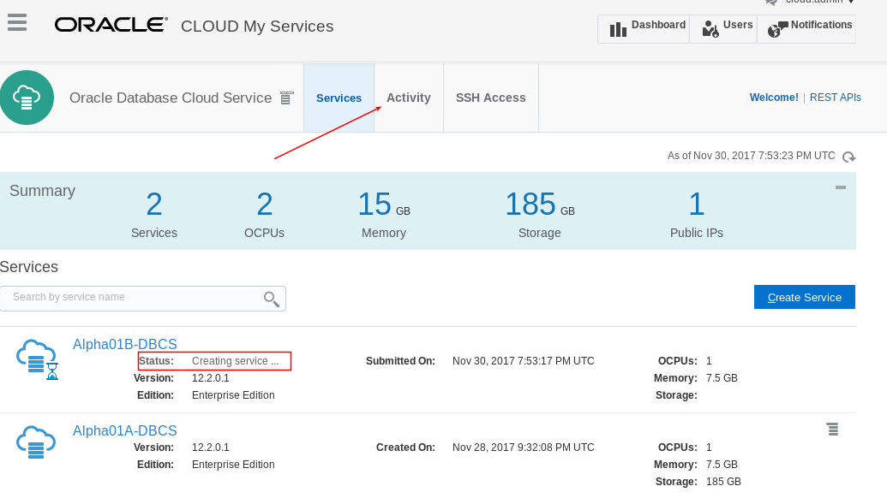

	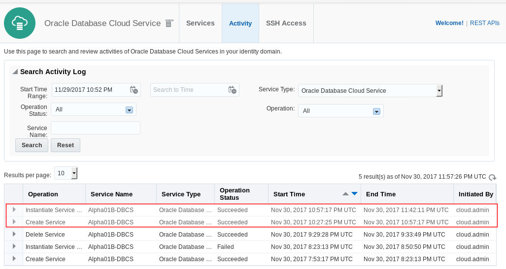

	**NOTE**: We will continue with the lab by utilizing **Alpha01A-DBCS** DBCS instance which is already created. 

	

### **STEP 12**: Run the SSH configuration script to start tunnels in the background

For security reasons, the default Oracle Public Cloud network configuration is locked down. You have the option of opening up ports to the various servers in your environment by ether using the Compute Cloud Service console and creating/re-using protocol definitions and access rules, OR you can create SSH tunnels to the specific server/port combinations as needed. This lab and the rest of the labs require access via development tools and the browser to various admin consoles running on the cloud servers themselves.

In this step you will run a script that creates and configures a SSH file used to connect to your various servers. Once the script is generated, it will create SSH tunnels in the background with connections via selected ports used in this and other labs.

-	Open a terminal Window by clicking the terminal icon in the screen's top menu bar and enter the following:
	- `cd /u01/OPCWorkshop`
	- `./setssh.sh DBONLY`

	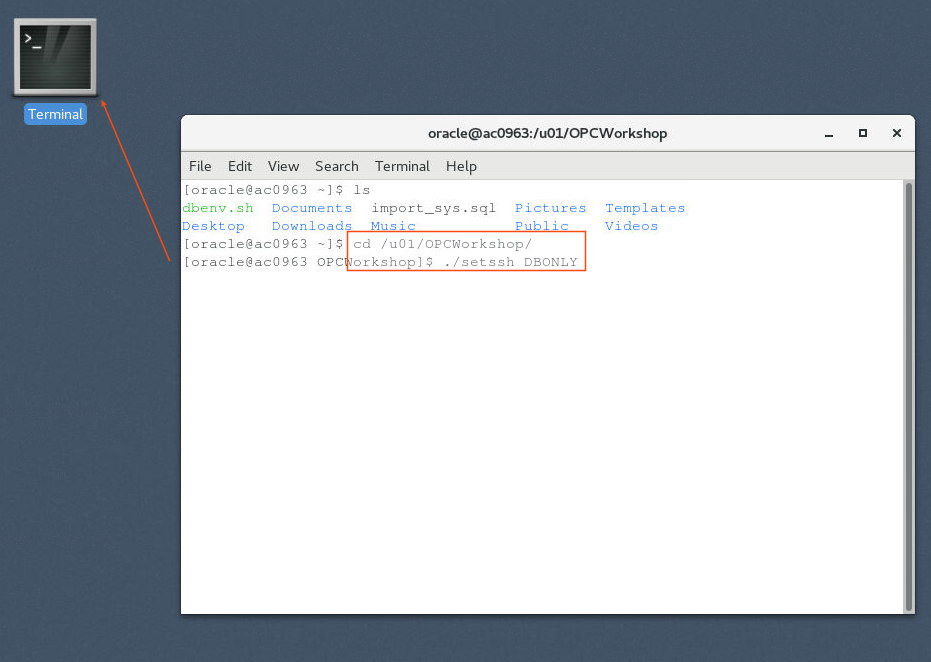

-	If you make an error, you'll see:

	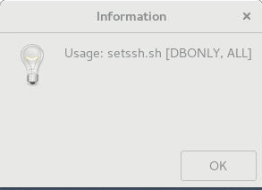

-	If the script runs successfully, you will enter the DB IP address previously obtained and select `OK`.

	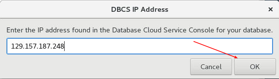

-	The script will try a test connection to your server. If it encounters errors, you will be re-prompted to enter the IP address. If successful, a SSH configuration file is created and a SSH session to the DB server will be placed in the background. A successful completion will show:

	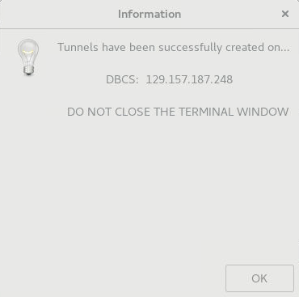

-	You can look at the generated configuration file by typing <strong>gedit myssh</strong> within the terminal window. Notice under the <strong>Host AlphaDBCS</strong> section of the config file that the DBCS IP address has been inserted in 5 areas defining LocalForward ports (1526, 443, 4848, and 5500). These ports can now be accessed locally using “localhost” in connection information or URLs.

-	Close the edit session.

-	You can also enter:
	- `sudo su`
	- `ps -ef | grep DBCS` to see the running background session.

	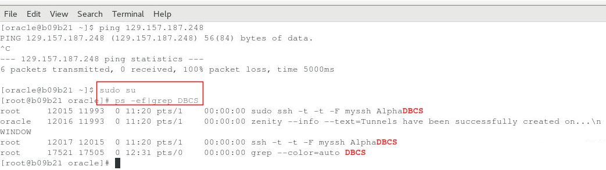

## Explore DB image via SSH

**Record IP address of Database Cloud Service**

In the upcoming steps you will record the IP addresses of the Virtual Machine on which the cloud service runs. You will then update the ssh configuration file for **Alpha01A-DBCS**.

### **STEP 13**:  Record the IP address of the Database Cloud Service

-   Click on **Alpha01A-DBCS** from the list of Database Instances

	

-   Note the IP address of **Alpha01A-DBCS**. In this example, we will note the IP address of 129.144.19.238

	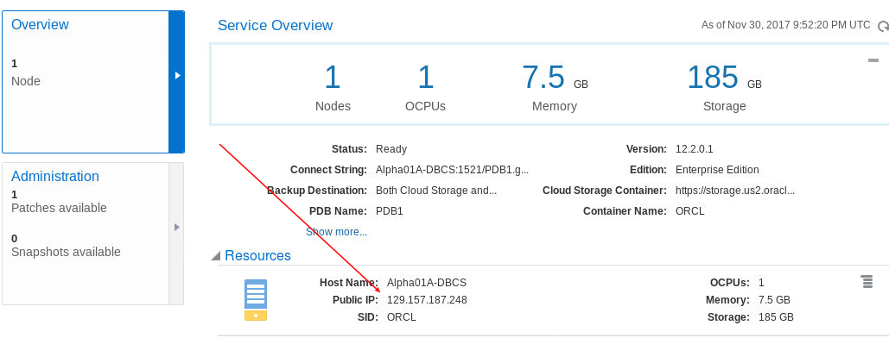

### **STEP 14**:  Open a new SSH Connection to browse the database image

-	enter the following command using the IP address for your DBCS cloud instance.
	- `ssh -o StrictHostKeyChecking=no -i /u01/OPCWorkshop/ci_opc_keys oracle@<your db ip>`
	
	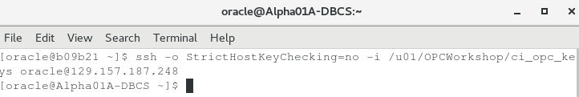

-   Now that you are connected to **Alpha01A-DBCS,** let's look around. Enter the **df** command to see mounted disks.

	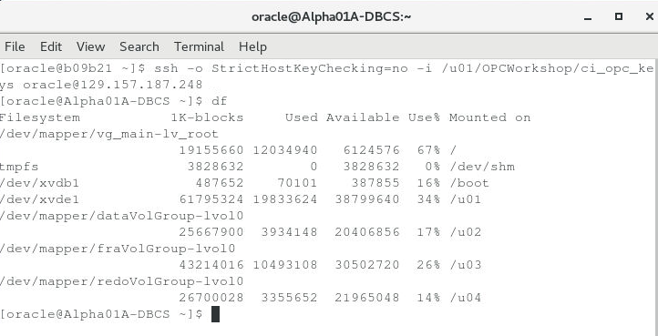

-   Issue the following command to view the Database environment variable.
	- `env | grep ORA`

	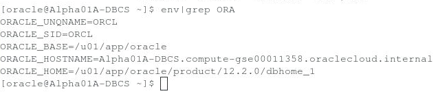

-   Now let's change directories to the Oracle Home and list the directories.
	- `cd $ORACLE_HOME`
	- `ls`

	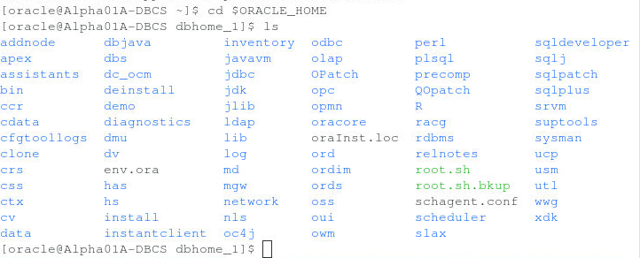

-   Type **exit** to close the remote Database Image ssh session.

	**NOTE:** By typing exit once, you are only exiting the Cloud DBCS Service. Do not exit the Terminal window, as we have the SSH Tunnels running in the background, and these SSH Tunnels will be used during the remainder of the lab.

## Access the Database Consoles

**Access DB Monitor, Apex, EM Consoles**

***NOTE***: For any of the URLs mentioned in this section you can also use the predefined browser links. If blocked ports on the network cause an issue loading any of these consoles, the predefined browser links will help by routing the traffic through the SSH tunnel that should already be open:


### **STEP 15**:  Access Database Monitor

To gain access to the various consoles used by the Database Cloud Service you have two options. You can open up the port on which the monitor is listening, or you can create a SSH tunnels to the specific server/port combinations as needed. We have already created the SSH tunnel, and you will use that tunnel to access most of the consoles.

In this step you will open the port 443 on the VM using a pre-create access rule and protocol definition.

-   If not already on the **Alpha01A-DBCS** details page, navigate back to Database Cloud Service console and click on **Alpha01A-DBCS** to get to this page.

	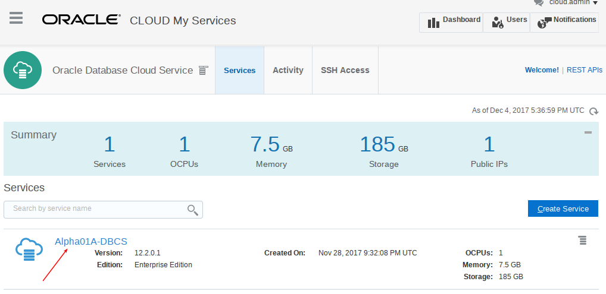

-   At the top of the page click  next to the instance name **Alpha01A-DBCS** and select **Access Rules**.

	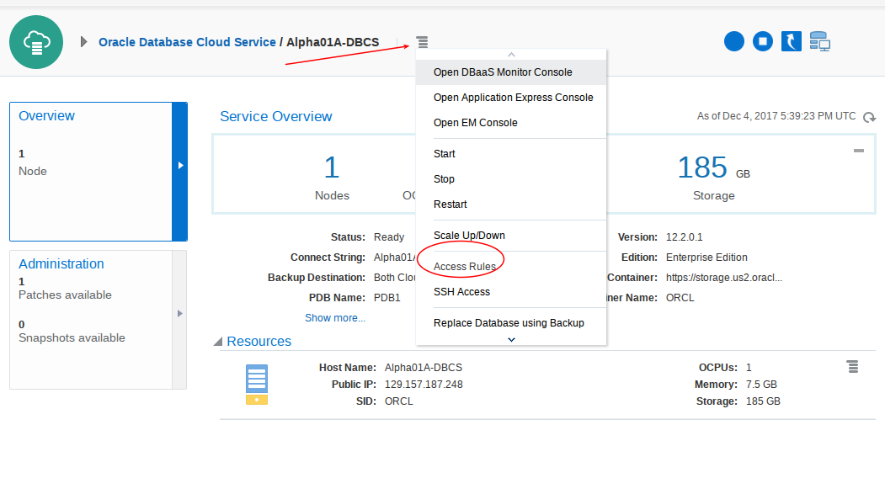

-   From this screen you see all the **Access Rules** that have been created for this instance

	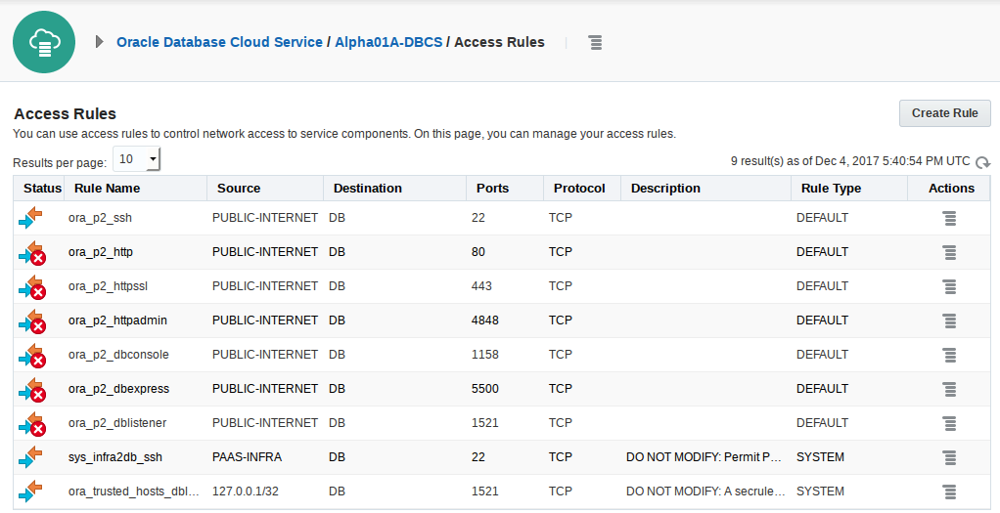

-   The Rule named **ora\_p2\_httpssl** is setup to open port 443 to the public internet. Click on the **hamburger menu** 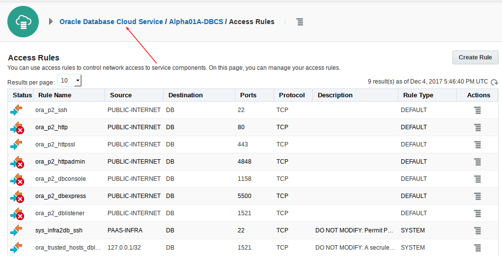 for this rule and select **Enable**

	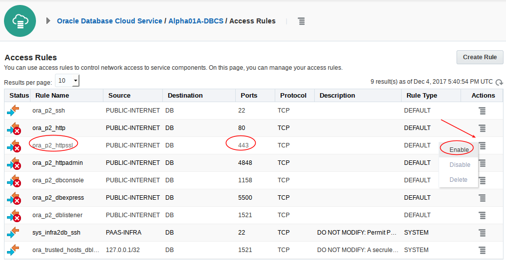

-   On Enable Access Rule popup window, click **Enable**.

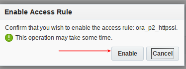

-   You should now see that the Access Rule **ora\_p2\_httpssl** is enabled. Click on **Oracle Database Cloud Service** link at the top of the window to navigate back to the Service Console

	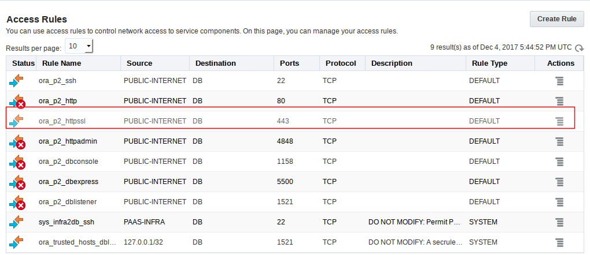

-   Go back to the list of DBCS services (click on the breadcrumbs) and then  select **Open DBaaS Monitor Console.** from the hamburger menu.

	

	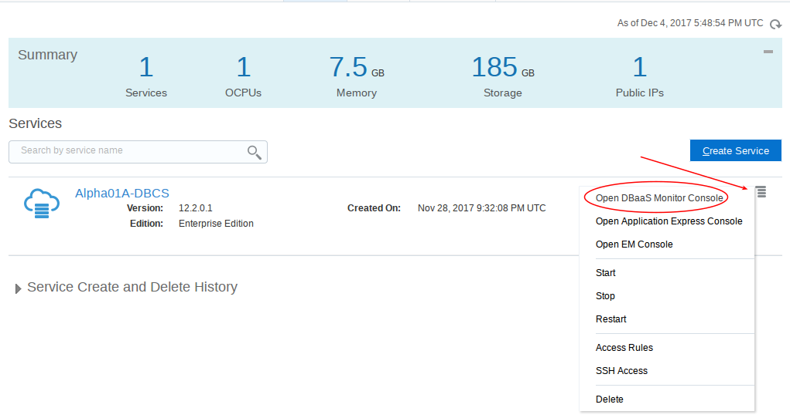

-   If you get a security warning, click **ADVANCED** followed by **Add Exception..**

	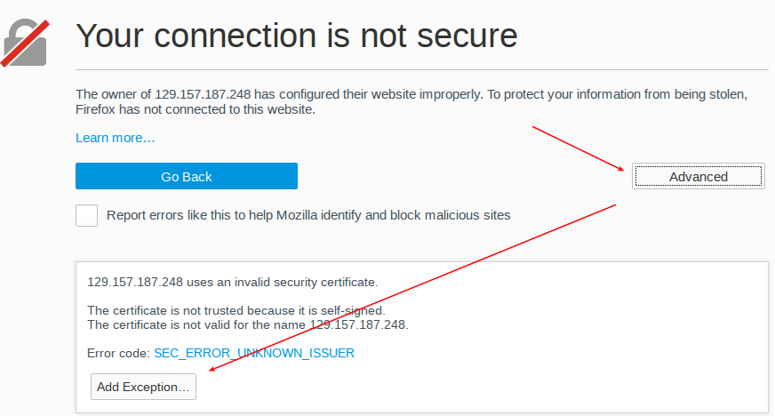

-	Then Confirm Security Exception

	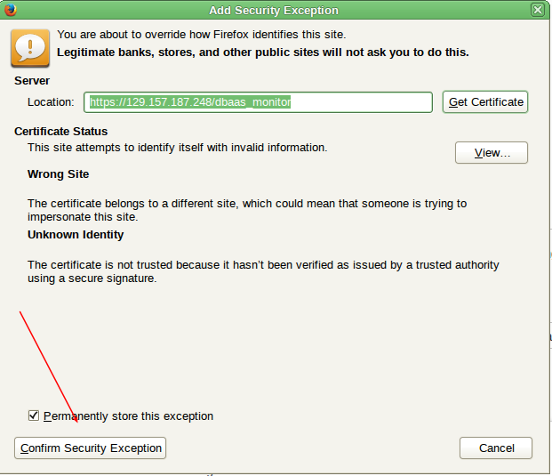

-   When prompted, enter **dbaas\_monitor** for the **User Name** and **Alpha2018\_** for the **Password**.

	
	
-   Once connected to the Database Monitor Console, feel free to explore the various screens.

	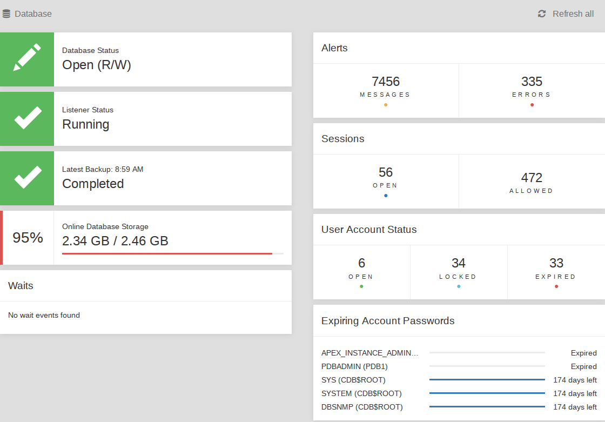

### **STEP 16**:  Access Enterprise Manager DB Express (inside the workshop image)

-   On the browser, open a new tab, and **enter** the following **URL** to access the **EM Express** page. The first time the URL is used, it can take a minute for the console to load. **Note**: The setssh.sh script that you ran earlier in this lab created the ssh tunnel that will cause all traffic referencing localhost:5500 to actually be routed to the database cloud service.

	- `https://localhost:5500/em`


-   If you get a security warning, click **ADVANCED** followed by **Add Exception**, and then 

	

	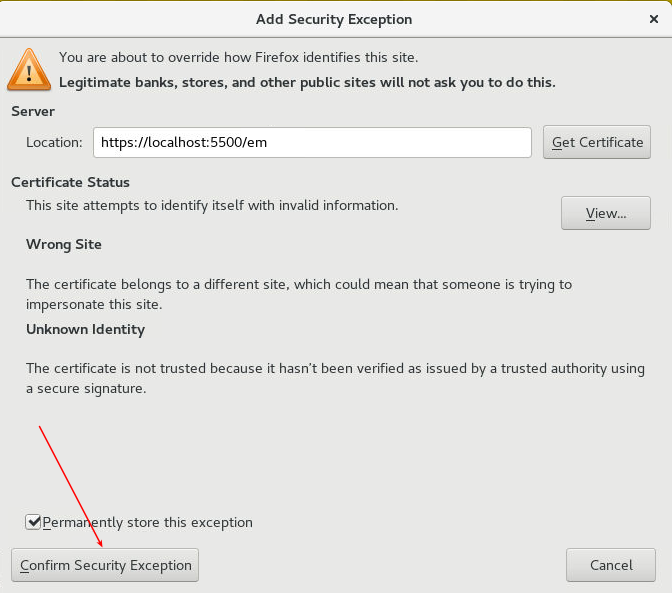

-   On the EM login page enter the following and click on **Login**:

	**User Name:** `sys`

	**Password:** `Alpha2018_`

	**Container:**	`pdb1`

	**Select** the **as sysdba** box.

	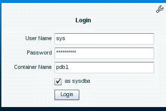

-   Feel free to explore the Enterprise Manager console.

	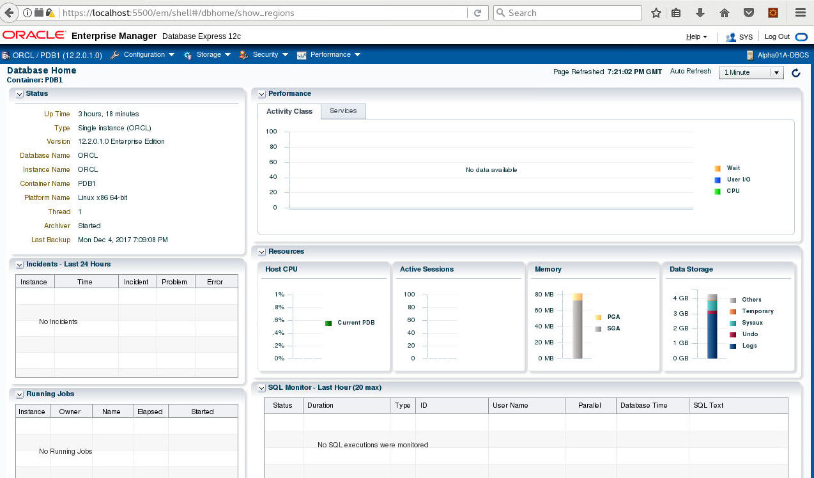

### **STEP 17**:  Access Apex Monitor

-   Enter the following URL into a browser window to access the **Apex console** (click to add a security exception if necessary). **Note**: All traffic to the default https port (443) on local host is also routed through the ssh tunnel to the database cloud service.  Click through the security warnings.

	- `https://localhost/apex/pdb1/`

-   Once the Apex login window is displayed, **enter the following** and click on **Sign In**:

	**Workspace**: `internal`

	**Username**: `ADMIN`
	
	**Password**: `Alpha2018_`
	
	

-   You are now connected to Apex. Feel free to explore the menu options.

	

-   You are now ready to move to the next lab.

## Appendix: Configure Transparent Data Encryption (TDE)

### **STEP 5**:  Turn on Database Archivelog Mode

-	Open a command window

	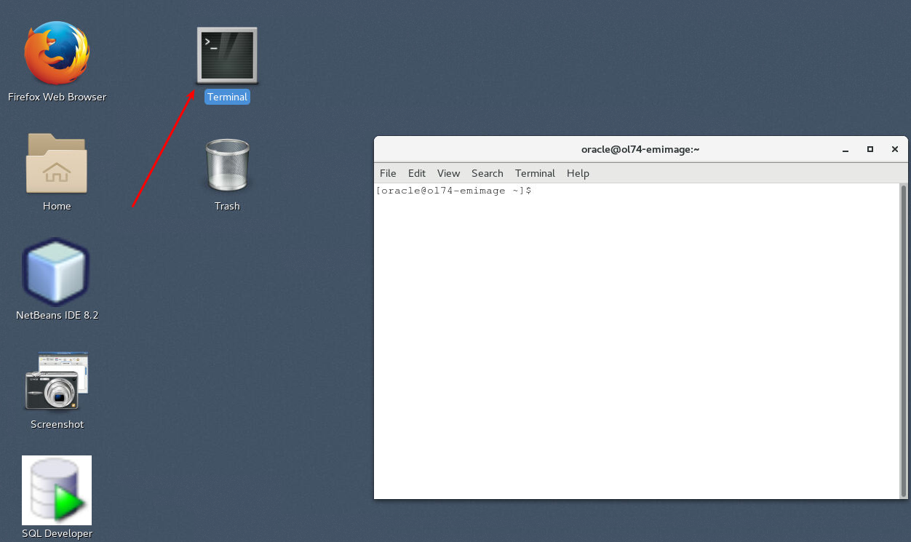

-	Enter the following commands:
	- `source dbenv.sh`
	- `lsnrctl start`
	- `sqlplus sys/Alpha018_ as sysdba`
	- `startup`
	- `select log_mode from v$database;`
	- `shutdown immediate`
	- `startup mount;`
	- `alter database archivelog;`
	- `alter database open;`
	- `alter pluggable database all open;`
	- `SELECT open_mode from v$database;`
	- `exit`

	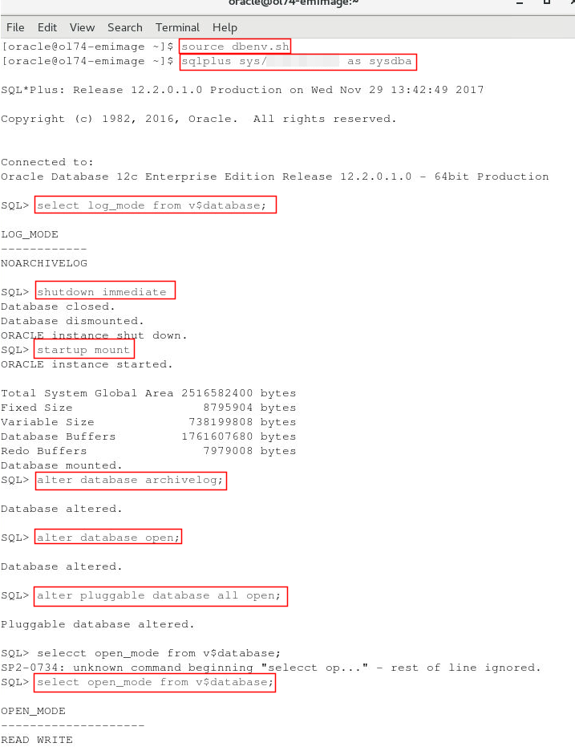

### **STEP 6**:  Configure Transparent Data Encryption (required to instantiate DBCS from backup in cloud)

-	First exit out of sqlpus (in the command window) if you have not already done so (last step above).

-	Create TDE Wallet directory in command window
	- `mkdir /u01/app/oracle/product/12.2/wallet`

	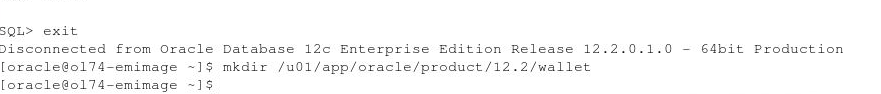

-	Edit the sqlnet.ora file
	- `gedit /u01/app/oracle/product/12.2/dbhome_1/network/admin/sqlnet.ora`

	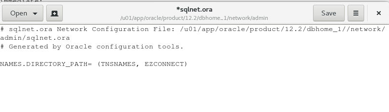

-	**Add the following** and then **save** (spacing does not matter):
	
`ENCRYPTION_WALLET_LOCATION=(SOURCE=(METHOD=FILE)(METHOD_DATA=(DIRECTORY=/u01/app/oracle/product/12.2/wallet)))`

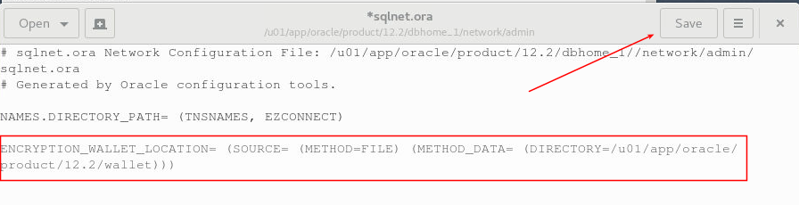

-	Open a command window and bounce the database.  **Enter the following:**
	- `source dbenv.sh`
	- `sqlplus sys/Alpha2018_ as sysdba`
	- `shutdown immediate`
	- `startup`
	- `alter pluggable database all open;`
	- `set linesize 300` -- this is so we can read the output easier
	- `col wrl_parameter format a40` -- easier to read output
	- `select * from v$encryption_wallet;`

	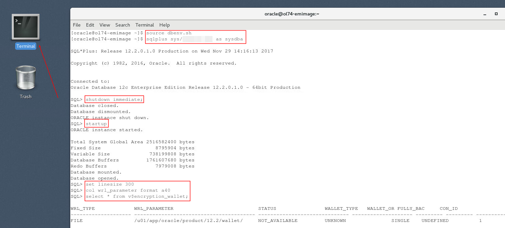

-	Create TDE keystore and auto login keystore.
	- `administer key management create keystore '/u01/app/oracle/product/12.2/wallet' identified by oracle;`
	- `administer key management create auto_login keystore from keystore '/u01/app/oracle/product/12.2/wallet' identified by oracle;`

	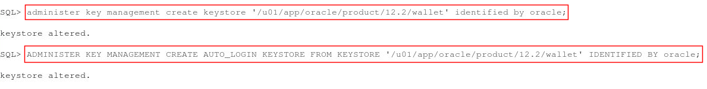

-	Open the software keystore for the password based key (screenshot does not show all of this)
	- `ADMINISTER KEY MANAGEMENT SET KEYSTORE OPEN IDENTIFIED BY oracle CONTAINER = ALL;`
	- `ADMINISTER KEY MANAGEMENT SET KEYSTORE OPEN FORCE KEYSTORE IDENTIFIED BY oracle CONTAINER = ALL;`
	- `alter session set container=pdb$seed`
	- `ADMINISTER KEY MANAGEMENT SET KEYSTORE OPEN FORCE KEYSTORE identified by oracle;`
	- `alter session set container=alphapdb`
	- `ADMINISTER KEY MANAGEMENT SET KEYSTORE OPEN FORCE KEYSTORE identified by oracle;`
	- `alter session set container=pdb1`
	- `ADMINISTER KEY MANAGEMENT SET KEYSTORE OPEN FORCE KEYSTORE identified by oracle;`

	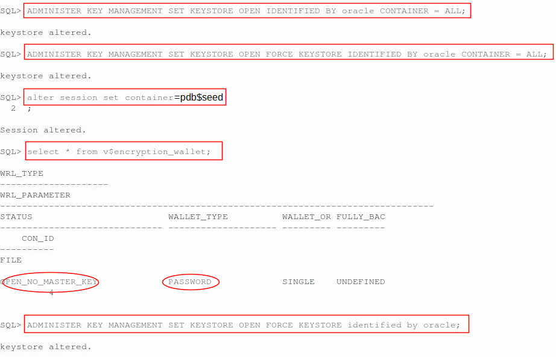

-	Set the Software TDE Master Encryption Key.
	- `alter session set container=cdb$root;`
	- `ADMINISTER KEY MANAGEMENT SET KEYSTORE CLOSE;`
	- `ADMINISTER KEY MANAGEMENT SET KEY IDENTIFIED BY oracle WITH BACKUP USING 'key_backup' CONTAINER = ALL;`
	- `ADMINISTER KEY MANAGEMENT SET KEY FORCE KEYSTORE IDENTIFIED BY oracle WITH BACKUP USING 'key_backup' CONTAINER = ALL;`

	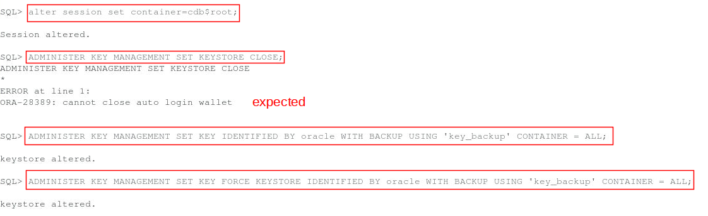

-	Zip the TDE wallet.  You will need this later when creating a new instance from our cloud backup.  Return to your terminal window, exit out of SQLPlus, change your directory, and zip the wallet directory:
	- `cd /u01/app/oracle/product/12.2`
	- `zip -r wallet.zip wallet`

	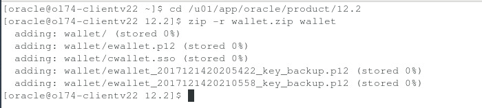