Update Dec 4, 2017

## Introduction

In this lab, you will explore some common use cases for moving your data from on-premises to the cloud. There are multiple options for solving this data movement challenge. In this lab, we will use SQL\*Developer and command line tools to clone and move a pluggable database from your on-premises database (your Virtual Machine) to your cloud database. You will also use standard Oracle Data Pump tools to export a schema from the on-premises database, and then import that data to your cloud database in a new schema. The final exercise uses RMAN to move a tablespace to the cloud.  These are only a few of the many options for moving data into and between Oracle databases.  More choices for how to migrate Oracle Databases from on-premise to the cloud can be found in this [Migration Strategies Document](http://www.oracle.com/technetwork/database/database-appliance/documentation/oda-migration-strategies-1676870.pdf).

This lab supports the following use cases:
-	Migration of on-premise pluggable databases to a cloud based environment.
-	Rapid creation of test or development pluggable database copies in the Cloud.
-	Rapid replication of on-premise data for reporting and analytics.
-	Rapid re-fresh of selected on-premise schemas for test and/or development activities and/or reporting and analytics.

- To log issues and view the Lab Guide source, go to the [github oracle](https://github.com/oracle/learning-library/tree/master/workshops/dbcs) repository.

## Objectives

-   Migrate a pluggable database from on-premise to the Cloud.
-   Migrate a schema using Oracle Data Pump.
-   Migrate data using a Transportable Tablespace.
-   Copy data using Database Links.

## Required Artifacts

-   The following labs assume that the steps outlined in lab guide 100 have been completed.

-   The SSH tunnels must be active in a terminal window.

# Cloud Migration Using Pluggable Databases

## Configure the Environment

### **STEP 1**:  Open a **DBA Navigator** connection to the on-premise database

-   From the VNC Session desktop, locate and double-click on the **SQL Developer** icon. ***NOTE***: The first time SQL Developer is brought up; it may take some time to instantiate.

	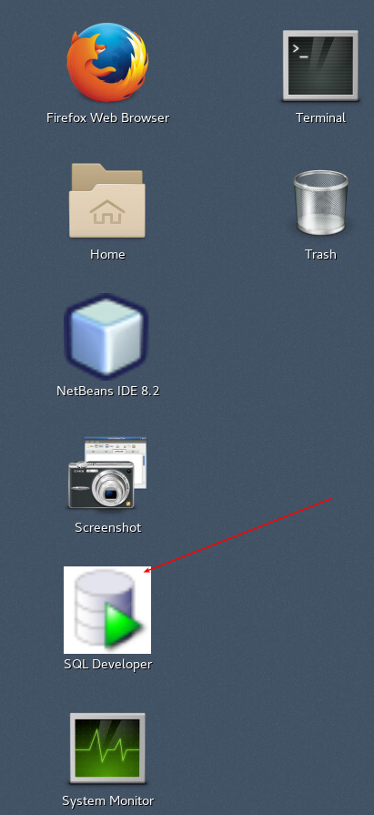

-   Double-click the **On-premises** folder to expand the list of database connections. Please note the pre-configured connections to the on-premises database.

	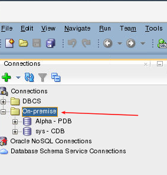

-   Select the **View** -> **DBA** menu option from the top dropdown menu.

	

-   On the DBA tab, click the green plus icon to create a new connection.

	**Note**: you may also right-click on Connections and select Add Connection.

	

-   Select the **sys - CDB** connection and click **OK**. 

	**Note: sys - CDB** is an “on-premises” database located on the Virtual Box Image.

	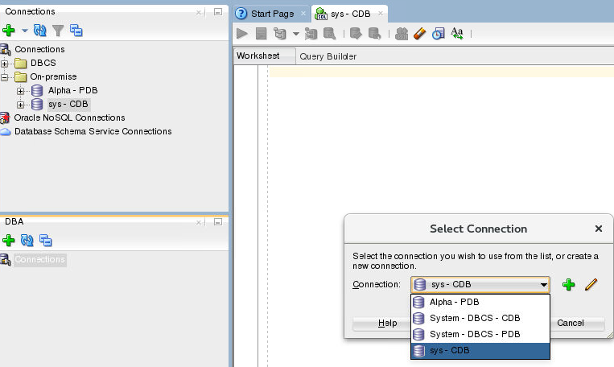

-   Expand the **sys - CDB connect**, and then expand the **Container Database** tree item. Click on the **ALPHAPDB** pluggable database to show the details for the pluggable database.

	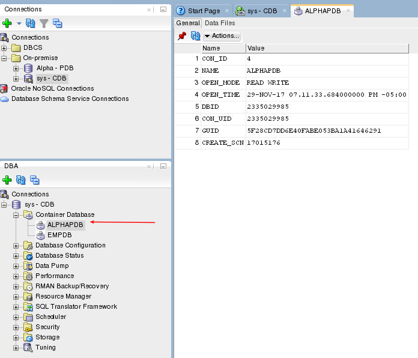

## Clone the On-premise ALPHAPDB

### **STEP 2**:  Clone the ALPHAPDB

-   In the DBA Navigator panel, right click on the ALPHAPDB pluggable database and select the Clone PDB... menu option.

	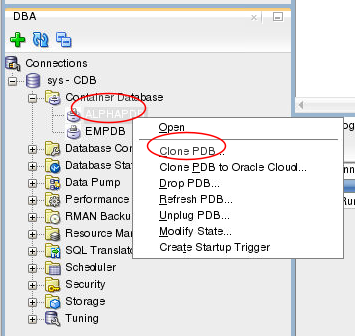

-	Enter the following
	- **Database Name:** `ALPHACLONE`
	- **File Name Conversions:** `Customer Expressions` (note by default the directory name is derived from the database name - we are overriding this)
	- **Click the + on the right**
	- **Source File Pattern:** `alphapdb`
	- **Target File Pattern:** `alphaclone`
	- Then select the SQL table above

	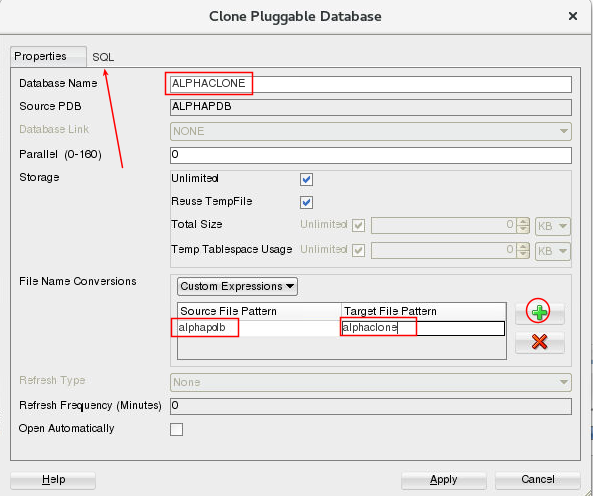

-	Since we have implemented TDE (Transparent Data Encryption) we need to override the SQL.  Select the SQL tab above and enter the following
	- `keystore identified by oracle`

	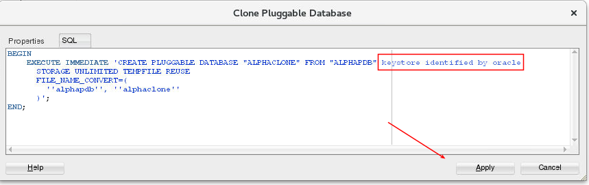

-	You should see the new PDB

	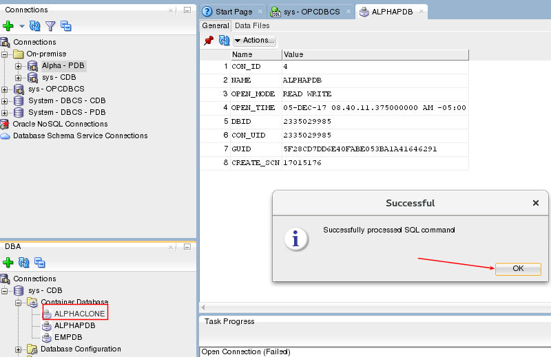

-	Click on the ALPHACLONE database in the DBA navigator to see the status of the database.  Note: The cloned database shows an OPEN_MODE of MOUNTED indicating the database is plugged-in but is not open for access.

	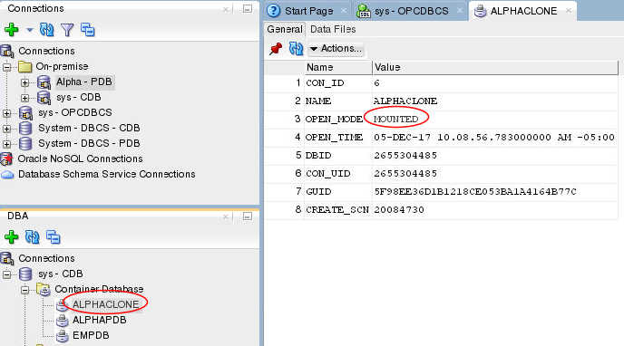

-	Click on the Data Files tab for the ALPHACLONE to review the data files created during the cloning operation.

	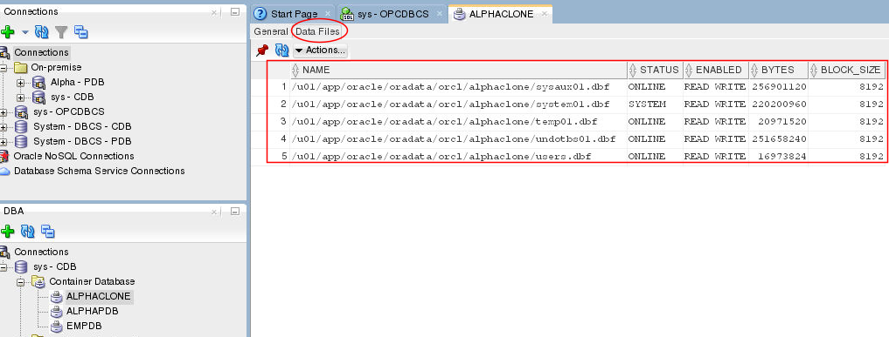

## Clone the ALPHACLONE DB to the Cloud

### **STEP 3**:  Create SSH and SYS Database Cloud Connections

-   First we need to setup a SSH host connection to the Database Cloud Service instance. From the top menu select **View -> SSH** to display SSH hosts panel on the left.

	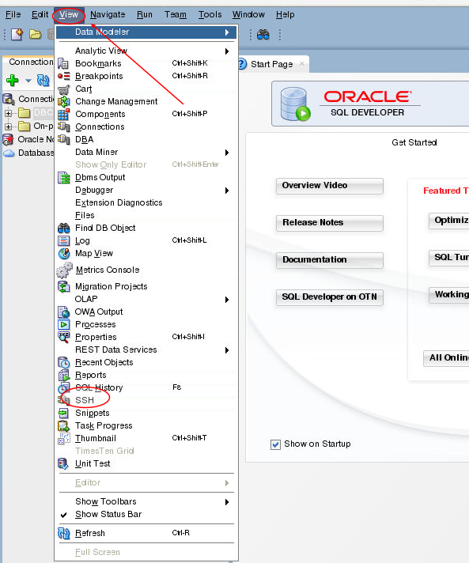

-   Right click on **SSH Hosts** and select **New SSH Host**.

	

-   We will now configure an SSH connection to our DBCS instance

	**Name**: `Alpha01A-DBCS`

	**Host**: `<Database Image public IP you obtained in lab 100>`

	**Username**: `oracle`
	
	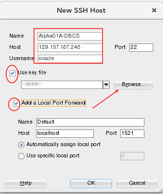

-   Select **Use key file** and click **Browse...** Select file **/u01/OPCWorkshop/ci_opc_keys** and click **Open**.

	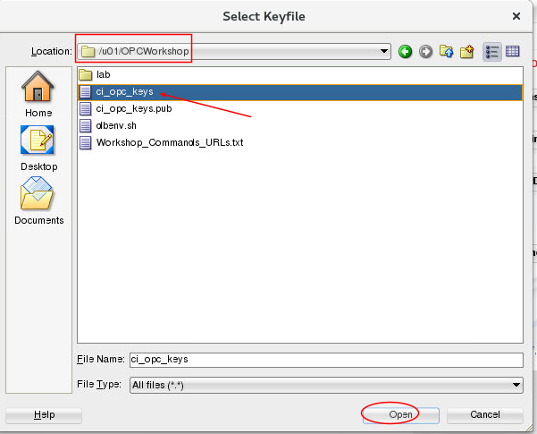

-   Click **Add a Local Port Forward** and enter the following values:

	**Name**: `Database`

	**Host**: `<Database Image Public IP you obtained in lab 100>`
	
-   Select **Use specific local port** and enter **1530**

	**NOTE**: We are using port 1530 since 1521 is already in use for our local database.

	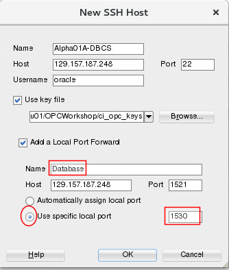

-   Verify the configuration and click **OK**

-	Right click on the SSH connection and test.  You should see a message saying the connection was successful.

	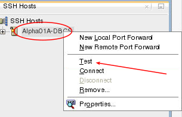

	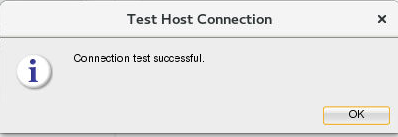

### **STEP 4**:  Create a SQL Developer connection to the Public Cloud database SYS schema

-   Click the green plus sign  in the **Connections** window to create a new connection; enter the following connection details:

	**Connection Name**: 	`sys - OPCDBCS`

	**Username**: 			`sys`

	**Password**:			`Alpha2018_`

	**Check** 				"Save Password"

	**Optionally select a color for the connection**

	**ConnectionType**: 	`SSH`

	**Role**:				`SYSDBA`

	**Service Name**: 		`ORCL.<Your ID Domain>.oraclecloud.internal`
	
	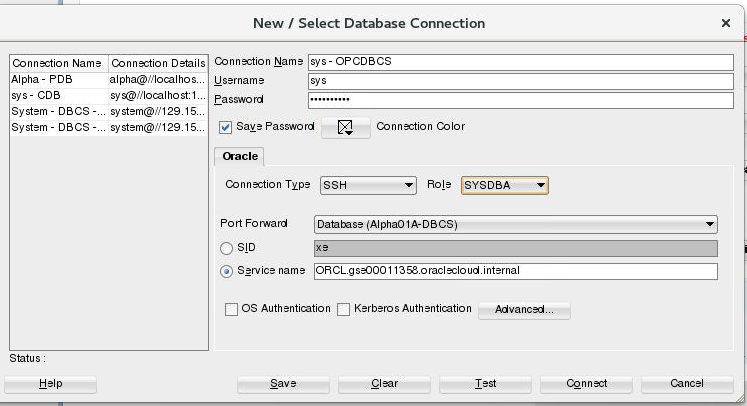

-   Click **Test** to confirm the information was entered correctly.

	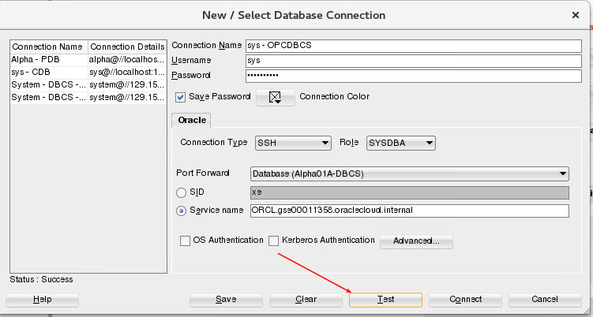

-   Click **Connect** to save the connection information which opens a new SQL Worksheet.

	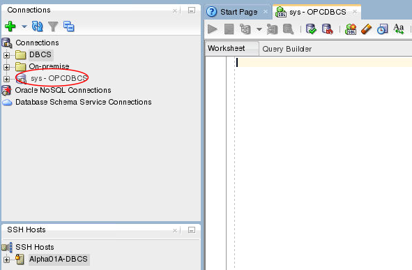

### **STEP 5**:  Unplug ALPHACLONE

-	Since TDE requires additional commands that are not included in the generation of SQL within SQL Developer we will do step 5 in a terminal window.  Open a termainal window off the desktop.

	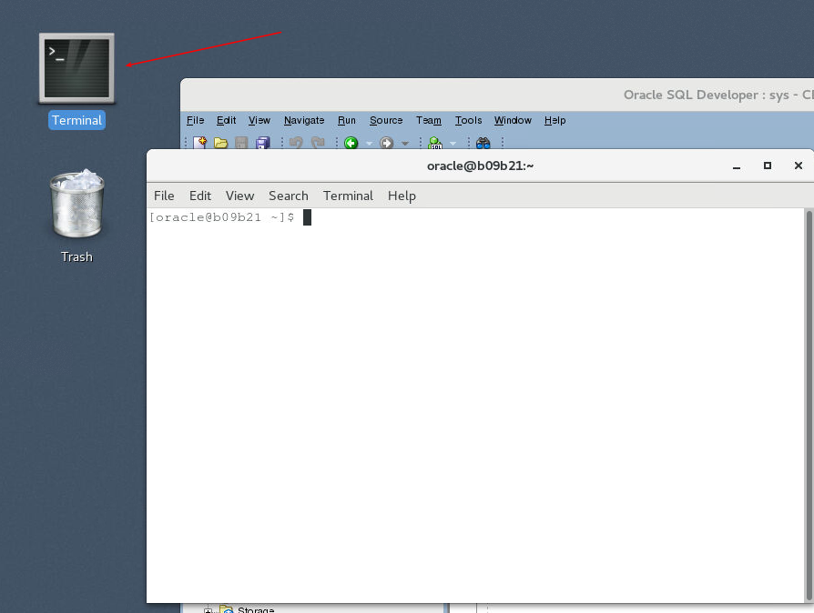

-	Remove the auto-open wallet.  We will use the password wallet.  Enter the following commands
	- `source dbenv.sh`
	- `sqlplus sys/Alpha2018_ as sysdba`
	- `shutdown immediate`
	- `exit`
	- `mv /u01/app/oracle/product/12.2/wallet/cwallet.sso /u01/app/oracle/product/12.2`
	- `source dbenv.sh`
	- `sqlplus sys/Alpha2018_ as sysdba`
	- `startup`

	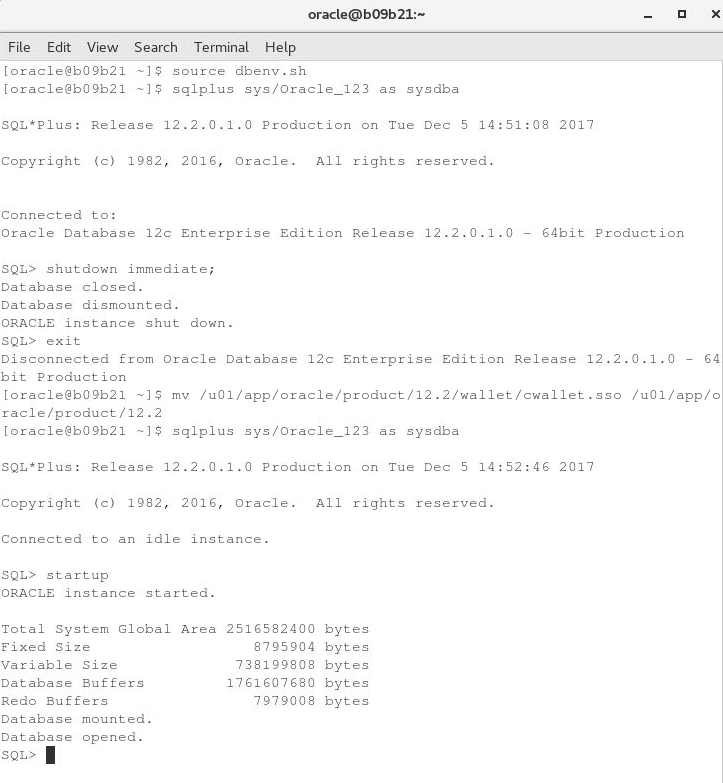

-	Enter the following commands
	- `alter pluggable database all open;`
	- `administer key management set keystore open identified by oracle container=all;`
	- `alter session set container=alphaclone;`
	- `administer key management set keystore open force keystore identified by oracle;`
	- `administer key management export encryption keys with secret "oracle" to '/u01/app/oracle/oradata/orcl/alphaclone/alphaclone.p12' identified by oracle;`
	- `alter session set container=cdb$root;`
	- `alter pluggable database alphaclone close;`
	- `alter pluggable database alphaclone unplug into '/u01/app/oracle/oradata/orcl/alphaclone/alphaclone.xml';`

	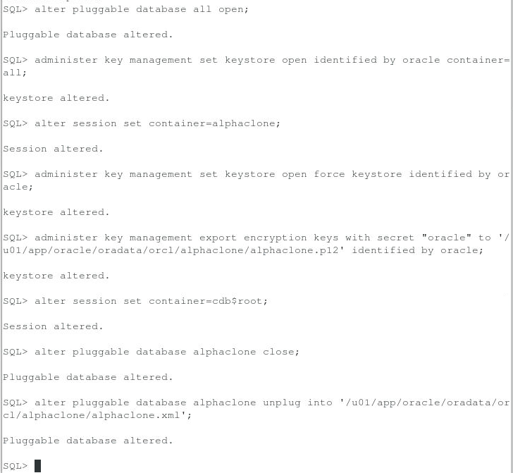

### **STEP 6**:  Copy the data files of new cloned on-premise PDB to the Oracle Cloud

-	Exit out of SQL PLus and run the following commands.
	- `exit;`
	- `cd /u01/app/oracle/oradata/orcl/alphaclone`
	- `tar -cvzf alphaclone.tar.gz *`

	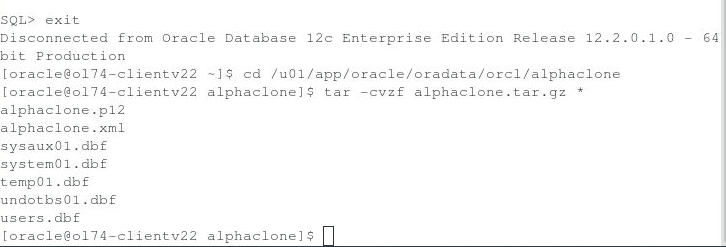

-	SSH into the Alpha01A-DBCS instance, create an alphaclone directory, and then copy the pluggable database to DBCS.
	- `ssh -i /u01/OPCWorkshop/ci_opc_keys oracle@<Alpha01A-DBCS IP>`
	- `mkdir /u02/app/oracle/oradata/ORCL/alphaclone`
	- `exit`
	- `scp -i /u01/OPCWorkshop/ci_opc_keys /u01/app/oracle/oradata/orcl/alphaclone/alphaclone.tar.gz oracle@<Alpha01A-DBCS IP>:/u02/app/oracle/oradata/ORCL/alphaclone`

	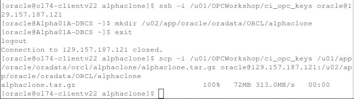

-	Untar the files
	- `ssh -i /u01/OPCWorkshop/ci_opc_keys oracle@<Alpha01A-DBCS IP>`
	- `cd /u02/app/oracle/oradata/ORCL/alphaclone`
	- `tar -xvzf alphaclone.tar.gz`

	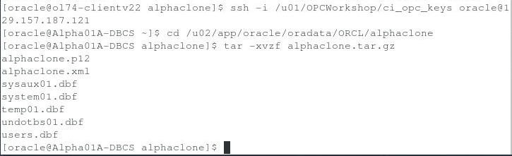

### **STEP 7**:  Plug the cloned on-premise database to Oracle Cloud Database

-	Open Firefox on the Desktop and log into Enterprise Manager Express
	- `https://localhost:5500/em`
	- **User Name:** `sys`
	- **Password:** `Alpha2018_`
	- **Container Name:** leave blank
	- check 'as sysdba'

	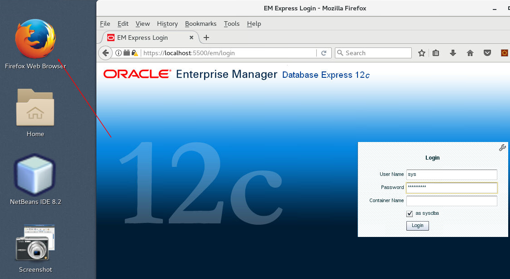

-	Click on the CDB link.

	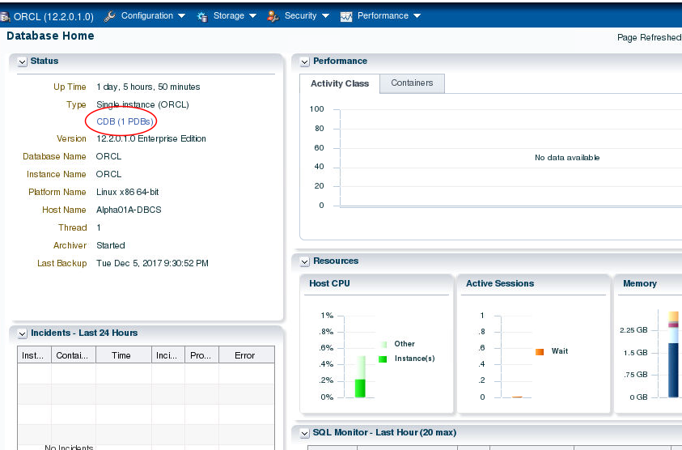

-	Click on Plug

	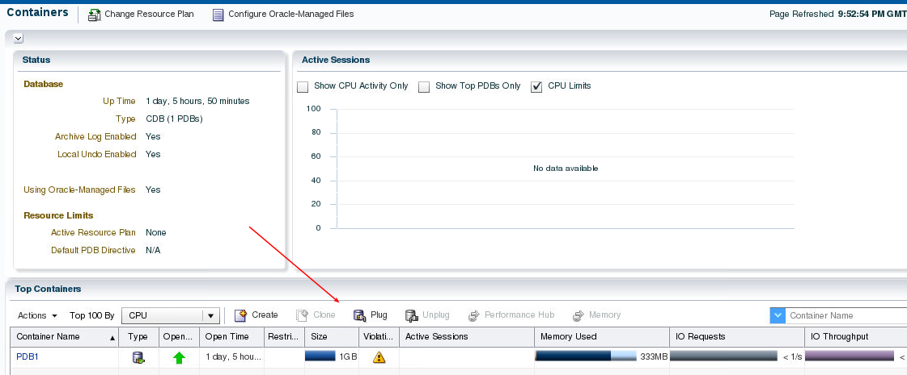

-	Enter Meetadata file, uncheck the 'Reuse source datafile' and enter the Source Datafile Location
	- **Metadata File:** `/u02/app/oracle/oradata/ORCL/alphaclone/alphaclone.xml`
	- **Source Datafile Location:** `/u02/app/oracle/oradata/ORCL/alphaclone`

	

	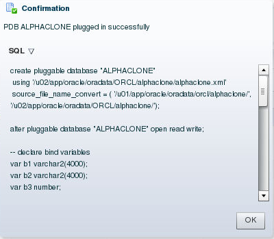

-	Notice the pluggable database has a violation.  Click on this.

	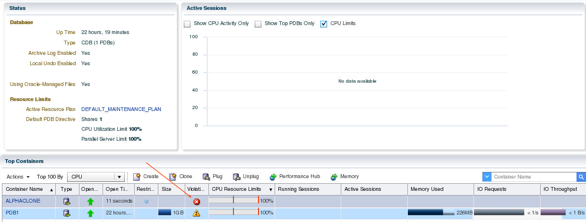

	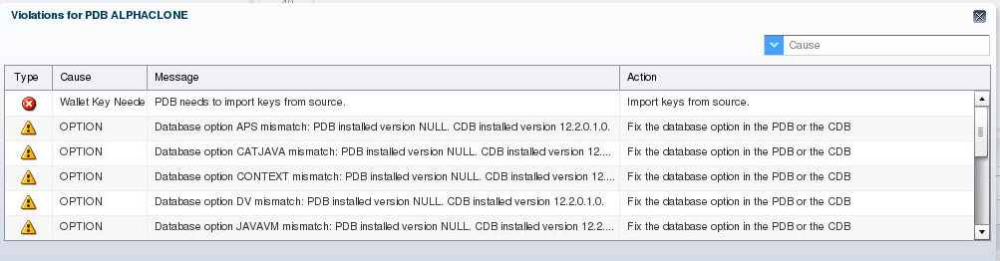

-	Cloud databases have TDE configured by default, but we need to import the alphapdb key.  Open a terminal window on the compute desktop and SSH into the Alpha01A-DBCS instance.
	- `source dbenv.sh`
	- `ssh -i /u01/OPCWorkshop/ci_opc_keys oracle@<Alpha01A-DBCS IP>`
	- `sqlplus sys/Alpha2018_ as sysdba`
	- `alter session set container = alphaclone;`
	- `select * from v$encryption_wallet;`

	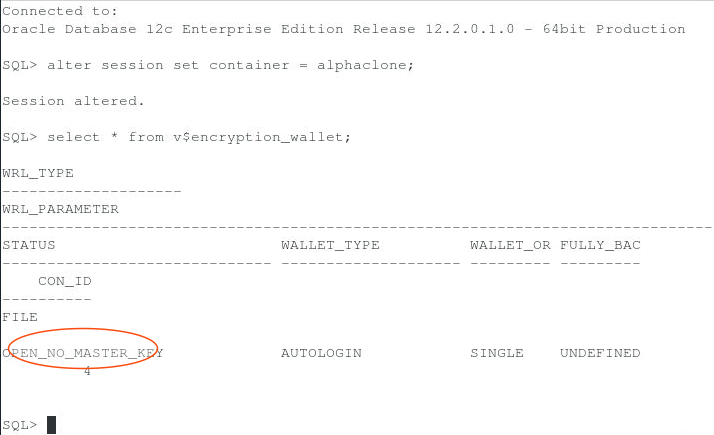

-	Import keys
	- `administer key management import keys with secret "oracle" from '/u02/app/oracle/oradata/ORCL/alphaclone/alphaclone.p12' force keystore identified by Alpha2018_ with backup;`

	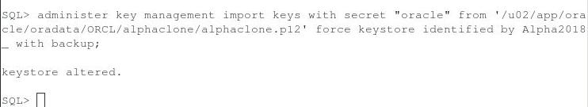

-	Review status of pluggable database in EM.  Open (or go back to) Firefox and log into IM:
	- `https://localhost:5500/em`
	- **User:** `sys`
	- **password:** sys password

	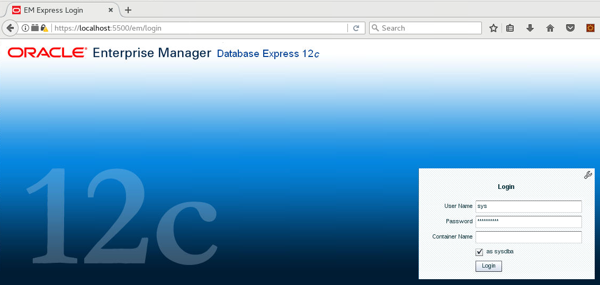

-	Navigate to containers.

	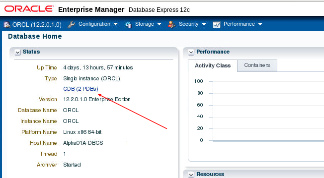

-	Highlight the Alphapdb pluggable database (don't click on the link) and select action close.

	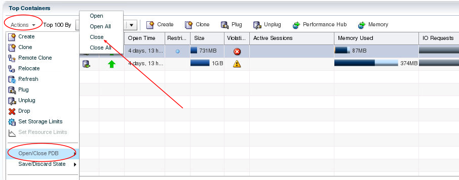

	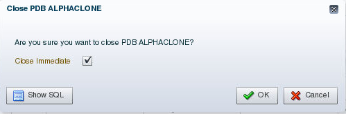

-	Re-open alphapdb pdb

	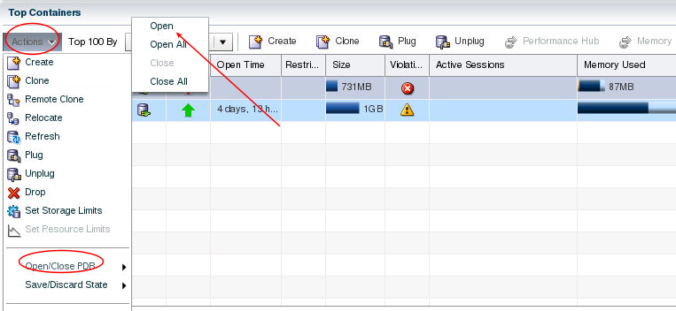

	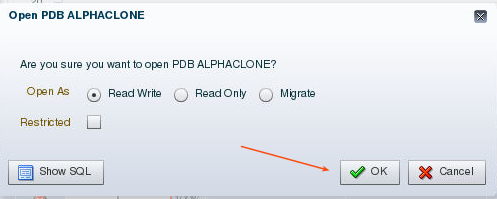

	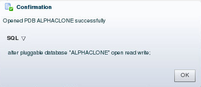

	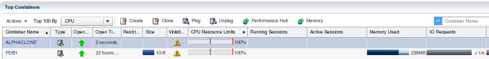

### **STEP 8**:  Create a SQL Developer connection to the Public Cloud database ALPHAPDB schema

-   Back in SQL Developer, click the green plus sign  in the Connections window to create a new connection; enter the following connection details:

	
	**Connection Name**:	`Alpha01A-DBCS`

	**Username**:			`alpha`

	**Password**:			`Alpha2018_`

	**Check** "Save Password"

	**Optionally select a color for the connection**

	**ConnectionType**:		`SSH`

	**Service Name**:		`alphaclone.<Your ID Domain>.oraclecloud.internal`
	
	
	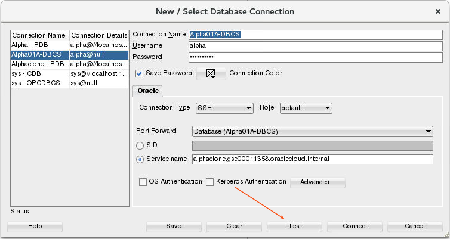

-   Click **Test** to confirm the information was entered correctly.

	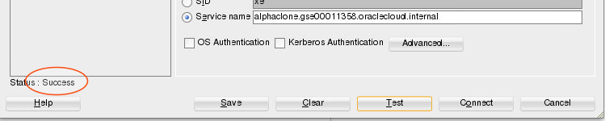
 
-   Click **Connect** to save the connection information and open a new SQL Worksheet.

	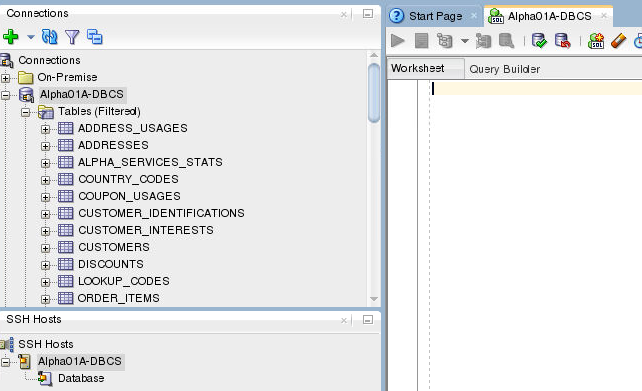

# Cloud Migration Using Data Pump: Schema Level

## Export the Alpha Schema

### **STEP 9**:  Create directory for datapump export

-	Open a terminal window and run the following commands
	- `source dbenv.sh`
	- `sqlplus alpha/Alpha2018_@alphapdb`
	- `create directory oracle as '/home/oracle';`
	- `exit;`

	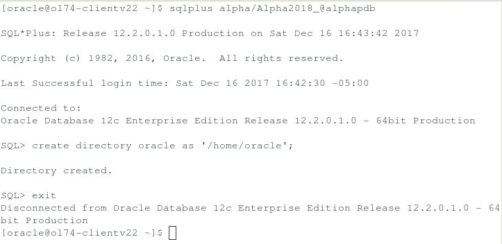

### **STEP 10**:  Run datapump export

-	Exit out of sqlplus and export the data
	- `exit` if you are still in sqlplus, otherwise open a new command window and enter source dbenv.sh
	- `expdp alpha/Alpha2018_@alphapdb directory=oracle dumpfile=alpha.dmp compression=all`
	- Note that directory tmp was created previously for you and is mapped to /tmp.  Also we are compressing the export file on the fly to reduce the size for when we scp the file to DBCS.

	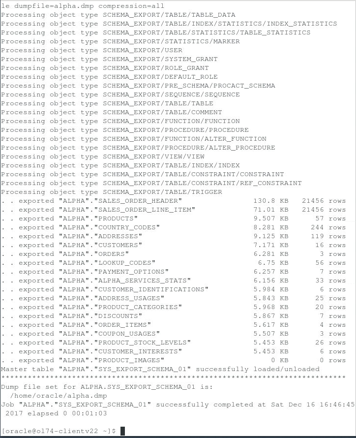

### **STEP 11**:  Copy the export Data Pump file to the server

-   Use the following secure copy (**scp**) command to transfer the Data Pump export to the DBCS server using your Database Service's Public IP address identified in Lab 100:
	- `scp -i /u01/OPCWorkshop/ci_opc_keys /home/oracle/alpha.dmp oracle@{your public IP}:.`

	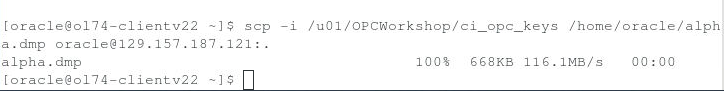

### **STEP 12**:  Create a new schema to hold a copy of the data

-	Open a new terminal window (or use the current one) and enter the following commands that will SSH to the Alpha01A-DBCS instance, create an Oracle directory, and import the data.
	- `ssh -i /u01/OPCWorkshop/ci_opc_keys oracle@{your public IP}` -- log into your remote DBCS instance
	- `sqlplus system/Alpha2018_@pdb1;` -- log into system in the alphapdb
	- `create user alpha2 identified by Alpha2018_;` -- create schema alpha2 (alpha already has the data from the previous lab)
	- `grant dba to alpha2;`
	- `connect alpha2/Alpha2018_@pdb1;` -- connect to alpha2 so we can create the oracle directory
	- `create directory oracle as '/home/oracle';`
	- `exit`

-	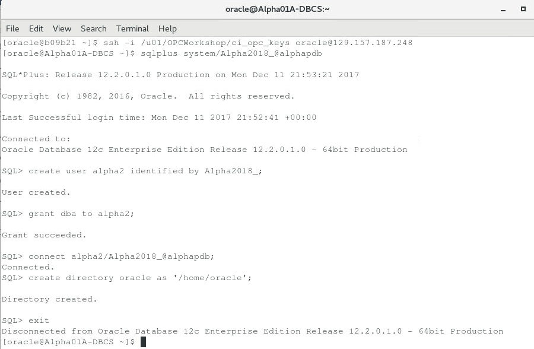

### **STEP 13**:  Import the data

-	Import the data.  Run the following command in your terminal window.
	- `impdp alpha2/Alpha2018_@pdb1 directory=oracle dumpfile=alpha.dmp remap_schema=alpha:alpha2`

-	

# Cloud Migration Using Data Pump: Tablespace Level

While datapump provides a very fast multi-threaded technique to move data quickly between Oracle Databases, it was not designed for very large volumes of data.  Transportable Tablespaces enable a database file copy technique that does not require an exported copy of the data, but instead allow you to copy the in-place data files to target, which using Datapump to capture the metadata only.

## Export the euro Schema

We will be exporting a GG (GoldenGate) tablespace, since there already is a users tablespace in the target database.

### **STEP 14**:  Open euro in read/write mode and export the metadata

-	Open a terminal window and create an Oracle export directory and put the tablespace in read only mode.
	- `source dbenv.sh`
	- `sqlplus system/Alpha2018_@pdb1`
	- `create directory oracle as '/home/oracle';`
	- `alter tablespace gg read only;`

	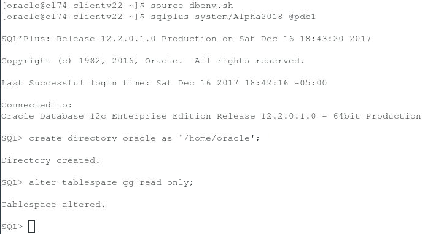

-	Export the data.  Enter the following commands in the terminal window.
	- `exit`
	- `expdp system/Alpha2018_@pdb1 directory=oracle dumpfile=ggtbs.dmp transport_tablespaces=gg exclude=statistics encryption_password=oracle logfile=full_tts_export.log`

	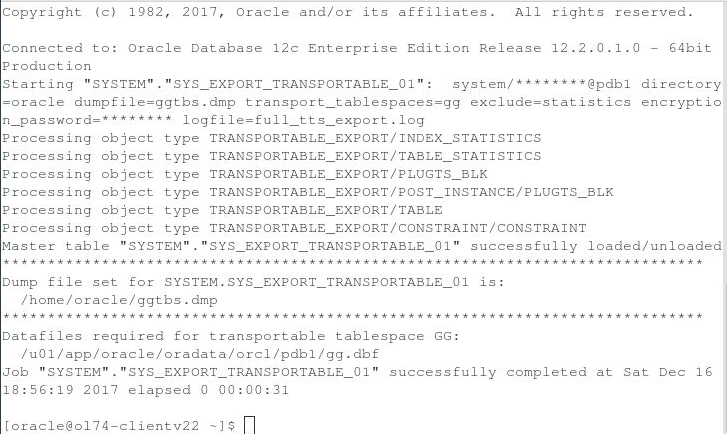

### **STEP 15**:  Copy the datafiles to the target DBCS instance

-	In the terminal window enter the following:
	- `scp -i /u01/OPCWorkshop/ci_opc_keys /home/oracle/ggtbs.dmp oracle@<DBCS IP>:.` -- metadata
	- `scp -i /u01/OPCWorkshop/ci_opc_keys /u01/app/oracle/oradata/orcl/pdb1/gg.dbf oracle@<DBCS IP>:.` -- datafiles

	

### **STEP 16**:  Import the tablespace into the target DBCS instance

We will be importing the data into the pdb1 instance.  First we'll need to drop the users tablespace since it already exists, then create an Oracle tmp directory, and then run the import.

-	SSH to the target DBCS instance, log in, and create euro user (must already exist in the target).
	- `ssh -i /u01/OPCWorkshop/ci_opc_keys oracle@<DBCS IP>`
	- `sqlplus system/Alpha2018_@pdb1`
	- `create user euro identified by Alpha2018_;`
	- `grant dba to euro;` 
	- `create directory oracle as '/home/oracle';`

	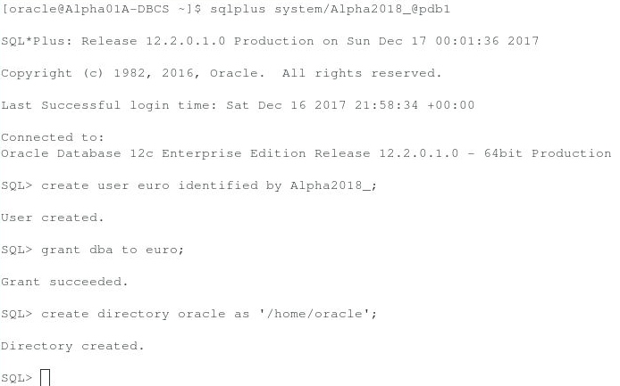

-	Exit from sqlplus and copy the ggtbs.dbf datafile to the pdb1 directory.
	- `exit`
	- `cp /home/oracle/gg.dbf /u02/app/oracle/oradata/ORCL/PDB1`

	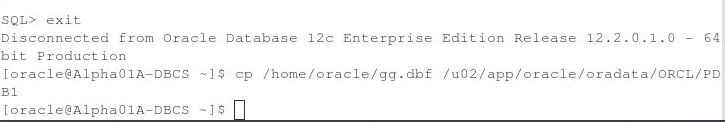

-	Import the data (note you will see some errors due to existence of some objects).
	- `impdp system/Alpha2018_@pdb1 directory=oracle dumpfile=ggtbs.dmp logfile=full_tts_imp.log encryption_password=oracle transport_datafiles='/u02/app/oracle/oradata/ORCL/PDB1/gg.dbf'`

	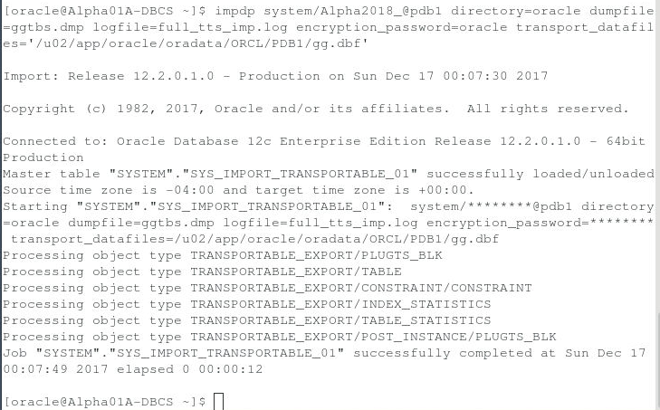

-	Confirm tablespace and contents exist by querying the Oracle dictionary.  Log into sqlplus and run the following query.
	- `sqlplus system/Alpha2018_@pdb1`
	- `select tablespace_name, count(*) from dba_tables group by tablespace_name;`

	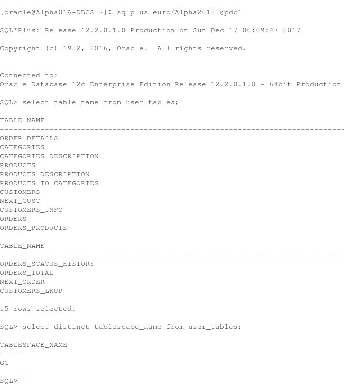

# Cloud Migration Using Database Links (Table Level)

Occasionally you just want to copy one or more tables from one database to another, and the easiest/quickest way to do that is to use a database link.  A database link connects two databases with sqlnet allowing you to reference remote tables in your local database.  This is good for table data, but other object types such as stored procedures, etc. cannot be replicated as easily.

## Create a Database Link

### **STEP 17**:  Create Database Link on the local system

-	Since we need to use tunnels to communicate with the remote DBCS instance when using ports other than 22 (which is open) we need to ensure our tunnels are still open (from lab 100).  In a terminal window enter the following
	- `sudo su`
	- `ps -ef|grep DBCS`

	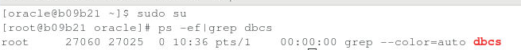 -- if this is all you see then the tunnels are not open.  If you see the tunnels then no need for the next step

-	If you do need to re-establish the tunnels enter the following, and do NOT close the terminal window, just minimize it.
	- `/u01/OPCWorkshop/lab/setssh.sh DBONLY` -- enter the DBCS IP address when prompted

-	Re-test tunnels - you should see this.

	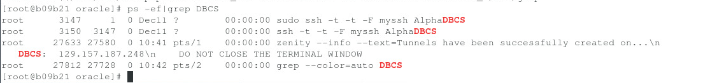

-	Log into SQLPlus in and create the database link.  Be sure to update this command with your Identity Domain.
	- `source dbenv.sh`
	- `sqlplus alpha/Alpha2018_@alphapdb;`
	- `create database link alpha_dbcs.oracledemo.com connect to alpha2 identified by Alpha2018_ using '(DESCRIPTION=(ADDRESS=(PROTOCOL=TCP)(HOST=localhost)(PORT=1530))(CONNECT_DATA=(SERVER=DEDICATED)(SERVICE_NAME=pdb1.<IDENTITY DOMAIN>.oraclecloud.internal)))';`
	- `select sysdate from dual@alpha_dbcs.oracledemo.com;`

	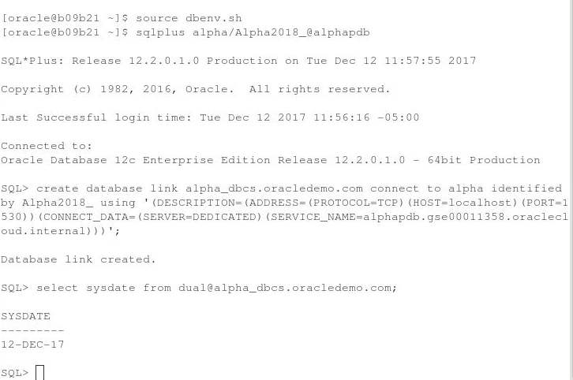

-	Copy a table from the remote DBCS to the local instance.  Note that you cannot create a remote table (DDL operation) on the remote server but you can do an insert operation.  First need alter the local users tablespace and make it read write.
	- `create table mstars_local as select * from mstars@alpha_dbcs.oracledemo.com;`
	- `insert into mstars@alpha_dbcs.oracledemo.com select * from mstars;`
	- `commit;`

	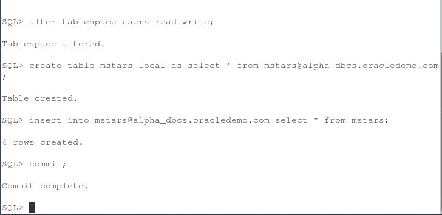