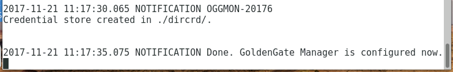
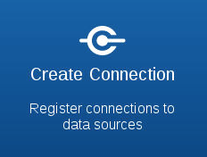
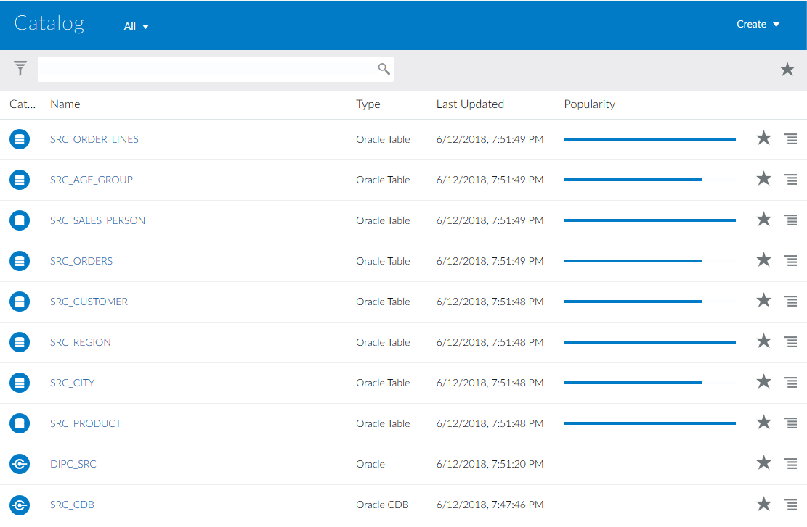

# Task 0: Preparation Steps

## Logging Into Oracle Cloud Instance

1. In your web browser, navigate to cloud.oracle.com, then click Sign in.

- Enter your user name and password, then click Sign In.

2. Log into Data Integration Platform Cloud

    a. Open a browser window from your laptop/desktop (not inside the DIPC VM)

    b. Click on DIPC Home bookmark or go to  \<hostname>:7003/dicloud/login.html
    

- Login with weblogic/#!hyper1on!#

After a few seconds, the following page should appear –

## Optional 
    - (Optional)  If the Agent is not started:
    - Open a Terminal windows:
    - cd /home/DIPC/DIPC_AGENT2/dicloud/agent/dipcagent001/bin
    - Execute ./startAgentInstance.sh In the Terminal window you should see ‘NOTIFICATION Done. GoldenGate manager is configured now.’ when the agent is fully started

- In Browser : Within app, on your desktop go to Agents page in DIPC

- The agent should appear as follows (it will be Stopped at first then Running)

# Task 1: Setup DIPC Connections

The connectivity information for this hand-on lab is as follows:

    * Source Schema/User: DIPC_SRC
    * OLTP_Schema/User: DIPC_TGT
    * Passwords: welcome
    * Server: localhost
    * Port: 1521
    * Service: dics12c

The next steps will walk you through how to setup each.

1. Log into Data Integration Platform Cloud

    a. From your local laptop/desktop start Chrome (you can also continue to
use Chrome on the Ravello instance)
    
    b. Go to your \<hostname>:7003/dicloud/login.html

    c. Login with weblogic/#!hyper1on!#. The following page should appear

2. Click Home

3. Create Source Connection

    a. Click Create Connection

4. Enter the following information:

    * Name: Sync Source
    * Description – Sales OLTP Source Data
    * Agent – localhost:
    * Type Oracle – selecting Oracle will expand the Connection Settings
    * Hostname: localhost
    * Port: 1521
    * Username: DIPC_SRC
    * Password: welcome
    * Service Name: dics1
    * Schema: DIPC_SRC
    

5. Review Connections settings.

6. Click Test Connection button then Save

7. Create Target Connection from the Catalog

    a. Click on the Create button and select Connection

8. Enter the following information

    - Name: Sync Target
    - Description – Sales OLTP Replicated Data
    - Agent – localhost:
    - Type Oracle – selecting Oracle will expand the Connection Settings
    - Hostname: localhost
    - Port: 1521
    - Username: DIPC_TGT
    - Password: welcome
    - Service Name: dics12c
    - Schema: DIPC_TGT

9. Click Test Connection button then Save

10. Review Catalog after saving –

Note: Data Entities are harvested and profiled at Connection creation, their popularity
is also calculated by reviewing the DB query logs. This process may take some time (5 minutes or so), the Catalog will show
a message when new updates are available

11. Click entity – SRC_ORDERS
You can browse the Catalog pages to find it or you can use the Search bar
(search for SRC_ for example)

Notice the Popularity score calculated for SRC_ORDERS, a full bar means that this
is one of the Data Entities that has been used the most in queries. Right now
SRC_ORDERS hasn’t been used yet so the bar is empty. Tags can be added as
well to group objects together

12. Click on the Metadata tab

13. Click on an Attribute, ORDER_DATE for example

14. Notice the Profiling statistics appearing in the right-hand side drawer

15. Click Data tab

16. suing the left-most panel, go back to the main Catalog page – Search for Data Entity –
SRC_ORDER_LINES and click on it in the Quick Search results

17. Click Metadata tab

18. Click on a column, for example column – QTY

19. Notice the Profiling statistics

20. Click Data tab

21. Review other entities as needed

# Task 2 : Create DIPC Synchronize Data Task

1. This hands-on lab uses a JDBC utility client that was built specifically for this
demo. This client is NOT part of DIPC, however it does help visualize the
Synchronize Data and ODI Execution Job process.

   a. Open a browser window from your laptop/desktop (not inside the DIPC VM)

    b. Click on DIPC Home bookmark or go to  \<hostname>:7003/dicloud/login.html
    

- If needed
press Enter to see the Login window, re-enter the DIPC user password (welcome1) and press Enter or click Unlock

3. Open a Terminal

4. From the home directory execute ./startDIPCDemoClient.sh

5. Once the Synchronize Data task is saved and executed this client will be used
to visually monitor the Replicated Schema, the tables and their row counts

6. Optional: If you are also familiar with ODI Console, you will be able to monitor
the data pump execution from within ODI Console –

7. Optional: Create a new tab within Chrome

8. Optional: Log into ODI Console
    - \<hostname>:7003/odiconsole
    - username: SUPERVISOR
    - password: welcome 

9. Within the DIPC App, click Home (from the left-most panel)

10. Click Synchronize Data

11. Name your task –Sync Sales Data

12. Description: Sync Schemas - DIPC_SRC to DIPC_TGT

13. Select your source connection and schema
    - Connection: Sync Source
    - Schema: DIPC_SRC

14. Select your target connection and schema
    - Connection: Sync Target
    - Schema: DIPC_TGT

15. Leave ‘Include Initial Load’ and ‘Include Replication’ checked under Advanced
Options. These options allow you to optionally enable or disable the initial load
and/or the on-going schema replication

Note: If you run into any issues when trying to select a Connection refresh the page
manually. The Schemas may take some time to appear as well, this is expected.

16. Next click on Configure Entities to filter the objects that will be transferred from
Sync Source into Sync Target

17. The Configure Entities screen allows you to create include or exclude rules to
define precisely which database objects will be moved over to the target
schema. By default all Data Entities are transferred

18. Enter SRC* in the Rules field and click on Include

19. Then click on the menu next to the 1st rule (Include *) and select Delete

20. You should end up with only the following Include Rule (Include SRC*) listed

21. To better view the Demo Client as well as the DIPC monitoring, try to setup your
screen as follows with the Demo Client at the top and the DIPC App below or
have the two side by side.
It is recommended to use two screens if possible.

## OR

22. Run Synchronize Data Task
    
    a. Click Save and Run
    
    
    b. A notification will appear that the job was saved.

    c. A new DIPC Job will be created to execute the task. A notification will appear in the notification bar as below:
    

    d. The job will automatically appear within the Jobs page. This may take up to 1 minute.
    

    e. Click on the Job to see the Job Details
    

    f. Auto-refresh is on, statuses will be updated frequently

    g. As the job executes, the Initial Load process is created in ODI while DIPC configures OGG for the Source Capture and Target Delivery

    h. As this job executes, the Replicated Sales OLTP Source Data table will be updated in the Demo Client. As new tables are created they will show up as yellow, when the row counts of the source and replicated schemas match the rows will turn green
    

Note: It may take several minutes for the Replicated Sales OLTP Data side to
show anything. This is normal.

    i. As the row counts of each table match the rows will turn green

    j. Optional: The Initial Load process (uses Data Pump) can also be monitored within ODI Console- (second created tab in Chrome) Expand Runtime/Sessions/Load Plan Executions then click on Sessions and on the glasses icon to view the status
    

    k. Optional: Click on the Session at the top of the list to view the Details in ODI Console

    l. Once the row counts match and the Initial Load process is complete the “Initial Load Complete” button within the Demo Client will be enabled.

    m. Go back to the Job Details in the DIPC App. to review the status there. The Initial load Action will show Successful after a little while (may take 7 minutes or more)

    n. Once done, the Initial load Action can be expanded to review the various steps underneath

    o. Click on Procedure:Initial load_PROC:DBLINK_DATAPUMP to review the Code generated by DIPC for the Initial Load. Click Done when you’ve completed the code review

# Task 3 : Validate DIPC data Synchronization Job

At this point DIPC has created and orchestrated the initial load and the data
synchronization process for the OLTP source and operational data store. A new DIPC
job is created and executed and can be monitored with the Jobs view.

1. You can also monitor the process by monitoring the DIPC Agent terminal
window. You could also monitor the DIPC Managed Server, however there is a
lot of detailed information here

2. Click Jobs and refresh until the newly created DIPC Job shows up.
    - You should see 5 Actions

3. The DIPC agent is orchestrating this process. Additional details can be seen in
the GG logs as well as within ODI Studio.

4. Before doing anything else monitor GG and watch for extracts and replicats to
be created and started and RUNNING

    a. Open Terminal on DIPC host machine
    b. cd /home/DIPC
    c. Execute ./GGINFO_ALL.sh
    d. Ensure both Extract and Replicat are running

5. Once all rows are green in the Demo Client, proceed to next step

# Task 4 : Monitor Source Inserts/Updates/Deletes

1. Now that the initial load is complete and the extract/replicat have been created
and are running, we can simulate insert/updates and deletes on the source and
monitor the replicated data through the Demo Client.

2. Using the Demo Client click on the “Initial Load Complete” Button (if you have NOT done it already).

3. The following screen will appear. NOTE – the current refresh of the client is 10
seconds.

The demo client shows the source Sales OLTP data, the replicated Sales OLTP
data, and the target Sales DW. As data is updated, inserted or deleted from the
source the data will be automatically synchronized with the replicated schema
by the Sync Sales Data Job we created in DIPC. Once the synchronization is
done, the target Sales DW schema is updated by a scenario that was created in
the Standalone ODI Instance included with DIPC. DIPC and standalone ODI will
work hand in hand to implement the end-to-end data flow.
Note: We will be using an ODI Execution Task in DIPC to kick off the execution
of that scenario

Note: If the window is too small through the Ravello Console you can also use
VNC to log into the VM. Use your favorite VNC client and enter <Ravello
Instance Hostname>:1 as the URL to connect to.
When prompted enter the password: #DIPCR0CKS#

4. Perform a simple update of the source table by editing the data directly within
the table grid. Update the first row’s status which contains ORDER_ID=1 from
COM to CLO, clicking enter will commit the update and turn the column yellow –

5. This row will be automatically update on the replicated schema as the DIPC Job
picks up the change. The Demo Client is set to refresh at 10 seconds, so it will
at least take 10 seconds for the replicated table grid to update. Once the Demo
Client finds the change both rows will be updated to yellow.

6. The yellow highlights will automatically expire within the client.

7. To perform an insert click on the “Simulate Inserts” Button once.
This will perform an insert and the demo client will scroll to the row that was
inserted.

8. Depending on the refresh, the row may directly be replicated to the replicated
schema or appear in the next refresh by the Demo Client.

9. Both rows should show as yellow

10. To perform a delete click last row and click on the icon
  
 
- Notice this record will be deleted from the replicated schema as well.

# Summary

You have now successfully completed the Hands on Lab, and have successfully performed an end-to-end data synchronization task through Oracle’s Data Integration Platform Cloud.

