# Lab 200 - Data Synch Elevated Task
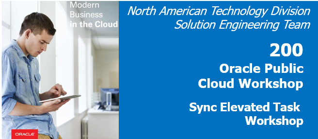

## Before You Begin

### Purpose
This lab shows you how to execute a Data Synch elevated task; as well as how to define all necessary elements to run the task.

### Time to Complete 
Approximately 60 minutes.

### What Do You Need?
Your will need:
- DIPC Instance URL
- DIPC User and Password
- General understanding of RDBMS and data integration concepts

## Log into DIPC Server

### Login into DIPC using Oracle Cloud Services Dashboard
1. In your web browser, navigate to cloud.oracle.com, then click Sign in.
2. Provide the cloud account: oscnas001 then <Enter>
3. Provide your user name and password, then click "Sign In" button. You will land in the Dasboard screen

	

4. In the "Data Integration Platform Cloud" service box click on the hamburguer menu and then select "Open Service Console"

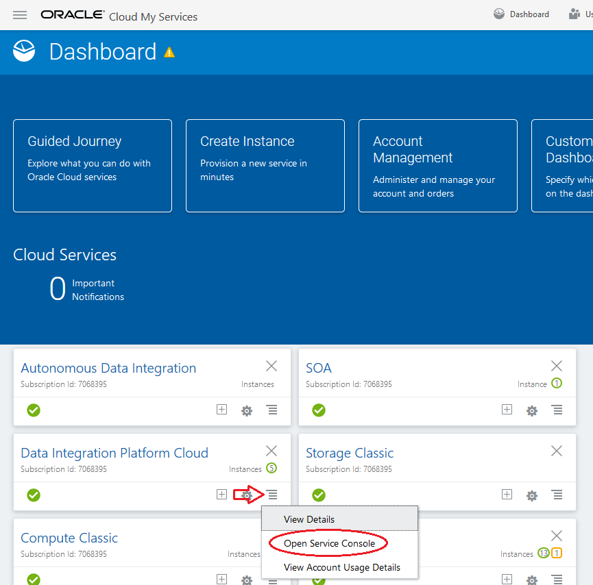

5. Click on the hamburger menu of the DIPC server assigned to you, then click "Data Integration Platform Console"

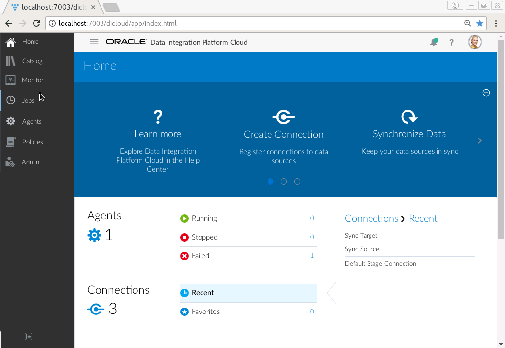

You will be navigated to your DIPC server Home page.

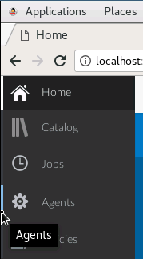

### Login into DIPC using direct URL
1. Open a browser window an provide your DIPC server URL. The URL will be provided by the instructor and will look like this one

https://osc132657dipc-oscnas001.uscom-central-1.oraclecloud.com/dicloud

2. Provide your user name and password, then click "Sign In" button

You will be navigated to your DIPC server Home page.

## Create Connections and Review Catalog
1. Log into your Workshop DIPC Server
2.	In the Home Page click “Create Connection” from top section
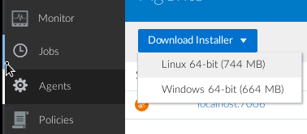

3.	Enter the following information:
    - Name: DIPC_SRC
    - Description: Sales OLTP Source Data
    - Agent: \<LOCAL_AGENT>
    - Type Oracle: selecting Oracle will expand the Connection Settings

    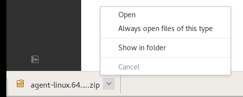

    - Hostname: <SOURCE_DB>
    - Port: 1521
    - Username: DIPC_SRC
    - Password: Welcome#123
    - Service Name: <SOURCE_DB_SERVICE_NAME>
    - Schema: DIPC_SRC
    - Schema Name: DIPC_SRC (Default) – When you try to select the schema, you are testing the connection at the same time
    - CDB Connection: SRC_CDB

    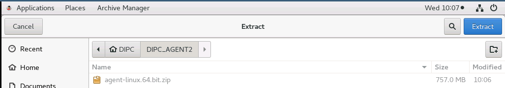

4. Click "Test Connection" button and when the test is successful click "Save" button. DIPC will create the connection and will harvest the entities in the schema. You will be navigated to the Catalog and you will see, after some time, the connection you just created and the entities in that schema

**Note: Data Entities are harvested and profiled at the time the connection is created, their popularity is also calculated by reviewing the DB query logs. This process may take some time (5 minutes or so), the Catalog will show a message when new updates are available**

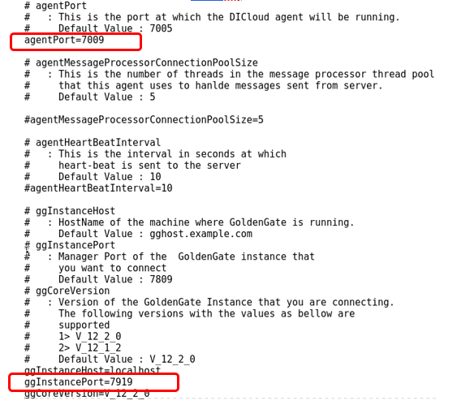

5.	Click on entity “SRC_CUSTOMER” to drill down in it and look at the information DIPC brought in

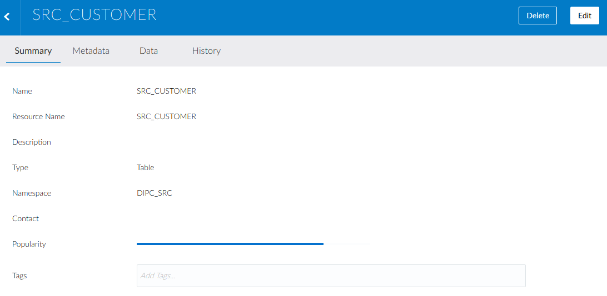 

If you would like to associate a tag or a contact to this entity, click on “Edit” button on the top right corner.

6.	Click on the “Metadata” tab on top

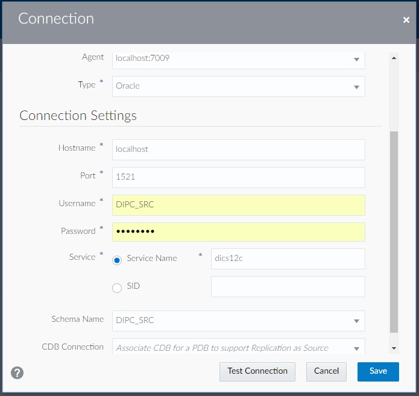 

DIPCS shows attributes, primary keys, data types and some sample values of the selected entity. If you click in one of the attributes, profiling information will be shown on the right side of the screen.

  

7.	Click on the “Data” tab on top

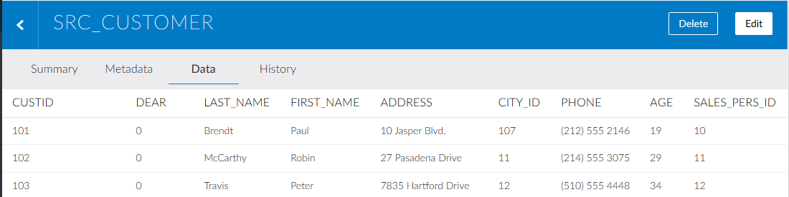 

8.	Click on the back icon, located on the top left corner (left of the entity name) to go back to the Catalog
9.	In the catalog you can use the drop-down menu located at the top to select the type of object that will be shown

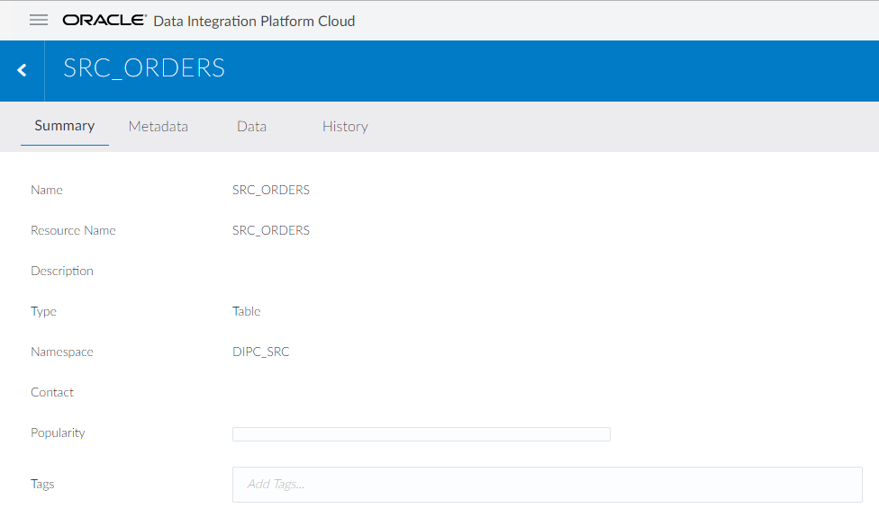

10.	It is also possible to use the filter to search for a specific object

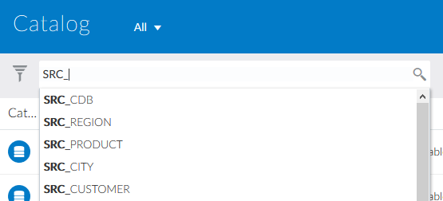

11.	Now, we are going to create the target connection. From the top bar, Open the drop-down menu from the top far right corner and then select “Connection” 

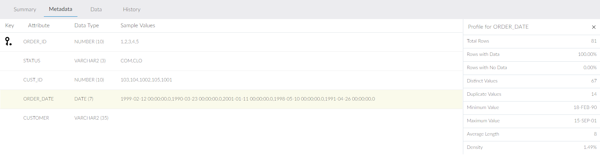

12.	Enter the following information:
    - Name: DIPC_TGT
    - Description: Sales OLTP Replicated Data
    - Agent: <LOCAL_AGENT>
    - Type Oracle – selecting Oracle will expand the Connection Settings
    - Hostname: <TARGET_DB>
    - Port: 1521
    - Username: DIPC_TGT
    - Password: Welcome#123
    - Service Name: <SOURCE_DB_SERVICE_NAME>
    - Schema: DIPC_TGT (Default)

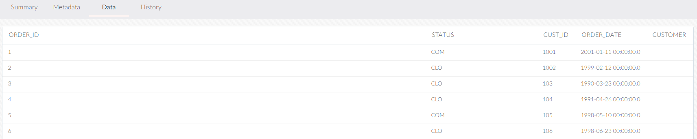

13. Click "Test Connection" button and when the test is successful click "Save" button. DIPC will create the connection and will harvest the entities in the schema. You will be navigated to the Catalog and you will see, after some time, the new connection you just created and the entities in that schema (if any)

## Create Synchronize Data Elevated Task

1.	Connections have been defined. We are ready to create and execute our “Synch Data” elevated task. From the top bar, open the drop-down menu from the top far right corner and then select “Synchronize Data”

 

2.	Provide the following information:
•	Name: Sync Sales Data
•	Description: Sync Schemas - DIPC_SRC to DIPC_TGT 
•	Source – Connection: DIPC_SRC
•	Source – Schema: DIPC_SRC – The default schema will be automatically selected. Leave it
•	Target – Connection: DIPC_TGT
•	Target – Schema: DIPC_TGT – The default schema will be automatically selected. Leave it
•	Advanced – Include Initial Load: SELECTED
•	Advanced – Include Replication: SELECTED
The “Advanced Options” allow you to optionally enable or disable the initial load and/or the on-going schema replication.
Note: If you run into any issues when trying to select a Connection refresh the page manually. The Schemas may take some time to appear as well, this is expected.

 
17.	Next click on “Configure Entities” on the top bar to filter the objects that will be transferred from source into target.
 
18.	The “Configure Entities” screen allows you to create include or exclude rules to define precisely which database objects will be moved over to the target schema. By default, all data entities are transferred. Enter SRC* in the Rules field and click on “Include” button.

  

19.	Select the hamburger menu   (located on the right side of the row) of the rule you just created and select “Delete”
20.	You should end up with the original rule only

 
21.	Click on “Save & Run” button on the top right to execute the task
22.	You will be navigated to the “Jobs” screen. After some time, a notification will appear in the notification bar

 

23.	The job will automatically appear within the Jobs page. This may take up to 1 minute

 

Auto-refresh is on, statuses will be updated frequently
As the job executes, the Initial Load process is created in ODI while DIPC configures OGG for the Source Capture and Target Delivery.
OPTIONAL: ODI Console
Optional: The Initial Load process (uses Data Pump) can also be monitored within ODI Console. Expand Runtime/Sessions/Load Plan Executions then click on Sessions and on the glasses icon to view the status

1.	Click on the picture icon located on the top right corner of the screen and then select “Open ODI”

 

2.	Click on “Proceed” button
 
3.	On the hierarchical panel on the left select “Runtime > Sessions > Sessions”

 

4.	Now click on the “View” ( ) icon (sunglasses located on top left corner). This will open a tab on the right side with information about the executed sessions.

 

5.	Click on the session name to drill down and look at more detail
 
6.	Scroll down to see the detailed steps. When finished, you can close the browser tab with ODI Console

 

Review Job in DIPC
1.	You should be in the “Jobs” screen. Click on the Job to see the Job Details. The Initial load Action will show Successful after a little while

 

2.	Once done, the “Initial Load” Action can be expanded to review the various steps underneath

 

3.	Click on “Procedure:Initial load_PROC:DBLINK_DATAPUMP” to review the code generated by DIPC for the Initial Load. 

 

4.	Click Done when you’ve completed the code review
5.	Close “Initial Load” action. Let’s review what else has been created. You should see 5 Actions

 

6.	DIPC has created and orchestrated the initial load and the data synchronization processes between the source (for example, an OLTP system) and the target (for example, an operational data store, stand-by copy, etc.) -- (additional details can be seen in the GG logs as well as within ODI Studio)

Optional: Verify data in source and target DBs
Up until this point, we have monitored the job within DIPC but it would nice to see the data in both source and target to verify that they are the same. For such task, we will use SQL Developer; please refer to Appendix 3 to learn how to create connections against the workshop databases.
1.	Start SQL Developer. On the connections panel, select your source database and click on the plus (+) sign to open the connection
 
2.	Once opened, copy and paste the following statements in the panel on the right:
SELECT COUNT(*) AGE_GROUP FROM SRC_AGE_GROUP;
SELECT COUNT(*) CITY FROM SRC_CITY;
SELECT COUNT(*) CUSTOMER FROM SRC_CUSTOMER;
SELECT COUNT(*) ORDER_LINES FROM SRC_ORDER_LINES;
SELECT COUNT(*) ORDERS FROM SRC_ORDERS;
SELECT COUNT(*) PRODUCTS FROM SRC_PRODUCT;
SELECT COUNT(*) REGION FROM SRC_REGION;
SELECT COUNT(*) SALES_PERSON FROM SRC_SALES_PERSON;

 
3.	Execute the statements by clicking on the “Run script” ( ) icon (second from left to right on the icon bar
4.	This will show all entities count on the results panel (lower section)
 
5.	Repeat steps 1 through 4 for connection “WS EMEA - DIPC_TGT”
 
This will show that the count in both DBs is exactly the same

Optional: Verify GG processes
If you want to take a look and verify that the GG processes (extract and replicat) are running, these are the steps:
1.	Open an SSH session into the DIPC server; please refer to Appendix 1 to learn how to establish a SSH session against the DIPC server
2.	Execute : source .ggsetup 
3.	Execute: /u01/app/oracle/suite/gghome/ggsci
 
4.	You are now in GG console, execute: info all
 

Now you have ensured both Extract and Replicat are running. Exit from GGSCI
Monitor data changes Source
We are going to apply some changes to the source DB and verify how our “Synchronize Data” task takes care of these changes and replicates them to the target.
1.	Go to your SQL Developer and expand “WS AMER - DIPC_SRC” connection and its tables.
 
2.	Select “SRC_CUSTOMER” table
3.	On the right panel, select “Data” tab
 
4.	Click on “Insert Row” ( ) icon and provide the following data:
•	CUSTID: 1000
•	DEAR: 0
•	LAST_NAME: Parker
•	FIRST_NAME: Peter
•	ADDRESS: 1200 Smith Street
•	CITY_ID: 12
•	PHONE: (510) 556 4879
•	AGE: 48
•	SALES_PERS_ID: 12
 
5.	Click on “Commit” ( ) icon to insert the row into the DB
6.	Verify the insert in the target. Go to SQL developer and expand “WS EMEA - DIPC_TGT” connection and its tables
 
7.	Select “SRC_CUSTOMER”  table
8.	On the right panel, select “Data” tab. You will need to scroll all the way down to see the new row
 
As data is updated, inserted or deleted from the source the data will be automatically synchronized with the replicated schema by the DIPC Sync Sales Data Job. 
9.	Go back to DIPC, you should be in the detail screen of the Data Synch job
10.	Verify that the screen has auto refresh ON so you will see the changes 
 
11.	It might take some time. The screen will reflect the insertion in the source
 
12.	And the insertion in the target
 
13.	Now, we will perform a delete. On your “WS AMER - DIPC_SRC” connection (SQL Developer) select “SRC_CUSTOMER” table
14.	On the right panel, select “Data” tab and look for “Peter Parker”, select it.
 
15.	Click on “delete icon ( ) 
16.	Click on “Commit” ( ) icon 
17.	Let’s verify the deletion in the target. On your “WS EMEA - DIPC_TGT” connection (SQL Developer) select “SRC_CUSTOMER” table
18.	Look for “Peter Parker”, it will not be there
19.	Go back to DIPC, you should be in the detail screen of the Data Synch job
20.	It might take some time. The screen will reflect the deletion in the source
 
21.	And the deletion in the target
 
22.	Now let’s perform an update. On your “WS AMER - DIPC_SRC” connection (SQL Developer) select “SRC_CUSTOMER” table
23.	On the right panel, select “Data” tab and look for “Paul Brendt”, double click in his age
 
24.	Change it to 25
 
25.	Click on “Commit” ( ) icon. This row will be automatically updated on the target as the DIPC Job picks up the change
26.	Let’s verify the update in the target. On your “WS EMEA - DIPC_TGT” connection (SQL Developer) select “SRC_CUSTOMER” table
27.	On the right panel, select “Data” tab and look for “Paul Brendt”, his age has change to 25
28.	Go back to DIPC, you should be in the detail screen of the Data Synch job
29.	It might take some time. The screen will reflect the update in the source
 
30.	And the update in the target
 

Summary
You have now successfully completed the Hands-on Lab, and have successfully performed an end-to-end data synchronization task through Oracle’s Data Integration Platform Cloud.
 
