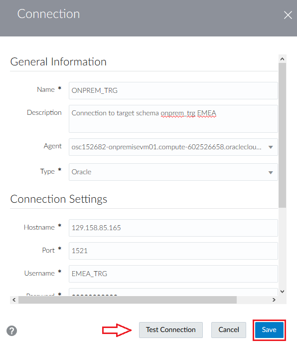
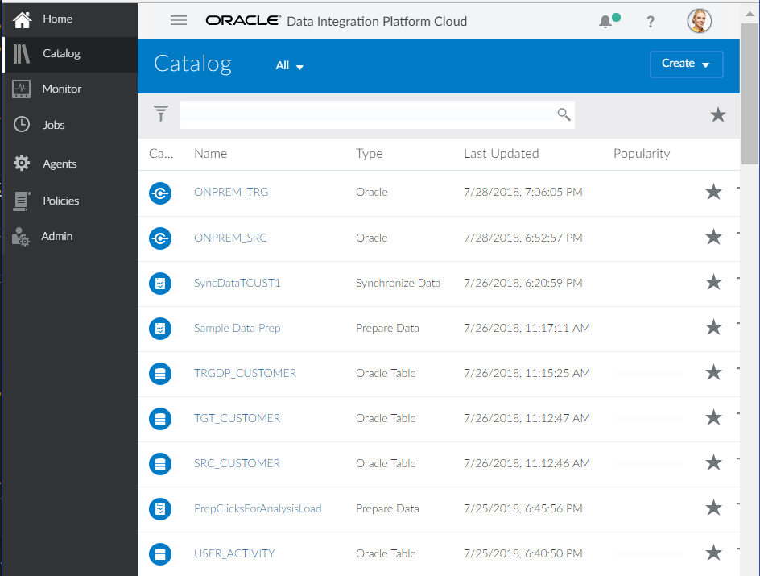
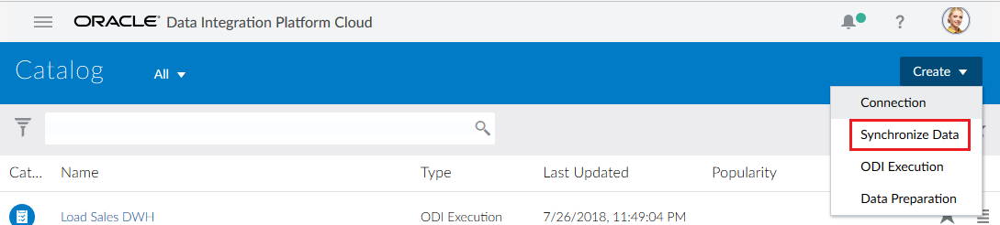
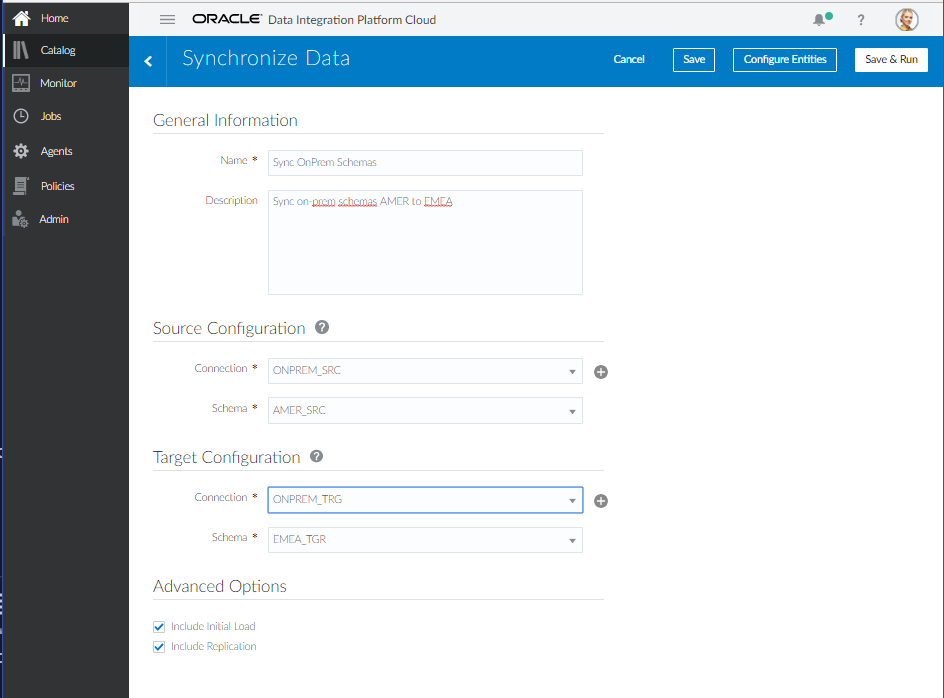
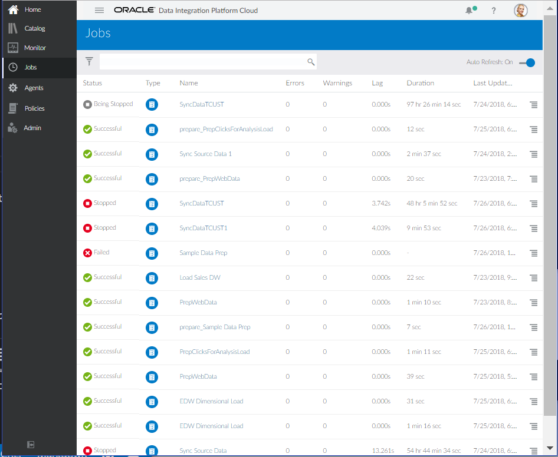

# Lab 300 - Remote Agent Install and On-prem to On-prem DB Synchronization

## Before You Begin

### Introduction

This lab covers installation and configuration of DIPC remote agent along with synchronization of two on-prem database schemas. Agents allow synchronization of data from sources outside Oracle Cloud. The target and source schemas will reside in the same database.

This lab supports the following use cases:
-   Configure Remote DIPC Agent
-   Synchronize two On-Premise Databases

### Objectives
-	Ensure Remote Agent is trusted by DIPC instance
-   Agent Download
-   Agent Installation and Configuration
-	Agent Administration - Starting and Stopping.
-   Synchronize two On-Premise Databases
   
### Time to complete
Approximately 45 minutes.

### What would you need
-   Cloud Dashboard URL and login credentials
-   1 DIPC Instance - DIPCINST
-   2 DBCS Instances - DBCSAMER, DBCSEMEA
-   1 Compute Instance - OnPremiseVM
-   Private keys in OpenSSH format for all instances 
-   OnPremiseVM public IP address
-   VNC Client
-	Putty for ssh connection to instances

## Remote Agent

### Download Agent
1.	Open an SSH session into your compute server (we will simulate on-prem with a compute instance); please refer to Appendix 1 to learn how to establish a SSH session
2.	Open a VNC viewer; please refer to Appendix 2 to learn how to establish a VNC session
3.	Open a terminal; select “Applications > Favorites > Firefox” from the top left corner of the screen

 
4.	Navigate to your DIPC server, provide the URL (it should look like this): https://osc132657dipc-oscnas001.uscom-central-1.oraclecloud.com/dicloud
5.	Provide your user name and password, then click "Sign In" button

 
6.	This will bring you to your DIPC server’s  home page
7.	Click on “Agents” (left part of your screen)

8.	Select drop down menu and select zip file for your Operating System 
9.	Select the “Linux” option

10.	Click "OK" to confirm selection

 
11.	Select “Save File” and the click “OK”, to download the file to your “on-premise” machine

12.	Open a terminal, select “Applications > Favorites > Terminal” from the top left corner of the screen

### Install Agent
1.	Create a directory for the agent, execute: mkdir dipcagent
2.	Move the downloaded file to that new directory, execute: mv Downloads/* dipcagent
3.	MOve to the new directory, execute: cd dipcagent
4.	Unzip the file, execute: unzip agent-linux.64.bit.zip
5.	Move to the agent directory, execute: cd dicloud
6.	Execute command to install agent: 
./dicloudConfigureAgent.sh -user=DIPCADMIN -dipchost=<DIPC_IP_ADDRESS> -dipcport=7003  -authType=BASIC
7.	New directories will be created, to look at then execute: ls
8.	We will take a look at the configuration file (agent.properties) and we will change the port in which this agent will talk to DIPC
9.	Open the editor, select “Applications > Accessories > Editor” from the top left corner of the screen

 
10.	Click on “Open” then “Other Documents”

11.	Browse to “/home/oracle/dipcagent/dicloud/agent/dipcagent001/conf/agent.properties”

 
12.	Modify agent port "agentPort" in parameter file "agent.properties" to 7010

 
13.	Now look for “ggccServicePort” and change it to 80

 
14.	Save and close. Click on “Save” button then on "Close" icon (top right corner)

### Execute the Agent
1.	We installed with defaults so we will move to the directory with the necessary commands to start the agent; execute: cd agent/dipcagent001/bin
2.	We will start the agent by executing:
./startAgentInstance.sh
3.	Your agent is now running. Go back to Firefox and look the “Agent” screen in DIPC
 

## On-Prem to On-Prem synchronization

### Verify Data in Source and Target DBs (Optional)
** MISSING STEPS
** Saves images 15 to 29 for this section

### Execute Data Synch Elevated Task
1. You should be logged into DIPC, if that is NOT the case, log in.
2. From the left side panel, SELECT "Home"

3. In the Home Page click "Create Connections" from the top section

4. Enter the following information:
    - Name: ONPREM_SRC
    - Description: Connection to on-prem database schema with source tables. AMER
	- Agent: <REMOTE_AGENT>
	- Type: Oracle
  	- Hostname: <COMPUTE_INSTANCE_IP>
	- Port: 1521
	- Username: AMER_SRC
	- Password: Welcome#123
	- Service Name: orcl

** MISSING 

5. Click on "Test Connection" button at the bottom. a green message should appear on top when everything is in order
6. Click on "Save"

** MISSING 

7. From the top bar, open the drop-down menu and the select "Connection"

** MISSING 

8. Enter the following information:
    - Name: ONPREM_TRG
    - Description: Connection to target schema onprem_trg EMEA
	- Agent: <REMOTE_AGENT>
	- Type: Oracle
	- Hostname: <COMPUTE_INSTANCE_IP>
	- Port: 1521
	- Username: EMEA_TRG
	- Password: Welcome#123
	- Service Name: orcl

** MISSING 

5. Click on "Test Connection" button at the bottom. a green message should appear on top when everything is in order
6. Click on "Save"

** MISSING 

7. From the top bar, open the drop-down menu and the select "Synchronize Data"

** MISSING 

8. Enter the following information:
	- Name: Sync OnPrem Schemas
	- Description: Sync on-prem schemas AMER to EMEA
	- Connection: ONPREM_SRC
	- Schema: AMER
	- Connection: ONPREM_TRG
	- Schema: EMEA
	- Advanced - Include Initial Load: SELECTED
	- Advanced - Include Replication: SELECTED

** MISSING 

9. Click on "Save & Run" button on the top right of the screen to execute the task
10. You will be navigated to teh "Jobs"screen. After some time, a message will appear in the notification bar

** MISSING 

11. The job will automatically appear within the "Jobs" page

** MISSING 

12. Click job to review details

** MISSING 

### Verify Data in Target DB (Optional)
** MISSING STEPS
** MISSING IMAGES

