# Lab 400 - Migrate On-Prem Database to Cloud
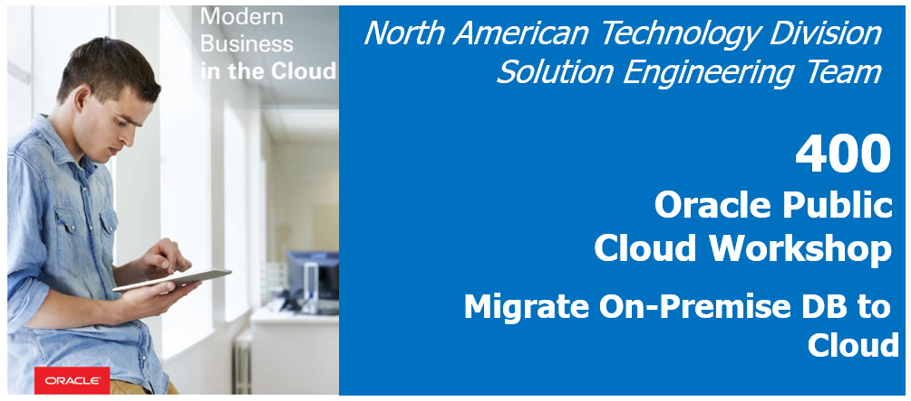

## Before You Begin

### Introduction 
This lab covers synchronization of an on-prem and cloud database using a previously installed remote DIPC agent. Agents allow synchronization of data from sources outside Oracle Cloud. Two VMs will be used to simulate a DIPC instance and an On-Prem database server. The DIPC repository database also host the cloud target schema.

This lab supports the following use cases:
-   Configure Remote DIPC  (Optional already done in Lab 300)
-   Synchronize On-Premise Database

### Objectives
-   Ensure Remote Agent is trusted by DIPC instance
-   Agent Download
-   Agent Installation and Configuration
-   Configure Agent SSL
-	Agent Administration - Starting and Stopping.
-   Synchronize On-Premise Database

### Time to complete
Approximately 45 minutes.

## Remote Agent
If you have already downloaded the agent to your "On-Prem" environment, please skip this section

### Download Agent
1.	Open an SSH session into your compute server (we will simulate on-prem with a compute instance); please refer to Appendix 1 to learn how to establish a SSH session
2.	Open a VNC viewer; please refer to Appendix 2 to learn how to establish a VNC session
3.	Open a terminal; select “Applications > Favorites > Firefox” from the top left corner of the screen

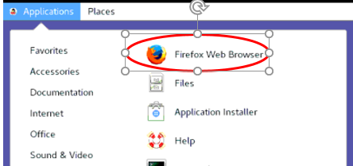
 
4.	Navigate to your DIPC server, provide the URL (it should look like this): 
https://osc132657dipc-oscnas001.uscom-central-1.oraclecloud.com/dicloud
5.	Provide your user name and password, then click "Sign In" button

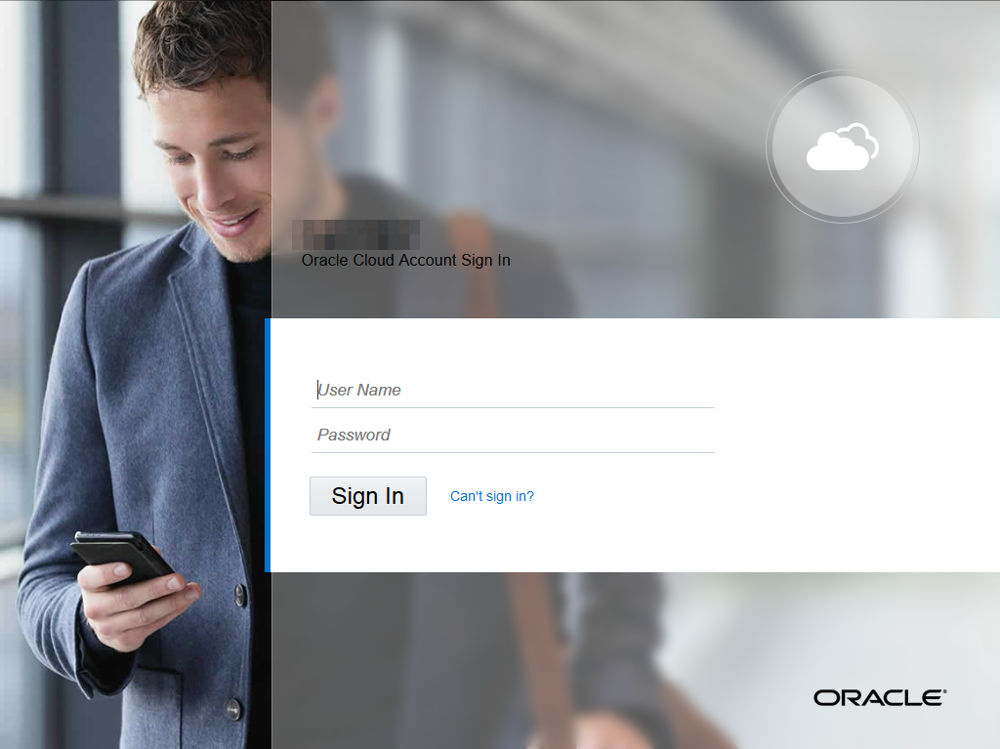
 
6.	This will bring you to your DIPC server’s  home page
7.	Click on “Agents” (left part of your screen)

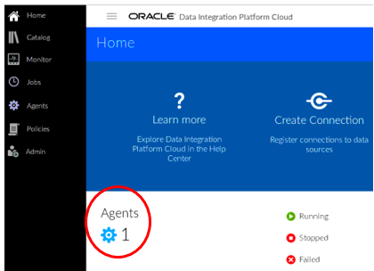

8.	Select drop down menu and select zip file for your Operating System 
9.	Select the “Linux” option

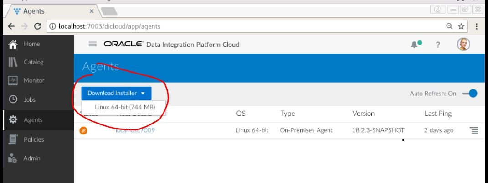

10.	Click "OK" to confirm selection

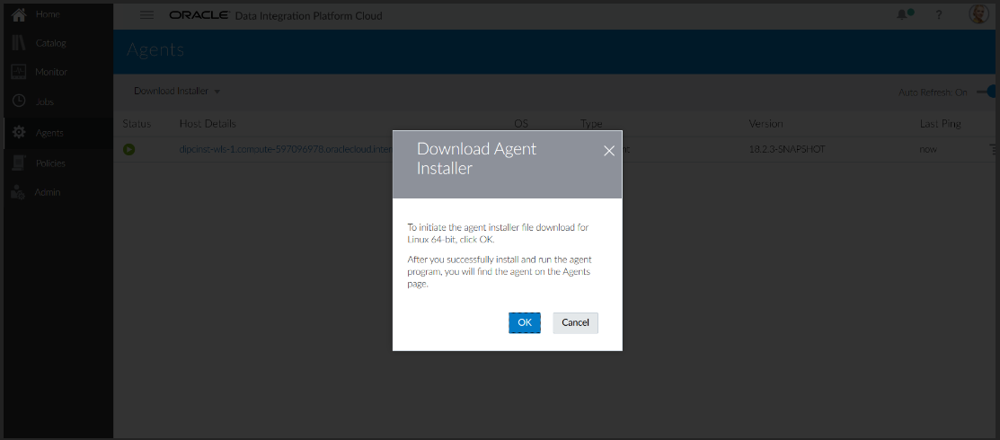
 
11.	Select “Save File” and the click “OK”, to download the file to your “on-premise” machine

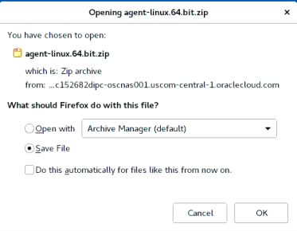

12.	Open a terminal, select “Applications > Favorites > Terminal” from the top left corner of the screen

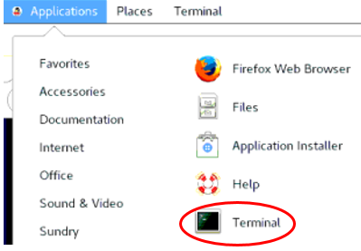

### Install Agent
1.	Create a directory for the agent, execute: mkdir dipcagent
2.	Move the downloaded file to that new directory, execute: mv Downloads/* dipcagent
3.	MOve to the new directory, execute: cd dipcagent
4.	Unzip the file, execute: unzip agent-linux.64.bit.zip
5.	Move to the agent directory, execute: cd dicloud
6.	Execute command to install agent: 
./dicloudConfigureAgent.sh -user=DIPCADMIN -dipchost=<DIPC_IP_ADDRESS> -dipcport=7003  -authType=BASIC
7.	New directories will be created, to look at then execute: ls
8.	We will take a look at the configuration file (agent.properties) and we will change the port in which this agent will talk to DIPC
9.	Open the editor, select “Applications > Accessories > Editor” from the top left corner of the screen

 
10.	Click on “Open” then “Other Documents”

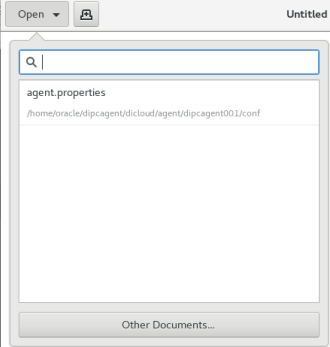

11.	Browse to “/home/oracle/dipcagent/dicloud/agent/dipcagent001/conf/agent.properties”

 
12.	Modify agent port "agentPort" in parameter file "agent.properties" to 7010

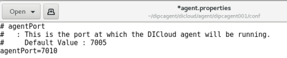
 
13.	Now look for “ggccServicePort” and change it to 80

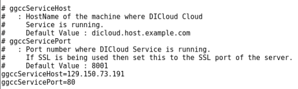
 
14.	Save and close. Click on “Save” button then on "Close" icon (top right corner)

### Execute the Agent
1.	We installed with defaults so we will move to the directory with the necessary commands to start the agent; execute: cd agent/dipcagent001/bin
2.	We will start the agent by executing:
./startAgentInstance.sh
3.	Your agent is now running. Go back to Firefox and look the “Agent” screen in DIPC
 
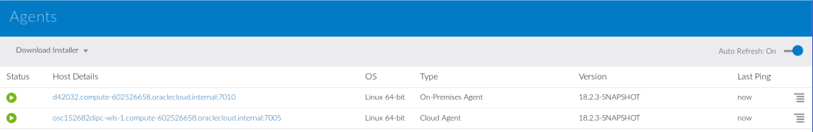

## Migrate On-Prem to the Cloud

### Verify Data in Source and Target DBs (Optional)
** MISSING STEPS
** Saves images 15 to 29 for this section
** Images for source could be the same as in Lab300, images for target need to be new

### Execute Data Synch Elevated Task
1. You should be logged into DIPC, if that is NOT the case, log in.
2. From the left side panel, SELECT "Home"

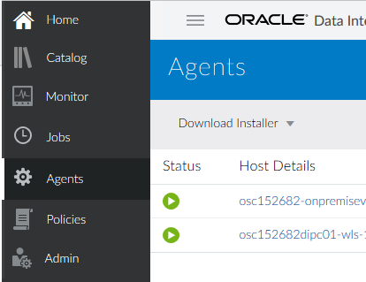

3. If you have already created connection "ONPREM_SRC", skip to step 7. If connection "ONPREM_SRC" has NOT yet been created, in the Home Page click "Create Connections" from the top section

4. Enter the following information:
    - Name: ONPREM_SRC
    - Description: Connection to on-prem database schema with source tables. AMER
	- Agent: <REMOTE_AGENT>
	- Type: Oracle
  	- Hostname: <COMPUTE_INSTANCE_IP>
	- Port: 1521
	- Username: AMER_SRC
	- Password: Welcome#123
	- Service Name: orcl

** MISSING 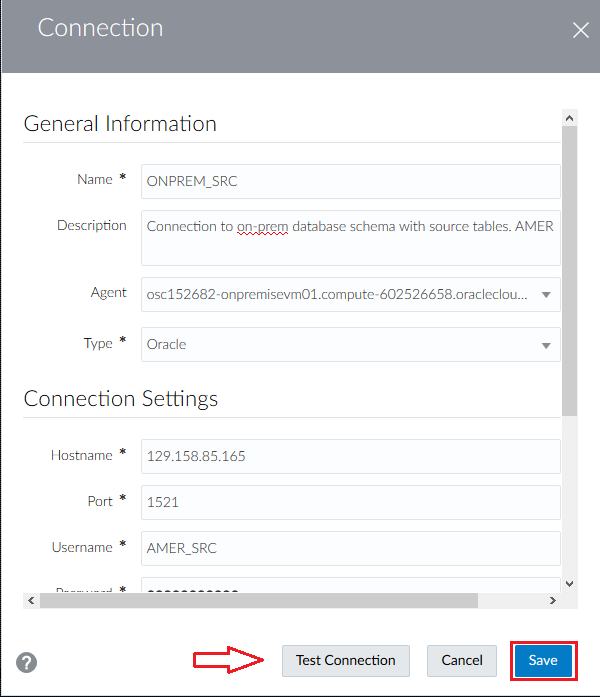

5. Click on "Test Connection" button at the bottom. a green message should appear on top when everything is in order
6. Click on "Save"

** MISSING 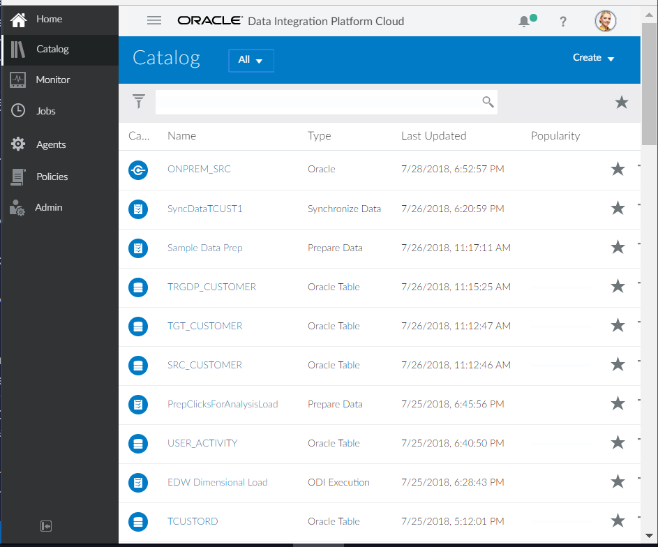

7. If you are in the Home page, click "create Connection" from the top panel. If you are in the catalog screen, from the top bar, open the drop-down menu and the select "Connection"

** MISSING 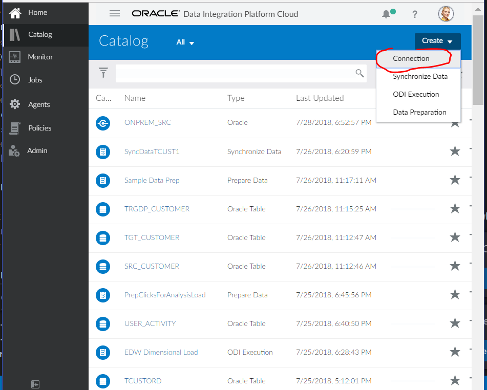

8. Enter the following information:
    - Name: EMEA_CLOUD
    - Description: Connection to target schema cloud target EMEA
	- Agent: <LOCAL_AGENT>
	- Type: Oracle
	- Hostname: <TARGET_DB>
	- Port: 1521
	- Username: EMEA_CL_TRG
	- Password: Welcome#123
	- Service Name: <SOURCE_DB_SERVICE_NAME>
    - Schema Name: EMEA_CL_TRG (Default)	

** MISSING 

5. Click on "Test Connection" button at the bottom. a green message should appear on top when everything is in order
6. Click on "Save"

** MISSING 

7. From the top bar, open the drop-down menu and the select "Synchronize Data"

** MISSING 

8. Enter the following information:
	- Name: Sync OnPrem to Cloud
	- Description: Sync on-prem to cloud schemas AMER to EMEA
	- Connection: ONPREM_SRC
	- Schema: AMER
	- Connection: CLOUD_TRG
	- Schema: EMEA
	- Advanced - Include Initial Load: SELECTED
	- Advanced - Include Replication: SELECTED

** MISSING 

9. Click on "Save & Run" button on the top right of the screen to execute the task
10. You will be navigated to teh "Jobs"screen. After some time, a message will appear in the notification bar

** MISSING 

11. The job will automatically appear within the "Jobs" page

** MISSING 

12. Click job to review details

** MISSING 

### Verify Data in Target DB (Optional)
** MISSING STEPS
** MISSING IMAGES
