Update: May 10, 2018

## Introduction - Remote Agent Install and Synchronization of an On-prem database

This lab covers installation and configuration of DIPC remote agent along with synchronization of an on-prem database. Agents allow synchronization of data from sources outside Oracle Cloud. Two VMs within Ravello will be used to simulate a DIPC instance and an On-Prem database server. 
Ravello VMs are being used to simulate cloud instances and do not have Identity Cloud Service (IDCS). Modifications will be made before porting to a GSE environment.

This lab supports the following use cases:
-   Configure Remote DIPC Agent
-   Synchronize On-Premise Database

## Objectives

-   Ensure Ravello VMs for DIPC and DB 
-	Ensure Remote Agent is trusted by DIPC instance *MODIFY FOR GSE*
-   Agent Download
-   Agent Installation and Configuration
-   Configure Agent SSL *MODIFY FOR GSE*
-	Agent Administration - Starting and Stopping.
-   Synchronize On-Premise Database
   
### **STEP 1**: Identify Shared Ravello Blueprint *REMOVE FOR GSE*

-   In the Left Sidebar Click on Library>Blueprints

	

### **STEP 2**: Create Ravello Application  *REMOVE FOR GSE*

-   Select Blueprint "DIPC 18.2.3 V6-bp Werner 4.6.2018"
-   Click "Create Application"

	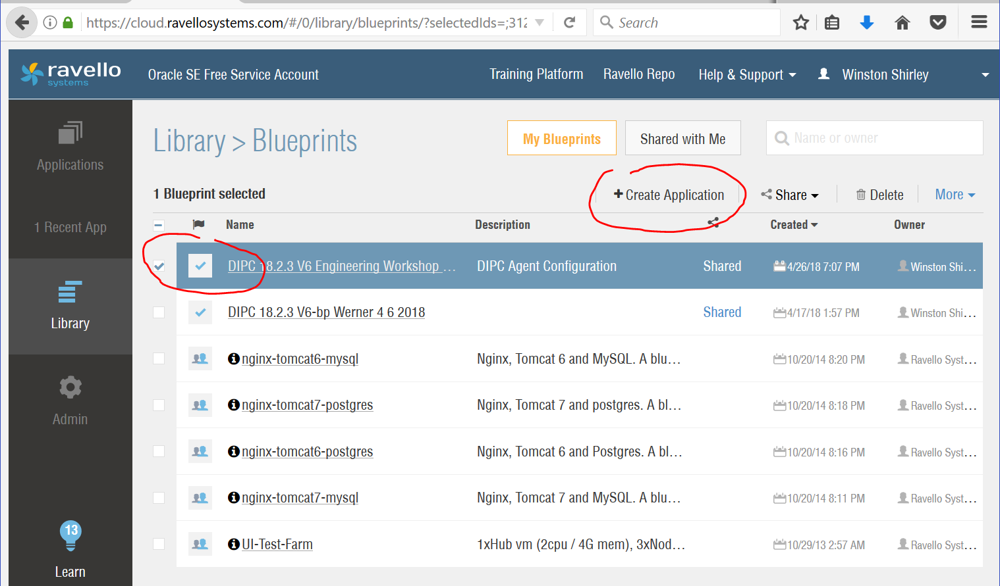

-   Enter Ravello Application Details
    Name: "DIPC 18.2.3 Agent - DB Sync"
    Description: "DIPC Agent - DB Sync Configuration"
    Click "Create"

	

### **STEP 3**: Publish Ravello Application

-   The Blue Print has two VMs: "DIPC 18.2.3" & "DIPC 18.2.3.1"
-   Change "DIPC 18.2.3.1" to "On-Prem DB Svr"
-   Publish the Blueprint VMs
    Click "Publish" highlighted in top right

	

-   Review publish parameters and click "Publish"
-   Choose "Performance" for Optimize option
-   Start the VMs and Log into the Consoles using:
    -  Username/Password: DIPC/wecome1
    
	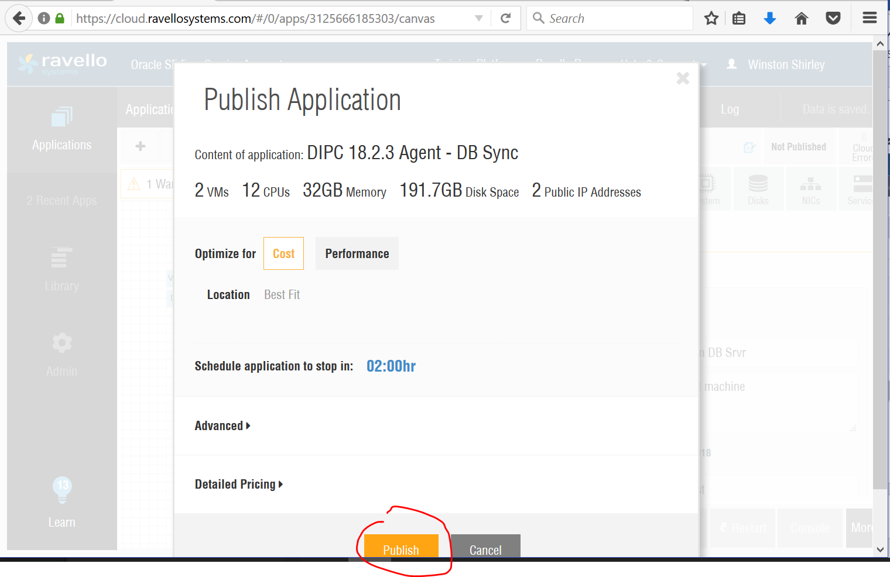

### **STEP 4**: [DIPC 18.2.3] Log into DIPC Console and go to Agent Page

-   From "DIPC 18.2.3" lauch DIPC Console from Chrome browser bookmark
-   Login using:
    - Username/Password: weblogic/welcome1
-   Click "Agents" in left panel

	

### **STEP 5**: [DIPC 18.2.3] Select Download Installer Drop Down Menu

-   Select drop down menu and select zip file for your Operating System

	

### **STEP 6**: [DIPC 18.2.3] Confirm your agent download selection

-   Click "OK" to confirm selection

	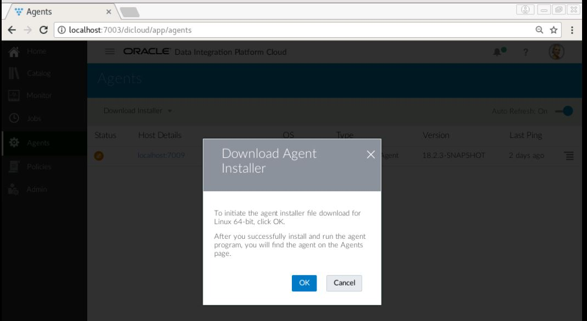

### **STEP 7**: [DIPC 18.2.3] Save the agent zip file to your home directory

-   Save the file to your home directory in preparation to unzip and install
-   ftp agent zip file to "On-Prem DB Svr"

	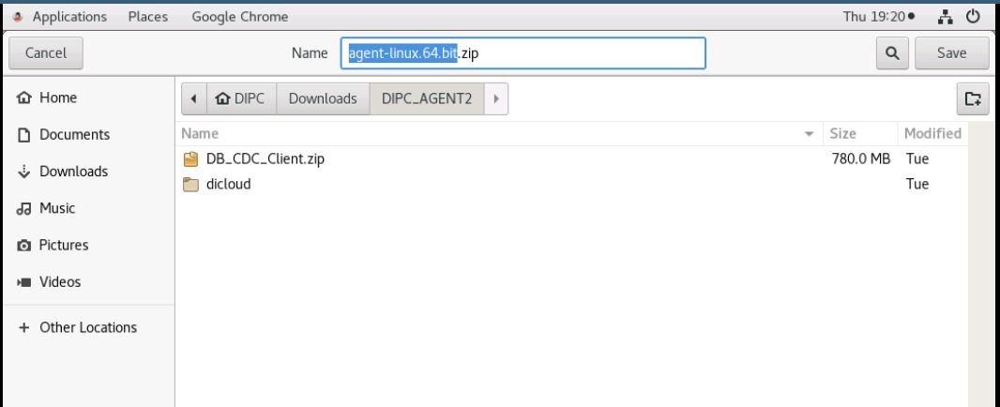

### **STEP 8**: [On-Prem DB Svr] View and unzip agent file

-   Open terminal on "On-Prem DB Svr]
-   view agent zip file "agent-linux.64.bit.zip"

	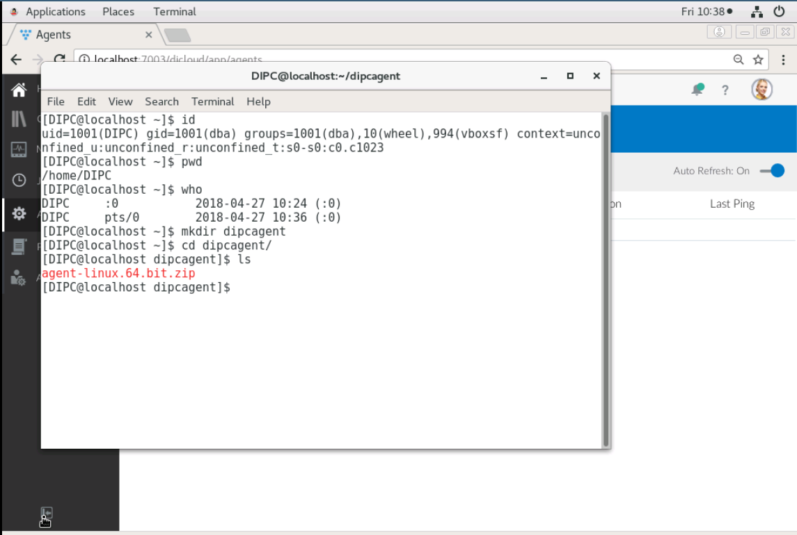

-   unzip agent file
    -   $unzip agent-linux.64.bit.zip

	

### **STEP 9**: [DIPC 18.2.3] Show current agent page in DIPC console

-   Navigate to DIPC console on VM "DIPC 18.2.3"
-   Click "Agent" in the left toolbar
-   There is only one local agent install 

	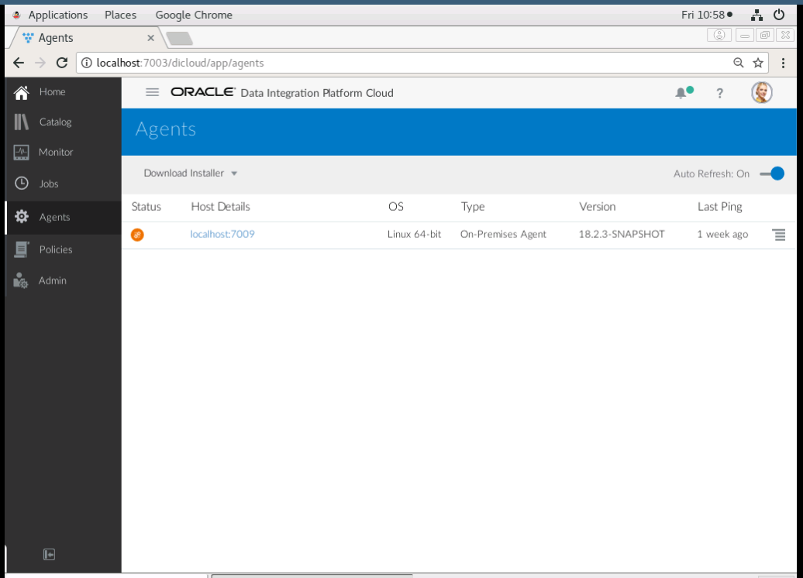

### **STEP 10**: [DIPC 18.2.3] Identify private IP for DIPC console

-   Navigate to Ravello Application to get information for agent install
-   Click VM "DIPC 18.2.3" (DIPC Instance and Target DB)
-   Note the private IP listed in bottom left of DIPC console (10.0.0.3)

	

### **STEP 11**: [On-Prem DB Svr] Install the Agent from On-Prem Console

-   Open a terminal in On-Prem VM
-   Navigate to the agent directory
-   Execute command to install agent using password - #!hyper1on!#
    ./dicloudConfigureAgent.sh -dipchost=10.0.0.3 -dipcport=7003 -user=weblogic -authType=BASIC

-   Set the "dipchost" parameter to 10.0.0.3
-   This configuration does not have IDCS so use "BASIC" for parameter AuthType

	
   
-   Output shows agent created

-   

### **STEP 12**: [On-Prem DB Svr] Modify Agent Parameter 

-   Modify agent port "agentPort" in parameter file "agent.properties" to 7010
-   path to parameter file: 
-   /home/DIPC/Documents/dicloud/agent/dipcagent001/conf 

	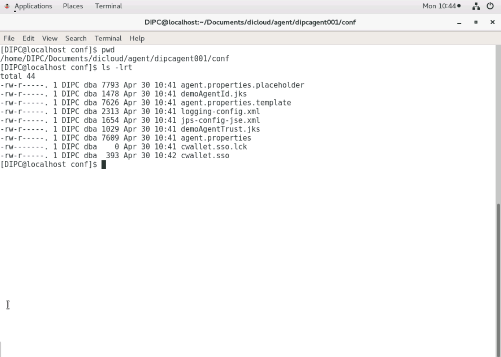

	

### **STEP 13**: [On-Prem DB Svr] Start Agent

-   Navigate to the agent bin directory
    -   /home/DIPC/Documents/dicloud/agent/dipcagent001/bin
-   Start agent using script startAgentInstance.sh
    -   $ ./startAgentInstance.sh

	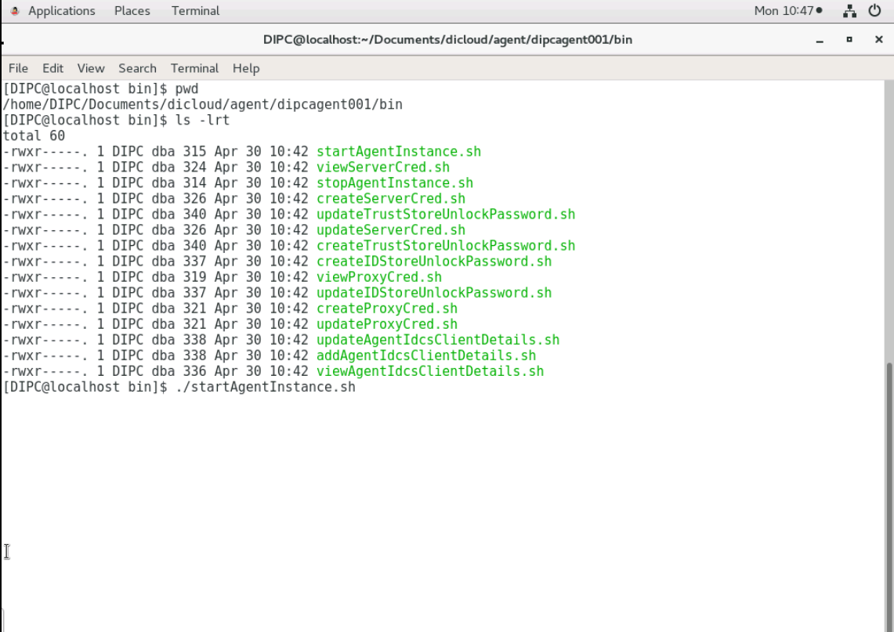

	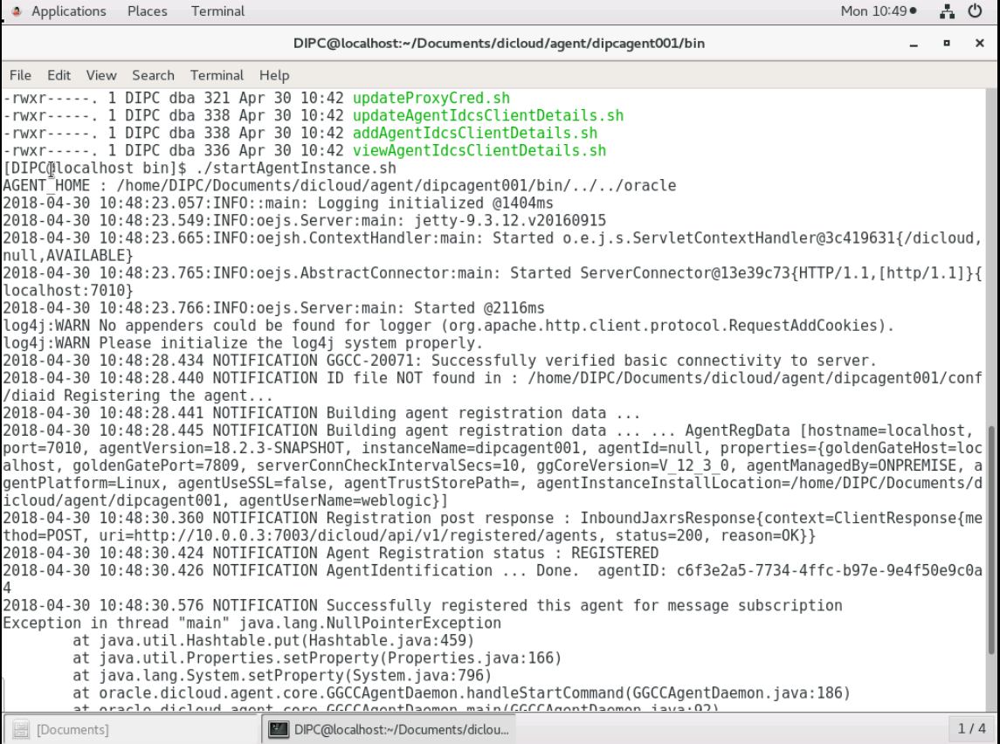

### **STEP 14**: [DIPC 18.2.3] View Remote Agent in DIPC Console

-   Navigate to DIPC Console
-   Clict Agents in left toolbar

	

### **STEP 15**: [DIPC 18.2.3] Ensure local and Remote Agents are started

-   Start agents as needed from Agent bin directory
    -   $ ./startAgentInstance.sh

	

### **STEP 16**: [On-Prem DB Svr] Review On-Prem Schema

-   Connect to remote schema and view tables and row count

	

### **STEP 17**: [DIPC 18.2.3] Create Source Connection to On-Prem Schema

-   Navigate to DIPC console
-   Click Home in left toolbar and click "Create Connections"

	

-   Enter source connection information for On-prem schema

    - Name:        ONPREM_SRC
    - Description: Connection to on-prem database schema with source tables
	- Agent:       localhost:7010
	- Type:        Oracle
	- Connection Settings
	  - Hostname:   10.0.0.4
	  - Port:       1521
	  - Username:   DIPC_SRC
	  - Password:   welcome1
	  - Service:    Service Name: dics12c

	

-   Click "Test Connection" and "Save"

	

-   Search for source connection ONPREM_SRC in catalog

	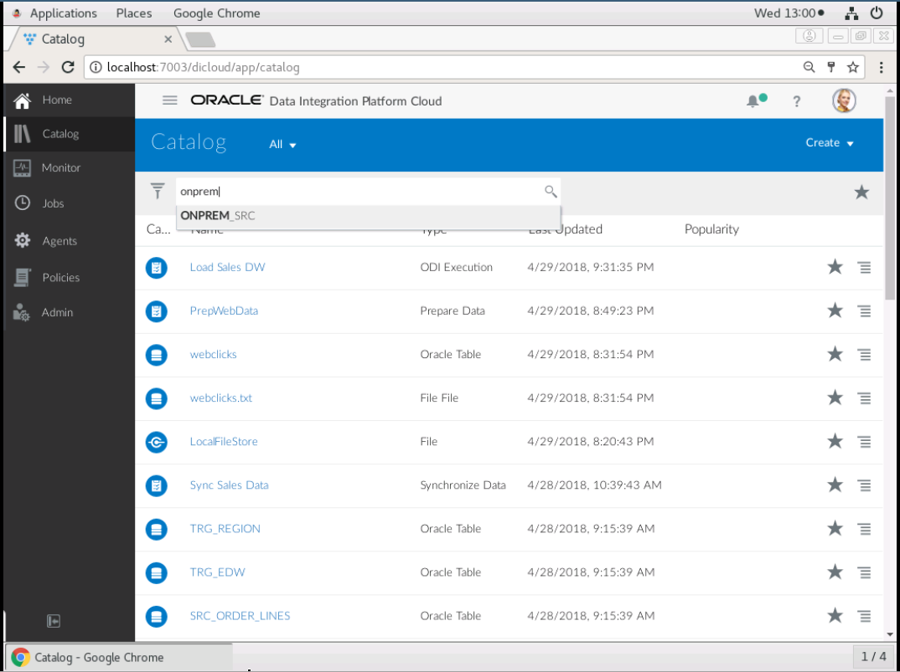

    

-   Click connection name to view summary

    

-   Click metadata tab

    

### **STEP 18**: [DIPC 18.2.3] Create blank target Schema CLOUD_TRG

-   Create schema and ensure necessary privileges
-   SQL> create user cloud_trg identified by welcome1;
-   SQL> grant connect, resource, unlimited tablespace to cloud_trg;
-   SQL> grant create database link to cloud_trg;
-   

	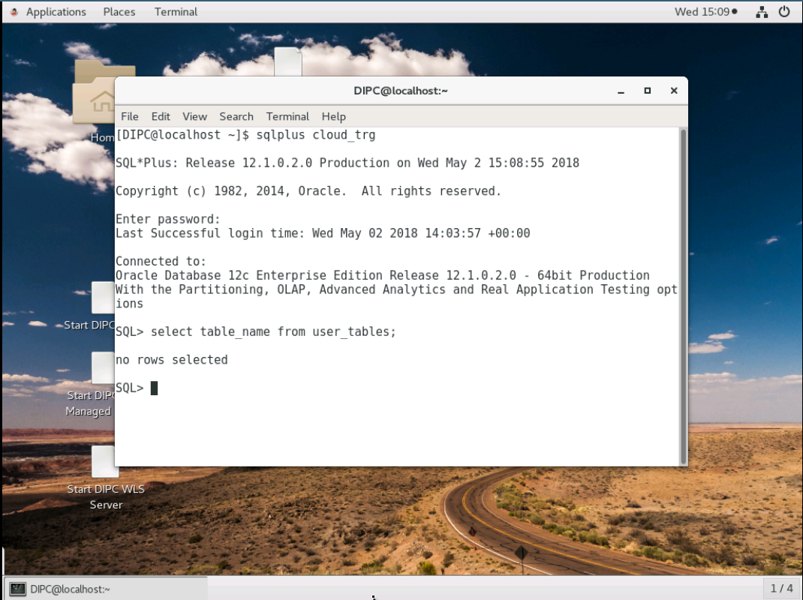

-   View schema tables and row count - should be empty

	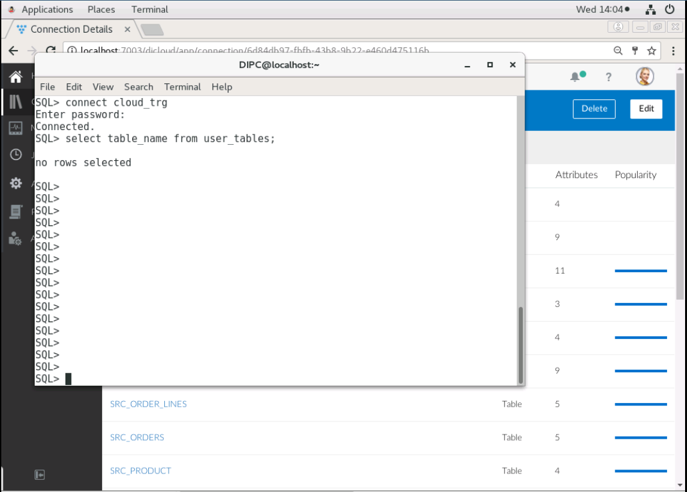

### **STEP 19**: [DIPC 18.2.3] Create Target Connection to Schema CLOUD_TRG

-   Enter target connection information to schema CLOUD_TRG

    - Name:        CLOUD_TRG
    - Description: Connection to target schema cloud_trg
	- Agent:       localhost:7009
	- Type:        Oracle
	- Connection Settings
	  - Hostname:   localhost
	  - Port:       1521
	  - Username:   CLOUD_TRG
	  - Password:   welcome1
	  - Service:    Service Name: dics12c

-   Click "Test Connection"

	

-   Click "Save" to save target connection

	

-   View Target Connection

	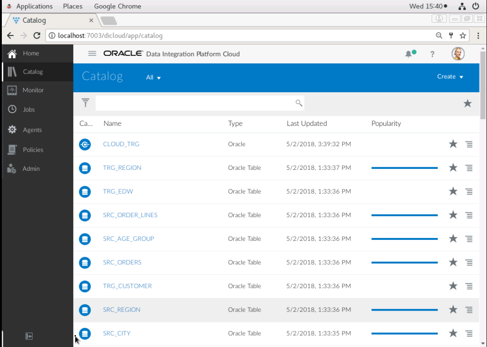

### **STEP 20**: [DIPC 18.2.3] Create Sync Job between Source and Target

-   In DIPC Console click "Home" in left toolbar
-   Click "Synchronize Data"

	

-   Enter Sync Job Information
    - General Information
	  - Name:        SYNC ONPREM SCHEMA
	  - Description: Job to sync on-prem schema with cloud target schema
	- Source Configuration
	  - Connection: ONPREM_SRC
	  - Schema:     DIPC_SRC
	- Target Configuration
	  - Connection: CLOUD_TRG
	  - Schema: CLOUD_TRG
	- Advanced Options
	  - Include Initial Load: check for initial load
	  - Include Replication: check for replication

-   Click "Save & Run"

	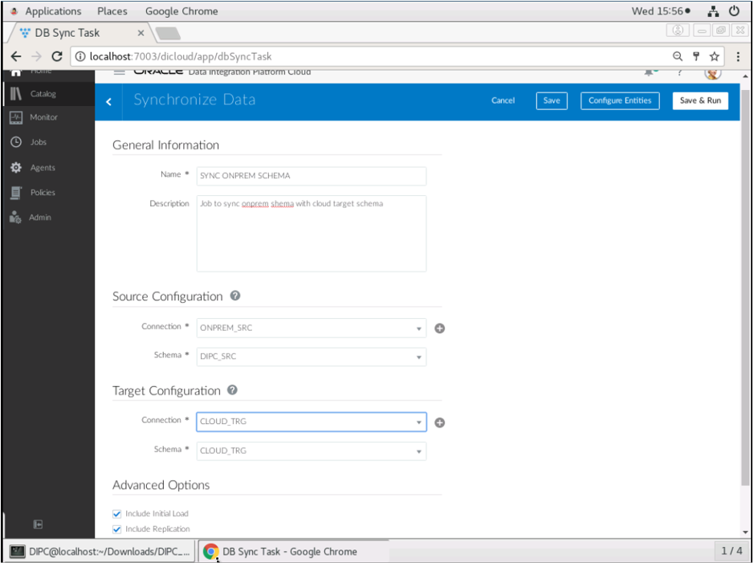

-   Click Job to review Sync Job Details

	

-   Monitor Target Schema for table creation and row count
AgentImage135-SyncJobMonitorSchema.png

	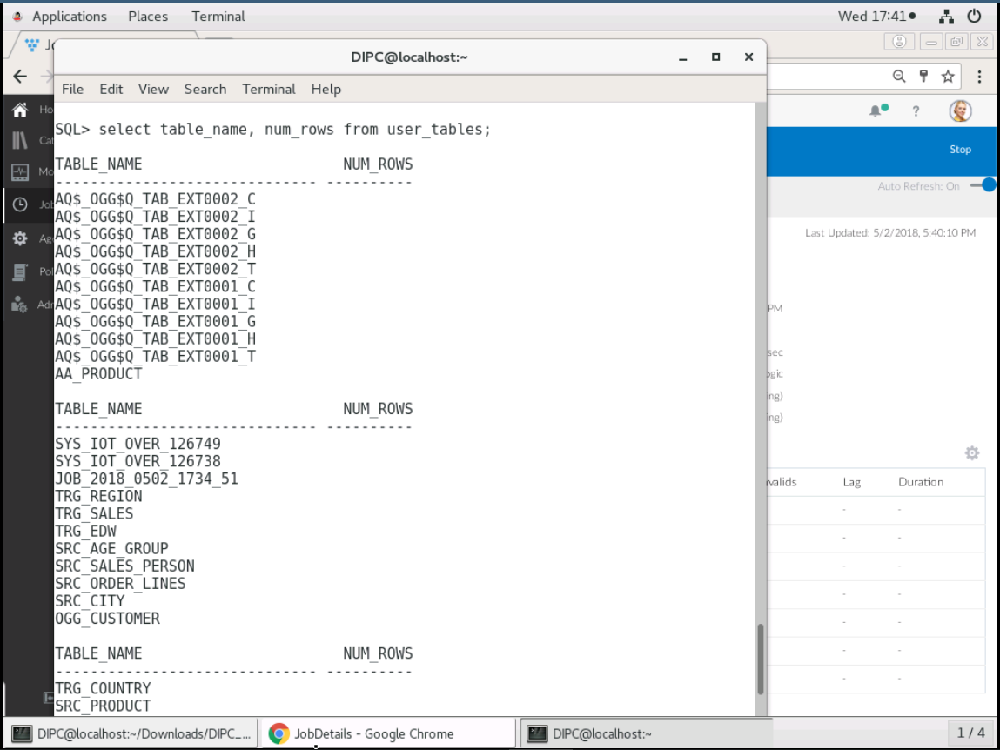

	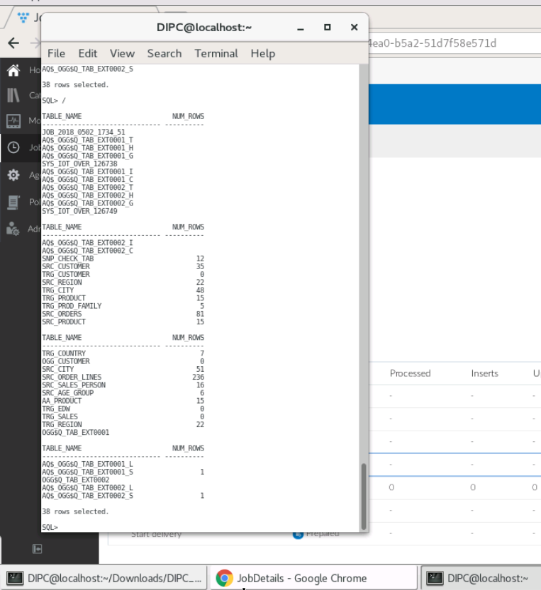

	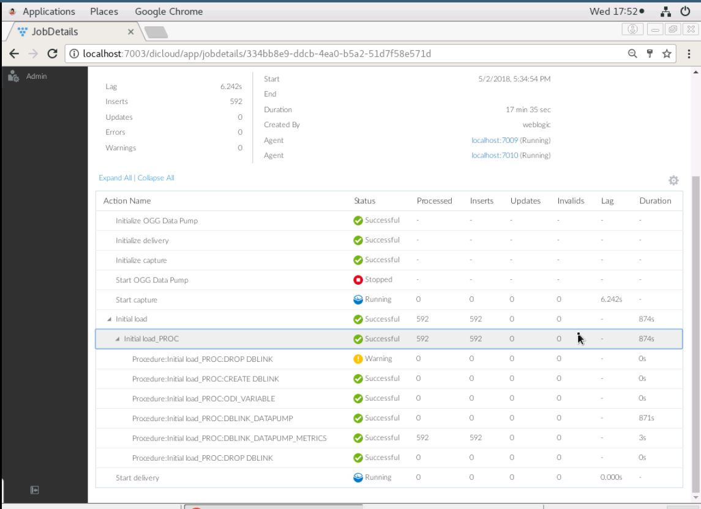

