# Lab 500 - Oracle ODI Data Preparation Lab

## Before You Begin

### Purpose
This lab shows you how to execute a Data Preparation elevated task; as well as how to define all necessary elements to run the task.

### Time to Complete 
Approximately 15 minutes.

### What Do You Need?
Your will need:
- DIPC Instance URL
- DIPC User and Password
- Flat file "webclicks.txt"

## Execute Data Preparation Elevated Task

### Login to DIPC
1. Open a browser window an provide your DIPC server URL. The URL will be provided by the instructor and will look like this one

https://osc132657dipc-oscnas001.uscom-central-1.oraclecloud.com/dicloud

2. Provide your user name and password, then click "Sign In" button

You will be navigated to your DIPC server Home page.

3. In the Home Page click on "Next" icon (>) located at the far right side of the top panel to locate the "Data Preparation" task icon

4. Once you have located the "Data Preparation" task icon, click on it

### Staging Connection Definition (Optional)
If you receive the following error message:

Click on "Select a default staging connection" hyperlink. You will navigate to the admin screen in which you can define this defualt connection.

1. Click on "Edit"

2. Open the "Oracle" field drop-down menu and select "SALES_TRG"
3. Click "Save" button.

4. You are now ready to run your "Data Preparation" task. Using the left panel, click on "Home".

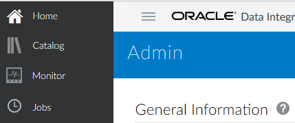

5. In the Home Page click on "Next" icon (>) located at the far right side of the top panel to locate the "Data Preparation" task icon

4. Once you have located the "Data Preparation" task icon, click on it

### Execute Data Preparation Task

1.	Provide the following information:
	- Name: PrepWebData 
	- Description:  Prep External Website Data
2. For "Source Configuration" click on "Create Connection" button

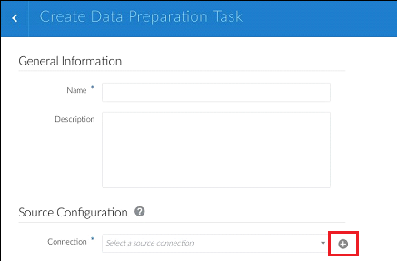

3. Provide the following information:
	- Name: WebClicks_File
	- Description: Website Clicks information
	- Agent: Leave Blank
	- Type: File
	- Directory: /home/DIPC
 4. Click "Test Connection" button and when the test is successful click "Save" button

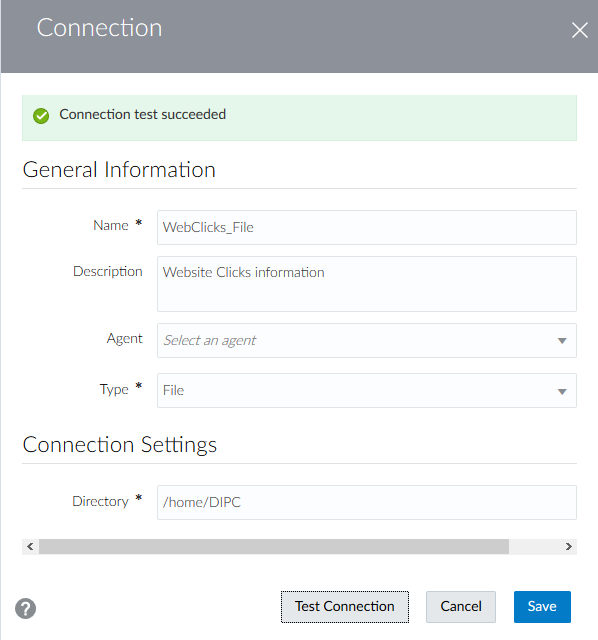

5. Provide the following information:
	
	**Source Configuration**
	- Connection: WebClicks_File
	- Directory: /home/DIPC
	- File: Click on "Select" button, click on "webclicks.txt" hyperlink and then the "Select" button

	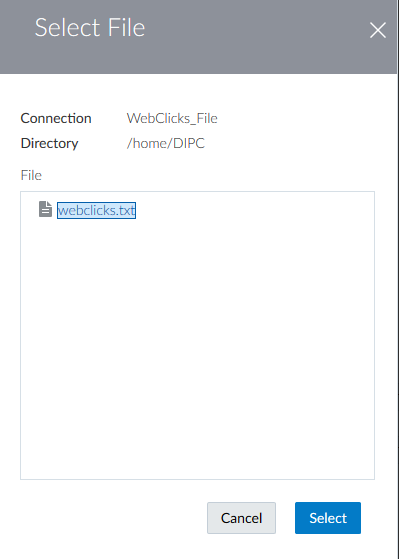

	**Target Configuration**
	- Connection: SALES_TRG
	- Schema: SALES_TRG 
	- Data Entity: WEB_CLICKS

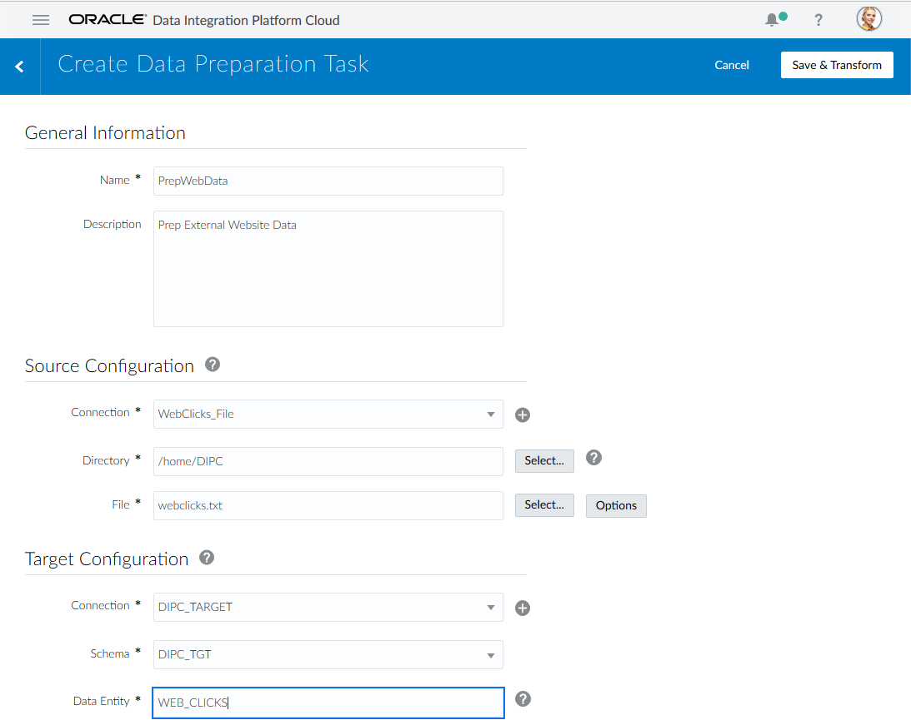

6.	Let's review the file option DIPC offers, Click on "Options" button.
7. Provide the following information:
	- Edcoding: UTF-8
	- Delimiter: Comma
	- Text Qualifier: Leave blank
	- Header: UNSELECTED 
	- First Data Row: 1 
8. Click on "OK" button

9. Execute the task, click on "Save and Transform" button

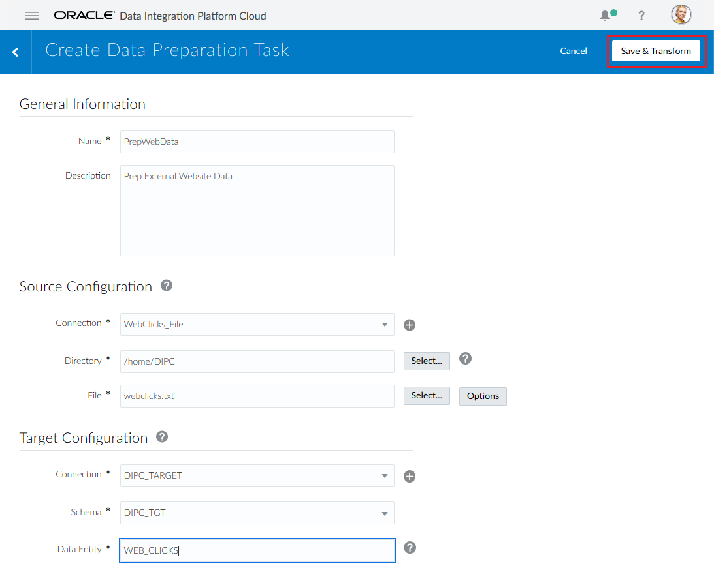

10.	As the file is being parsed and profiled, the following screen will appear  

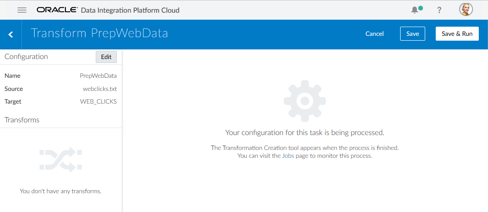

11. Once finished, the data preparation screen will come up. The profiling process has captured advanced profiling information as the flat file was ingested.  Click each column to review the profiling results in the right hand data profile drawer.
12. There is a second tab in which is possible to review the data in the file; click the "Data" tab 

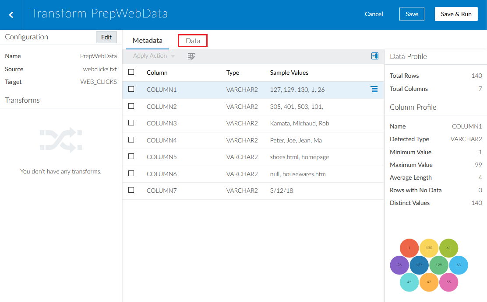

13. To transform data on a particular column, click the hamburger menu on the column you want to transfom.  

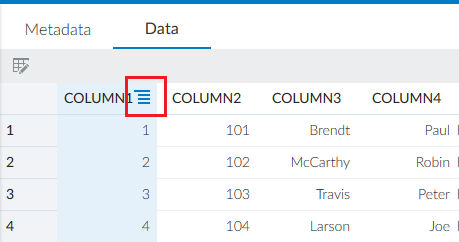

14. For Column 6, click on the hamburger menu and then select "Replace".
 
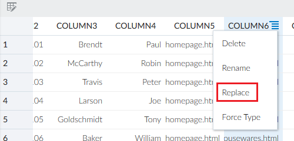

15. Provide the following information:
	- Search String: SHoe.html
	- Replace String: shoes.html
16. Click the "Apply" button.

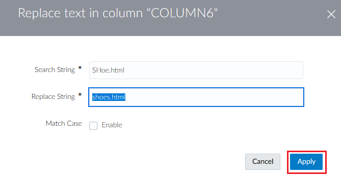

Clicking apply updates data, metadata and profiling statistics.  Also note the transform is saved and displayed in the left-hand drawer.  This transform can be deleted and the data, metadata and profiling statistics will be updated accordingly. 

17. Now please perform the following transformations:
	- Column 1: Rename to WROWID 
	- Column 2: Rename to CUSTID 
	- Column 3: Rename to LNAME 
	- Column 4: Rename to FNAME 
	- Column 5: Rename to PAGENAME 
	- Column 6: Rename to PAGEREFERRER 
	- Column 7: Rename to VISITDATE 
18. Review Transforms and Data
19. Click "Save and Run" button (top right corner)

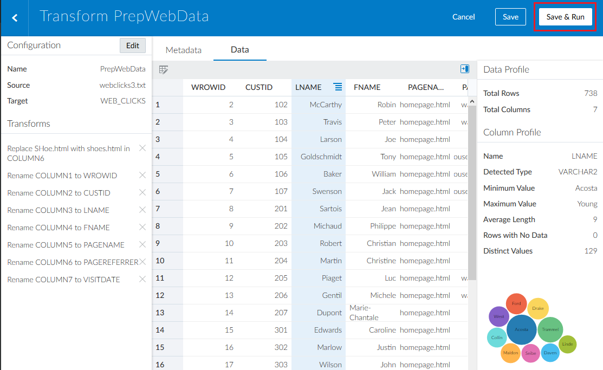

20.	You will be navigated to the “Jobs” screen. After some time, a message will appear in the notification bar
21.	The job will automatically appear within the "Jobs" page. This may take up to 1 minute

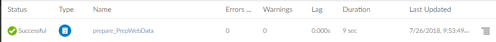

22. Review the job execution, click on the job name
 
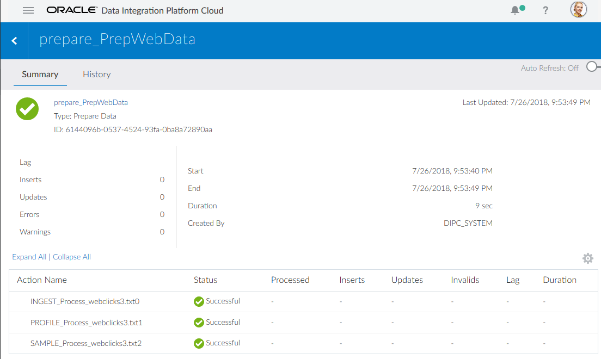

### Verify Uploaded Data (Optional)

1.	Go to your SQL Developer and expand "WS - SALES_TRG" connection and its tables. If it is already opened, just refresh the information)
2.	Select “SRC_CUSTOMER” table
3.	On the right panel, select “Data” tab

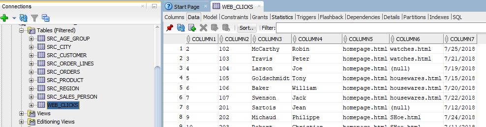
 

## Summary 
 
You have now successfully completed the Hands on Lab, and have successfully performed an Data Preparation task through Oracle’s Data Integration Platform Cloud. 
