# Lab 500: Oracle ODI Data Preparation Lab
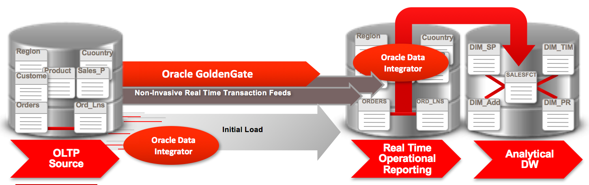
# Task 0: ODI Preparation Steps

## Logging Into Oracle Cloud Instance

1. In your web browser, navigate to cloud.oracle.com, then click Sign in.
2. Enter your user name and password, then click Sign In.

If the screensaver is on just press “enter” to open the login screen. 
 
# Task 1: Prep External Website Data  
 
## Logging Into Oracle Cloud Instance

1. In your web browser, navigate to cloud.oracle.com, then click Sign in.
- Enter your user name and password, then click Sign In.

The following page should appear – 
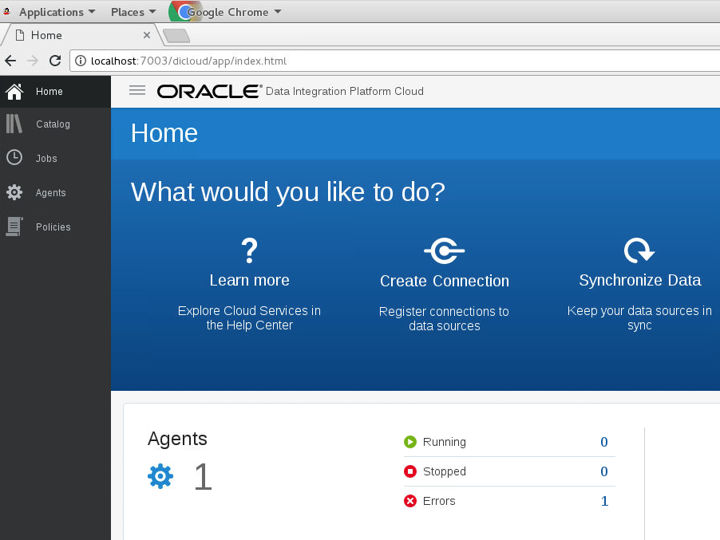

2.	Click Home 

3.	Create Data Preparation Task 
- Click Data Preparation 

4.	Create Data Preparation Task enter the following information 
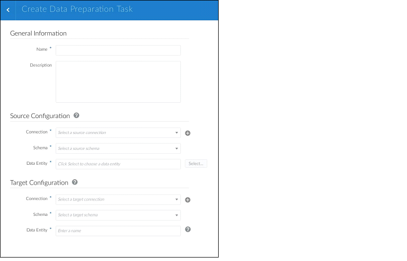
- Name: PrepWebData 
- Description:  Prep External Website Data  
- Agent – leave blank 
- Type: File 
- Directory: /home/DIPC 

5. For Source Configuration click add new connection button

- Name: Local File Store
- Description: Local File Store
- Agent: Leave Blank
- Type: File
- Directory: /home/DIPC

6.	Review Connections settings. 

7.	Click Test Connection – Review for Errors. 
- Click Save  

8.	Create Target Connection from the Catalog 
- NOTE: This connection may have already have been setup in a previous HOL 
- Click on the Create button and select Connection  

9.	Enter the following information  
- Name: Sync Target 
- Description: Sales OLTP Replicated Data 
- Agent: leave blank 
- Type: Oracle – selecting Oracle will expand the Connection Settings 
- Hostname: localhost 
- Port: 1521 
- Username: DIPC_TGT 
- Password: welcome1 
- Service Name: dics12c 
- Schema: DIPC_TGT 

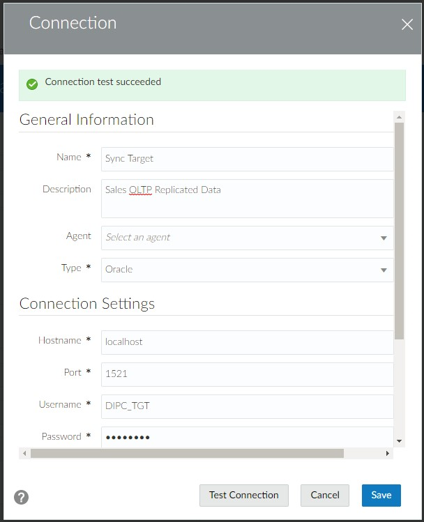

10.	Click Test Connection, Review for errors 

11.	Click Save 

12.	Create Data Preparation Task Entries as follows 
- Name: Prep Web Data 
- Description: Prep External Website Data 
- Source Configuration 
-  Connection: LocalFileStore 
-  Directory: /home/DIPC 
-  File: Click Select - scroll to webclicks.txt 

- Select options for webclicks.txt as follows 

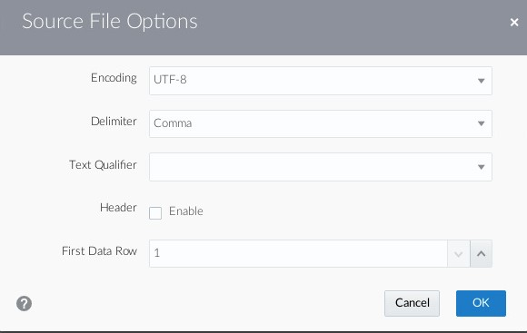

- No Text Qualifier 
- Ensure header is not enabled 
- First Data Row should be 1 
- Select OK

- Target Configuration 
-  Connection: DIPC_TGT 
-  Schema: DIPC_TGT 
-  Data Entity: webclicks  

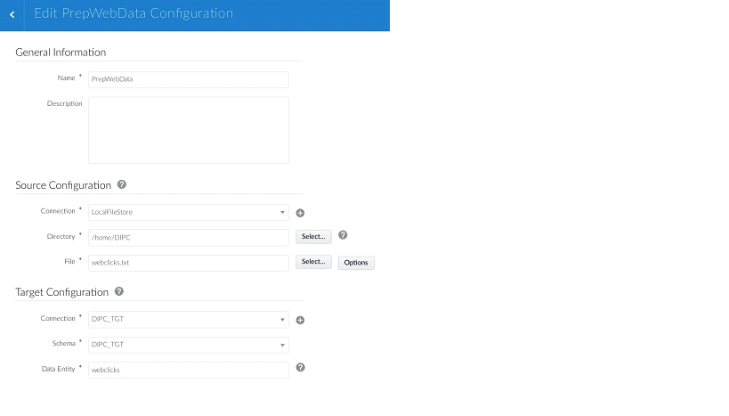

13.	Click Save and Transform 

14.	The following screen will appear as the file is being parsed and profiled 

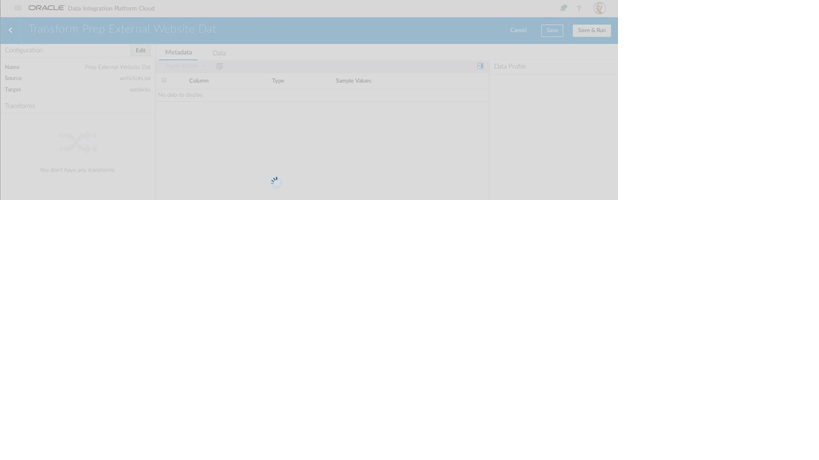

15. Once finished the data preparation screen will appear 

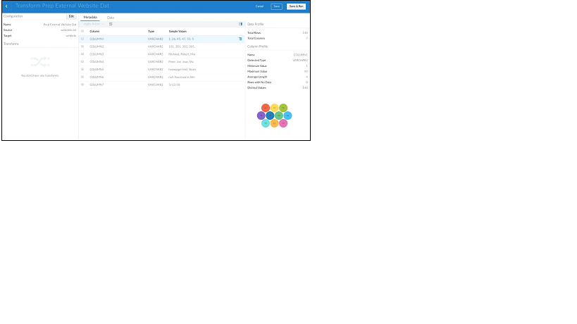

16. Begin prepping/transforming the file 

- The profiling process has captured advanced profiling information as the flat file was ingested.  Click each column to review the profiling results in the right hand data profile drawer. 
- There are also two views in which data can be prepped and transformed. To view the data view click the data tab 

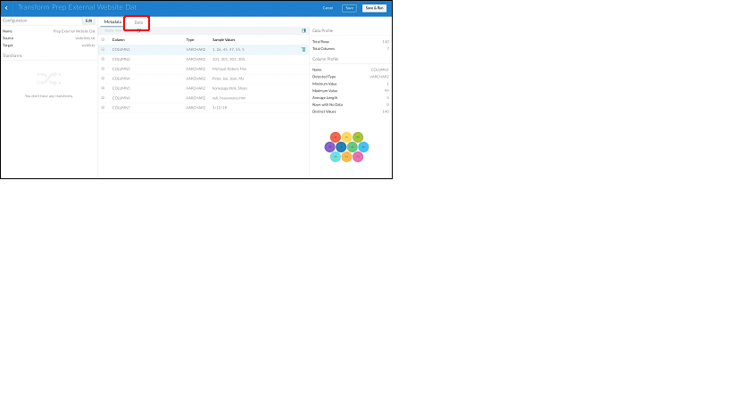

17. To transform data click the menu bar on the column 

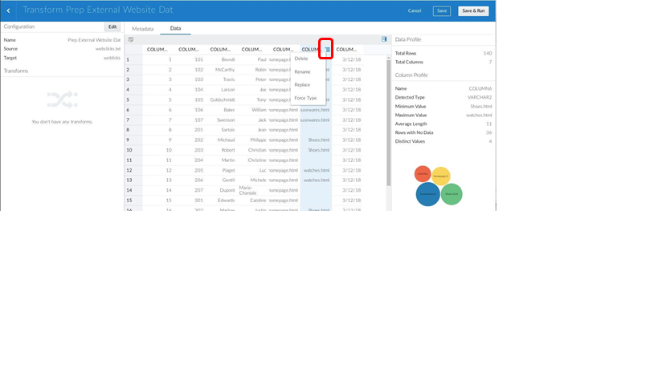

18. For Column 6 transform Shoes.html to shoes.html using the Replace transform 

19. Click Apply.  Clicking apply updates, the data, metadata and profiling statistics.  Also note the transform is saved and displayed in the left-hand drawer.  This transform can be deleted and the data, metadata and profiling statistics will be updated accordingly. 
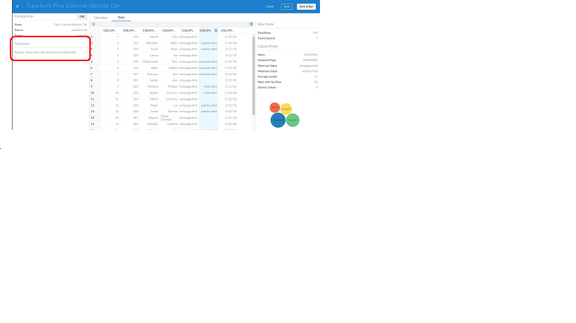
- Column 1: Rename WROWID 
- Column 2: Rename CUSTID 
- Column 3: Rename LNAME 
- Column 4: Rename FNAME 
- Column 5: Rename PAGENAME 
- Column 6: Rename PAGEREFERRER 
- Column 7: Rename VISITDATE 

20. Review Transforms and Data

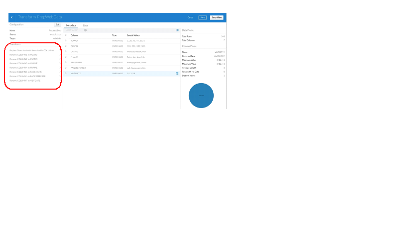

21. Click Save and Run 

22. Review Job Execution 
 
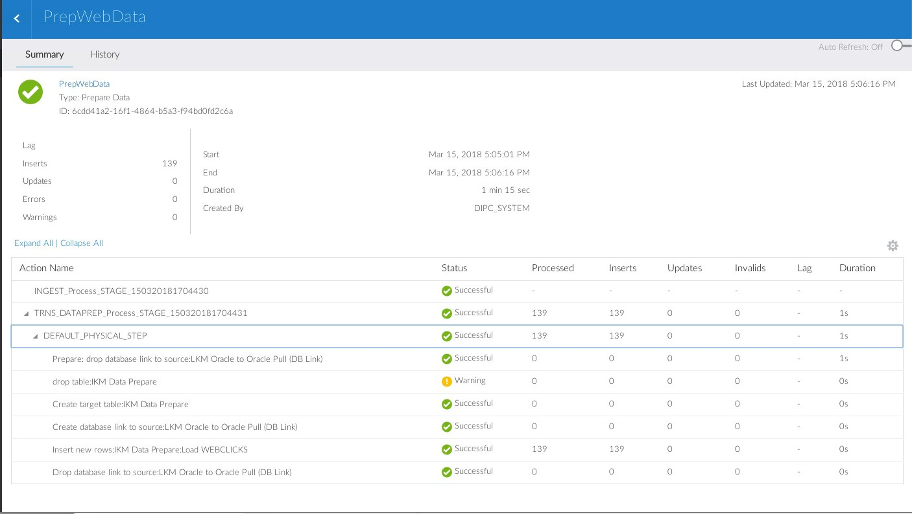

Summary 
 
You have now successfully completed the Hands on Lab, and have successfully performed an end-to-end data synchronization task through Oracle’s Data Integration Platform Cloud. 
