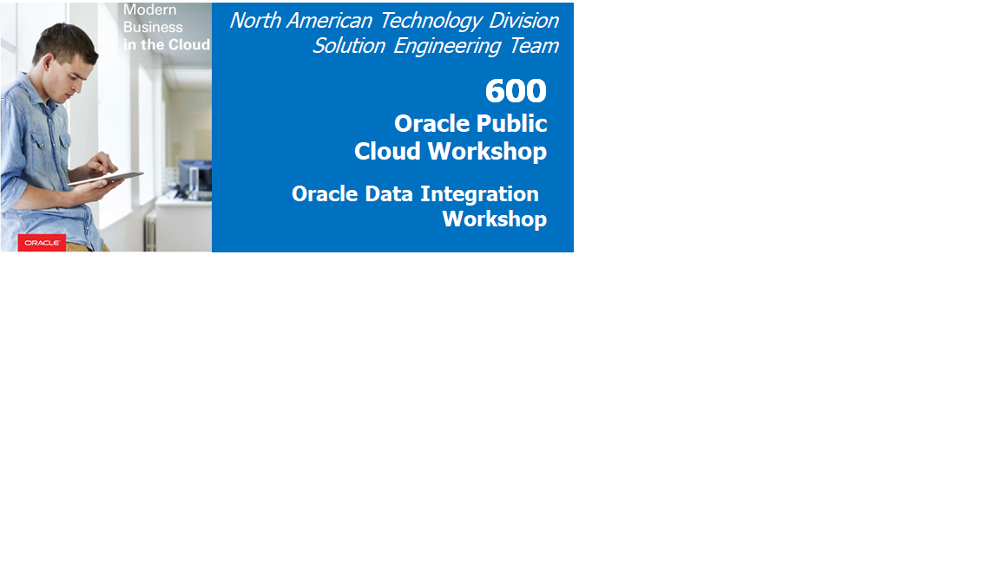
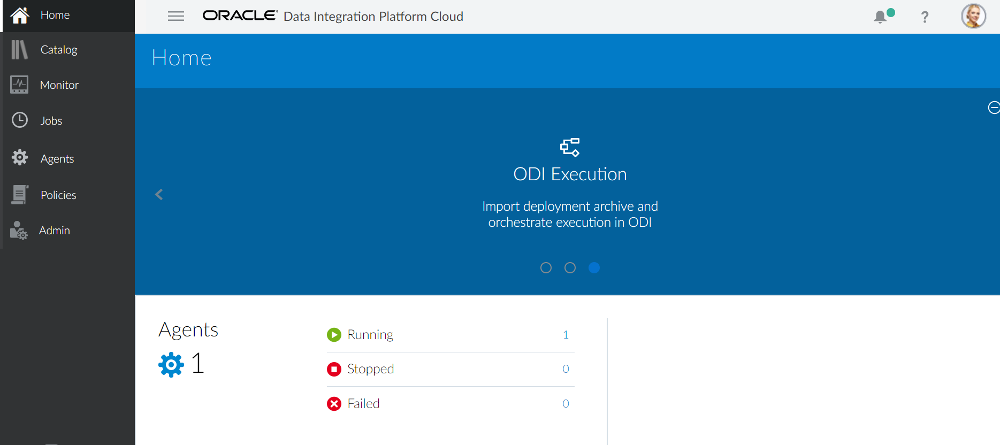
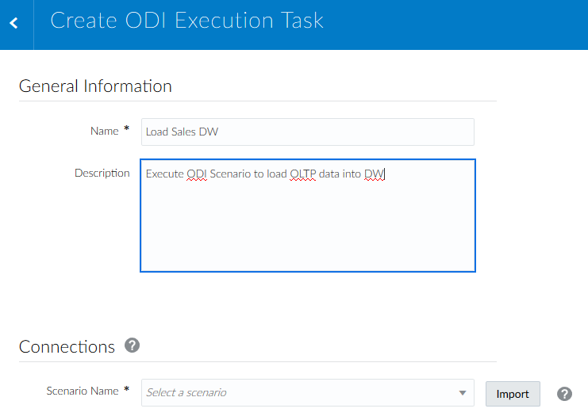
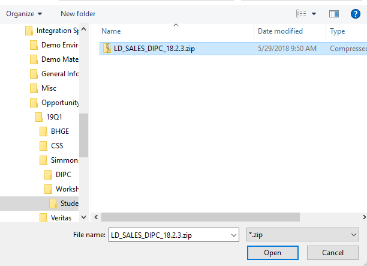
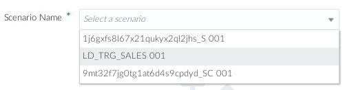
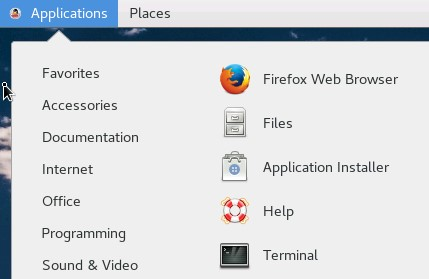
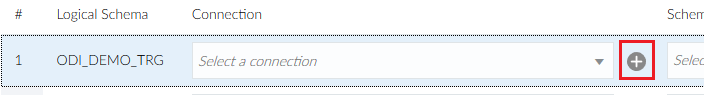

# Lab 500: Oracle Data Integration (ODI) Lab Execution

# Overview 

Time to Complete 
- Perform all tasks – 20 Minutes 
- Prerequisites 
Before you begin this tutorial, you should 
•	Have a general understanding of RDBMS and data integration concepts. 
•	Have a general understanding of ETL and data synchronization concepts. 

Lab Environment 
For this lab, the Data Integration Platform Cloud and the client environment are contained within on environment for simplicity.  Most user interactions with Data Integration Platform Cloud will be through a browser installed on your local machine (Chrome preferred, Firefox is also supported).   

# Task 0: Preparation Steps 

1. Login to the VM as DIPC user – Password is “welcome1”

 
If the screensaver is on just press “enter” to open the login screen. 

 
2.	Log into Data Integration Platform Cloud 
- Use VNC to log into the VM. Use your favorite VNC client and enter Ravello Instance Hostname:5901 as the URL to connect to  

- When prompted enter the password: welcome1 and click OK 

- Go to Applications > Internet and click Google Chrome 

- In Chrome, open up DIPC Home bookmark or go to localhostRavello Host Name:7003/dicloud/login.html
- Login with weblogic/#!hyper1on!#  

After a few seconds, the following page should appear – 

3. Use DIPC Demo Client 
- This hands-on lab uses a JDBC utility client that was built specifically for this demo.  This client is NOT part of DIPC, however it does help visualize the 
Synchronize Data and ODI Execution Job process 
- Open a Terminal 

- From the home directory execute ./startDIPCDemoClient.sh 

