# Lab 700 - Under the covers DIPCS (Notes only)

## Notes by Rick Michaud on 5/29/2018

### Lab Notes

- Intent of this lab is to show the various engines within DIPC that do various types of processing like ODI for batch ELT processing and GoldenGate for streaming replication processing.
- This helps to communicate the value of DIPCS by showing the power of the individual "engines" that are part of DIPCS.
- This "feature" will not be included in ADIPCS per PM.   Some determination will need to be made with ADIPCS is released if it makes sense to have this lab, or if  specific labs can be added for ADIPCS to this workshop once its released.   
- Labs can use/repurpose content from existing on-premise workshop (DIS Master V4).
- Download for DIS Master Workshop (Tim Garrod's OneDrive Account): https://onedrive.live.com/?authkey=%21ADa5xuFznYLGk50&id=3084185E628A11B2%21241&cid=3084185E628A11B2
- ODI Lab
    - Follow instructions listed here for the steps of how to enable VNC and access ODI Studio: https://docs.oracle.com/en/cloud/paas/data-integration-platform-cloud/using/integrating-data.html.
    - Customer will need to access DIPCS Instance using VNC from laptop computer.   They will need to start the VNC servce first within a terminal window in the DIPCS environment and then can access VNC to to access the desktop.
    - The odi_studio.sh script is buried deep in the DIPCS filesystem hierarchy.   It might make the workshop simpler to run ODI Studio by creating a desktop launcher in the DIPCS instance to avoid having to walk the customer through the complexity since a lot of software is installed in the same filesystem path.
    - For ODI hands on use case, use a simple data flow in ODI from the original workshop that can easily be implemented.
    - It might make sense to preserve a the data flow as a smart export that can be imported in by the customer if they find it too complex to build out the use case.
- GoldenGate Lab
    - Customer will need to access DIPCS instance using VNC or through SSH from laptop computer.   They will access GoldenGate through ggsci command line tool.
    - For the hands on use case perhaps use a uni-directional data flow from the DIS Master V4 GoldenGate workshop.
    - It might make sense to have this already implemented in a scripable way using GoldenGate OBEY files so that they customer can just run the script rather than having to type everything in.
- EDQ Lab (optional)
    - EDQ Docs  for DIPCS: https://docs.oracle.com/en/cloud/paas/data-integration-platform-cloud/using/validating-data-quality.html
    - Follow similar pattern of using VNC as above.
    - Use existing EDQ lab use case from DIS Master V4.

### Useful VNC Server commands 

You might want to consider making VNC management a desktop launcher or some type of shell tool.   Unfortunatley vnc is not enabled as a system service which makes it a bit difficult to operationalize.   Its possible to do this but its not a default configuration in the DIPCS instance in the public cloud.

To starting vncserver:

`vncserver -nolisten local -geometry 1680x1050 -nolock`

To List running VNC Servers: 

`vncserver -list`

To forcefully stop VNC Servers:

`vncserver -kill [number of vncserver]`

------

## Before You Begin

### Purpose
This lab shows how to show the power of the individual "engines" that are part of DIPCS. DIPCS is powerful on its own but this power is increased with the possibility of accessing and working directly with the "engines" underneath.

### Time to Complete 
GG: Approximately ** minutes
ODI: Approximately ** minutes
EDQ: Approximately 90 minutes

### What Do You Need?
Your will need:
- DIPC Instance URL
- DIPC User and Password
- SSH acces to DIPC server
- VNC viewer to establish a graphic session against DIPC server
- General understanding of data quality

## GoldenGate (GG)

## Oracle Data Integration (ODI)

### Accessing ODI Studio
1.	Open an SSH session into the DIPC server; please refer to Appendix 1 to learn how to establish a SSH session against the DIPC server
2.	Open a VNC viewer; please refer to Appendix 2 to learn how to establish a VNC session against the DIPC server
3.	Open a terminal; select “Applications > System Tools > Terminal” from the top left corner of the screen
 
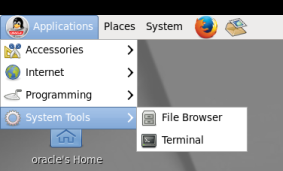

4.	Execute: sh /u01/app/oracle/suite/odi_studio/odi/studio/bin/odi 

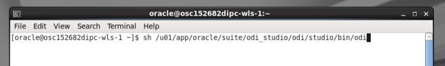

5.	ODI Studio will come up. Click on “Connect to Repository…”

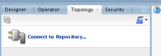

6.	Use login “ODIStudio”. Click on “OK” button

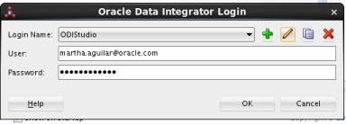

7.	You are now in ODI Studio

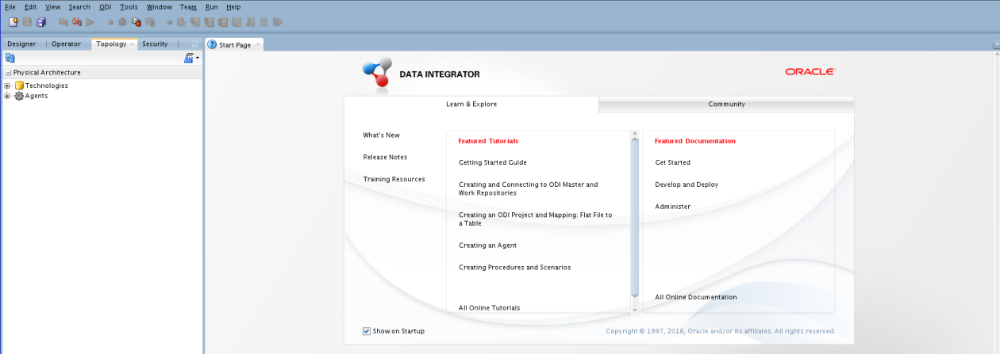

## Enterprise Data Quality (EDQ)

Enterprise Data Quality brings to DIPC the necessary functionality for delivering Data Fit for Use and that satisfy an organization’s current and emerging Data Governance requirements for your Data Warehouse / Data Mart / Data Lake initiatives. EDQ offers an integrated suite of data quality tools that provide an end-to-end solution to measure, improve and manage the quality of data from any domain. EDQ also combines powerful data profiling, cleansing, matching and monitoring capabilities while offering unparalleled ease of use. Features of EDQ include: 
- Advanced data profiling to identify and measure poor quality data and identify rule requirements to resolve your Project and/or Enterprise data quality issues 
- Semantic and pattern-based recognition to accurately parse and standardize data that is poorly structured 
- An innovative Open Reference Data Architecture enabling easy creation, customization and maintenance of business rules that adapt and learn from your data to enable and expedite automated solutions to jumpstart, continually improve and socialize your data quality over time 
- Easy integration with ODI scenarios 

### Start EDQ Director
1.	Log into your Workshop DIPC Server. In your web browser, provide your DIPC server URL. The URL will be provided by the instructor and will look like this one:
https://osc132657dipc-oscnas001.uscom-central-1.oraclecloud.com/dicloud
2. Provide your user name and password, then click "Sign In" button

You will be navigated to your DIPC server Home page.

3. Click on the picture icon located on the top right corner of the screen and then select “Open EDQ”

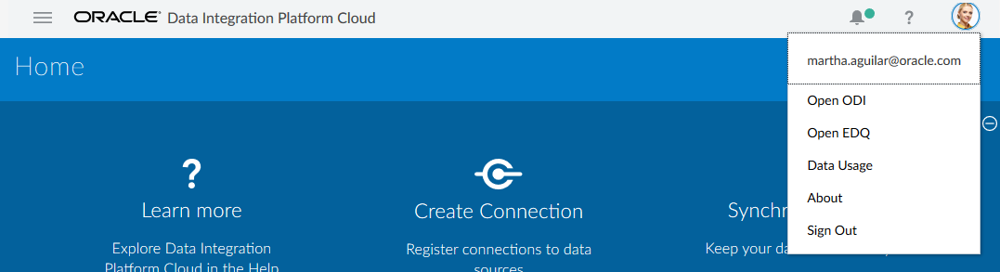

4.	From the launchpad, click on “Director”

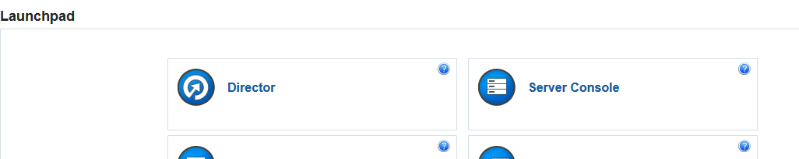

5.	Click “OK” to accept opening the program

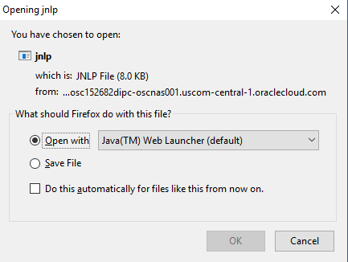

6.	Wait a few minutes, you will receive a new message, click on “Run”

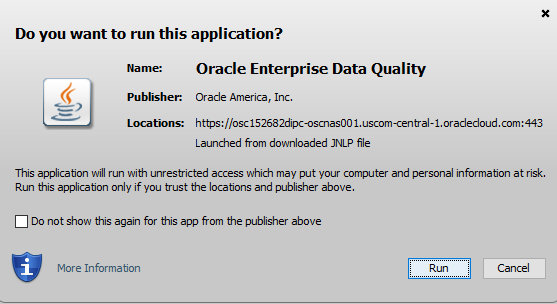

7.	EDQ director will appear on your screen. Take a moment to familiarize yourself with the Terminology of each of the four different areas of the Director application

### Create a New Project
1.	In the "Project Browser", right-click "Projects" and select "New Project…" to start the wizard 

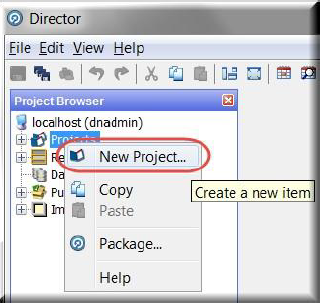

2.	Provide the following information:
    - Name: Exploring Customer Data
    - Description: Data Quality Project to Profile, Standardize, Match and Merge customer data
3.	Click on “Next >” button located at the bottom right corner

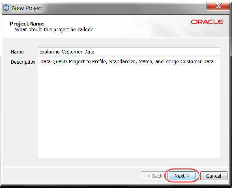

4.	Ensure the “All Groups” checkbox is selected in “Project Permissions”; then click “Finish” button located at the bottom right

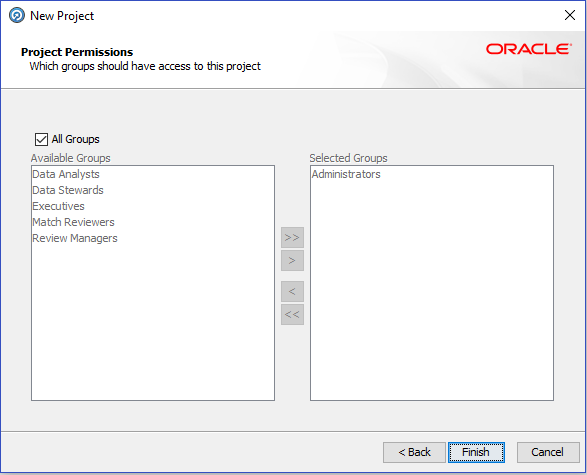

The “Exploring Customer Data” project now appears in the Projects list!

### Create a Data Store and a Snapshot
Now that we have created a project, the next step is creating a Data Store. A Data Store is a connection to a source of data, whether the data is stored in a database or in one or more files.
1.	Expand the newly created project “Exploring Customer Data”, right click “Data Stores”, and select “New Data Store” to launch the wizard

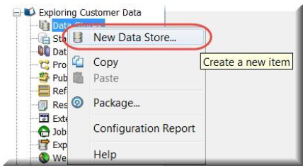

2.	Select "Server" on “Data is accessed from” field.
3.	Leave “Database” on “Category” field
4.	Select “Oracle” on the “Type” list and click “Next >” to continue

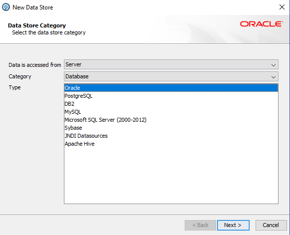

5.	Provide the following data:
    - Database host: <SOURCE_DB>
    - Port: 1521
    - Database name: <SOURCE_DB_SERVICE_NAME>
    - Name type: Service
    - User name: EDQ_SRC
    - Password: Welcome#123
    - Schema: 
6.	Click on “Test…” button located on the bottom right corner

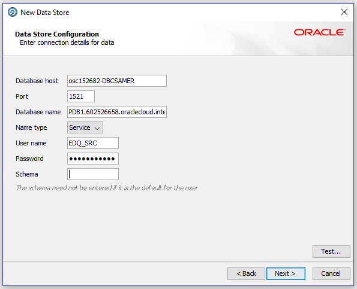

7.	When all information is correct, you will receive a message about connection success, click “OK”

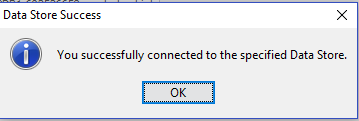

8.	Click on “Next > ” button located on the bottom right corner
9.	Provide the following information
    - Name: Connection to Oracle Database
    - Description: Connection to US Custom Data
10.	Click on “Finish” button located on the bottom right corner

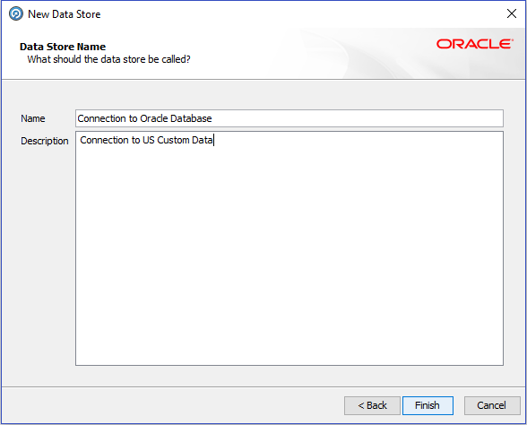

11.	Now we will use this new connection and select a table for profiling and cleansing; the goal is to stage some of the data so we can begin to understand it. Right click “Staged Data” under your project and select “New Snapshot…”

12.	Select the newly created database connection, then click “Next >” to continue

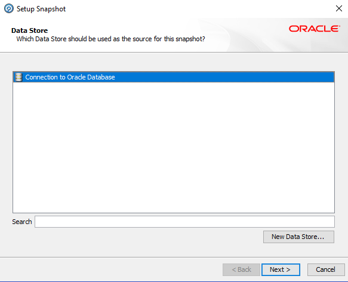

13.	In “Table Selection”, select "US_Customers" from the list.  Click “Next >” to continue

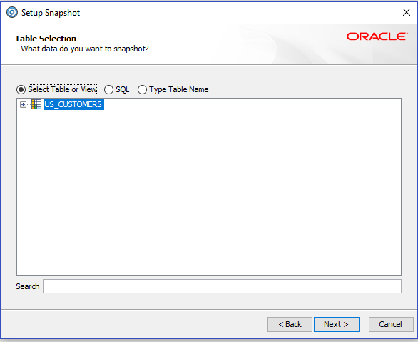

14.	In “Column Selection”, ensure all columns are selected, then click “Next >” to continue

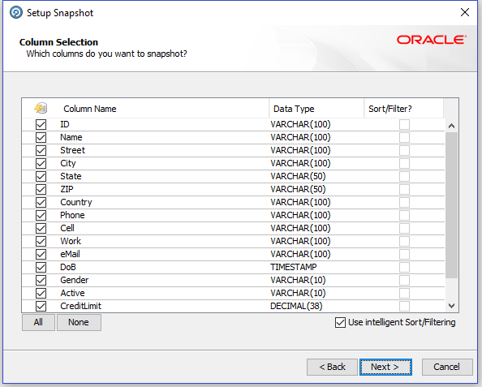

15.	In “Filter Options”, leave the default value of Simple and click “Next >” to continue

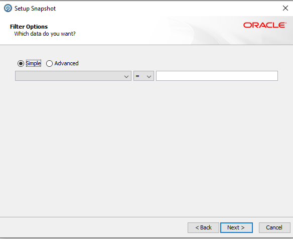

16.	Sampling Options allows to specify the amount of data brought to the snapshot. If needed, it is possible to specify a certain “Count” or “Percentage” of data to be read for the snapshot. Leave the default and click “Next >“

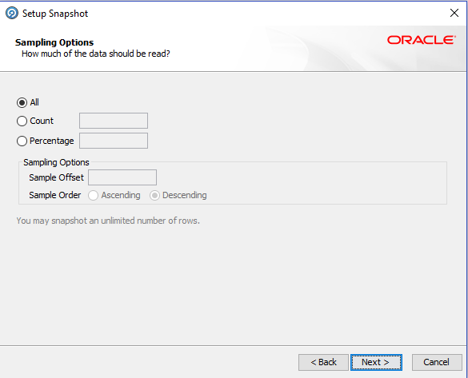

17.	Leave the default empty value for the ‘No Data’ Reference Data field, click on “Next >“

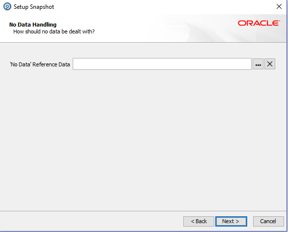

18.	Provide the following data:
    - Name: US Customer Data
    - Description: Connection to Oracle Database.US_CUSTOMERS
19.	Verify that checkbox “Run Now?” is checked and click on “Finish”

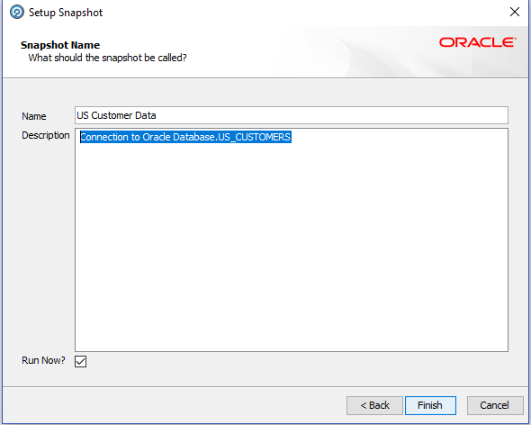

After a short delay, the Results Browser panel is populated. Taking the Snapshot causes EDQ to stage the data from the database into the EDQ data repository. From now on we will be working with the data residing in the "US_Customer" Data Snapshot and we will not be modifying or in any way accessing the source data.

### Profiling Data
The first step in improving the quality of your data is to understand it. You know you have data but is it good data? EDQ allows to quickly assess, find, investigate and understand anomalies regarding data content, standardization, relationships and duplication among others.
1.	In the Project Browser right-click on “Processes” under your project, then select “New Process”

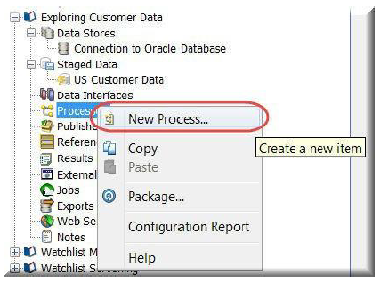

2.	Select the previously create staged data set “US Customer Data”, then click “Next >”

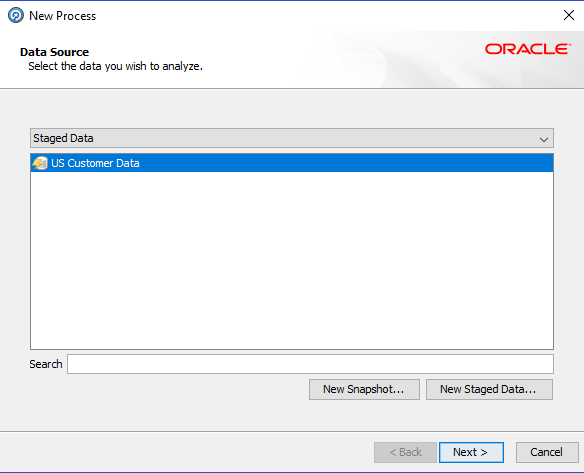

3.	Leave “Add Profiling” checkbox unchecked and click “Next >” to continue

**Note. Selecting "Add Profiling" when a new process is created, data will be profiled for all profilers selected. When you are creating a process for a large or wide dataset, it is recommended to add profilers separately after creating the Process as it may take a long time to execute all the profilers as they are compute intensive**

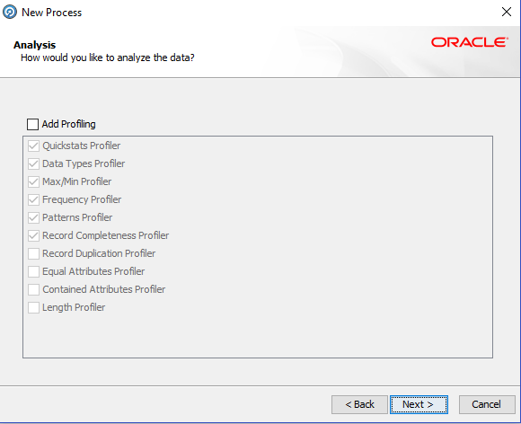
 
4.	Provide the following information:
    - Name: Profiling – Understanding your Data
    - Description: Understanding US CUSTOMERS Data
5.	Click on “Finish” button

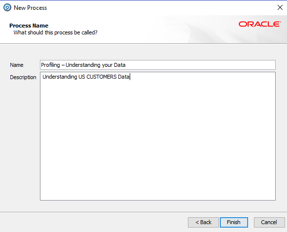

6.	In the "Tool Palette" find the "Profiling" category.

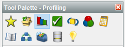
 
7.	Find “Quickstats Profiler” among the profiling processor family

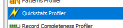
 
8.	Drag and drop “Quickstats Profiler” icon into the “Project Canvas” area

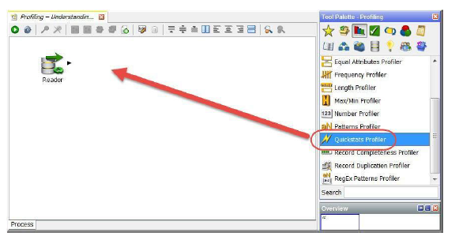

9.	Connect the “Reader” icon to the “Quick Stats” icon; click and drag from the output triangle of the “Reader” processor to the input triangle of the “Quickstats Profiler”. Upon successful connection, the configuration applet will come up

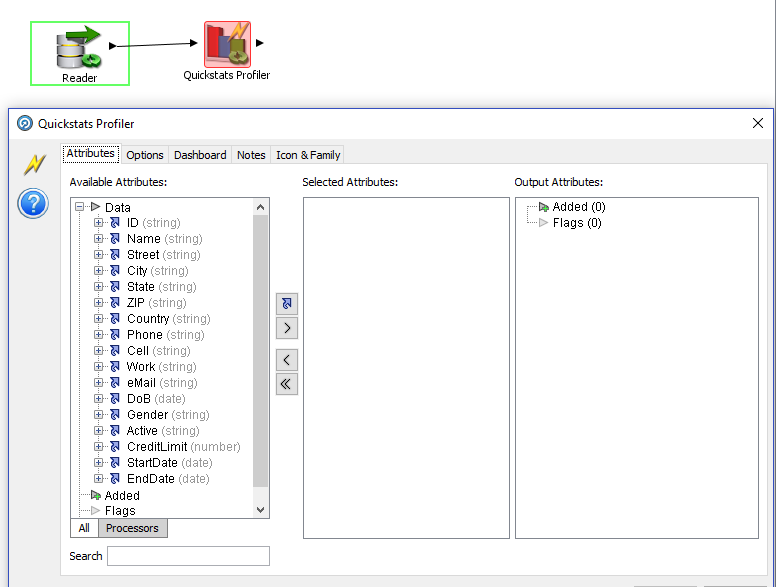

10.	Click on “Select All” icon ( ) then click “OK” button to save

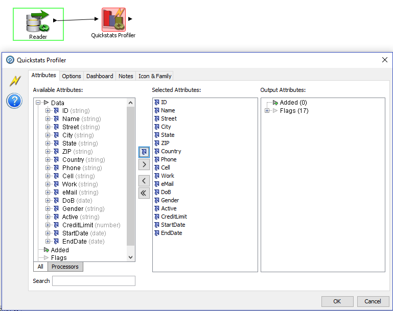 

**Note: The green circular arrows on any processor means it has yet to be executed.**

11.	Click the “Run” icon in the toolbar (top of the "Project" Canvas) to run the process. The progress can be observed in the "Task Bar" in the bottom-left of the "Director" as the process runs.

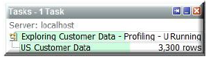

**Note: When the process has finished, the green circular arrows will disappear.**

12.	Click on the “Reader” processor to see the raw input data, stored in the staged data snapshot. This will be displayed in the "Results Browser" panel

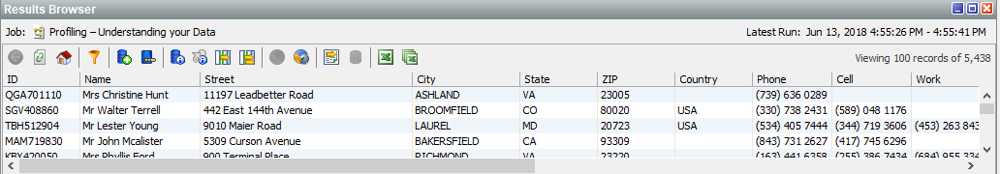

13.	Now click the “Quickstats Profiler” to see the output of the processor

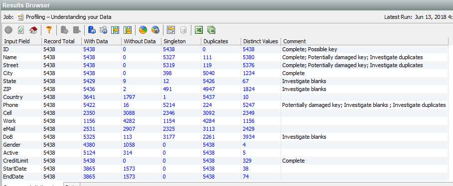

The “Quickstats Profiler” provides fundamental quality metrics for those    selected attributes. It highlights: 
- Candidate key columns 
- Completeness and missing data 
- Duplication 
- Uniqueness and diversity of values 

For each selected attribute, the number of records (Record Total), With Data, Without Data, Singleton, Duplicates, and Distinct Values are shown. These results can be observed and investigated to quickly find data anomalies. For instance, there are 4 Distinct Values for the Gender attribute, when there should really be two: Male and Female. You can also drill down on any blue text to see the data underneath.

14.	Click the number 3113 listed for “eMail” under the “Duplicates” column in the Results Browser. 

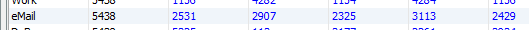

15.	Click the "Count" hyperlink for the “eMail” containing no content / blank

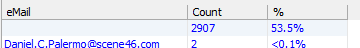

The large number of empty email values (53.5%) may also represent a "Data Fit for Use" issue depending on the requirements or data SLAs of the customer

16.	Click the “Back” icon in the "Results Browser" panel to return to the previous view. Now drill-down on one of the non-null values. 

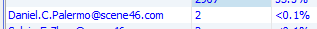
 
We observe that there are a number of duplicate “eMail” values (Count of 2) in the system that may require further investigation (from a duplicate record standpoint)

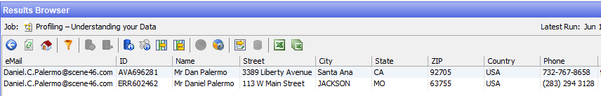 

17.	Click the “Back” icon in the "Results Browser" panel as many times as needed to return to the results of the “Quickstats Profiler”
18.	In the "Tool Palette" find the “Frequency Profiler” processor

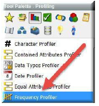

19.	Drag and drop the “Frequency Profiler” processor onto the "Project Canvas"

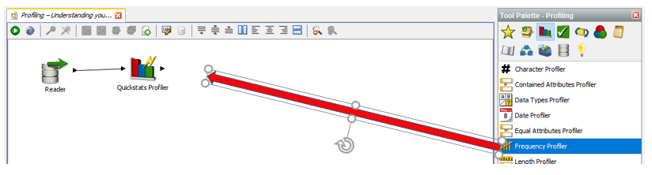
 
20.	 Link the output triangle of the “Quickstats Profiler” to the input of the “Frequency Profiler”, the dialog applet will come up.

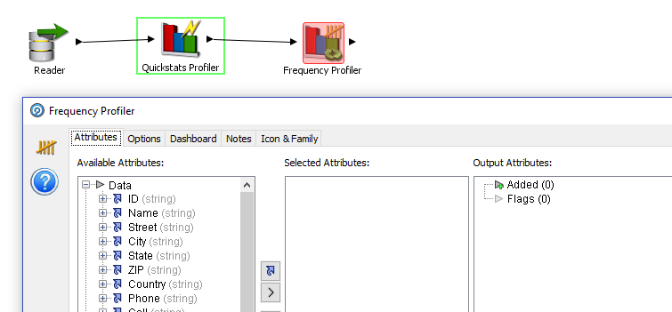
 
21.	Multi-select the Country, DoB, and Gender and click on the “Select” icon to add the attributes to the “Selected Attributes” section, then click “OK”

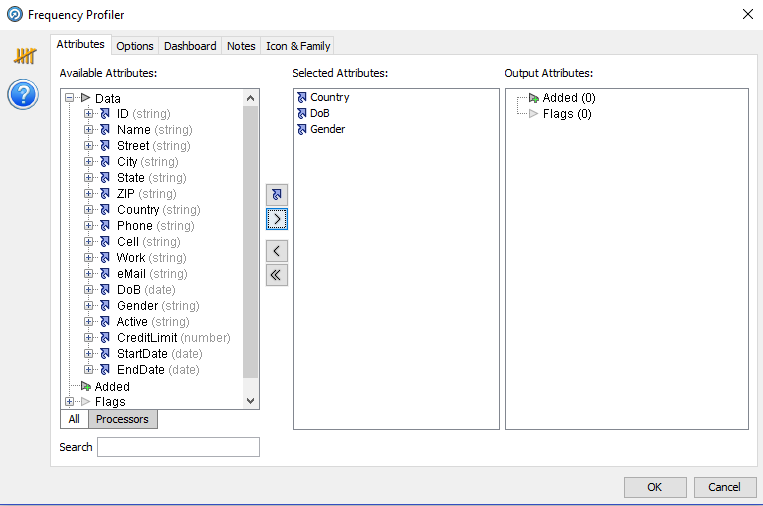

22.	Processors can be renamed by double-clicking on the name of the processor within the canvas. Double click on the existing label of the Frequency Profiler and enter “Frequency Profile Country, DoB, and Gender”

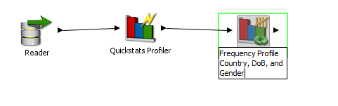

23.	Click the “Run” icon in the toolbar (top of the "Project Canvas") to run the process.
24.	Once the process finishes, click the “Frequency Profile Country, DoB, and Gender” processor to view the results in the "Results Browser" panel. Notice the 4 distinct tabs at the bottom left corner: Country, DoB, Gender and Data

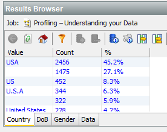

This specific processor happens to tell us a lot about our data set just by observing the different values. Notice how many different representations of United States of America there are: USA, US, U.S.A, United States, and U.S. This discrepancy can cause major issues with Business Intelligence (BI) dashboard authors and analytics dashboards results.

If the BI team is asked to report on United States sales, the Business Intelligence dashboard author must do one of the following (neither of which are appealing): 
- Undercount US Sales because he/she picks “USA” to look for and does not know there are 5 (and perhaps rising over time) different (but similar) valid representations of United States in the Country column. Such an approach results in the undercounting of US Sales (a 55% undercounting to be exact). 
- Have to ask “Which United States?” 
- Be put under the burden to identify all the variants of acceptable representations of “United States” in the Country column. And not just Country column, all Columns can have standardization content issues – putting the onus on the Business Intelligence report and dashboard authors to ferret out and identify all possible acceptable variants and incorporate that logic in the Business Intelligence report/dashboard implementations. Why put ‘dirty data’ in the Data Lake – why not clean the water before it is put in the Lake? 

Finally, there are over 27% of the rows with no data in the "Country" column. While we will not do so in this workshop, one could easily create "States" Reference Data and if Country is blank and the "State" column is one of the valid 50 states – set the Country to the standardized value of “United States” – furthering the efforts in transforming the Customer dataset from something more than “just data”, but "Data Fit for Use”. Not just “Analytics”, but “Accurate Analytics”.

25.	Click on the “DoB” tab in the bottom of the "Results Browser" panel to view the results of the Frequency Profiler 

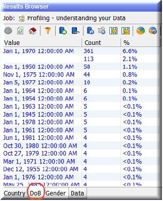

Note that the columns can be sorted by clicking on the various column headers (click on Count - if not already sorted by count, keep clicking count until it is sorted from high to low). Column sorting in the "Results Browser" can be another good exploratory technique to quickly identify additional issues with your data. For instance, you will notice many individuals with a birthday on Jan 1. This may indicate that there was some sort of default value used with Jan 1 and that the quality of the "DoB" column may be low. 

As another example, if you saw one "DoB" value entry showing an unusually high percentage of the total row counts (such as 6.6% having Jan 1, 1970) – this would represent another hidden issue with the data (likely a spurious default value used by the source data system if the value were whitespace). Every single row with Jan 1, 1970 of course inserted into the source database just fine … but the data is not "Fit for Use" for age banding or other age analysis of the data unless attempts are made to fix / enrich the "DoB" field. 

Lack of "Fit for Use" of data (default, blank and null values for "DoB" ) limits "Fit for Use" – limiting the data’s "Fit for Use" as Report / Dashboard authors unknowingly include erroneous data in the results of their Dashboards. Additionally, Dashboard consumers losing confidence in their Reports/Dashboards is the number 1 cause of Data Warehouse / Data Mart / Data Governance project failures (Gartner)

26.	Click the Gender tab in the bottom of the "Results Browser" panel to view the results of the "Frequency Profiler"

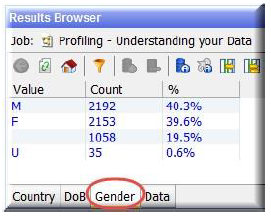

By now, you will surely see that this dataset needs some fine tuning to make it usable for accurate analytics. For instance, 19.5% of the gender values above are blank.

27.	Let’s add a few more processors. In the “Profiling Tool Palette" find “Record Completeness” processor and “Record Duplication” processor; drag and drop each processor to the "Project Canvas"

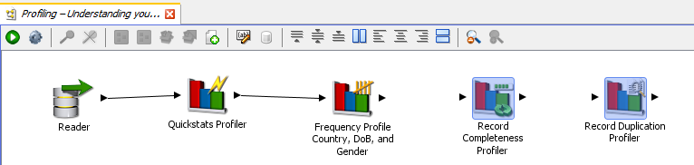
 
28.	Connect the “Record Completeness” processor to the “Frequency Profile” processor, the dialog applet will come up
29.	Click the “Select All” icon to have all the data columns participate, then click “OK”

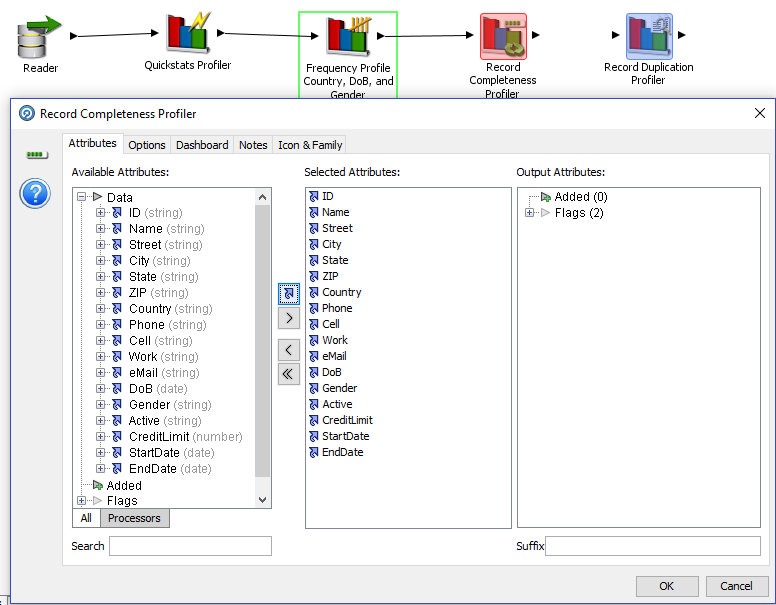

30.	Connect the “Record Completeness” processor to the “Record Duplication Profile” processor, the dialog applet will come up
31.	Click and select the “Name” and “Zip” attributes from “Available Attributes” section, then click the “Select” icon to move the attribute to the “Selected Attributes” section. Click "OK"

32.	Click the “Run” icon in the toolbar (top of the Project Canvas) to run the process
33.	Click on the “Record Completeness Profiler” processor to view the results in the Results Browser. You can see that only 207 of the customers have all 17 of 17 attributes filled. Click the "Show Additional Information" icon.

Notice that those 207 complete records only make up 3.8% of the entire dataset

34.	Click on the “Record Duplication Profiler” processor to view the results. Drill down on the 14 representing Duplicated records

35.	In the “Profiling Tool Palette" find “Pattern Profiler” processor; drag and drop it into the "Project Canvas"

36.	Connect the “Record Duplication” processor to “Pattern Profiler” processor, the dialog applet will come up
37.	Click on “Zip” from “Available Attributes” section, then click the “Select” icon to move the attribute to the “Selected Attributes” section. Click "OK"

38.	Click the “Run” icon in the toolbar (top of the Project Canvas) to run the process

While we can continue to add Profilers to further investigate the data, perhaps it is best to move on to explore the next family of EDQ Processors: Audit – which will help us check and standardize the data.

### Generate Reference Data 
We will take advantage of the results generated while we were profiling the data to create reference data that will be used later.

1.	Click on the “Frequency Profile Country, DoB, and Gender” processor, then click on the "Gender" tab in the bottom left corner of the "Results Browser" panel
2.	Hold down CTRL key and click on the M and F values

3.	Right-click and select “Create Reference Data”. 

4.	The "New Reference Data" dialog appears. Rename the attribute name to “Gender”, click “Next”

 
5.	Add “Gender” to the Lookup Column using the   button, then click “Next”. Click “Next” on the next two screens to keep the defaults

 
6.	Provide the following information:
    - Name: Valid Genders
    - Description: Valid Genders

    then click “Finish”
 

7.	The "Reference Data Editor" appears next. Here, you can modify the reference data to add rows or delete rows. EDQ comes with many different types of reference data out of the box which can dramatically speed up the time it takes to create data check processes. Click "OK" to return to the "Project Canvas"

8.	Next, we will need to create Reference Data for the valid types of ZIP Codes. To easily create this reference data, we will use the results of the "Pattern Profiler"; click the "Pattern Profiler" processor and view the results in the "Results Browser"panel

**Note: "N" signifies a number, "p" signifies punctuation, "a" signifies an alpha character, and "_" signifies a space.**

 
9.	This is pattern information from which we can create reference data. Since we want 5 digits or 5 digits followed by 4 digits, CTRL click on "NNNNN" and "NNNNNpNNNN" then right-click on either one and select “Create Reference Data”

10.	The "New Reference Data" dialog appears. Rename the attribute name to “Zip Pattern”, click “Next”

11.	Add “Zip Pattern” to the Lookup Column using the ">" icon, then click “Next”. Click “Next” on the next two screens to keep the defaults

 
12.	Provide the following information:
    - Name: Valid Zip Patterns
    - Description: Valid Zip Patterns
then click “Finish”

13.	The "Reference Data Editor" appears next. Click "OK" to return to the "Project Canvas"

 

### Copy Reference Data
To save time, we will copy reference data previously created into our project.
1.	In the “Project Browser” find a project titled “Examples”, expand it

2.	Expand the “Reference Data” item and right-click on “City to Country Mappings” then select “Copy”

 
3.	Return to your project (Exploring Customer Data) and find the “Reference Data” item, right-click and select “Paste”

4.	Repeat these steps to copy “Country Variants” and “US Common Titles1” under “Reference Data” of your project (Exploring Customer Data)

5.	In the “Reference Data” section of your project (Exploring Customer Data), click on “City to Country Mappings”. Notice in the “Results Browser” that this is a two column Reference Data set. The “City” (yellow) column signifies the Lookup Column, similar to the two sets of reference data we created in previous steps for “Gender” and “Zip Code”. The “Country” (green) column signifies the Return Column. This means, wherever the Lookup Column value contains data, the “City to Country Mappings” Reference Data set can be used to return the “Country” that “City” is in. This will help us standardize the values found in the “Country” column.
 
 

### Auditing Data
We will now begin to create a new Process for Auditing our US Customer data. The reference data we just created in the past few steps will be utilized by some of the out-of-the-box "Audit Processors" within our Audit (data checking) Process
1.	Return to the "Project Browser" in the left side of your "Director" window, and underneath your project right-click on “Processes” and click “New Process…”

 
2.	Select “US Customer Data”, then click “Next”. Click “Next” on the next screen (we will not add any profiling here). Provide the following Data:
    - Name: Auditing Customer Data
    - Description: Auditing Customer Data

    Click “Finish” to continue

3.	As with the first process we created, a "Reader Processor" is automatically added to the "Project Canvas". In the "Tool Palette" find the “Audit” category.

4.	First, drag and drop a “No Data Check” processor onto the "Process Canvas". 

5.	Right click on the "No Data Check" processor and select “Rename” to re-name it to “Email Populated” and press the enter key. 
6.	Drag and Drop the end triangle from the “Reader” to your newly named “Email Populated” audit processor. The "Email Populated" configuration dialog appears

 
7.	Select “eMail” from “Available Attributes” and click the button to add it to “Selected Attributes”, click "OK" 
 

8.	Click the “Run” icon in the toolbar (top of the Project Canvas) to run the process. Once it finishes, select the “Email Populated” audit processor to view the results

**Note: If desired, we can continue to develop this process using one or more of the end point output data stream triangles from the Processor by choosing “Data”, “No Data” or “All".**

9.	Next, find the “Pattern Check” processor in the Tool Palette. Drag and drop it into the canvas and rename it to “Zip Code in Right Format” by double clicking on processor.

10.	Connect the “All” end triangle from “Email Populated” to the “Zip Code in Right Format” processor. The configuration dialog for the "Pattern Check" processor appears.
11.	Select “ZIP” from “Available Attributes” as the “Field for validation” using the ">" icon

12.	Click the “Options” tab at the top of the dialog box, then click the "..."  button in the “Valid Patterns” section in the middle of the window

13.	Uncheck “Filter by Category” in the “Select Resource” applet. This is where you will select the Reference Data we created for the different types of valid zip codes. Click on “Valid Zip Patterns”, then click “OK” 

14.	In the section under “Valid Patterns”, click the drop-down box to change “Categorize unmatched as” to “Invalid”, then click “OK” to continue

15.	Click the “Run” icon in the toolbar (top of the Project Canvas) to run the process. Once it finishes, click the “Zip Code in Right Format” processor to view the results

Notice that there are 5362 Valid Records and 76 Invalid Records. That is, there are 76 records that fail the rule, that is they do not match the patterns “NNNNN” or “NNNNNpNNNN”.

16.	Return to the "Tool Palette" and find the “List Check” processor. Drag and drop it onto the "Project Canvas"

 
17.	Link the “All” triangle from “Zip Code in Right Format” to the “List Check” processor, the “List Check” dialog comes up; select “Gender” in “Available Attributes” and click on the ">' icon to add it to the “Selected Attributes”.
18.	Click the “Options” tab in the top of the dialog box to add reference data. On the section “Valid Values” click on the "..." button 

19.	Select the “Valid Genders” reference data, then click “OK” to continue

20.	Click “OK” to close the “List Check” dialog box. 
21.	Double-click the “List Check” processor to rename it to “Check for Valid Gender”.
22.	 Finally, click the “Run” icon to start the process

We now have a better understanding of our data and its issues. Next step is create a process that will fix those issues.

### Data Standardization and Enhancement
1.	Create a New Process under your project in the “Project Browser” by right-clicking on “Processes” and clicking “New Process…”
2.	Select “US Customer Data” and click “Next”. Click “Next” without adding any profiling
3.	Name your process “Clean Data” then click "Finish"
4.	Return to the “Tool Palette” on the right side of the screen and find the “Normalize Whitespace” processor under the “Transformation” category

**Note: You can always use the search box on the bottom of the “Tool Palette” to help you find the processor you are looking for.**

5.	Connect the “Reader” to the “Normalize Whitespace” processor. The Normalize Whitespace Dialog Box appears. Click on “Select All” icon and click “OK”.

6.	Click the “Run” icon to start the process.
7.	Find the “Enhance from Map” processor from the “Tool Palette” (you can use the "Search" field, type "Enhance"). Drag and drop the processor to the "Process Canvas". Double click the “Enhance from Map” and rename it to “Country from City”

8.	Connect “Normalize Whitespace” processor to “Country from City” processor. In the “Country from City” dialog box, expand the "City" field from the “Available Attributes” to observe the extra metadata value(s) created by the “Normalize Whitespace” processor. Double-click on “City” (the “City” to the right of the blue arrow) to add “City” to the “Field to Match”. Next, click the “Options” tab at the top of the dialog box 

9.	Click the “Browse” button within the “Value Map” section to select the reference data we will use. 

10.	Select “City to Country Mappings”, click “OK” to continue

11.	Click “Attributes” tab on the top left corner of the dialog box to adjust the name of the “Output Attribute”. Double click in the current value (EnhancedResult) and change it to “Derived Country”, then click “OK”

12.	Click the “Run” icon to start the process.
13.	You will notice several unenhanced results, but we are not done yet! Feel free to drill down on the “Enhanced” and “Unenhanced” values (Result Browser panel) to glance at what this processor did. 

14.	Go back to the “Tool Palette” and search for the “Replace” processor. Drag and drop the “Replace” processor to the “Project Canvas”. Rename “Replace” processor to “Standardize Country”.
15.	Connect the “All” end triangle from the “Country from City” processor to the “Standardize Country” processor. The configuration dialog appears, double-click the “Country” field to add “Country.WhitespaceNormalized” to the “Input field”. Then click the “Options” tab at the top of the dialog box to setup the replacements

**Note: If you want, you could select the original 'country' value from the source data. By default, EDQ will take the most recent field conversion as the input attribute (e.g. it will take fullname.whitespacenormalized and not the original fullname field from the source data)**

16.	Click the “Browse” button on the “Replacements” row 

17.	Select “Country Variants” and click “OK”

18.	Click the “Run” icon to start the process
19.	Return to the “Tool Palette” and search for “Merge”. Drag and drop the “Merge Attributes” processor onto the “Project Canvas” and rename it to “Create Best Country Attribute”

We will use this to combine the “Country” and “Derived Country” columns to a single attribute.

20.	Connect the “All” end triangle from “Standardize Country” to the “Create Best Country Attribute” processor. In the dialog applet, double-click on “Country.Replaced” and “Derived Country” from the “Available Attributes” to add to the “Merged Attributes”. Lastly, double click on “Merged (string)” at the top of the “Merged Attribute” section and type “Best Country”, then click “OK” to continue

21.	Click the “Run” icon to start the process then click on “Create Best Country Attribute” processor to view the results in the “Results Browser” panel

Notice how the two columns, “Country.Replaced” and “Derived Country” have now been merged to a single column “Best Country”

22.	In the “Tool Palette”, search for “Writer”. This processor enables an EDQ process to write data to different types of data stores, for example, Staged Data. Drag and drop the “Writer” to the right of the “Create Best Country Attribute” processor on the Project Canvas

23.	Connect the end triangle from the “Create Best Country Attribute” processor to the “Writer” processor. The writer dialog comes up; click button    to select all “Available Attributes”. Using button   send back attributes “Country” and “Derived Country”. Drag and drop “Best Country” until it is after “ZIP” and before “Phone”

24.	Now press the "+" button on the right side of the “Writer Configuration” dialog box to add a new ataged data set

25.	Double click on “Best Country” and rename it to “Country”
 

26.	Click “Next” to accept the default configuration of creating the staged data set
27.	Provide the following information:
    - Name: Clean Customers
    - Description: Clean Customers
28.	Click “Finish”
29.	Click OK to finish setting up the Writer Configuration

30.	Click the “Run” icon to start the process

### Prepare EDQ process for ODI consumption 

We will create a job that runs data through the process we just created. Next, we will configure the Job to run within an ODI package to automate the Data Quality project. 
1.	The first step is direct EDQ to export the out file. Navigate to the “Project Browser” on the left side of the screen and right-click on ‘Clean Customers” under the “Staged Data” category (expand the “Staged Data” category if you do not see it). Right click on it and select “Export Staged Data…”
 
2.	 Click “Next” on the first window of the dialog since the Staged Data is already selected
 
3.	Select “Connection to Oracle Database” for Output data store. Click “Next”
 
4.	Select “CLEAN_CUSTOMERS” table. Click on “Next”
 
5.	You can leave the default name or assign a new one. We will leave the default this time. Make sure “Run now?” box is NOT checked. Click “Finish”
 
6.	We now need to create a job that could be invoked externally. Navigate to the “Project Browser”, and select the “Jobs” category, right-click it and select “New Job…”
 
7.	Name the job by typing “Clean US Customers”, click “Finish”.
 
8.	The “Job Canvas” is displayed next with a slightly different “Tool Palette”. The “Tool Palette” contains all of the runnable configuration tasks in the project including snapshots, processes, exports, etc. Notice the icons at the top of the “Tool Palette” are different – click through them to explore
 
9.	Click the   icon in the “Tool Palette” to display the “Snapshots” and drag the “US_Customer_Data” snapshot onto the canvas
10.	Next, click the   icon in the “Tool Palette” to display the “Processes” and drag the “Clean Data” process onto the canvas
 
11.	Lastly, click the  icon on the right side of the “Tool Palette” to display the “Exports”. Drag and drop the “Clean Customers to Connection to Oracle” for output export onto the canvas
 
12.	Click the Run icon in the toolbar to run the job. Note the Tasks Window in the bottom left of the Director

 
