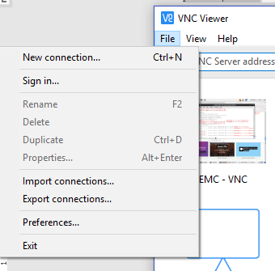
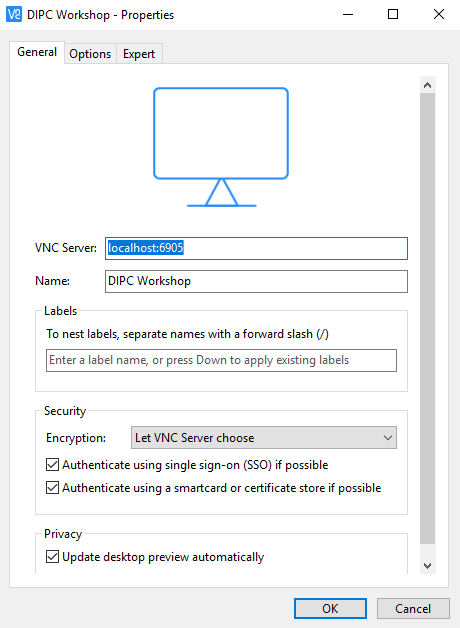
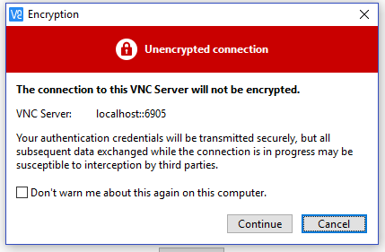
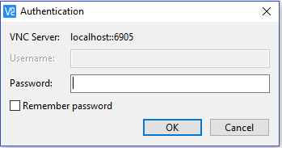
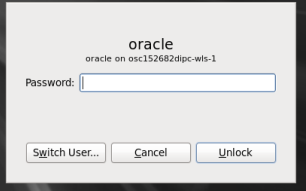

# Appendix2: VNC Viewer Configuration

** Note: Before you start your VNC Viewer session, an SSH session SHOULD to be up and running **
1.	Start VNC Viewer

2.	Click on “File” then select “New Connection”

3.	Provide the following information:
- VNC Server: localhost:6905
- Name: provide ANY name you want to assign to this session
- All other values: defaults

4.	Click on “OK” button

5.	Double click on the connection you just created
6.	If you receive a warning, click “Continue”

 

7.	If password is required, provide “Welcome#123” and check “Remember password” to avoid this question in the future. Click “OK”

8.	When requested to provide a password for oracle user, provide “Welcome#123” and click “Unlock”

