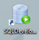
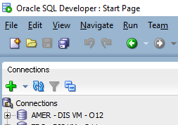
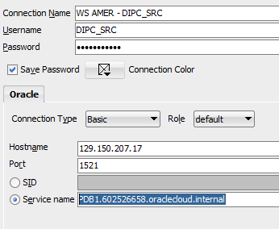
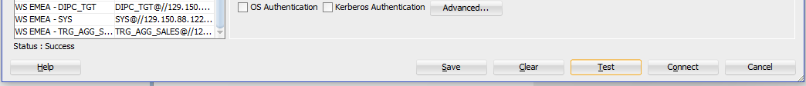

# Appendix 3: SQL Developer

SQL developer can be used to verify data in sources and targets.
1.	Start SQL Developer

2.	Click on plus icon ( ) to create a new connection

3.	Provide the following information
>    - Connection Name: WS SALES - SALES_SRC
>    - Username: SALES_SRC
>    - Password: Welcome#123
>    - Save Password: SELECTED
>    - Connector Type: Basic
>    - Hostname: **<SRC_DB_IP_ADDRESS>**
>    - Port: 1521
>    - Service Name: **<SRC_DB_SERVICE_NAME>**

4.	Click on “Test” button located on bottom right corner. A “Success” message should appear on the bottom left (just above the “Help” button)

5.	Once the test is successful, click on “Save” to save the connection and re-use in the future
6.	Once the connection is selected, click on “Connect” button to establish the connection

## Additional Connections
You will need to define the following connections:
1. WS TARGET - DIPC_TGT
>    - Connection Name: WS TARGET - DIPC_TGT
>    - Username: DIPC_TGT
>    - Password: Welcome#123
>    - Save Password: SELECTED
>    - Connector Type: Basic
>    - Hostname: **<TRG_DB_IP_ADDRESS>**
>    - Port: 1521
>    - Service Name: **<TRG_DB_SERVICE_NAME>**

2. WS TARGET - TRG_AGG_SALES
>   - Connection Name: WS TARGET - TRG_AGG_SALES
>   - Username: TRG_AGG_SALES
>   - Password: Welcome#123
>   - Save Password: SELECTED
>   - Connector Type: Basic
>   - Hostname: **<TRG_DB_IP_ADDRESS>**
>   - Port: 1521
>   - Service Name: **<TRG_DB_SERVICE_NAME>**
