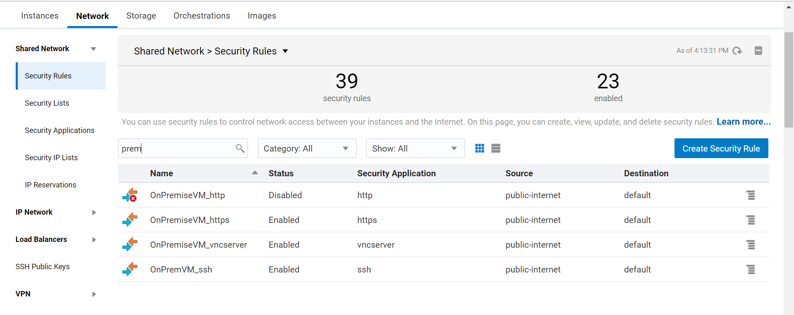

Lab Configuration  

Create Database Instances: osc-DBCSAMER, osc-DBCSEMEA

Creating a Data Integration Platform Cloud Instance: oscDIPC

Create a compute Instance: osc-OnPremiseVM

Create and enable access rules for OnPremise VM
dipc_image_access_rules_110_0.png

Configure VNC server on OnPremiseVM
# Log in as opc then 
sudo yum update -y
sudo yum groupinstall "Server with GUI" -y
sudo ln -sf /lib/systemd/system/runlevel5.target /etc/systemd/system/default.target
sudo shutdown -r now
sudo yum install mesa-libGL -y
sudo yum install tigervnc-server -y
vncpasswd

# set your vnc password: <vncpwd>; <vncpwd>v (view only)
sudo cp /lib/systemd/system/vncserver@.service /etc/systemd/system/vncserver@\:1.service
sudo vi /etc/systemd/system/vncserver@\:1.service
# replace <user> with opc (two entries)
sudo systemctl daemon-reload
sudo systemctl enable vncserver@\:1.service
sudo systemctl start vncserver@\:1.service

