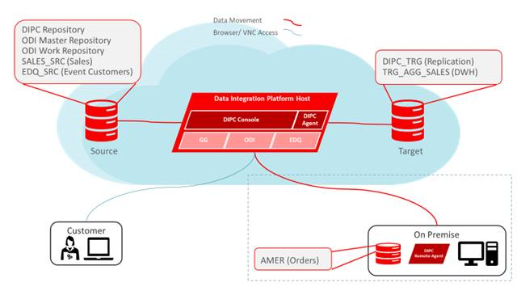

# Workshop Introduction

## How to Prepare for This Workshop

- To log issues and view the lab guide source, go to the [github oracle](https://github.com/oracle/learning-library/tree/master/workshops/dbcs-dba) repository.

- The Labguides are best viewed using the workshop's [GitHub Pages Website URL](https://oracle.github.io/learning-library/workshops/dbcs-dba) 

- Once you are viewing the workshop's gitHub page's website, you can see a list of Lab Guides at any time by clicking on the **Menu Icon**

  

## Oracle Data Integration Platform Cloud (DIPC) Services Workshop

Welcome to the Oracle Data Integration Platform Cloud Service Workshop. The labs simulate instances in Oracle Compute Infrastructure (OCI) services along with on premise evironments.  The content will give you a basic understanding of Oracle Data Integration Platform Cloud Service and many of the capabilities related to provisioning, elevated tasks, agent install, data preparation and internals.  The labs are as follows:
-  Lab 100 - Provisioning DIPCS
-  Lab 200 - Sync Elevated Task
-  Lab 300 - Remote Agent Install & Sync on-prem database
-  Lab 400 - Migrate on-prem to Cloud
-  Lab 500 - Prepare Data
-  Lab 600 - ODI Execution Task
-  Lab 700 - Under the covers DIPCS

## Workshop Details

**Reference the following Lab Guides by opening their Documentation Files:**

## Lab 100: Provisioning DIPCS

**Documentation**: [CloudWorkshop\_DIPCS\_100.md](CloudWorkshop\_DIPCS\_100.md)

### Objectives

-   Provision a Data Integration Cloud Service instance.

## Lab 200: Sync Elevated Task

**Documentation**: [CloudWorkshop\_DIPCS\_200.md](CloudWorkshop\_DIPCS\_200.md)

### Objectives
Review the following elevated tasks
-   Sync Data
-   Create Data Lake
-   Add Data to Data Mart
-   Data Replication
-   Data Validation

## Lab 300: Remote Agent Install & Sync on-prem databases

**Documentation**: [CloudWorkshop\_DIPCS\_300.md](CloudWorkshop\_DIPCS\_300.md)

### Objectives

-   Ensure Ravello VMs for DIPC and DB 
-	Ensure Remote Agent is trusted by DIPC instance *MODIFY FOR GSE*
-   Agent Download
-   Agent Installation and Configuration
-   Configure Agent SSL *MODIFY FOR GSE*
-	Agent Administration - Starting and Stopping.
-   Synchronize On-Premise Database

## Lab 400:  Migrate on-prem to Cloud

**Documentation**: [CloudWorkshop\_DIPCS\_400.md](CloudWorkshop\_DIPCS\_400.md)

### Objectives

-   Install on-prem and cloud agent
-   configure connections to target and source from DIPC console
-   Sync target and source

## Lab 500:  Prepare Data

**Documentation**: [CloudWorkshop\_DIPCS\_500.md](CloudWorkshop\_DIPCS\_500.md)

### Objectives

-   Prepare data from flat files
-   Transform data elements
-   Administer transformations

## Lab 600:  ODI Execution Task

**Documentation**: [CloudWorkshop\_DIPCS\_600.md](CloudWorkshop\_DIPCS\_600.md)

### Objectives

-   Explore ODI Interface
-   Load data from target to source

## Lab 700:  Under the covers DIPCS

**Documentation**: [CloudWorkshop\_DIPCS\_700.md](CloudWorkshop\_DIPCS\_700.md)

### Objectives

-   Understand underlying DIPC architecture
-   Review default Oracle Golden Gate configurations
-   Review weblogic components
-   Revew required ports for communication between agent and DIPC console
