Update January 25, 2018

## Introduction

In this lab, you will explore some common use cases for moving your data from on-premises to the cloud. There are multiple options for solving this data movement challenge. In this lab, we will use SQL\*Developer and command line tools to clone and move a pluggable database from your on-premises database (your Virtual Machine) to your cloud database. You will also use standard Oracle Data Pump tools to export a schema from the on-premises database, and then import that data to your cloud database in a new schema. The final exercise uses RMAN to move a tablespace to the cloud.  These are only a few of the many options for moving data into and between Oracle databases.  More choices for how to migrate Oracle Databases from on-premise to the cloud can be found in this [Migration Strategies Document](http://www.oracle.com/technetwork/database/database-appliance/documentation/oda-migration-strategies-1676870.pdf).

This lab supports the following use cases:
-	Migration of on-premise pluggable databases to a cloud based environment.
-	Rapid creation of test or development pluggable database copies in the Cloud.
-	Rapid replication of on-premise data for reporting and analytics.
-	Rapid re-fresh of selected on-premise schemas for test and/or development activities and/or reporting and analytics.

- To log issues and view the Lab Guide source, go to the [github oracle](https://github.com/oracle/learning-library/tree/master/workshops/dbcs) repository.

## Objectives

-   Migrate a pluggable database from on-premise to the Cloud.
-   Migrate a schema using Oracle Data Pump.
-   Migrate data using a Transportable Tablespace.
-   Copy data using Database Links.

## Required Artifacts

-   The following labs assume that the steps outlined in lab guide 100 have been completed.
-   The SSH tunnels must be active in a terminal window.

# Cloud Migration Using Pluggable Databases

## Configure the Environment

### **STEP 1**:  Open a **DBA Navigator** connection to the on-premise database

-   From the VNC Session desktop, locate and double-click on the **SQL Developer** icon. ***NOTE***: The first time SQL Developer is brought up; it may take some time to instantiate.

	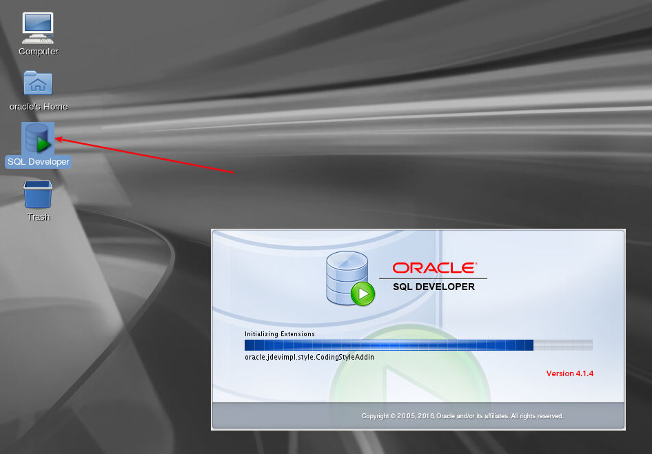

-   Select the **View** -> **DBA** menu option from the top dropdown menu.

	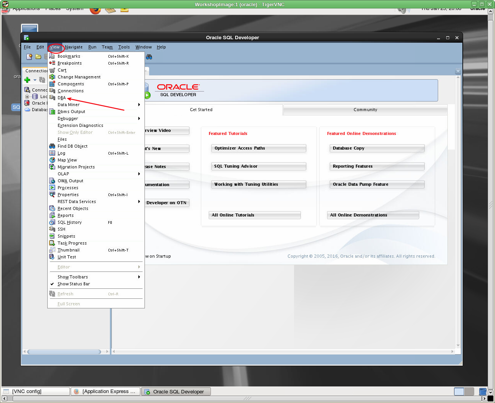

-   On the DBA tab, click the green plus icon to create a new connection.

	**Note**: you may also right-click on Connections and select Add Connection.

	

-   Select the **Local Sys CDB** connection and click **OK**. 

	**Note: Local Sys CDB** is our simulated “on-premises” database in the WorkshopImage Instance.  You will be prompted for a password - use `Alpha2018_`.

	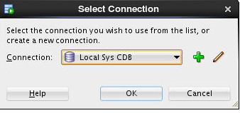

-   Expand the **Local Sys CDB connect**, and then expand the **Container Database** tree item. Click on the **PDB1** pluggable database to show the details for the pluggable database.

	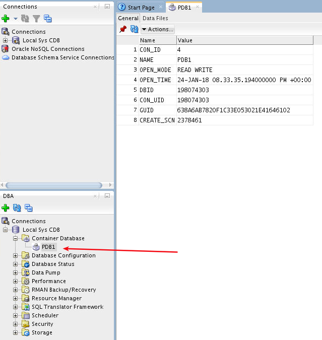

## Clone the On-premise PDB1

### **STEP 2**:  Clone the PDB1

-   In the DBA Navigator panel, right click on the PDB1 pluggable database and select the Clone PDB... menu option.

	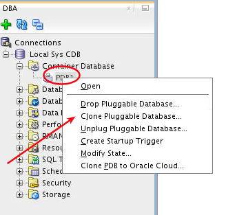

-	Enter the following
	- **Database Name:** `NEW_PDB`
	- Then select the SQL table above.  Since we have implemented TDE (Transparent Data Encryption) we need to override the SQL.

	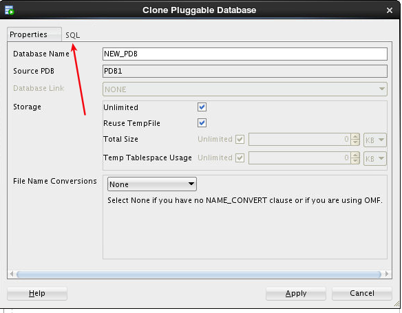

-	Select the SQL tab above and enter the following
	- `keystore identified by Alpha2018_`

	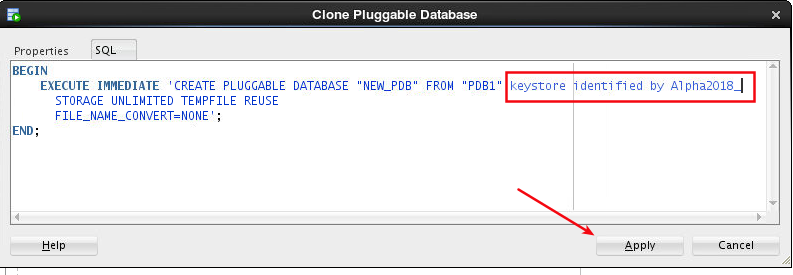

	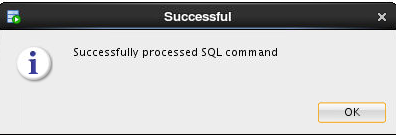

-	You should see the new PDB

	

-	Click on the NEW\_PDB database in the DBA navigator to see the status of the database.  Note: The cloned database shows an OPEN_MODE of MOUNTED indicating the database is plugged-in but is not open for access.

	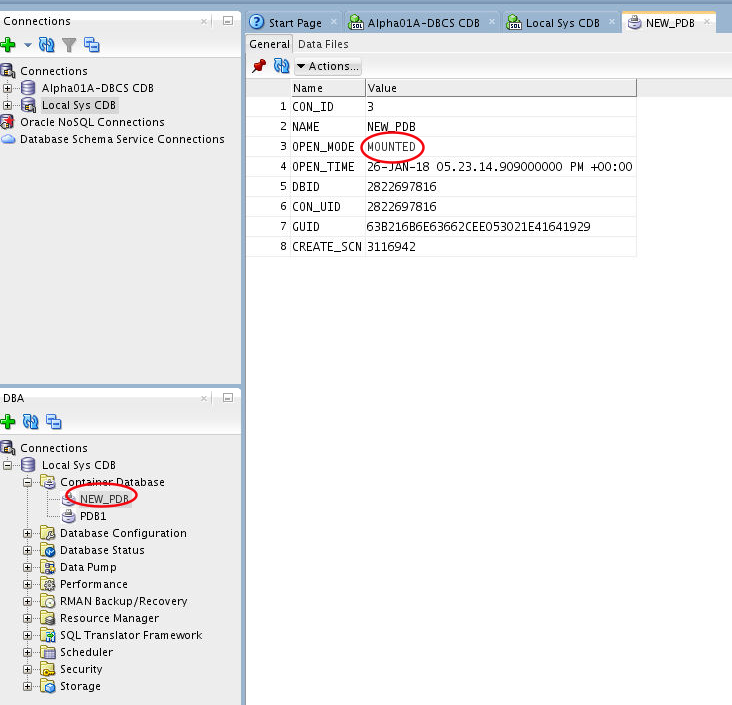

-	Click on the Data Files tab for the ALPHACLONE to review the data files created during the cloning operation.

	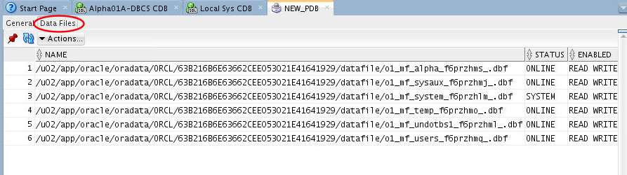

## Clone the NEW_PDB DB to the Cloud

### **STEP 3**:  Create SSH and SYS Database Cloud Connections

-   First we need to setup a SSH host connection to the Database Cloud Service instance. From the top menu select **View -> SSH** to display SSH hosts panel on the left.

	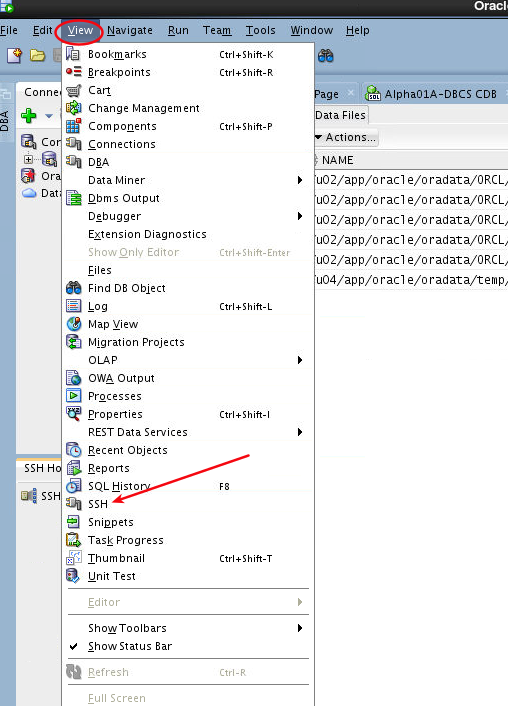

-   Right click on **SSH Hosts** and select **New SSH Host**.

	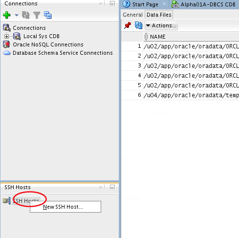

-   We will now confiAlphagure an SSH connection to our DBCS instance

	**Name**: `Alpha01A-DBCS`

	**Host**: `<Database Image public IP you obtained in lab 100>`

	**Username**: `oracle`
	
	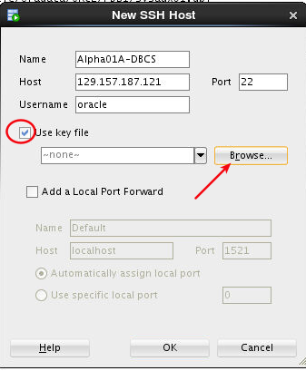

-   Select **Use key file** and click **Browse...** Select file **/home/oracle/privateKey** and click **Open**.

	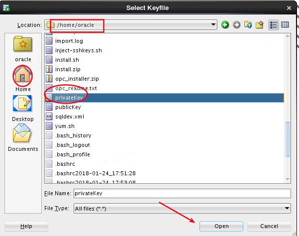

-   Click **Add a Local Port Forward** and enter the following values:

	**Name**: `Database`

	**Host**: `<Database Image Public IP you obtained in lab 100>`
	
-   Select **Use specific local port** and enter **1530**

	**NOTE**: We are using port 1530 since 1521 is already in use for our local database.

	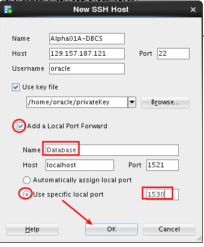

-	Right click on the SSH connection and test.  You should see a message saying the connection was successful.

	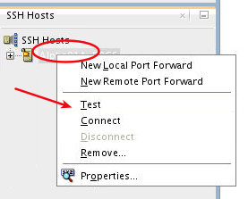

	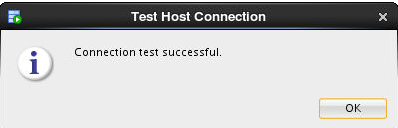

### **STEP 4**:  Create a SQL Developer connection to the Public Cloud database SYS schema

-   Click the green plus sign  in the **Connections** window to create a new connection; enter the following connection details:

	- **Connection Name**: 	`sys - OPCDBCS`
	- **Username**: 			`sys`
	- **Password**:			`Alpha2018_`
	- **Check** 				"Save Password"
	- **Optionally select a color for the connection**
	- **ConnectionType**: 	`SSH`
	- **Role**:				`SYSDBA`
	- **Service Name**: 		`ORCL.<Your ID Domain>.oraclecloud.internal`
	
	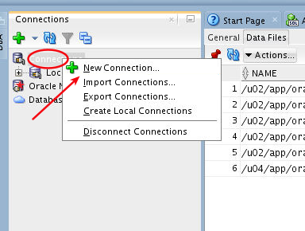

	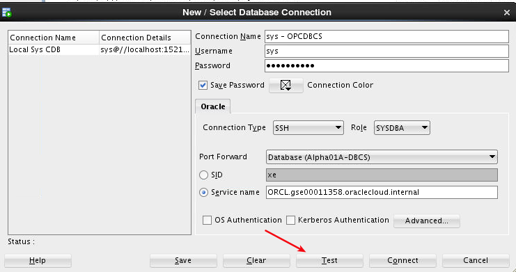

-   Click **Test** to confirm the information was entered correctly.

	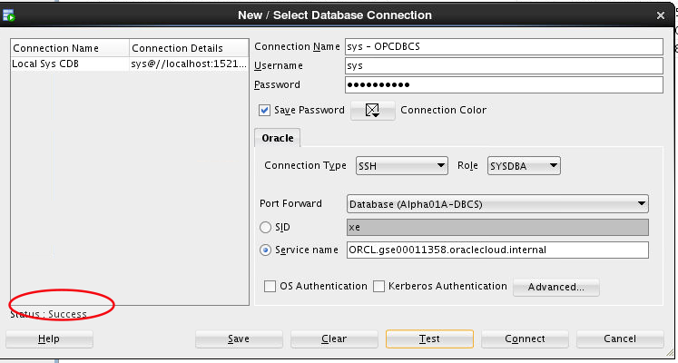

-   Click **Connect** to save the connection information which opens a new SQL Worksheet.

	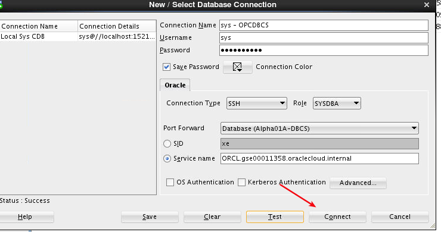

	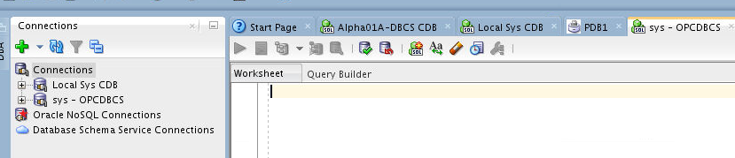

### **STEP 5**:  Unplug NEW_PDB

-	Since TDE requires additional commands that are not included in the generation of SQL within SQL Developer we will do step 5 in a terminal window.  Right click on the desktop and open a terminal window.

	

-	Shut down the database, remove the auto-open wallet, and start the database back up again.  We will be using the password wallet.  Enter the following commands
	- `sqlplus sys/Alpha2018_ as sysdba`
	- `shutdown immediate`
	- `exit`
	- `mv /u01/app/oracle/admin/ORCL/tde_wallet/cwallet.sso /u01/app/oracle/admin/ORCL/cwallet.sso`
	- `sqlplus sys/Alpha2018_ as sysdba`
	- `startup`
	- `alter pluggable database all open;`

	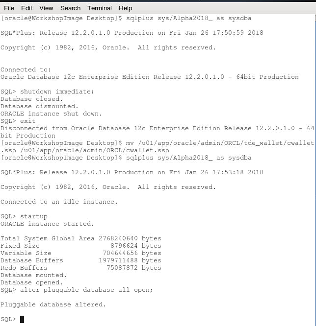

-	We need to open the password keystore.
	- `administer key management set keystore open identified by Alpha2018_ container=all;`
	- `alter session set container=new_pdb;`
	- `administer key management set keystore open force keystore identified by Alpha2018_;`

	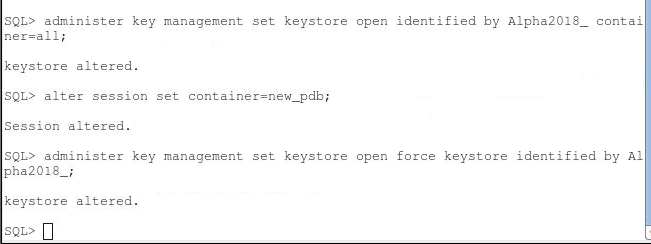

-	Since we took the defaults for datafile location when we cloned the database the location directory for the new_pdb was generated.  Open a browser window to locate that directory.  It will be a multi-digit generated directory name.  It also has a datafile sub-directory.  Copy this so we can paste it into the commands below.  Since it is derived it will be unique for you.

	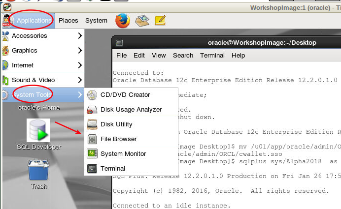

	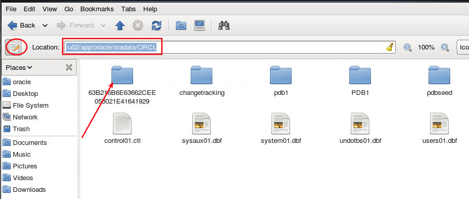

	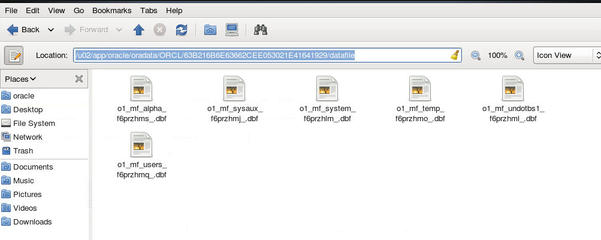

-	We now need to export the encryption keys to the pluggable database, close the pluggable database, and unplug it.  Enter the following commands. **Substititute the 63B... directory name below with the one you copied from above.**
	- `administer key management export encryption keys with secret "Alpha2018_" to '/u02/app/oracle/oradata/ORCL/63B216B6E63662CEE053021E41641929/datafile/new_pdb.p12' identified by Alpha2018_;`
	- `alter session set container=cdb$root;`
	- `alter pluggable database new_pdb close;`
	- `alter pluggable database new_pdb unplug into '/u02/app/oracle/oradata/ORCL/63B216B6E63662CEE053021E41641929/datafile/new_pdb.xml';`

	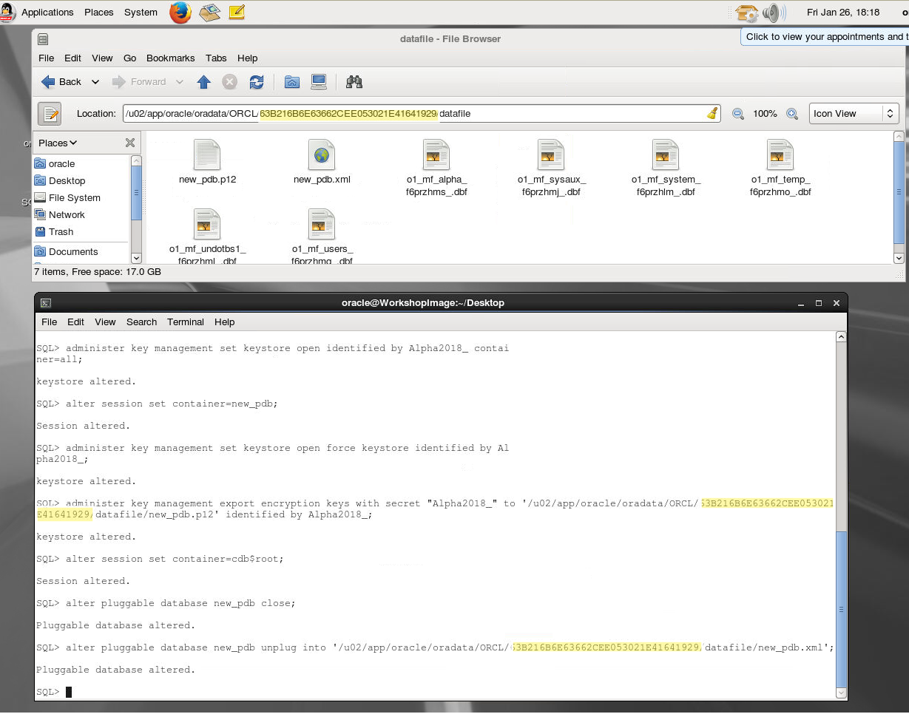

### **STEP 6**:  Copy the data files of new cloned on-premise PDB to the Oracle Cloud

-	Exit out of SQL PLus and tar the files in the pluggable database.  Be sure to first navigate to the datafile directory in your pdb/datafile location.
	- `exit;`
	- `cd /u02/app/oracle/oradata/ORCL/63B216B6E63662CEE053021E41641929/datafile`
	- `tar -cvzf new_pdb.tar.gz *`

	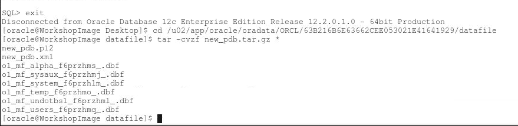

-	SSH into the Alpha01A-DBCS instance, create an new_pdb directory, and then copy the pluggable database to DBCS.  Be sure to replace the 63B... directory below with your own.
	- `ssh -i /home/oracle/privateKey oracle@<Alpha01A-DBCS IP>`
	- `mkdir /u02/app/oracle/oradata/ORCL/new_pdb`
	- `exit`
	- `scp -i /home/oracle/privateKey /u02/app/oracle/oradata/ORCL/63B216B6E63662CEE053021E41641929/datafile/new_pdb.tar.gz oracle@<Alpha01A-DBCS IP>:/u02/app/oracle/oradata/ORCL/new_pdb`

	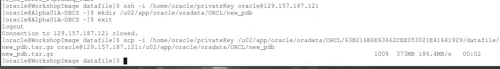

-	Log into the target instance and Untar the files
	- `ssh -i /home/oracle/privateKey oracle@<Alpha01A-DBCS IP>`
	- `cd /u02/app/oracle/oradata/ORCL/new_pdb`
	- `tar -xvzf new_pdb.tar.gz`

	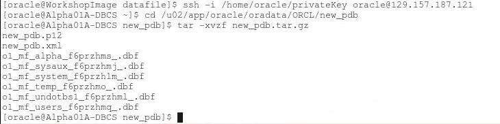

### **STEP 7**:  Plug the cloned on-premise database to Oracle Cloud Database

-	Open Firefox (next step).  If the page does not come up re-start your ssh tunnel.

	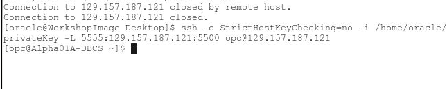

-	Open Firefox on the Desktop and log into Enterprise Manager Express.  If the page does not come up check that your tunnel is still running.
	- `https://localhost:5500/em`
	- **User Name:** `sys`
	- **Password:** `Alpha2018_`
	- **Container Name:** leave blank
	- check 'as sysdba'

	

-	Click on the CDB link.  You may need to go to tools > web developer > debugger screen if the login screen does not show (Firefox/Flash bug).

	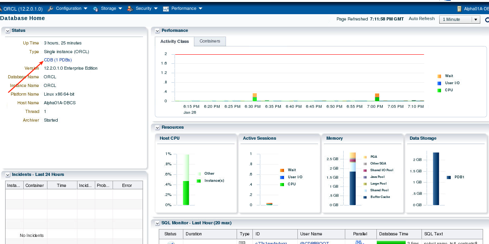

-	Click on Plug

	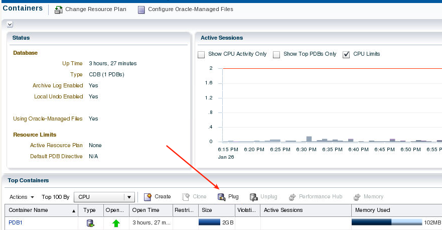

-	Enter Metadata file, uncheck the 'Reuse source datafile' and enter the Source Datafile Location
	- **Metadata File:** `/u02/app/oracle/oradata/ORCL/new_pdb/new_pdb.xml`
	- **Source Datafile Location:** `/u02/app/oracle/oradata/ORCL/new_pdb`

	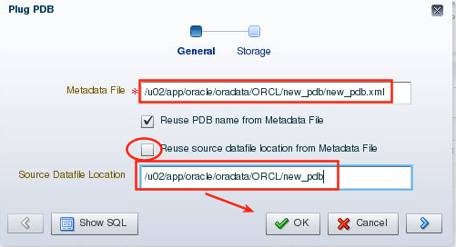

	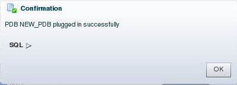

-	Notice the pluggable database has a violation.  Click on this.  The PDB need to import keys from source.  Note you can disregard the other violations.

	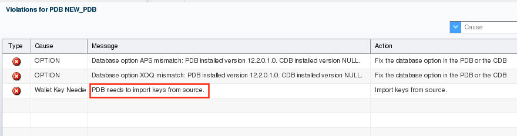

-	Cloud databases have TDE configured by default, but we need to import the new_pdb key.  Open a terminal window on the compute desktop and SSH into the Alpha01A-DBCS instance.
	- `ssh -i /home/oracle/privateKey oracle@<Alpha01A-DBCS IP>`
	- `sqlplus sys/Alpha2018_ as sysdba`
	- `alter session set container = new_pdb;`
	- `administer key management import keys with secret "Alpha2018_" from '/u02/app/oracle/oradata/ORCL/new_pdb/new_pdb.p12' force keystore identified by Alpha2018_ with backup;`

	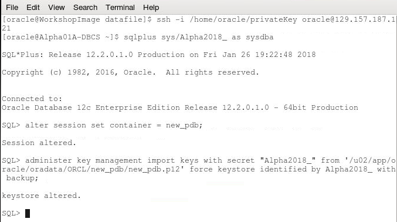

-	Review status of pluggable database in EM.  Open (or go back to) Firefox and log into IM.  Navigate to containers.
	- `https://localhost:5500/em`
	- **User:** `sys`
	- **password:** sys password

	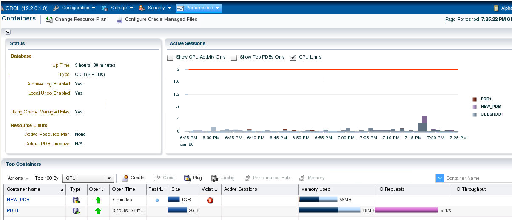

-	Highlight the NEW_PDB pluggable database (don't click on the link) and select action close.

	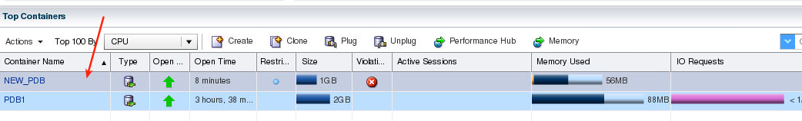

	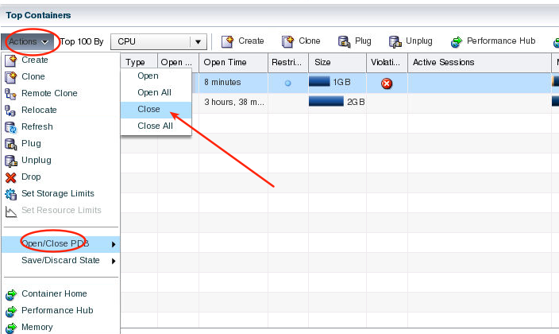

	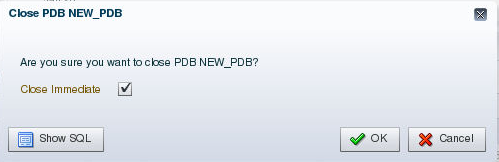

-	Re-open NEW_PDB pdb.  Optionally click on the violation.  The wallet error should be gone.

	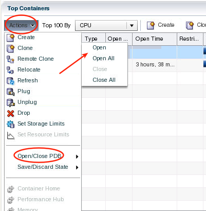

	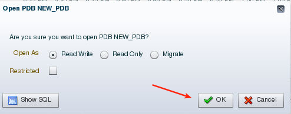

	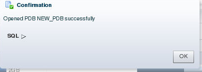

### **STEP 8**:  Create a SQL Developer connection to the Public Cloud database ALPHAPDB schema

-   Back in SQL Developer, click the green plus sign in the Connections window to create a new connection; enter the following connection details and click Save
	- **Connection Name**:	`Alpha01A-DBCS`
	- **Username**:			`alpha`
	- **Password**:			`Alpha2018_`
	- **Check** "Save Password"
	- **Optionally select a color for the connection**
	- **ConnectionType**:		`SSH`
	- **Port Forward:**		`Database (Alpha01A-DBCS)`
	- **Service Name**:		`new_pdb.<Your ID Domain>.oraclecloud.internal`
	
	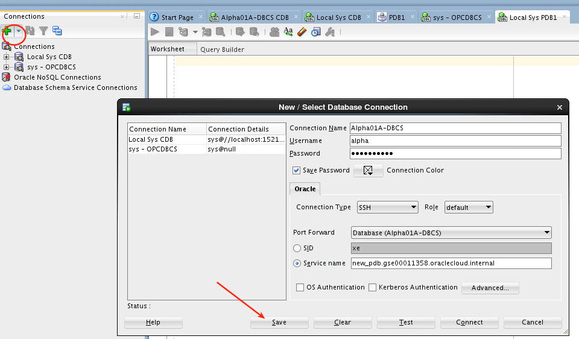

-   Click **Test** to confirm the information was entered correctly.

	
 
-   Click **Connect** to save the connection information, expand the connection on the left, and then expand the tables to confirm the migration was successful.

	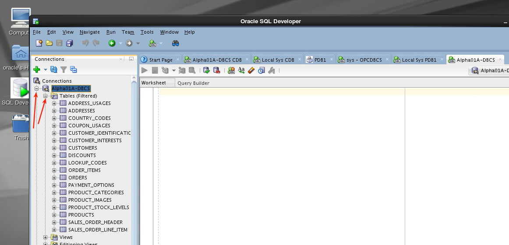

# Cloud Migration Using Data Pump: Schema Level

## Export the Alpha Schema

### **STEP 9**:  Create directory for datapump export

-	Create an Oracle directory (may already exist).
	- `sqlplus alpha/Alpha2018_@pdb1`
	- `create directory oracle as '/home/oracle';`
	- `exit;`

	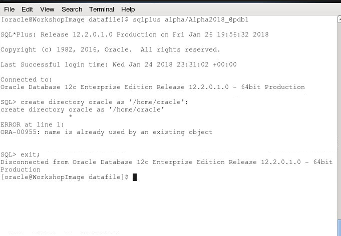

### **STEP 10**:  Run datapump export

-	Export the data.
	- `expdp alpha/Alpha2018_@pdb1 directory=oracle dumpfile=alphaexp.dmp compression=all`

	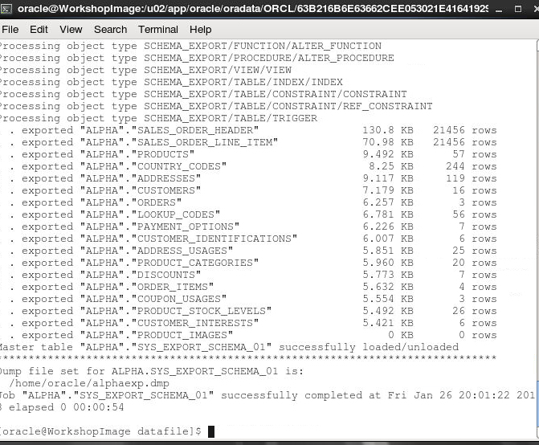

### **STEP 11**:  Copy the export Data Pump file to the server

-   Use the following secure copy (**scp**) command to transfer the Data Pump export to the Alpha01A-DBCS instance.
	- `scp -i /home/oracle/privateKey /home/oracle/alphaexp.dmp oracle@<Alpha01A-DBCS IP>:.`

	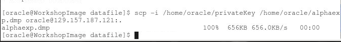

### **STEP 12**:  Create a new schema to hold a copy of the data

-	Open a new terminal window (or use the current one) and enter the following commands that will SSH to the Alpha01A-DBCS instance, create an Oracle directory, and import the data.
	- `ssh -i /home/oracle/privateKey oracle@<Alpha01A-DBCS IP>` -- log into your remote DBCS instance
	- `sqlplus system/Alpha2018_@pdb1;` -- log into system in the alphapdb
	- `create user alpha2 identified by Alpha2018_;` -- create schema alpha2 (alpha already has the data from the previous lab)
	- `grant dba to alpha2;`
	- `connect alpha2/Alpha2018_@pdb1;` -- connect to alpha2 so we can create the oracle directory
	- `create directory oracle as '/home/oracle';` -- this may already exist
	- `exit`

	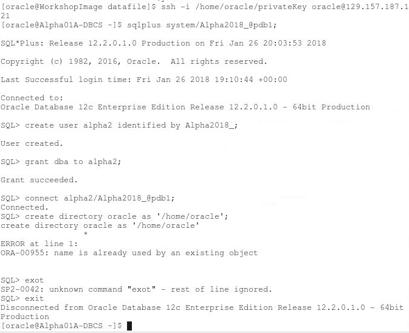

### **STEP 13**:  Import the data

-	Import the data from the alpha schema to the new alpha2 schema.  Run the following command in your terminal window.
	- `impdp alpha2/Alpha2018_@pdb1 directory=oracle dumpfile=alphaexp.dmp remap_schema=alpha:alpha2`

	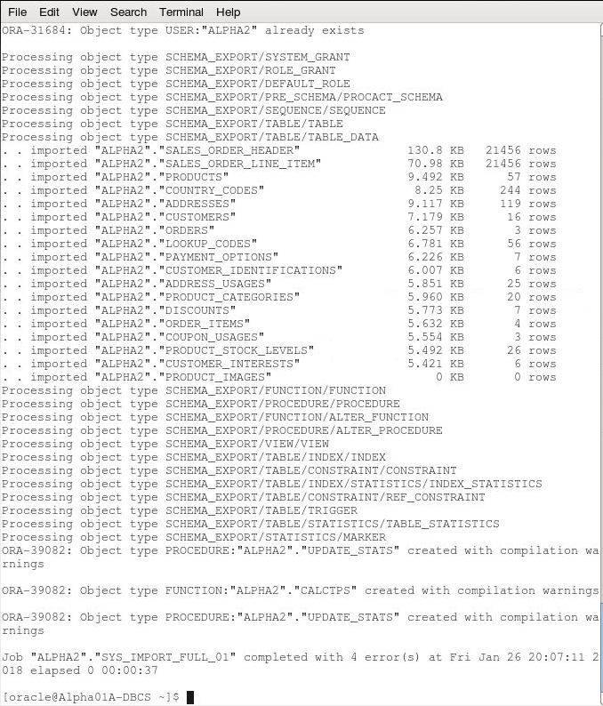

# Cloud Migration Using Data Pump: Tablespace Level

While datapump provides a very fast multi-threaded technique to move data quickly between Oracle Databases, it was not designed for very large volumes of data.  Transportable Tablespaces enable a database file copy technique that does not require an exported copy of the data, but instead allow you to copy the in-place data files to target, which using Datapump to capture the metadata only.

## Replicate Current Data to Archive Tablespace

We will be creating a copy of the alpha schema and tablespace, and replicating that to a alpha_archive schema and tablespace.

-	Open a terminal window and execute the following:
	- `/home/oracle/cr_tablespace.sh`

	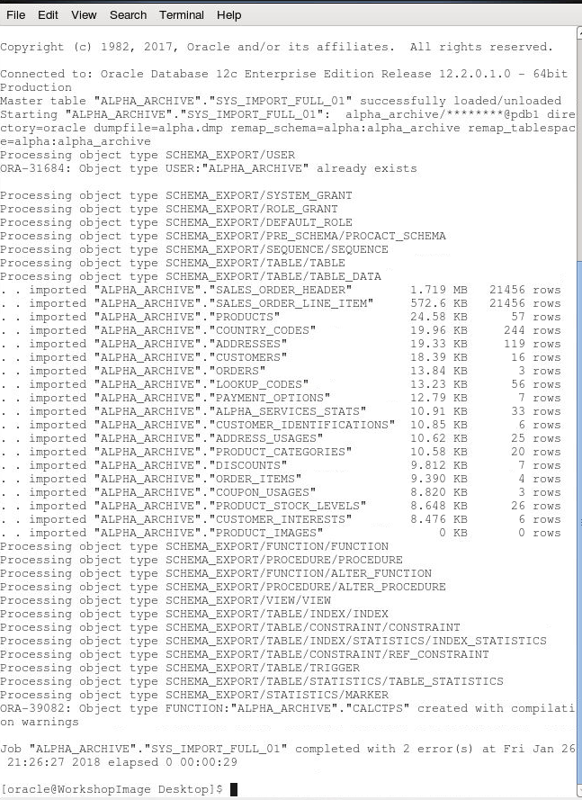

### **STEP 14**:  Open alpha_archive tablespace in read only mode and export the metadata

-	Log into the database, put the alpha_archive tablespace in in read only mode, and export the tablespace metadata.
	- `sqlplus system/Alpha2018_@pdb1`
	- `alter tablespace alpha_archive read only;`
	- `exit`
	- `expdp system/Alpha2018_@pdb1 directory=oracle dumpfile=alpha_archive_tbs.dmp transport_tablespaces=alpha_archive exclude=statistics encryption_password=Alpha2018_ logfile=full_tts_export.log`

	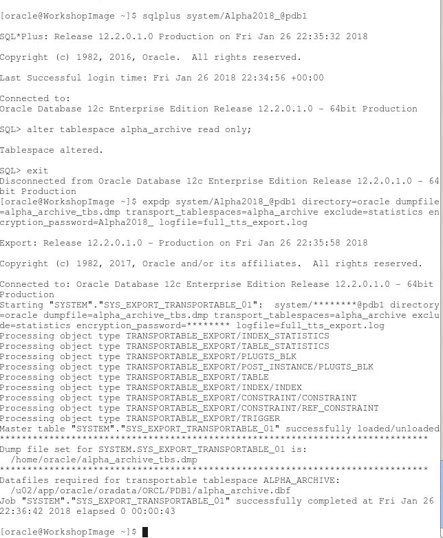

### **STEP 15**:  Copy the datafiles to the target DBCS instance

-	In the terminal window enter the following:
	- `scp -i /home/oracle/privateKey /home/oracle/alpha_archive_tbs.dmp oracle@<Alpha01A-DBCS IP>:.` -- metadata
	- `scp -i /home/oracle/privateKey /u02/app/oracle/oradata/ORCL/PDB1/alpha_archive.dbf oracle@<Alpha01A-DBCS IP>:.` -- datafiles

	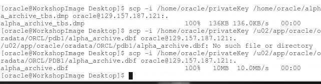

### **STEP 16**:  Import the tablespace into the target DBCS instance

We will be importing the data into the pdb1 instance.  We need to first create the alpha_archive user that owns the data.

-	SSH to the target DBCS instance, log in, and create euro user (must already exist in the target).
	- `ssh -i /home/oracle/privateKey oracle@<Alpha01A-DBCS IP>`
	- `sqlplus system/Alpha2018_@pdb1`
	- `create user alpha_archive identified by Alpha2018_;`
	- `grant dba to alpha_archive;`
	- `exit`

	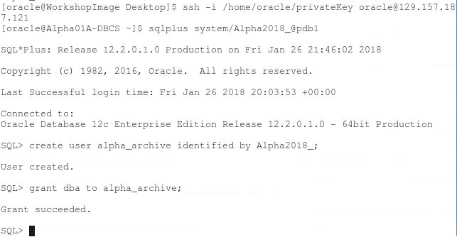

-	Copy the alpha_archive.dbf datafile to the pdb1 directory and import the metadata (the data is already there in the dbf file).
	- `cp /home/oracle/alpha_archive.dbf /u02/app/oracle/oradata/ORCL/PDB1`
	- `impdp system/Alpha2018_@pdb1 directory=oracle dumpfile=alpha_archive_tbs.dmp logfile=full_tts_imp.log encryption_password=Alpha2018_ transport_datafiles='/u02/app/oracle/oradata/ORCL/PDB1/alpha_archive.dbf'`

	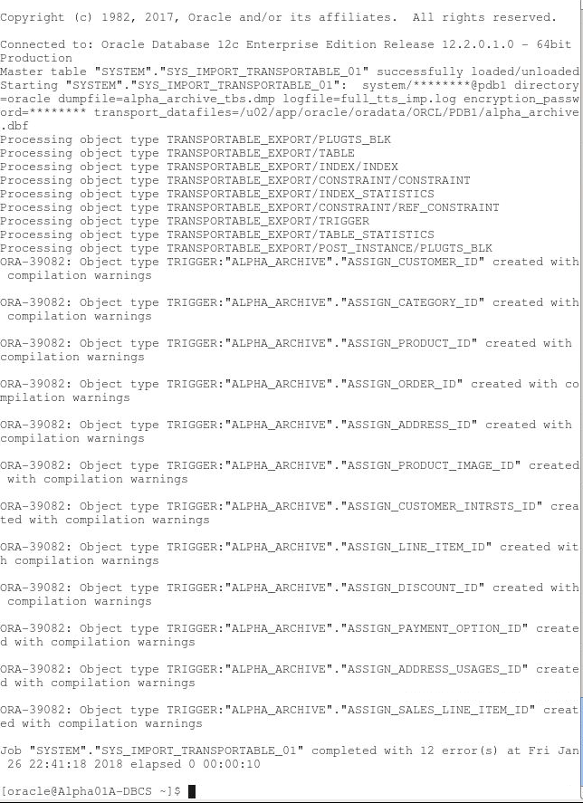

-	Confirm tablespace and contents exist by querying the Oracle dictionary.  Log into sqlplus and run the following query.
	- `sqlplus system/Alpha2018_@pdb1`
	- `select tablespace_name, count(*) from dba_tables where owner='ALPHA_ARCHIVE' group by tablespace_name;`
	- `exit`
- 
	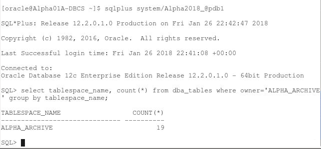

# Cloud Migration Using Database Links (Table Level)

Occasionally you just want to copy one or more tables from one database to another, and the easiest/quickest way to do that is to use a database link.  A database link connects two databases with sqlnet allowing you to reference remote tables in your local database.  This is good for table data, but other object types such as stored procedures, etc. cannot be replicated as easily.

## Create a Database Link

### **STEP 17**:  Create Database Link on the local system

-	Since we need to use tunnels to communicate with the remote DBCS instance when using ports other than 22 (which is open) we need to create a new tunnel for port 1521.  Open a new terminal window (be sure you are not SSH into the remote Alpha01A-DBCS instance - see terminal window heading).
	- `ssh -o StrictHostKeyChecking=no -i /home/oracle/privateKey -L 1526:<Alpha01A-DBCS IP>:1521 opc@<Alpha01A-DBCS IP>`
	- Minimize this window.

	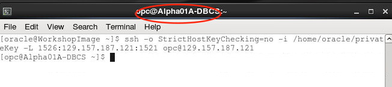

-	Log into SQL Plus and create the database link.  Be sure to update this command with your Identity Domain.
	- `sqlplus alpha/Alpha2018_@pdb1;`
	- `create database link alpha_dbcs connect to alpha_archive identified by Alpha2018_ using '(DESCRIPTION=(ADDRESS=(PROTOCOL=TCP)(HOST=localhost)(PORT=1526))(CONNECT_DATA=(SERVER=DEDICATED)(SERVICE_NAME=pdb1.gse00011358.oraclecloud.internal)))';`
	- `select sysdate from dual@alpha_dbcs;`

	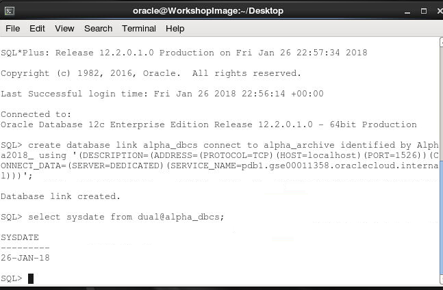

-	Query the REMOTE alpha_archive schema and list tables.  Then copy a table from the remote DBCS to the local instance.  Note that you cannot create a remote table (DDL operation) on the remote server but you can do an insert operation.  
	- `select table_name from user_tables@alpha_dbcs;`
	- `create table alpha_services_stats_archive as select * from alpha_services_stats@alpha_dbcs;`

	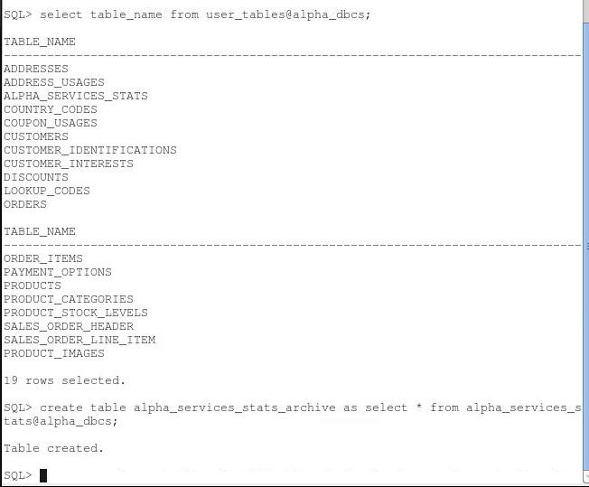

This lab shows how you can copy entire databases, tablespace datafiles, schemas, and individual tables between on-premise databases and cloud databases.  Depending on the use case one or more of these approaches may be applicable.