Update January 25, 2018

## Introduction

This is the first of several labs that are part of the Oracle Public Cloud Database Cloud Service workshop. These labs will give you a basic understanding of the Oracle Database Cloud Service and many of the capabilities around administration and database development.

This lab will walk you through creating a new Database Cloud Service from the backup, and then have you connect into the Database image using the ssh private key to familiarize yourself with the image layout. Next you will learn how to create an ssh configuration file that can be used to tunnel simultaneously multiple ports to a remote OPC instance. Using the tunnels, you will learn how to access various Database consoles.  Note that all Oracle Cloud Databases are configured by default with Transparent Data Encryption (TDE).  To restore an on-premise database that was backed up to the cloud it must be configured with with archivelog and TDE prior to backup.  Since this simulated on-premise instance is in fact a DBCS instance it already has this configured.  See the instructor led version (or documentation) on how to do this if you are using a non-cloud version.  The instructions to do this are in an appendix of the instructor led version if you wish to try this on your own 12.2 database.  Note that TDE has evolved between database versions, including between 12.1 and 12.2, and these instructions specifically relate to 12.2.

This lab supports the following use cases:
-	Migration of on-premise databases to a cloud based environment.
-	Rapid creation of test or development database copies in the Cloud.
-	Replication of Databases for reporting and analytics.
 
- To log issues and view the Lab Guide source, go to the [github oracle](https://github.com/oracle/learning-library/tree/master/workshops/dbcs) repository.

## Objectives

-	Backup your local database to the Oracle Cloud
-	Drop a table and then restore it from your cloud backup.
-	Create Database Cloud Service from your on-premise backup 
-   SSH configuration
-   Explore VM and consoles

## Required Artifacts

-   The following lab requires a VNC Viewer to connect to an Image running on Oracle's IaaS Compute Service.

## Configure and Backup the Local Database to the Oracle Cloud

### **STEP 1**:  Use RMAN to Back Up to the Cloud

The following steps will be done on the desktop of the WorkshopImage through VNC.  Log into VNC (if you are already not logged in).

-	Create opc_wallet directory.  Right click on the desktop and open a command window and enter the following:
	- `mkdir /u01/app/oracle/product/12.2.0/opc_wallet`

	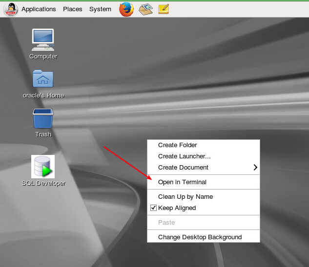

	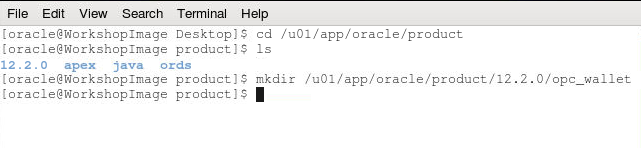

-	Install the Oracle Cloud Database Backup Module (previously downloaded from the [Oracle website](https://docs.oracle.com/en/cloud/paas/db-backup-cloud/csdbb/installing-oracle-database-cloud-backup-module.html#GUID-DA5B65A2-0A59-460E-8D2A-1E6E1F510A57)).  Open a terminal window and enter the following.  **Be sure to replace the identity domain and password placeholder with your own:**
	- `/u01/app/oracle/product/12.2.0/dbhome_1/jdk/bin/java -jar /home/oracle/opc_install.jar -serviceName Storage -identityDomain <identity domain> -opcId cloud.admin -opcPass <cloud account password> -walletDir /u01/app/oracle/product/12.2.0/opc_wallet -libDir $ORACLE_HOME/lib -libPlatform linux64 -container oracle-data-storageg-1`

	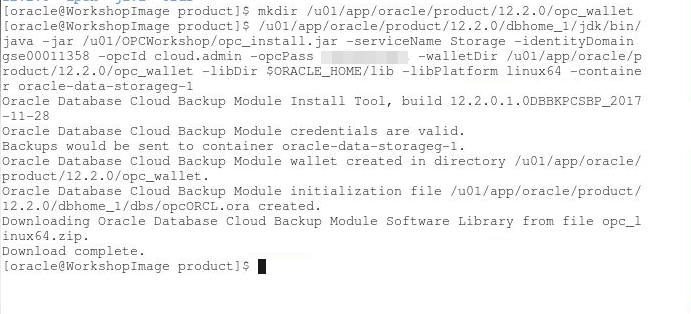

-	Connect to RMAN.
	- `rman target /`

	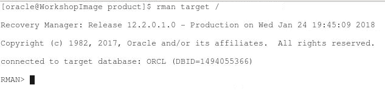

-	List backups and create restore point. 
	- `list backup summary;`
	- `create restore point gold preserve;`

	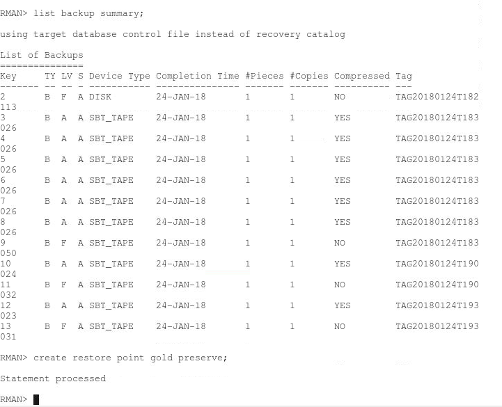

## Recover Dropped Table

Since we have configured backup when we created our DBCS/WorkshopImage we can always restore to a point in time.  We are going to “accidently” drop a table that will reappear once we perform the restore.  

### **STEP 2**:  Drop Table

-	Exit out of RMAN and log into alpha
	- `exit;`
	- `sqllplus alpha/Alpha2018_@pdb1`
	- `drop table alpha_services_stats;`

	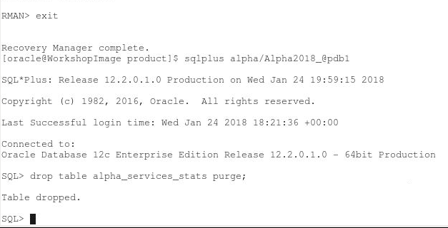

### **STEP 3**:  Recover Table

We now need to restore the database to the point in time before the alpha\_services\_stats table was accidentally deleted (: The backup files stored in cloud will be used.  These steps will bring the entire database to a point where media recovery can occur. This of course takes the database offline. 

-	Exit out of SQLPlus and log into RMAN and recover table.  Enter the following commands.
	- `exit`
	- `rman target /`
	- `shutdown immediate;`
	- `startup mount;`
	- `run {restore database; recover database to restore point gold; alter database open resetlogs;}`

	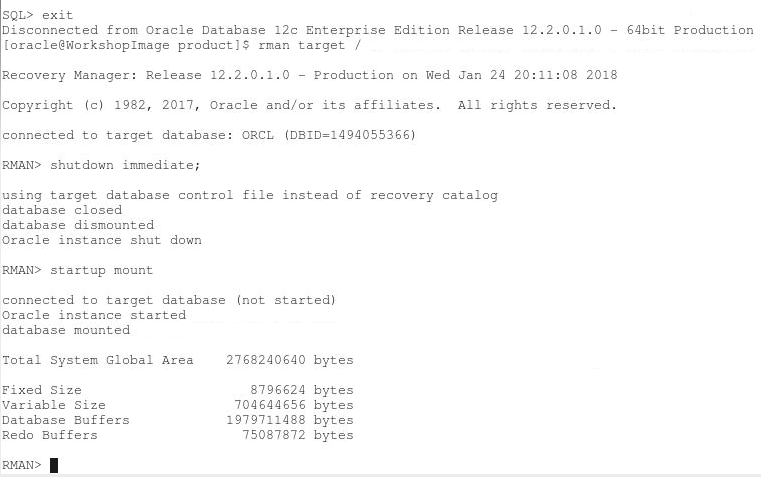

	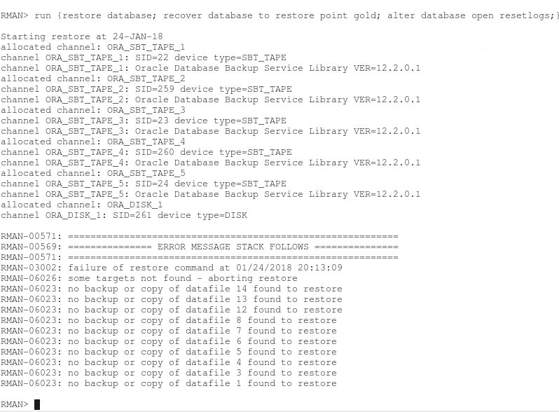

-	Exit out of RMAN and log back into SQL Plus to confirm the alpha\_services\_stats is restored.
	- `exit`
	- `sqlplus sys/Alpha2018_ as sysdba`
	- `alter database open;`
	- `alter pluggable database all open;`
	- `connect alpha/Alpha2018_@pdb1`
	- `select count(*) from alpha_services_stats;`

## Create Database Cloud Service from Backup

### **STEP 4**:  Login to your Oracle Cloud account

-   From within the VNC Session, open **Firefox** and go to the following URL: https://cloud.oracle.com

	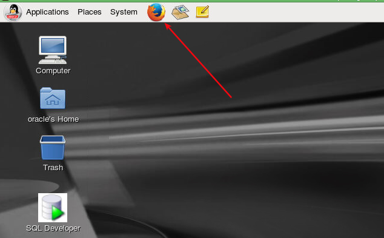

-   Click **Sign In** in the upper right hand corner of the browser.  Note this is the same account/login that you used earlier in this lab.

	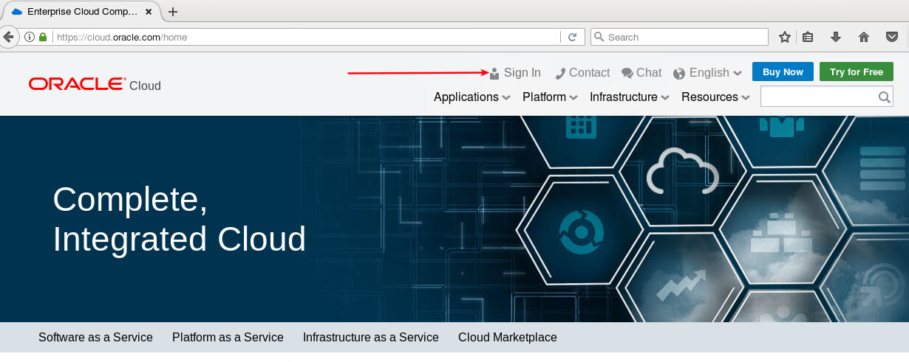

- **IMPORTANT** - Select 'Traditional Cloud Account' and then select from the Data Center drop down list the correct data center and click on **My Services**. If you are unsure of the data center you should select, and this is an in-person training event, ***ask your instructor*** which **Region** to select from the drop down list. If you received your account through an Oracle Trial, your Trial confirmation email should provide a URL that will pre-select the region for you.

	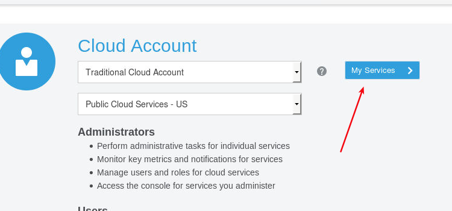

-   Enter the **identity domain** and click **Go**.  **NOTE**: The **Identity Domain, User Name** and **Password** values will be given to you from your instructor.  Once your Identity Domain is set, enter your User Name and Password and click **Sign In**

	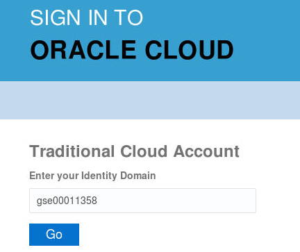

	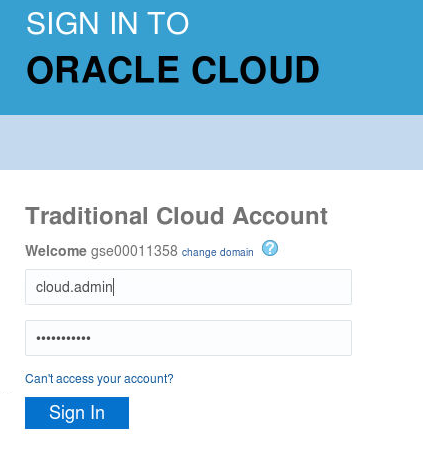

### **STEP 5**:  Create Database Cloud Service

-   From the main dashboard, click on the **Database** service link

	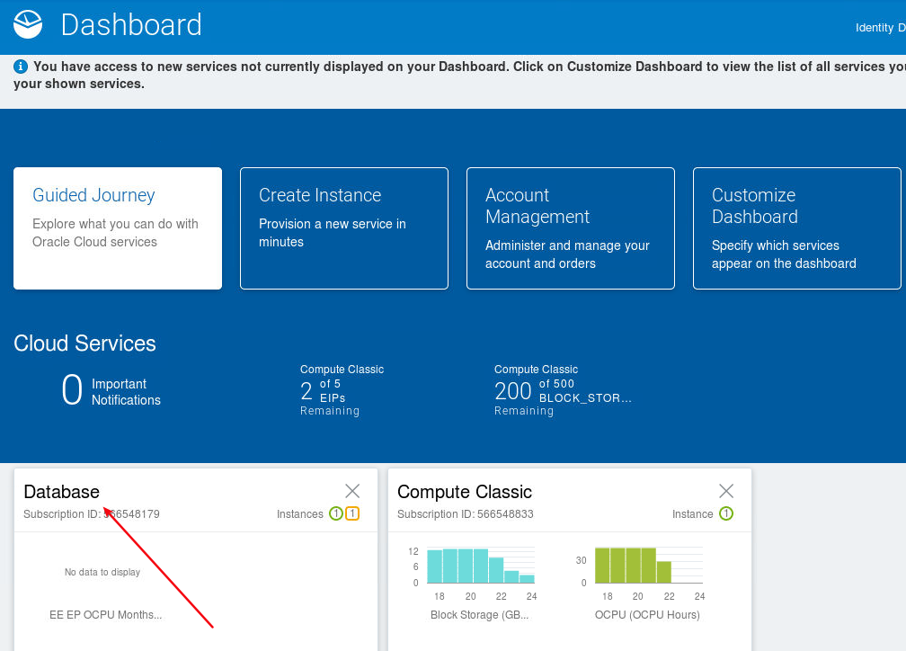

-   From this page you can view general information about this Database Cloud Service. Click on the **Open Service Console** button.

	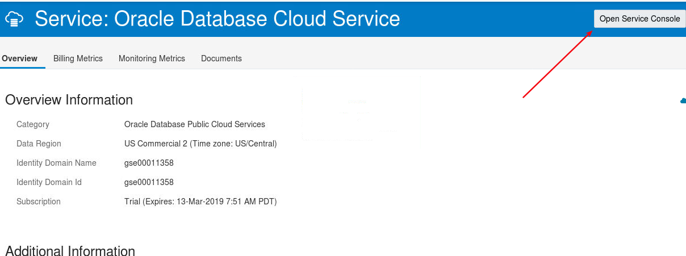

-   From the console, click **Create Service**

	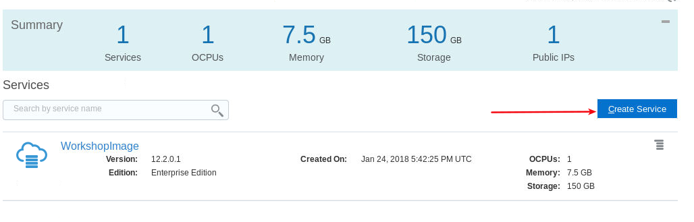

### **STEP 6**:  Enter the Instance Configuration

When providing a name, please note you may have another service instance already created in your account, so the name must be unique.

-   Enter the Service Name (Alpha01A-DBCS) and other fields as noted below.  Note it is important you select **Software Release Oracle Database 12c Release 2** (default is 1) 

	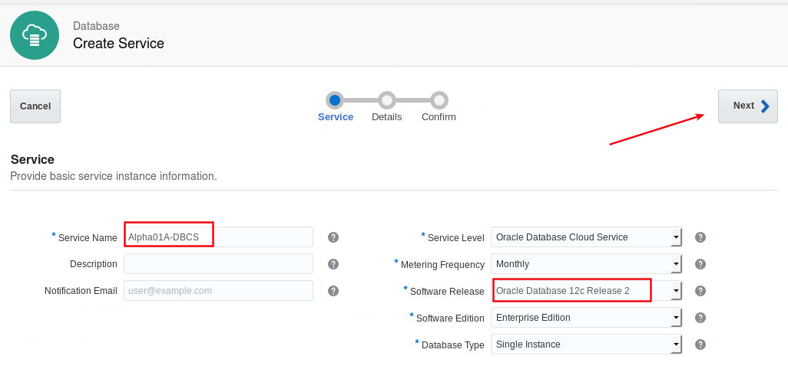

-   Click on the **Next** Button to navigate to the Service Details page.  Enter the DB Name, PDB Name, Administration Password ('Alpha2018_'), and then **select Edit for the SSH Public Key**.

	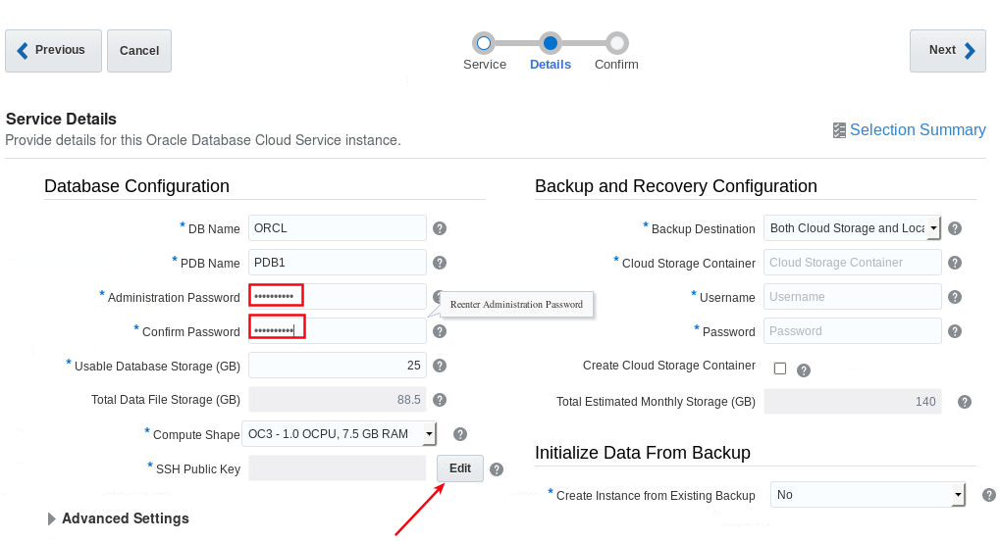

-	Click on Browse, select File System on the left, and then navigate to oracle on the left and select publicKey file.

	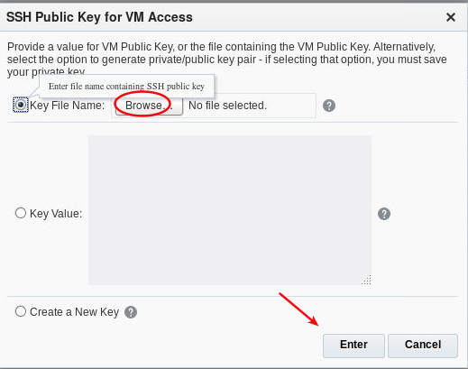

	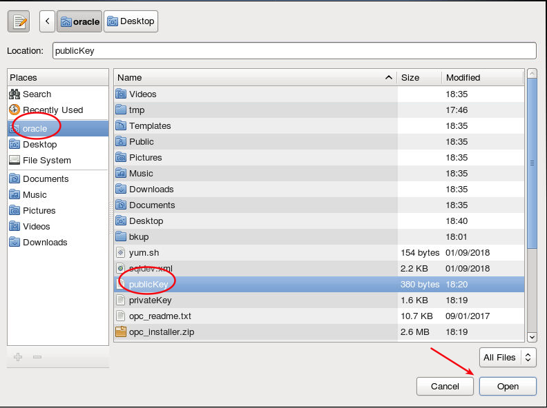

	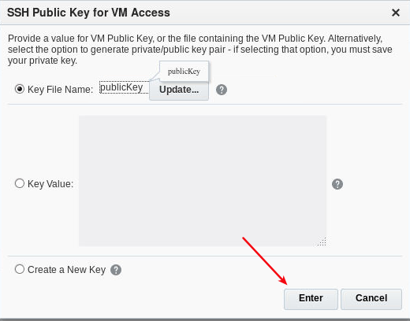

-	Select **Backup Destination None** and **Create Instance from Existing Backup Yes**.  Note that while we are simulating an on-premise migration/restore from backup we are in fact restoring from a DBCS backup.  If you were restoring from a manually configured instance you would select the on-premise checkbox and specify encryption wallet and other fields.

	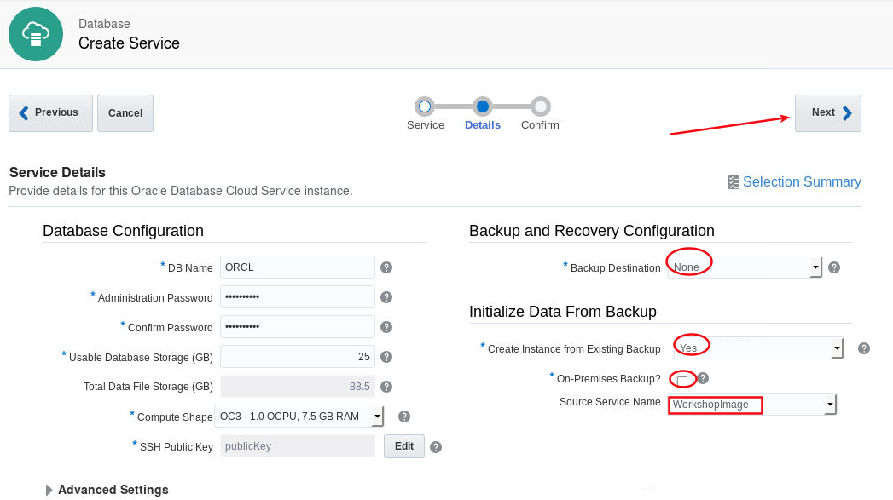

-	Select Create

	

-   The creation of the DBCS instance will take approximately 30 minutes. While your DBCS instance is being created, you can monitor the progress by clicking on the **Activity** menu item, and view the current status.  

	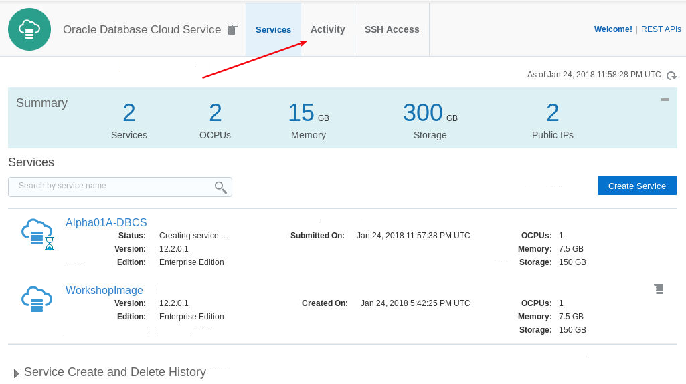

	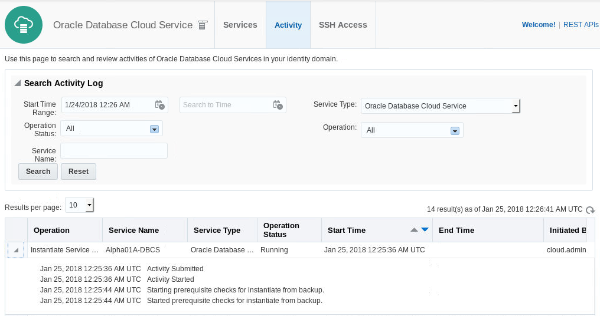

-	Wait for this to complete.  It should complete with a success message.

	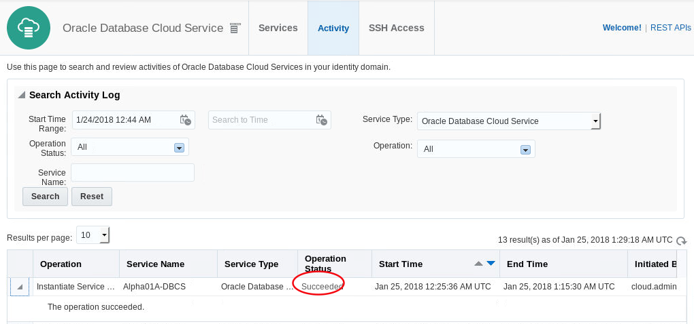

### **STEP 7**:  Record the IP address of the Database Cloud Service

-   Return to the dashboard, select Database, and then click on **Alpha01A-DBCS** from the list of Database Instances

	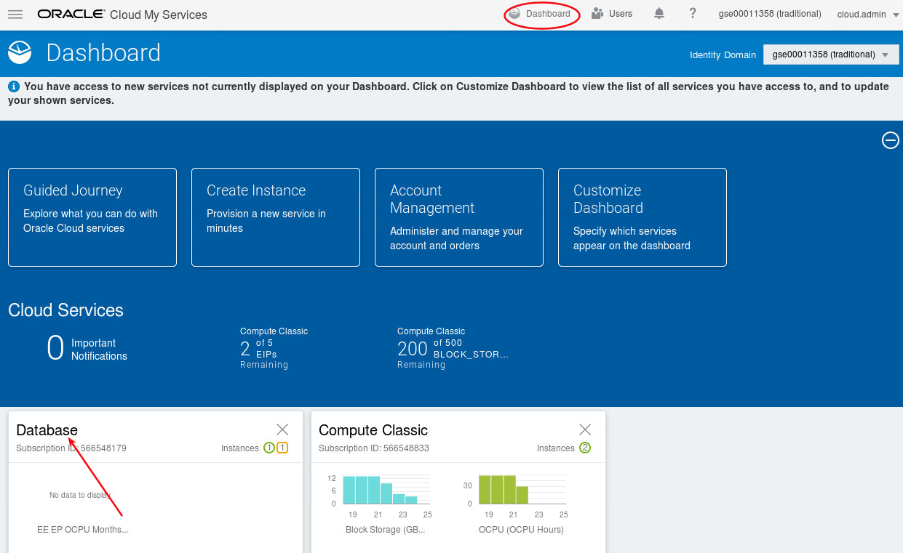

	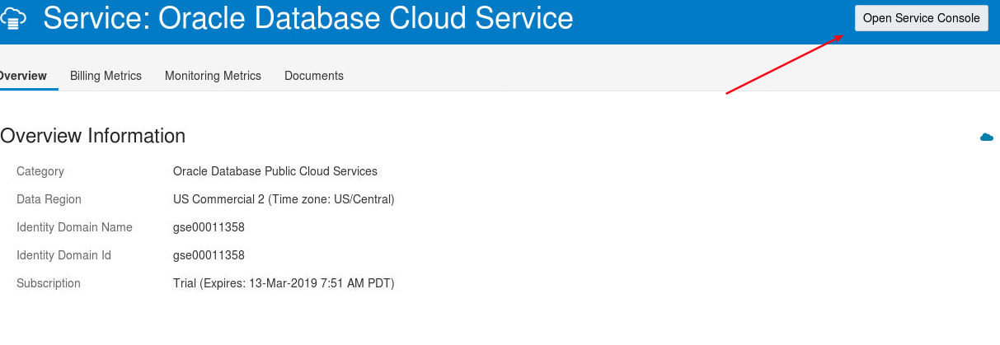

	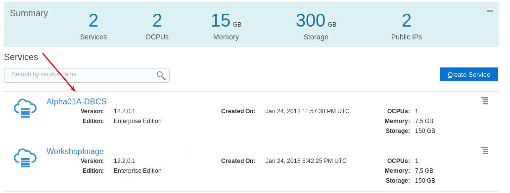

-   Note the IP address of **Alpha01A-DBCS**. 

	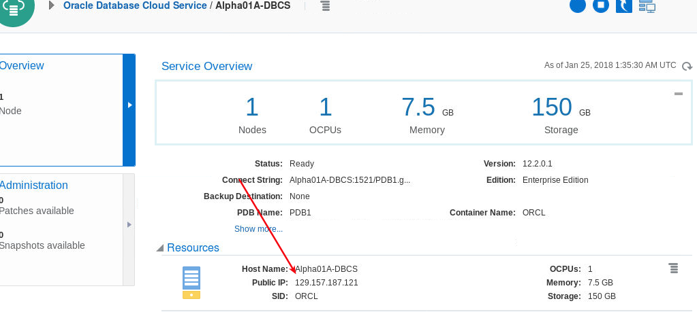

### **STEP 8**:start a SSH tunnel in the background

For security reasons, the default Oracle Public Cloud network configuration is locked down. You have the option of opening up ports to the various servers in your environment by ether using the Compute Cloud Service console and creating/re-using protocol definitions and access rules, OR you can create SSH tunnels to the specific server/port combinations as needed. This lab and the rest of the labs require access via development tools and the browser to various admin consoles running on the cloud servers themselves.

In this step you will create a SSH tunnel in the background for port 5500, which is not open.
-	Open a terminal Window by right clicking anywhere on the desktop, and then enter the following.  Do not close the window when finished:
	- `ssh -o StrictHostKeyChecking=no -i /home/oracle/privateKey -L 5555:<your Alpha01A-DBCS IP>:5500 opc@<Alpha01A-DBCS IP>`

	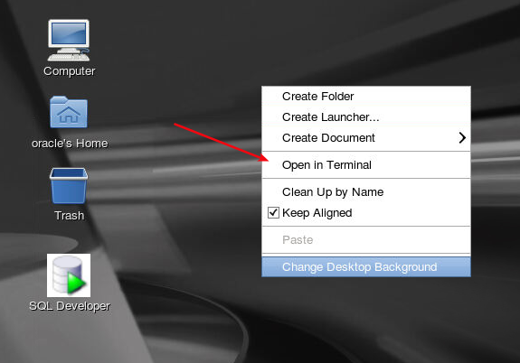

	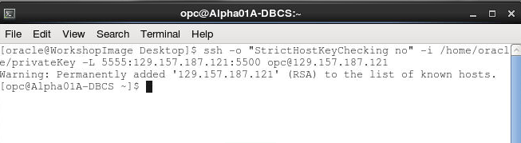

## Explore DB image via SSH

### **STEP 9**:  Open a new SSH Connection to browse the database image

-	Enter the following command in a terminal window using the IP address for your DBCS cloud instance.
	- `ssh -o StrictHostKeyChecking=no -i /home/oracle/privateKey oracle@<your Alpha01A-DBCS IP>`
	
	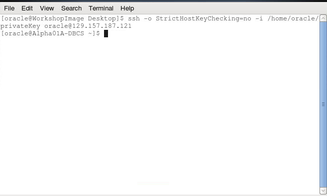

-   Now that you are connected to **Alpha01A-DBCS,** let's look around. Enter the **df** command to see mounted disks.

	

-   Issue the following command to view the Database environment variable.
	- `env | grep ORA`

	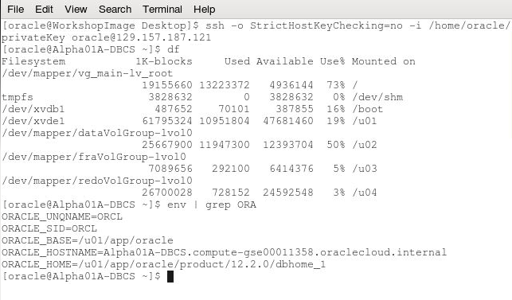

-   Now let's change directories to the Oracle Home and list the directories.
	- `cd $ORACLE_HOME`
	- `ls`

	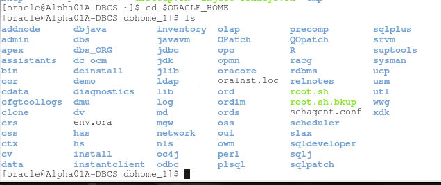

## Access the Database Consoles

**Access DB Monitor, Apex, EM Consoles**

### **STEP 10**:  Access Database Monitor

To gain access to the various consoles used by the Database Cloud Service you have two options. You can open up the port on which the monitor is listening, or you can create a SSH tunnels to the specific server/port combinations as needed. We have already created the SSH tunnel, and you will use that tunnel to access most of the consoles.

In this step you will open the port 443 on the VM using a pre-create access rule and protocol definition.

-   If not already on the **Alpha01A-DBCS** details page, navigate back to Database Cloud Service console and click on **Alpha01A-DBCS** to get to this page.

	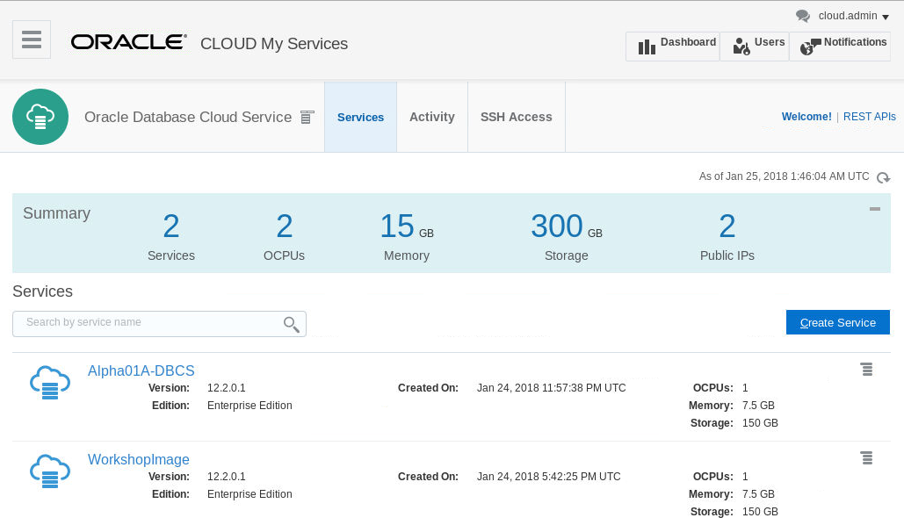

-   To the right next to the instance name **Alpha01A-DBCS** select **Access Rules** off the hamburger menu icon.

	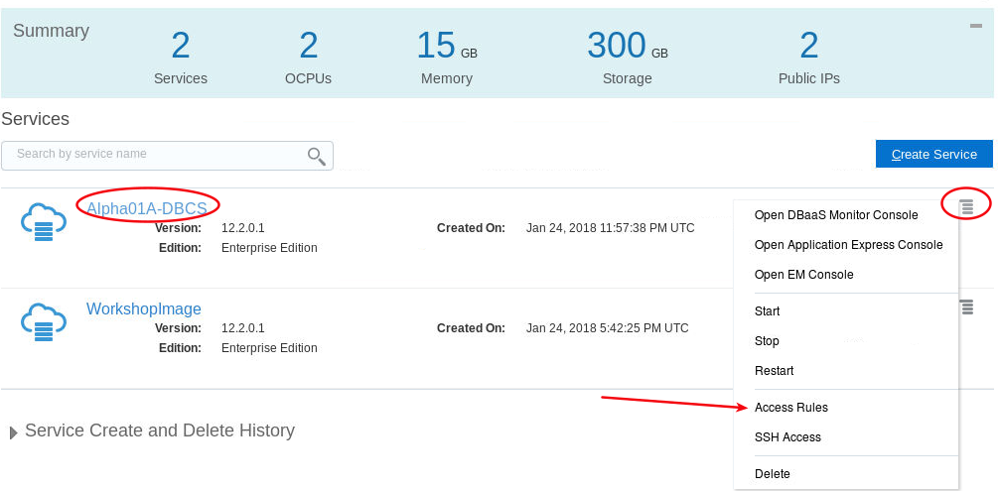

-   From this screen you see all the **Access Rules** that have been created for this instance

	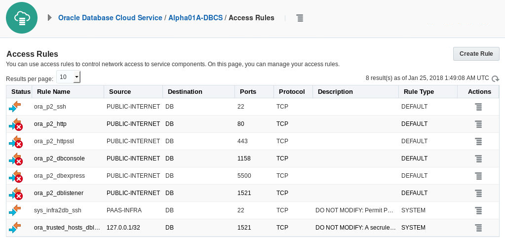

-   The Rule named **ora\_p2\_httpssl** is setup to open port 443 to the public internet. Click on the **hamburger menu** (on the right) for this rule and select **Enable**

	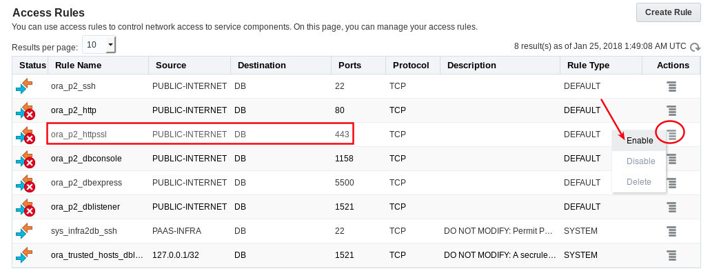

-   On Enable Access Rule popup window, click **Enable**.

	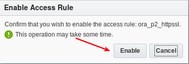

-   You should now see that the Access Rule **ora\_p2\_httpssl** is enabled. You will need to re-fresh your screen and re-select Access Rules to see the update.

	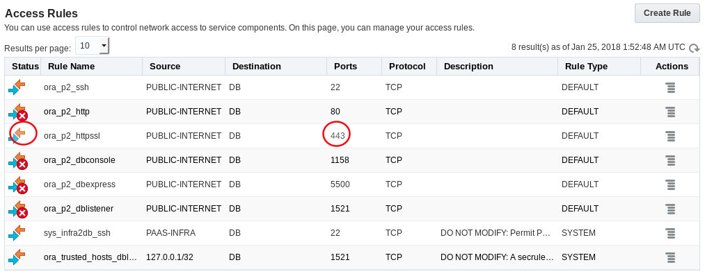

-   Go back to the list of DBCS services (click on the breadcrumbs) and then  select **Open DBaaS Monitor Console.** from the hamburger menu.

	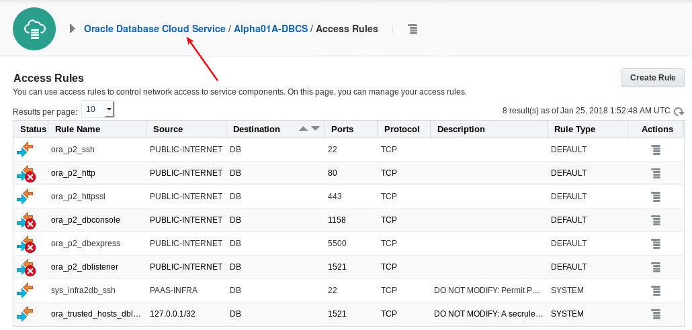

	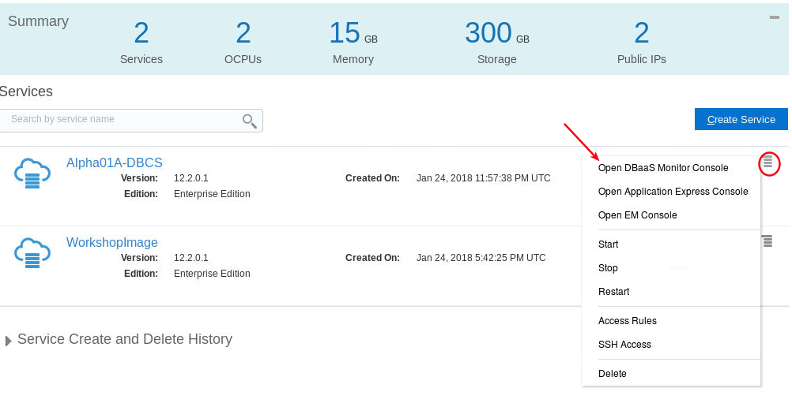

-   If you get a security warning, click **ADVANCED** followed by **Add Exception..**

	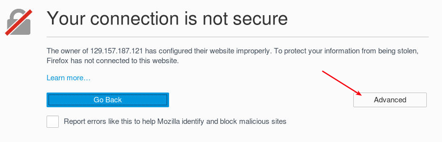

	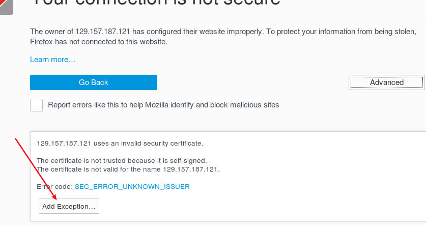

-	Then Confirm Security Exception

	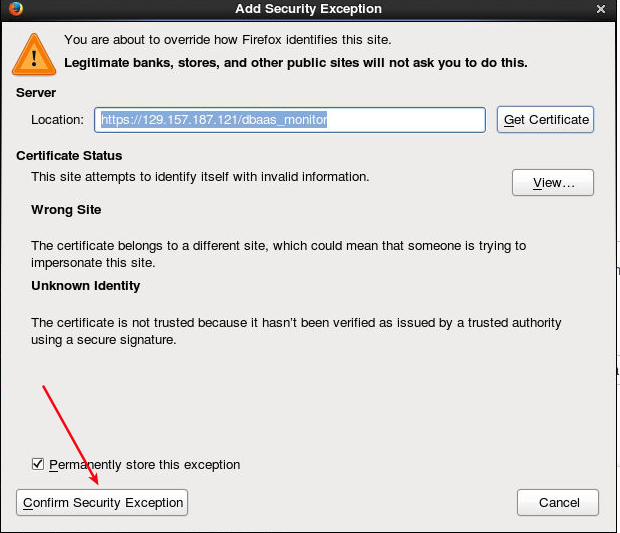

-   When prompted, enter **dbaas\_monitor** for the **User Name** and **Alpha2018\_** for the **Password**.

	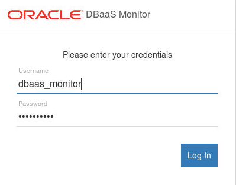
	
-   Once connected to the Database Monitor Console, feel free to explore the various screens.

	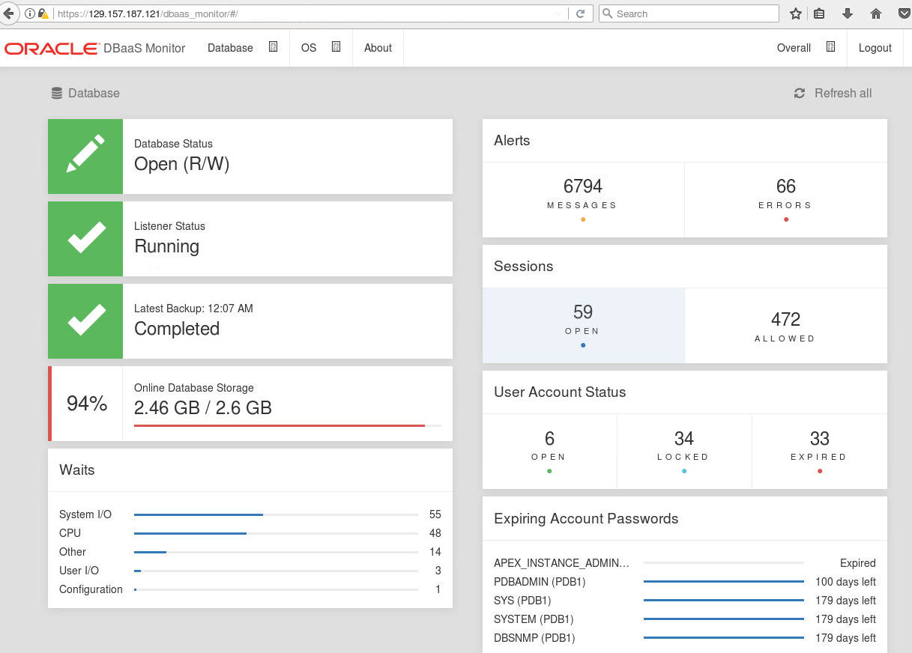

### **STEP 11**:  Access Enterprise Manager DB Express (inside the workshop image)

-   On the firefox browser, open a new tab, and **enter** the following **URL** to access the **EM Express** page. The first time the URL is used, it can take a minute for the console to load. The ssh tunnel you created earlier will cause all traffic referencing localhost:5555 to actually be routed to the database cloud service.
	- `https://localhost:5555/em`

	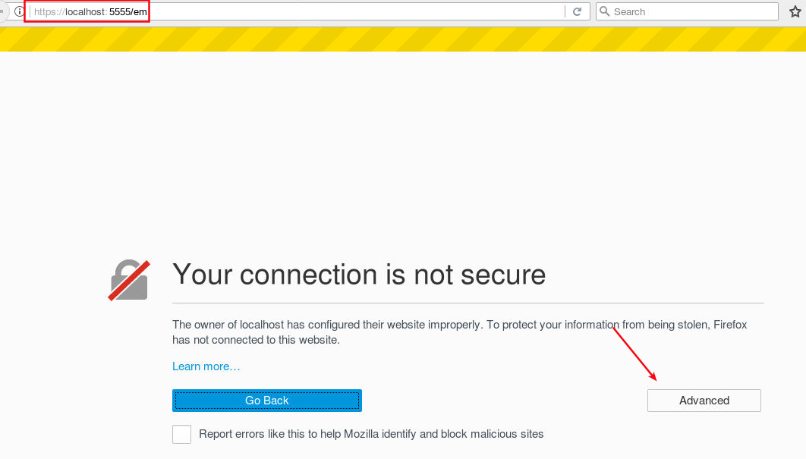

-   If you get a security warning, click **ADVANCED** followed by **Add Exception**, and then 

	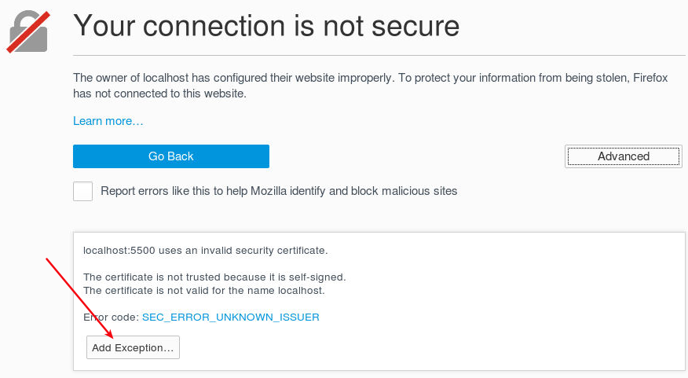

	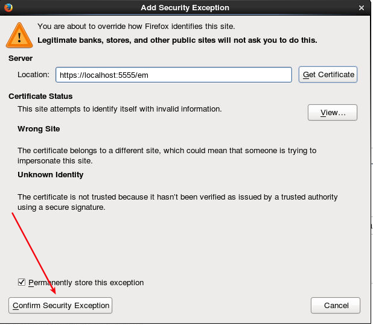

-   On the EM login page enter the following and click on **Login**:

	**User Name:** `sys`
	**Password:** `Alpha2018_`
	**Container:**	`pdb1`
	**Select** the **as sysdba** box.

	

-   De[ending on what version of Firefox and Flash is installed from the repositories you may end up with a hung page.  This may be a firefox or flash bug.

	

-	To get around this problem go to the Firefox menu Tools > Web Developer > Debugger.  This should clear the error.  You can then close the debugger window.

	

	

	

### **STEP 12**:  Access Apex Monitor

-   Return to the database console to access the **Apex console**.  Select `Open Application Express Console`.  Click through the security warnings.

	

-   Once the Apex login window is displayed, **enter the following** and click on **Sign In**:

	**Workspace**: `internal`

	**Username**: `ADMIN`
	
	**Password**: `Alpha2018_`

	

-   You are now connected to Apex. Feel free to explore the menu options.

	

-   You are now ready to move to the next lab.

