Update: January 26, 2018

## Introduction

While the Oracle Cloud has greatly simplified DBA tasks, the DBA still has a role to play in the development and maintenance of DBCA instances.  This lab covers a few of the common DBA activities in a cloud environment.

This lab supports the following use cases:
-	Rapid creation and scaling of cloud databases.
-	Maintenance of security access.

## Objectives

-   Create an instance.
-   Maintain security access.
-   Scale up an instance.
-   Add a SSH Key.

## Required Artifacts

-   The following lab does not require set up or artifacts from the previous labs.

## Create an instance

In lab 100 we created an instance from a cloud backup of an on-premise instance.  To create an instance from scratch the process is very similar.  We will not actually create the instance, but will walk through the screens but cancel before the final step.  If you (not an instructor or someone else) ran the setup steps for this workshop you would have already created an instance as part of those steps, and if this is the case you can skip this.

### **STEP 1**: Log into the Oracle Cloud Console and select the database service (same a lab 100)

-   Open Firefox on the compute image desktop and log into the Oracle Cloud.  Your particular datacenter may be different.

	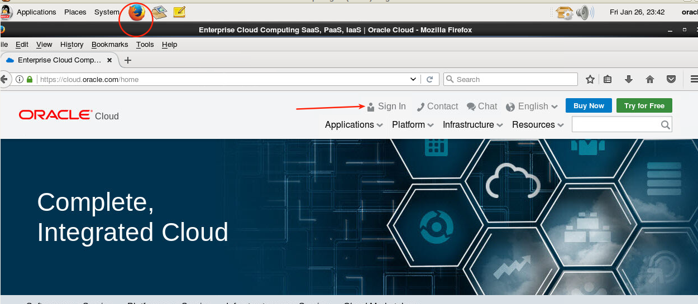

	

	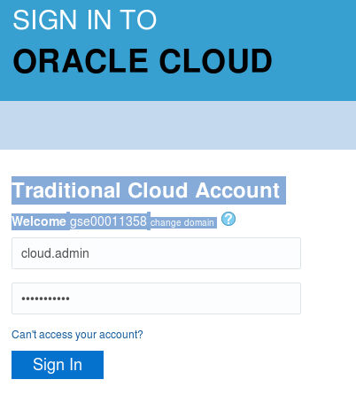

-   Select Database, then service console.

	

### **STEP 2**: Create Service

-   Select Create Service
 
	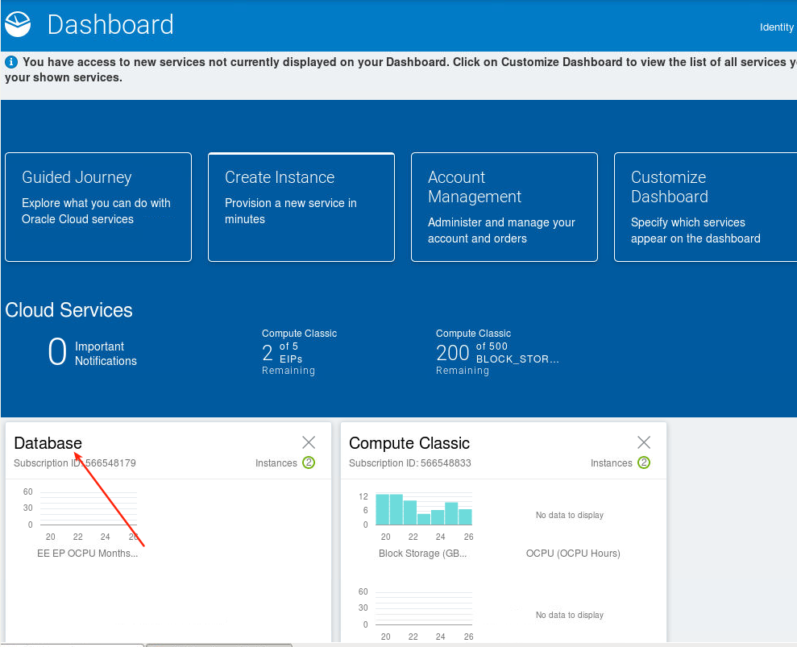

-   Enter the fields noted below.  Feel free to explore the various options in the drop down lists.  Hit Next.

 	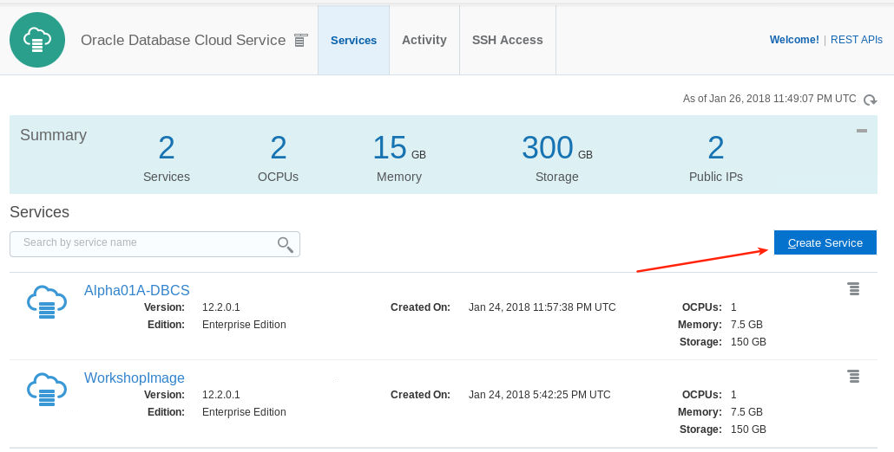

-   Very few fields are mandatory and require user input - just the sys password and the ssh public key. Also note that if you are planning on using this instance for GoldenGate you can select this option.  Also recall that in lab 100 we created a new instance from a backup.  We are not doing that here.  This is simply a review step.  **We will not go futher.  Hit cancel.** 

 	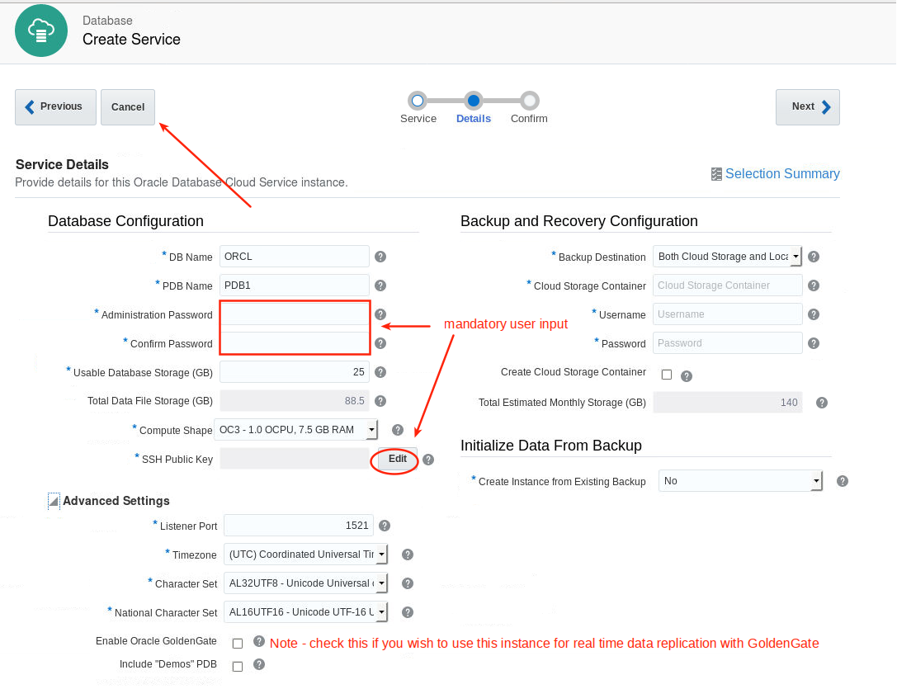
    
## Maintain Security Access

Once you have a running database you may wish to open (or close) various ports.  We will create a new rule to open 1522 (not used..this is just an example).

### **STEP 3**: Create Security Rule

-   To the right of the Alpha01A-DBCS Database Service select the hamburger menu and then 'Access Rules'.

 	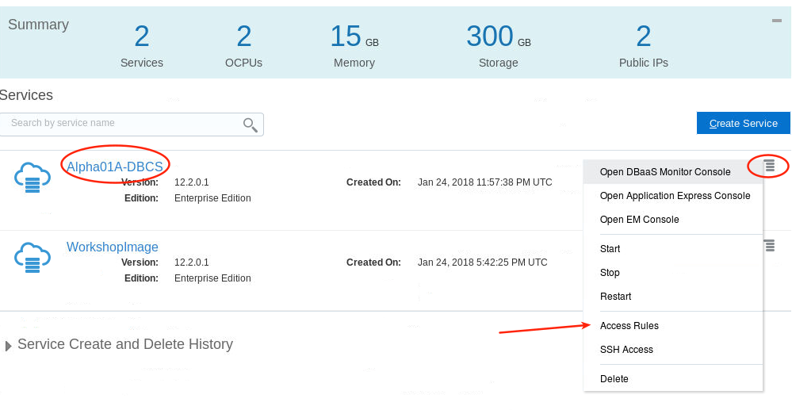

-   Note port 1521 is closed by default.  That is why we are using tunnels.  However you can open this port (not advised).  Select Create Rule.

 	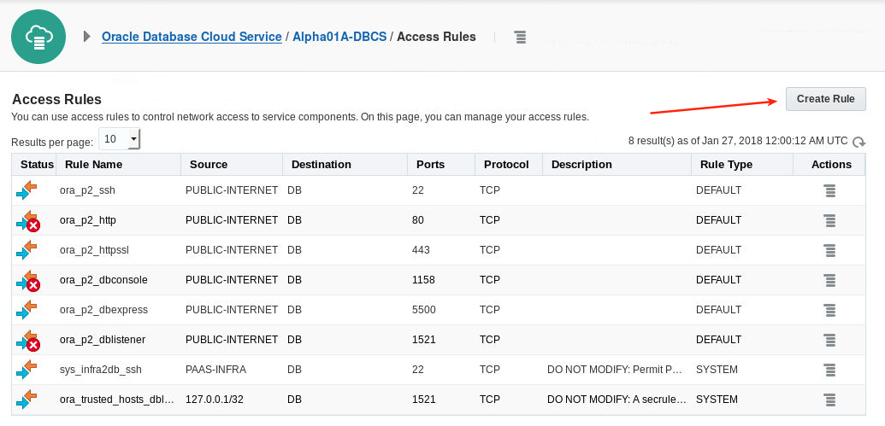

-   Create Rule.  Enter the following fields (Note we will not actually use this port - this is just for illustration purposes):
    - **Rule Name:**  `Open 1522`
    - **Source:** `PUBLIC-INTERNET` -- this is the 'from' part of network access
    - **Destination:** `DB` This is the security list (DB is a default one) that get attached to your instance.  You can add others.
    - **Destination Port:** `1522`
    - **Protocal:** `TCP`

	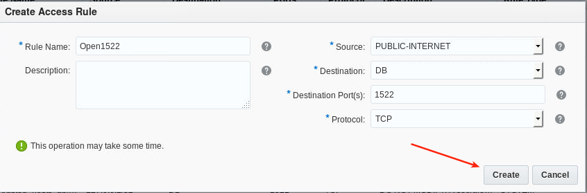

-   Initially the rule will not show while it is getting created.  After a minute or two refresh your browser, select access rules, and you should see the new rule enabled.  You can also select the hamburger menu on the right and disable the rule.

	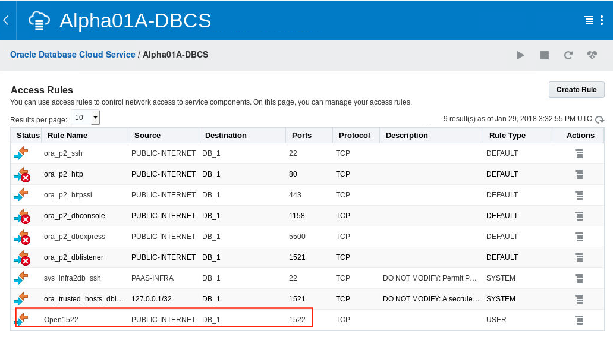

## Scale Up an Instance

Databases typically grow and require additional storage and possibly compute resources.  This shows the elastic nature of the Oracle Cloud.

### **STEP 4**: Scale Up An Instance

-   Navigate back to the Alpha01A-DBCS Service (either through the breadcrumbs or the top Dashboard).  Select the Alpha01A-DBCS instance.

	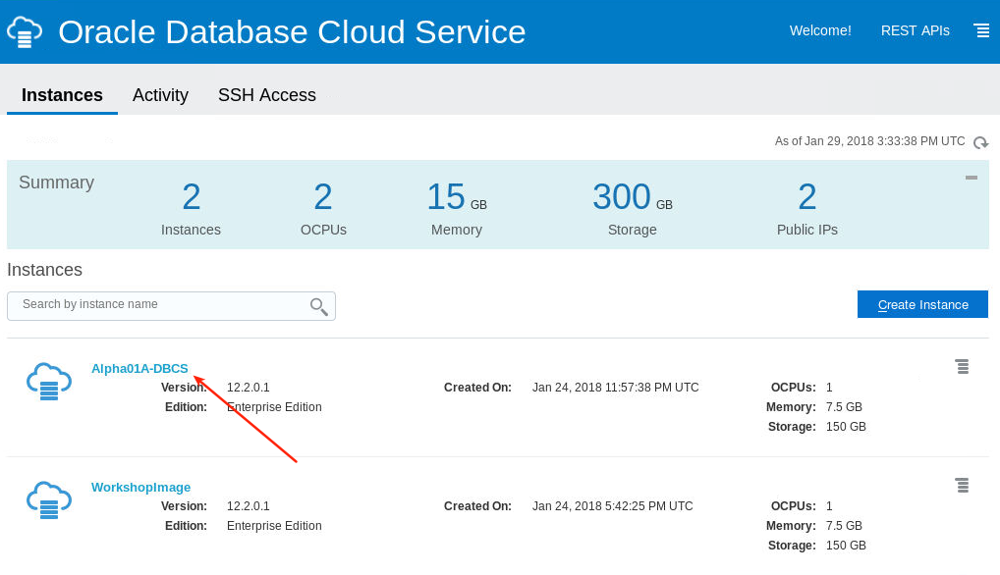

-   On the hamburger menu on the right select Scale Up/Down.

	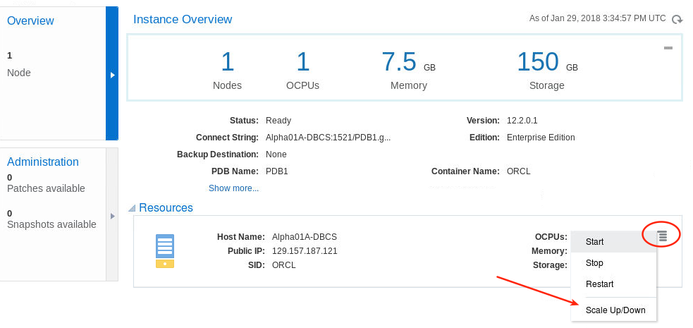

-   We can scale the Compute Shape (CPU) and/or the storage.  We will add 25G storage in this case.  We currently have 150G and this will extend the existing volume to 175G.

	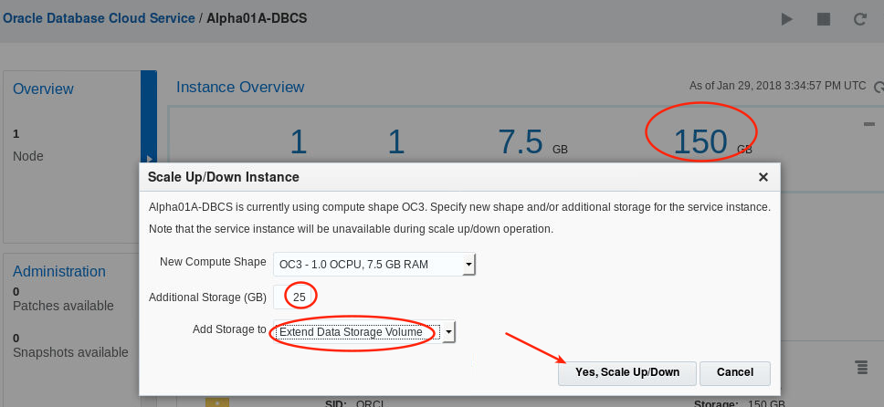

-   Note the instance will go into Service Maintenance mode while the scale operation is processing.  This will only take a few minutes.

	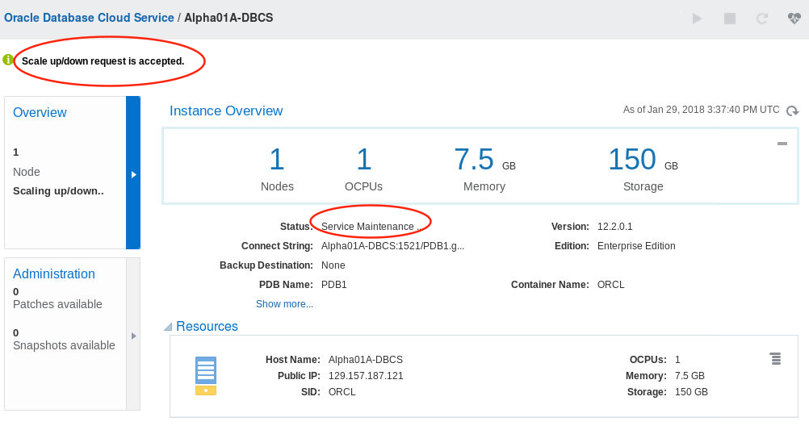

-   After a few minutes refresh the screen - you should see the storage change from 150GB to 175GB.

	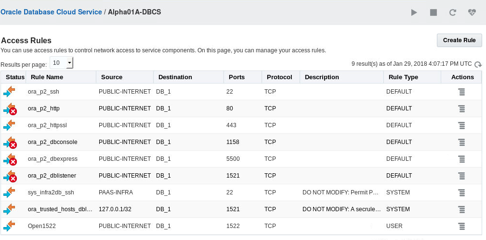

## Add SSH Key

SSHs are required when creating a new DBCS instance.  Later you can add additional keys (eg: if you lost your existing private key) through the database console.

### **STEP 5**: Generate New Key Pair

-   Navigate to the compute desktop and open a new terminal window.  Enter the following.
    - `ssh-keygen`
    - **Enter filename:** `lab300`
    - **Then hit enter twice for no password**

 	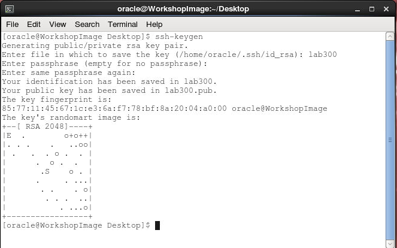

-   Change private key permissons.  Enter the following.
    - `ls` -- review files - see the new public and private keys.
    - `chmod 600 lab300`

 	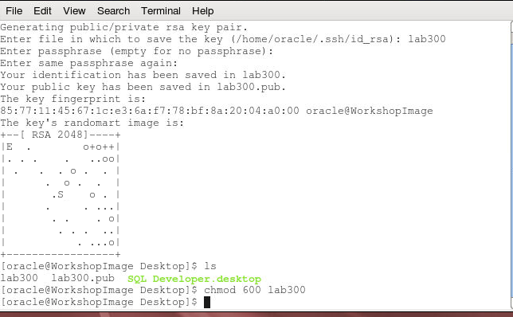

### **STEP 6**: Add SSH Key

-   Navigate to the DBCS Service page and select SSH Access.

 	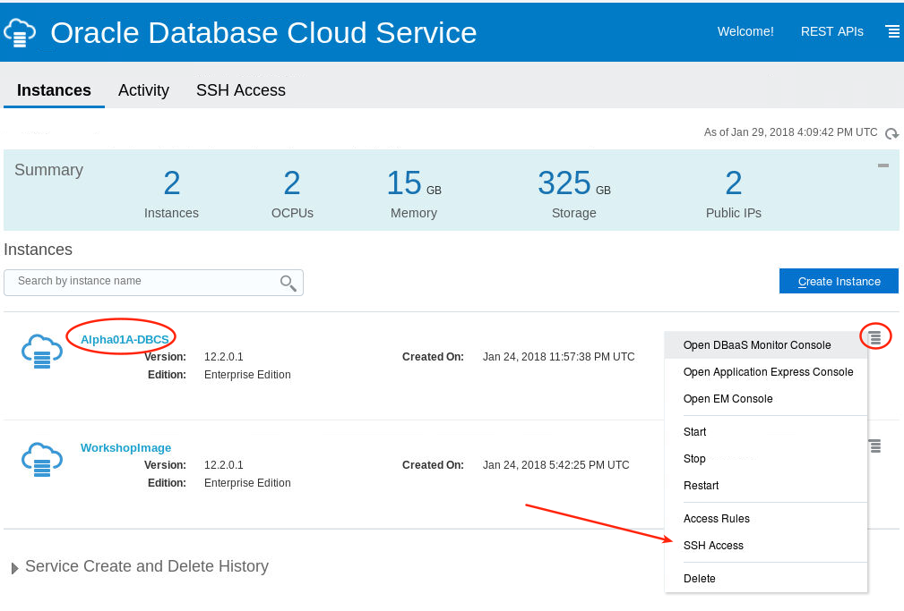

-   Select Browse to add new key.  Select lab300.pub public (server side) key.

 	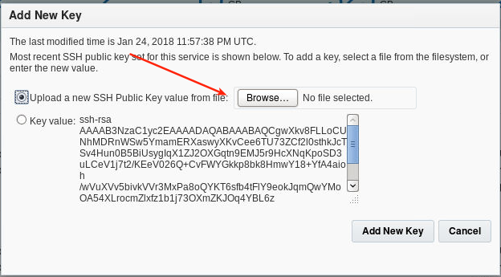

 	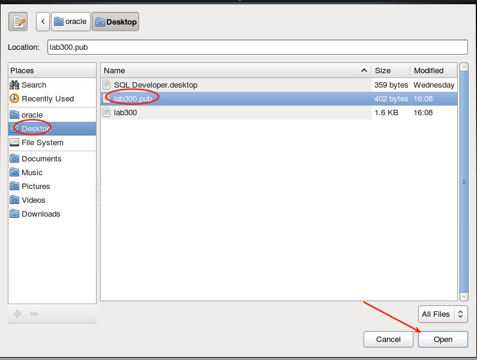

 	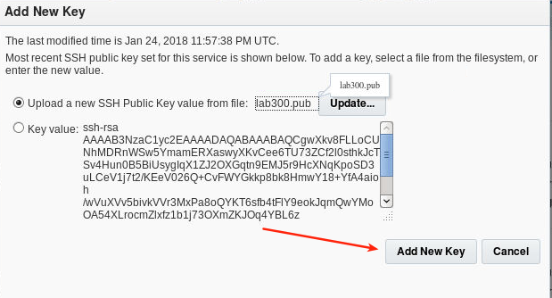

 	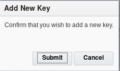

-   The instance will briefly go into Service Mainenance Mode and then in a few seconds after you refresh the screen you will see the instance back in normal operation.

 	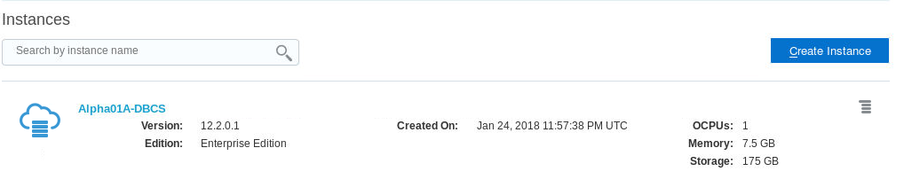

### **STEP 7**: Confirm Access

-   Go back to your terminal window and SSH to the image using the new key.  Enter the following.
    - `ssh -i lab300 oracle@<Alpha01A-DBCS IP>` -- note we originally created the keys off the desktop
    - `ls`

 	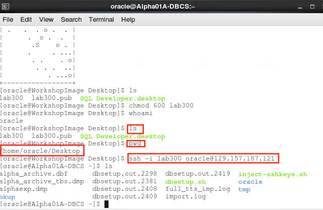

-   Then exit.